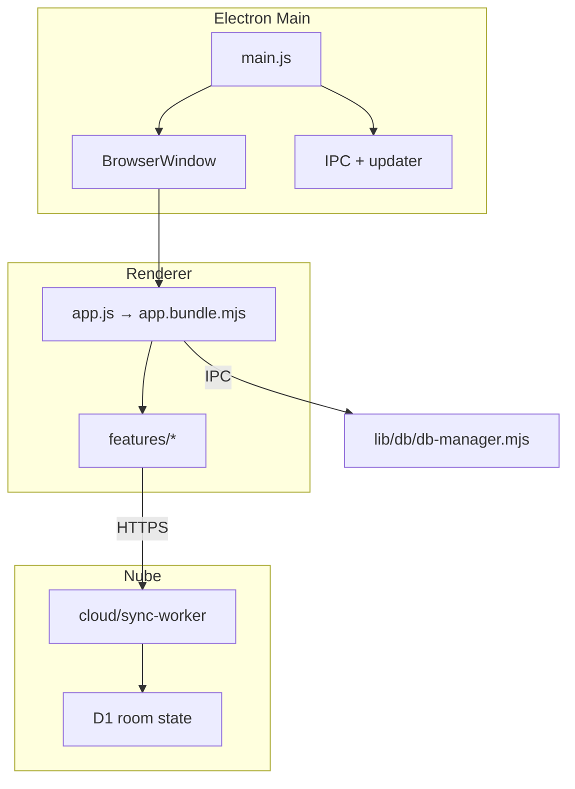

# Core Architecture

## Process model

## Layers

| Layer | Entry | Responsibility |
|-------|-------|----------------|
| Main | `main.js` | Window (`app://rplus`), updater, IPC |
| Preload | `preload.js` | `window.electronAPI` surface |
| Renderer | `public/js/app.js` | Feature registration via `app-runtimes.mjs` |
| Cloud sync | `cloud/sync-worker/` | Room LWW, Interno MIP, R+ Móvil `/mobile/` |
| Clinical DB | `lib/db/` | SQLCipher, Argon2, outbox |

LAN LiveSync and `server.js` (:3738) are removed. Phones do not talk to the Mac.

## Nube sync

1. **Typed mutations** — HTTPS to the Worker (note, labs, clinical-ops, commands)
2. **Pull** — D1 snapshot / revision reconcile
3. **Notify** — Durable Object can wake peers (paid Workers)
4. **Conflict policy** — LWW on overlap

## Document pipeline

Desktop export is IPC → `lib/doc-export-service.js` → `lib/doc-generators/{note,indicaciones,listado}.js` (JSZip `.docx`).

## Related

- [database/database-index.md](../database/database-index.md)
- [logic/logic-index.md](../logic/logic-index.md)
- [15-security.md](./15-security.md)
