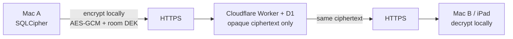

# Security

R+ is **local-first** with optional **Nube** (Cloudflare) room sync. It is not a certified EMR.

**Client E2EE (built 2026-08-17, NOT YET DEPLOYED):** clinical *content* — nota, indicaciones,
historia clínica, eventualidades, monitoreo/vitals, labs, todos, clinicalOps — is encrypted on
the client (AES-256-GCM, one DEK per room) before it ever leaves the Mac. Cloudflare stores only
opaque ciphertext for those fields. Patient *identity* fields (nombre, cama, servicio, registro,
diagnósticos — the `entries/{id}` root and `entries/{id}/fields`) are **still plaintext**: Interno's
phone board and the admin census view both read those server-side today, and moving them to
bed/alias-only is a separate, larger follow-up, not done yet. See "What is encrypted now" below.

**Production (currently live, confirmed 2026-08-23 via direct D1 query):** `room_state` rows are
whole-row encrypted at rest with `WORKER_DATA_KEY` (AES-256-GCM, one shared key held by the
Worker) — confirmed live, ciphertext + 12-byte IV columns hold real data, not plaintext JSON.
This is the "Legacy AES-GCM (Worker)" layer described below; despite the doc previously saying it
was dropped for Free CPU limits, it is active and handling multi-hundred-KB blobs fine. It is
**not** client E2EE — Cloudflare holds the key and can decrypt. The client E2EE code (per-room DEK,
below) is still unit-tested only, still not deployed — see "Deploy status" below before telling
anyone Nube is end-to-end encrypted.

Canonical code: `cloud/sync-worker/src/crypto-at-rest.js`, `public/js/features/cloud-sync/`, `lib/db/crypto.mjs`.  
Pilot spec: [2026-08-02-cloud-sync-free-pilot-design.md](../superpowers/specs/2026-08-02-cloud-sync-free-pilot-design.md) (V1 deferred true E2EE; at-rest AES also dropped).

---

## Where data lives

| Store | Location | Encryption |
|-------|----------|------------|
| Device cache | SQLCipher `rplus-clinical.db` on the Mac (`lib/db/`) | Argon2id + SQLCipher. Strong at-rest if the machine is locked. See [db-encryption.md](../db-encryption.md). |
| **Nube turn rooms** | Cloudflare Worker `rplus-sync` + D1 `rplus-sync` | **Target:** client E2EE. **Today:** HTTPS in transit; whole-row AES-256-GCM at rest via shared `WORKER_DATA_KEY` (Cloudflare can decrypt), not client E2EE. |
| Equipos queue | Separate Worker `rmas-lista-de-espera` + D1 `rplus-equipos` + R2 `rplus-equipos-photos` | Equipment photos / queue — not the patient room. |
| Recuérdame session | `cloud-sync-remember.json` in Electron `userData` (mode `0600`) | Raw Bearer token on disk — not OS keychain / `safeStorage`. |

### Nube hosting (production, 2026-08-14)

Default client URL: [`https://rplus-sync.rmas-workersdev.workers.dev`](https://rplus-sync.rmas-workersdev.workers.dev) (`DEFAULT_CLOUD_SYNC_URL` in `public/js/features/cloud-sync/settings.mjs`). No custom domain in `cloud/sync-worker/wrangler.toml`.

| Fact | Value |
|------|--------|
| Cloudflare account | `Djsalas99@gmail.com's Account` (Wrangler login `djsalas99@gmail.com`) |
| Account ID | `c231c997bf7c4e51c7a9f51d30e89e79` |
| workers.dev namespace | `rmas-workersdev` |
| Worker | `rplus-sync` |
| D1 | name `rplus-sync`, id `e8e36134-36a9-40d4-9c36-3f893e2b612c` |
| D1 region | **WNAM** (Western North America); jurisdiction unset |
| Durable Object | `RoomSyncHub` — revision notify only, not the clinical snapshot |
| Dashboard | [dash.cloudflare.com](https://dash.cloudflare.com) → that account → Workers `rplus-sync` / D1 `rplus-sync` |

This is a **personal Cloudflare** tenant (Workers paid), not a hospital-controlled account. Because production is not client E2EE, Cloudflare (and anyone with Wrangler/D1 access) can read room JSON.

---

## Intended Nube crypto (client encrypt / client decrypt)

Target architecture — **envelope DEKs**, north-star NEXT. Not in this build.

| Step | Who | What they see |
|------|-----|----------------|
| 1 | Sending client | Clinical JSON in memory / SQLCipher. Encrypts **before** `fetch`. |
| 2 | Network + Cloudflare | Ciphertext + metadata (room id, revision, sizes). **No names, labs, notes.** |
| 3 | Receiving client | Same ciphertext. Decrypts with the room DEK, then applies LWW **locally**. |

Room DEK stays on enrolled devices (wrapped by the user’s Nube password or a wrapped key per member). Cloudflare never holds the DEK. A TLS interceptor or D1 dump still sees blobs, not PHI.

**Why V1 did not ship this:** Worker-side last-write-wins (`cloud/sync-worker/src/lww.js`) and Interno MIP board assembly need to **read** the snapshot. True E2EE forces merge + Interno onto clients (or a decrypting Worker, which is not E2EE). The 7.9 spec listed true E2EE as a **non-goal** and substituted Worker AES-GCM (`WORKER_DATA_KEY`). That Worker AES was later dropped for Free CPU — leaving plaintext JSON.

**How the 2026-08-17 build resolves this without moving merge to clients:** LWW only ever reads
`path`, `updatedAt`, `actorId`, and a revision number — never the field **value** (confirmed by
reading `cloud/sync-worker/src/lww.js`). So content fields can be encrypted while merge metadata
stays plaintext, and `applyOps` keeps working server-side unchanged. The one exception was
`monitoreo`, whose merge (`mergeMonitoreoLww`) needs to read vitals historial to merge two devices'
readings — when a `monitoreo` value is an encrypted envelope, the Worker now skips that merge and
does a plain LWW replace instead (same pattern already used for `clinicalOps`). Interno was left
out of scope entirely by *not* encrypting the identity fields it depends on (see above) — cheaper
than redesigning it tonight, at the cost of names/beds staying visible server-side for now.

Until this ships to production and Interno is redesigned, do not describe Nube as fully
"encrypted to Cloudflare" — say "clinical content is encrypted; patient names and bed/service are
not yet."

### Deploy status (2026-08-17)

Built, unit tested, **nothing deployed**. This workstream was previously flagged "do not start" in
`docs/core/20-claude-code-handoff.md` after a 2026-08-14 PBKDF2 change broke every Nube login for
two days (see `password.js` history and `08155435`). Before running `wrangler deploy` for any of
this:

- Run `wrangler d1 migrations apply rplus-sync` for schema/006 (room DEK columns) and schema/007
  (`password_iterations`) against a **local** D1 first, then staging if one exists.
- The personal-Cloudflare-account and no-DPA gaps below are unchanged by this work — it closes the
  plaintext-content gap, not the account-ownership or paperwork gaps.
- Interno's phone board still reads patient names server-side — unaffected by this change, still a
  real plaintext PHI path, tracked as a separate follow-up.

---

## Nube (current)

Opt-in from ⇄. Once connected, the cloud room is turn authority for all clinical wards. Offline = local SQLCipher + outbox.

### What leaves the Mac

JSON ops over HTTPS, then a full room snapshot in D1:

- Census: name, `registro`, age, sex, bed, service, diagnoses, team metadata
- Estado actual / monitoreo, eventualidades
- Notes and indicaciones (clinical-repo projector, default on)
- Lab sidecars: SOME `sourceText` when it looks like SOME (often includes name + expediente), else parsed `resLabs` — **PDFs and non-SOME paste stay local**
- Todos, agenda
- `clinicalOps` (teams, `@usuario`, ranks, assignments, guardia)
- Delete tombstones (`id`, `registro`, `deletedAt`)
- Interno MIP sala token (also in QR as `?t=…`) and vitals from phones
- Login body: username + password; then `Authorization: Bearer`

**Not sent:** historia clínica; VPO / listado / receta HU / med receta & pharm profile; demo patients; device-unlock passphrase.

Of the above, once E2EE is deployed: monitoreo/eventualidades, notes/indicaciones, lab sidecars,
todos, and `clinicalOps` travel and store as ciphertext. Census (name/registro/bed/service/
diagnoses), agenda, and tombstones are unaffected — still plaintext, see "Encryption layers" below.

### Encryption layers

| Layer | Choice |
|-------|--------|
| In transit | HTTPS to Workers. No certificate pinning. A passive sniffer sees TLS; a trusted-CA MITM (hospital proxy) sees JSON (or ciphertext, once deployed — see below). |
| At rest in D1, identity fields | **Still plaintext.** `entries/{id}` root + `entries/{id}/fields` (nombre, cama, servicio, registro, diagnósticos) — Interno + admin census read these server-side. |
| At rest in D1, content fields | **Built, not deployed.** `public/js/features/cloud-sync/crypto.mjs` encrypts note, indicaciones, historiaClinica, eventualidades, monitoreo, labSidecars, todos, clinicalOps with AES-256-GCM (one DEK per room) before push. The Worker stores and relays ciphertext without ever holding the DEK. |
| Legacy AES-GCM (Worker) | V1 substitute: Worker encrypts with `WORKER_DATA_KEY` after it already has plaintext. **Not** client E2EE. **Active in production** (confirmed 2026-08-23) — whole `room_state` rows, including multi-hundred-KB snapshots, encrypted this way. Not just a decode path for old rows. |
| Room DEK wrapping | AES-256-GCM key wrapped with a key derived from the user's Nube password (PBKDF2-SHA-256, 210k iterations, client-side — not subject to the Worker's 100k platform cap). Wrapped blob stored server-side (`rooms.wrapped_dek_*`, schema/006); only the room owner can set it; any member can fetch it but still needs the password to unwrap. `public/js/features/cloud-sync/room-dek.mjs`. |
| Existing-room backfill | `ensureRoomDek` only ever ran at room *creation* — a room made before this shipped never got a DEK on its own, and users can't be asked to "recreate the room". Fixed: `room-dek-migrate.mjs`'s `backfillRoomEncryption` runs silently on the room owner's next login, generates the DEK if missing, then re-pushes every already-stored plaintext content field (sourced fresh from a pull, never from this device's local census) so it gets encrypted too. Non-owner devices are unaffected — unchanged, they pick up the DEK via `loadRoomDek` on their own next connect. |
| DEK persistence | Cached in memory, and also mirrored (raw, unwrapped) into the durable Recuérdame store (`cloud-sync-remember.json`, mode 0600 — same file already holding the plaintext session token) via `exportCachedDeksForPersistence`/`hydrateRoomDeksFromPersistence` in `room-dek.mjs`. Restored at boot in `panel-conexion-bootstrap.mjs` before password re-entry — no new trust boundary since anyone who can read that file already has the Bearer token. |
| Password recovery vs. DEK | `handleRecover` calls `rewrapCachedRoomDeks` right after a successful recovery, re-wrapping every DEK this device already holds unwrapped (live session, or one restored via the point above) under the new password — best-effort per room (only the owner may set a room's DEK). A password truly forgotten with **no** cached DEK on any device still can't be recovered — that key material never left the wrap; this is inherent to password-derived wrapping, not a bug. |
| Passwords | PBKDF2-SHA-256. **Per-row iteration count now** (`users.password_iterations`, schema/007) instead of one hardcoded constant — this is what a 2026-08-14 bump to 310k broke for two days, because every row was verified against the same hardcoded number regardless of how it was hashed. New hashes: 100k (the Cloudflare Workers WebCrypto hard cap — a platform rule, not a CPU-time limit; paid plans don't raise it). Existing rows: unchanged at 50k via the column's default, and verify correctly. Built and tested; **not deployed**. |
| Sessions | 32-byte token, SHA-256 at rest, ~14-day TTL. |

### If someone intercepts

| Attacker | Production (today, nothing deployed) | Once E2EE deploys |
|----------|-------------------|----------------|
| Passive Wi‑Fi / span, no TLS break | Hostnames, sizes, timing | Same |
| TLS MITM (trusted CA / proxy) | Full clinical JSON; login password in POST | Ciphertext for content fields; identity fields (name, bed) and the login password still readable — auth and Interno are not E2EE |
| Cloudflare / D1 dump / Wrangler | Full monthly room as readable JSON | Content fields (notes, labs, indicaciones, vitals) opaque without a client DEK; patient names/beds/diagnoses still readable |
| Stolen Recuérdame file or Interno QR | Pull (or Interno board + vitals) until rotate / expiry | Still a live client — they can decrypt if they have the DEK |

---

## Local device (SQLCipher)

Unchanged by Nube. Device unlock is required. Forced-cloud is an anti-goal — offline must keep working without a Nube account.

## Implemented (clinical)

- Calculator caps and high-risk rules (`lib/clinical-safety-rules/`)
- Human confirmation before persisting flagged actions
- Forensic audit hooks on DB (`lib/db/audit-hooks.mjs`, `forensic-audit.mjs`)

## LAN (retired)

LAN LiveSync is retired (8.0.5). The dev ward server (`server.js` on :3738) was removed 2026-09-02.

PHI at rest on iPad/Safari still wipes clinical `localStorage` on session end (`session-clinical-wipe.mjs`).

## Legacy recovery passphrase

The `'r+123'` recovery path remains for field support. Sunset when `legacy: true` unlock events stop appearing in forensic audit exports.

## Known boundaries (honest)

| Gap | Mitigation today | Roadmap |
|-----|------------------|---------|
| Nube content encryption built but **not deployed** | Code + tests exist (`crypto.mjs`, `room-dek.mjs`, `room-dek-migrate.mjs`, schema/006-007); production Worker still plaintext until `wrangler deploy` runs | Deploy, then verify against a real D1 (see "Deploy status" above) |
| Existing rooms never got a DEK on their own | Fixed 2026-08-17 — owner's next login auto-backfills the DEK and re-encrypts already-stored plaintext content (`room-dek-migrate.mjs`), no manual "recreate the room" needed | None — self-healing on next owner login, once deployed |
| Patient identity (nombre, cama, servicio, registro) stays plaintext even after deploy | Interno board + admin census need it server-side | Redesign Interno to bed/alias-only, then encrypt identity fields too |
| DEK survives app restart only via the Recuérdame file | Fixed 2026-08-17 — `room-dek.mjs` persists/restores raw DEKs through `cloud-sync-remember.json` | Still gated on `remember: true`; a "don't remember me" session re-asks the password each launch by design |
| Password recovery re-wraps DEKs this device still holds unwrapped | Fixed 2026-08-17 — `handleRecover` calls `rewrapCachedRoomDeks` | A device with no cached DEK at recovery time still loses that room (expected — password-derived wrap, no escrow) |
| Personal Cloudflare account (Workers paid) | Small program; Wrangler secrets | Hospital-controlled account / jurisdiction + signed DPA (`docs/superpowers/plans/2026-08-14-nube-client-encryption-compliance.md`) |
| Interno token in URL `?t=` | Rotate from ⇄; sala-scoped | Header-only tokens |
| Recuérdame token on disk | File mode `0600` | Electron `safeStorage` |
| Ward HTTP :3738 | Removed 2026-09-02 | Interno / Equipos / Móvil on Nube HTTPS |
| Shared Interno / shift access | Rank gates on desktop | RBAC per user (LATER) |
| Adjunct not EMR | Product positioning | Institutional agreement |

## Anti-goals (security-related)

See [01-vision-north-star.md](./01-vision-north-star.md#-out-of-bounds-anti-goals): no unmanaged public EMR SaaS; Nube is opt-in turn sync, not a general-purpose cloud expediente. Envelope DEK code exists and is tested (2026-08-17) but is **not deployed** — until it is deployed, do not claim Nube is encrypted at all. Even after deploy, do **not** claim full PHI protection: patient names, beds, services, and diagnoses stay plaintext server-side until Interno is redesigned off that dependency — say "clinical content is encrypted; patient identity is not yet."

## Related

- Local DB recovery: [db-encryption.md](../db-encryption.md)
- Decision log: [18-knowledge-capture.md](./18-knowledge-capture.md)
- Worker runbook: [cloud/sync-worker/README.md](../../cloud/sync-worker/README.md)
