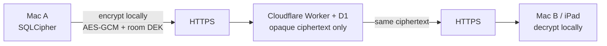

# Security

R+ is **local-first** with optional **Nube** (Cloudflare) room sync. It is not a certified EMR.

**Intended Nube crypto** (not implemented): encrypt on the client → Cloudflare stores opaque ciphertext → peers decrypt locally. Cloudflare must not read PHI.

**Production:** HTTPS only. Room JSON is plaintext in D1. The Worker applies LWW in the clear.

Canonical code: `cloud/sync-worker/src/crypto-at-rest.js`, `public/js/features/cloud-sync/`, `lib/db/crypto.mjs`.  
Pilot spec: [2026-08-02-cloud-sync-free-pilot-design.md](../superpowers/specs/2026-08-02-cloud-sync-free-pilot-design.md) (V1 deferred true E2EE; at-rest AES also dropped).

---

## Where data lives

| Store | Location | Encryption |
|-------|----------|------------|
| Device cache | SQLCipher `rplus-clinical.db` on the Mac (`lib/db/`) | Argon2id + SQLCipher. Strong at-rest if the machine is locked. See [db-encryption.md](../db-encryption.md). |
| **Nube turn rooms** | Cloudflare Worker `rplus-sync` + D1 `rplus-sync` | **Target:** client E2EE. **Today:** HTTPS in transit; plaintext JSON at rest. |
| Equipos queue | Separate Worker `rmas-lista-de-espera` + D1 `rplus-equipos` + R2 `rplus-equipos-photos` | Equipment photos / queue — not the patient room. |
| Recuérdame session | `cloud-sync-remember.json` in Electron `userData` (mode `0600`) | Raw Bearer token on disk — not OS keychain / `safeStorage`. |

### Nube hosting (production, 2026-08-14)

Default client URL: [`https://rplus-sync.rmas-workersdev.workers.dev`](https://rplus-sync.rmas-workersdev.workers.dev) (`DEFAULT_CLOUD_SYNC_URL` in `public/js/features/cloud-sync/settings.mjs`). No custom domain in `cloud/sync-worker/wrangler.toml`.

| Fact | Value |
|------|--------|
| Cloudflare account | `Djsalas99@gmail.com's Account` (Wrangler login `djsalas99@gmail.com`) |
| Account ID | `c231c997bf7c4e51c7a9f51d30e89e79` |
| workers.dev namespace | `rmas-workersdev` |
| Worker | `rplus-sync` |
| D1 | name `rplus-sync`, id `e8e36134-36a9-40d4-9c36-3f893e2b612c` |
| D1 region | **WNAM** (Western North America); jurisdiction unset |
| Durable Object | `RoomSyncHub` — revision notify only, not the clinical snapshot |
| Dashboard | [dash.cloudflare.com](https://dash.cloudflare.com) → that account → Workers `rplus-sync` / D1 `rplus-sync` |

This is a **personal Cloudflare Free** tenant, not a hospital-controlled account. Because production is not E2EE, Cloudflare (and anyone with Wrangler/D1 access) can read room JSON.

---

## Intended Nube crypto (client encrypt / client decrypt)

Target architecture — **envelope DEKs**, north-star NEXT. Not in this build.

| Step | Who | What they see |
|------|-----|----------------|
| 1 | Sending client | Clinical JSON in memory / SQLCipher. Encrypts **before** `fetch`. |
| 2 | Network + Cloudflare | Ciphertext + metadata (room id, revision, sizes). **No names, labs, notes.** |
| 3 | Receiving client | Same ciphertext. Decrypts with the room DEK, then applies LWW **locally**. |

Room DEK stays on enrolled devices (wrapped by the user’s Nube password or a wrapped key per member). Cloudflare never holds the DEK. A TLS interceptor or D1 dump still sees blobs, not PHI.

**Why V1 did not ship this:** Worker-side last-write-wins (`cloud/sync-worker/src/lww.js`) and Interno MIP board assembly need to **read** the snapshot. True E2EE forces merge + Interno onto clients (or a decrypting Worker, which is not E2EE). The 7.9 spec listed true E2EE as a **non-goal** and substituted Worker AES-GCM (`WORKER_DATA_KEY`). That Worker AES was later dropped for Free CPU — leaving plaintext JSON.

Until envelope DEKs land, do not describe Nube as “encrypted to Cloudflare.”

---

## Nube (current)

Opt-in from ⇄. Once connected, the cloud room is turn authority for all clinical wards. Offline = local SQLCipher + outbox.

### What leaves the Mac

JSON ops over HTTPS, then a full room snapshot in D1:

- Census: name, `registro`, age, sex, bed, service, diagnoses, team metadata
- Estado actual / monitoreo, eventualidades
- Notes and indicaciones (clinical-repo projector, default on)
- Lab sidecars: SOME `sourceText` when it looks like SOME (often includes name + expediente), else parsed `resLabs` — **PDFs and non-SOME paste stay local**
- Todos, agenda
- `clinicalOps` (teams, `@usuario`, ranks, assignments, guardia)
- Delete tombstones (`id`, `registro`, `deletedAt`)
- Interno MIP sala token (also in QR as `?t=…`) and vitals from phones
- Login body: username + password; then `Authorization: Bearer`

**Not sent:** historia clínica; VPO / listado / receta HU / med receta & pharm profile; demo patients; device-unlock passphrase.

### Encryption layers

| Layer | Choice |
|-------|--------|
| In transit | HTTPS to Workers. No certificate pinning. A passive sniffer sees TLS; a trusted-CA MITM (hospital proxy) sees JSON. |
| At rest in D1 | **UTF-8 JSON.** `encodeRoomState` writes `{…}` with an empty IV. Column `room_state.ciphertext` is a leftover name. `mutations.ops_json` is plaintext for ~100 revisions. |
| Legacy AES-GCM (Worker) | V1 substitute: Worker encrypts with `WORKER_DATA_KEY` after it already has plaintext. **Not** client E2EE. Dropped — Free CPU cannot AES multi‑MB snapshots. Small legacy blobs still decrypt when `iv` is present. |
| Client E2EE | **Not implemented.** No encrypt-before-push / decrypt-after-pull in `public/js/features/cloud-sync/`. Envelope DEKs are NEXT. |
| Passwords | PBKDF2-SHA-256, **50k** iterations, min 10 chars. Hashes in D1. |
| Sessions | 32-byte token, SHA-256 at rest, ~14-day TTL. |

### If someone intercepts

| Attacker | Production (today) | Intended E2EE |
|----------|-------------------|----------------|
| Passive Wi‑Fi / span, no TLS break | Hostnames, sizes, timing | Same |
| TLS MITM (trusted CA / proxy) | Full clinical JSON; login password in POST | Ciphertext ops + still the login password (auth is not E2EE) |
| Cloudflare / D1 dump / Wrangler | Full monthly room as readable JSON | Opaque blobs; no PHI without a client DEK |
| Stolen Recuérdame file or Interno QR | Pull (or Interno board + vitals) until rotate / expiry | Still a live client — they can decrypt if they have the DEK |

---

## Local device (SQLCipher)

Unchanged by Nube. Device unlock is required. Forced-cloud is an anti-goal — offline must keep working without a Nube account.

## Implemented (clinical)

- Calculator caps and high-risk rules (`lib/clinical-safety-rules/`)
- Human confirmation before persisting flagged actions
- Forensic audit hooks on DB (`lib/db/audit-hooks.mjs`, `forensic-audit.mjs`)

## LAN (retired for clinical sync; leftover risk)

LAN LiveSync is retired (8.0.5). Dev ward `server.js` on **:3738** (`R_PLUS_DEV_WARD_SERVER=1`) still uses **HTTP + WebSocket without TLS**.

| Condition | Requirement |
|-----------|-------------|
| Network | Isolated VLAN / Wi‑Fi only — not guest or public Internet |
| Exposure | Port **3738** must not be port-forwarded |
| Token hygiene | Team bearer + shift PIN; logs redacted (`lan-squad/redact-secrets.js`) |
| PHI at rest (web) | iPad/Safari wipe clinical `localStorage` on session end (`session-clinical-wipe.mjs`) |

**Revisit trigger:** IT offers managed TLS (WSS) on the VLAN, or an audit finds LAN exposure beyond the ward.

## Legacy recovery passphrase

The `'r+123'` recovery path remains for field support. Sunset when `legacy: true` unlock events stop appearing in forensic audit exports.

## Known boundaries (honest)

| Gap | Mitigation today | Roadmap |
|-----|------------------|---------|
| Nube D1 is plaintext JSON (not client E2EE) | HTTPS + account access control; opt-in rooms; trusted cohort | Encrypt on client, opaque D1, decrypt on client; LWW + Interno move off Worker plaintext |
| Personal Cloudflare Free tenant | Small program; Wrangler secrets | Hospital-controlled account / jurisdiction |
| PBKDF2 50k | Free Worker CPU budget | Raise iterations on Paid `cpu_ms` |
| Interno token in URL `?t=` | Rotate from ⇄; sala-scoped | Header-only tokens |
| Recuérdame token on disk | File mode `0600` | Electron `safeStorage` |
| HTTP without TLS on LAN :3738 | Dev-only / accepted LAN table | WSS + IT certs |
| Shared Interno / shift access | Rank gates on desktop | RBAC per user (LATER) |
| Adjunct not EMR | Product positioning | Institutional agreement |

## Anti-goals (security-related)

See [01-vision-north-star.md](./01-vision-north-star.md#-out-of-bounds-anti-goals): no unmanaged public EMR SaaS; Nube is opt-in turn sync, not a general-purpose cloud expediente. Do **not** claim client-encrypted PHI or encrypted-at-rest on Cloudflare until envelope DEKs ship.

## Related

- Local DB recovery: [db-encryption.md](../db-encryption.md)
- Decision log: [18-knowledge-capture.md](./18-knowledge-capture.md)
- Worker runbook: [cloud/sync-worker/README.md](../../cloud/sync-worker/README.md)
