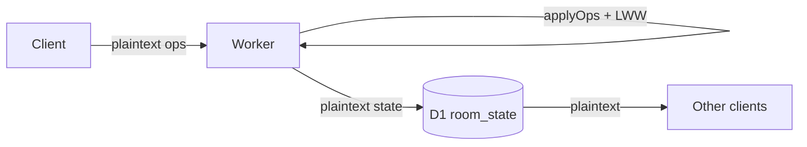
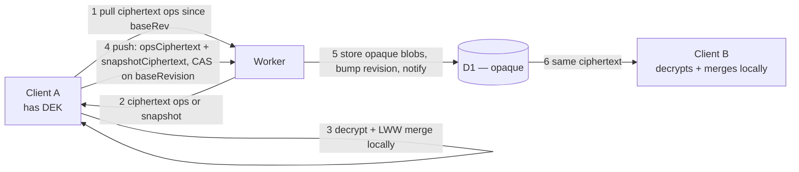

# Nube E2EE blind relay

Companion to [`docs/core/15-security.md`](core/15-security.md), which names this as the
"intended Nube crypto" and explains why V1 didn't ship it. This spec makes that concrete
enough to build.

## Goal

Cloudflare (Worker + D1) never sees clinical plaintext — not in `room_state`, not in
`mutations.ops_json`, not through the admin API. Every device that has joined a room already
holds the full room state locally (SQLCipher), so the cloud's only job is to **sequence and
relay ciphertext** between devices that already trust each other by virtue of having the room
code.

## Non-goals (this pass)

- **Interno MIP board** — dropped for now. It's the reason V1 deferred E2EE (`15-security.md`
  line 69: "Worker-side LWW and Interno MIP board assembly need to read the snapshot"). Interno
  vitals/board assembly is out of scope here; `sala_interno_access` (token issuance in
  `interno-access-sidecar.js`) is untouched — it stores rotation tokens, not PHI, so it isn't
  blocked by this.
- **Mobile lab-window filtering server-side** (`mobile-lab-window.js`) — moves to the client
  (see below), not redesigned.
- **Per-member key revocation** (removing one member without re-keying everyone) — out of
  scope; see Key management.
- Multi-DEK / key rotation UX polish, admin dashboards for ciphertext rooms — later.

## Threat model shift

| Attacker | Today (`15-security.md`) | After this spec |
|---|---|---|
| Cloudflare / D1 dump / Wrangler access | Full room JSON, readable | Opaque ciphertext; PHI requires the room code |
| TLS MITM (trusted CA / hospital proxy) | Full clinical JSON | Ciphertext ops (login/auth unchanged — still plaintext creds over TLS) |
| Stolen room code / QR | Live client, decrypts if they have the DEK (same as today) | **Unchanged** — this spec does not add a second factor beyond the room code |
| Program admin (`SYNC_ADMIN_KEY`) | Can read room content via `/admin/rooms/:id/mutations` | Can see op **counts/sizes/actors**, not content (see Admin API) |

The room code stays the trust boundary — this spec removes Cloudflare from that boundary, it
doesn't add a new one. A leaked room code is still a full room compromise, same as today.

## Key management

**DEK = HKDF(roomJoinSecret, roomId)**, computed identically by every client that has the room
code — no wrapping, no per-member public keys, no new schema.

- `roomJoinSecret` is the existing 6-char room `code` (`rooms.code`) plus, if we want stronger
  entropy without changing the invite UX, a server-issued high-entropy `join_secret` returned
  once at room creation and re-issued on rotate (join by code alone is already the trust model
  today, so reusing `code` as-is is defensible for pilot; issuing a separate secret is the
  hardening option if `code`'s 6-char space is judged too small once it's also a crypto seed).
- **Rotation reuses the existing mechanism.** `admin.js:handleRotateCode` already exists
  (`POST /admin/rooms/:id/rotate-code`) — rotating the code now *also* rotates the DEK, since
  the DEK is derived from it. That's the natural "kick everyone, re-invite" lever; it's blunt
  (whole-room, not per-member) but it's free — no new endpoint, no new key-wrap table.
- Every enrolled client can always re-derive the DEK from the code it already has stored
  locally (same place `cloud-sync/settings.mjs` keeps `DEFAULT_CLOUD_SYNC_URL` today). No DEK
  ever crosses the network.

## Protocol changes

### Today (server-side merge)

### After (blind relay)

Key point: **the client that's pushing already has the fully-merged next state in memory**
(it just computed it to apply its own ops). So it sends two ciphertexts in one request:

1. `opsCiphertext` — the ops it applied, for peers doing an incremental pull (small, cheap).
2. `stateCiphertext` — the full merged room snapshot, encrypted, for peers whose gap is too
   large for incremental pull (mirrors today's `room_state` row exactly).

The Worker writes both verbatim. It never decrypts either one.

### `handleMutations` (`cloud/sync-worker/src/sync.js`)

| Step | Today | After |
|---|---|---|
| Auth + membership | `requireMember` | **Unchanged** |
| Rate limit | `checkMutationPushRateLimit` | **Unchanged** (keyed by roomId, no content needed) |
| Body size cap | `QUOTAS.maxMutationBodyBytes` | **Unchanged**, checked on ciphertext length |
| Per-op byte caps by path (`labMutationMaxBytes` vs `noteMaxBytes`) | Inspects `op.path` | **Lost** — ops are opaque. Replace with one flat cap on total `opsCiphertext` bytes. Flag as a real regression: a buggy/malicious client can no longer be capped per-field, only per-batch. |
| `maxLivePatients` / `maxMembers` quota enforcement | `applyOps` throws `QuotaExceededError` by inspecting `entries` | **Lost** as hard enforcement — becomes advisory (client-side check before push). `storageHardBytes` on the ciphertext blob remains a blunt backstop (bytes still correlate with patient count). |
| Merge (LWW) | `applyOps` in `lww.js`, server-side | **Moves to client.** `lww.js` already runs client-side in mirror form (`estado-actual-data-merge.mjs`) — this makes that copy canonical and deletes the server one, or keeps a shared module imported by both (Worker keeps it only for reading legacy plaintext rooms during migration, see below). |
| Optimistic concurrency + 5x retry loop (`MUTATION_COMMIT_ATTEMPTS`) | Server retries: reload state, reapply ops, re-attempt CAS | **Moves to client.** Same shape: on `revision_stale`, pull the winning ops, decrypt, re-merge locally, recompute `stateCiphertext`, retry the push with the new `baseRevision`. This is the biggest client-side complexity add — today's retry loop (`sync.js:275-327`) has to be ported near-verbatim into `public/js/features/cloud-sync/`. |
| Persist | `commitMutationBatch` calls `encodeRoomState` (Worker encrypts) | Worker just writes the client-supplied ciphertext blobs. No `WORKER_DATA_KEY`, no server-side AES at all — that whole subsystem (`crypto-at-rest.js`) goes away for new rooms. |

### `handlePull` (`cloud/sync-worker/src/sync.js`)

- `shouldReturnSnapshotPull(gap)` logic is **unchanged** — still a server-side decision based
  on revision gap / cumulative `ops_json` bytes, both of which are still visible (ciphertext
  length is public metadata). The Worker still decides "send ops vs send snapshot," it just
  doesn't read either.
- `filterRoomStateLabSidecarsForMobile` / `mobile-lab-window.js` — **moves client-side.** Today
  the Worker trims lab sidecars to a recent-days window before sending to phones so payloads
  stay light; under blind relay it can't inspect `labSidecars` to trim them. The mobile client
  pulls the full ciphertext snapshot, decrypts, and applies the same day-window filter locally
  (`lib/lab-mobile-history-window.mjs` is already isomorphic — it's imported by the Worker
  today precisely because it has no server-only dependencies). Cost: mobile pulls a bigger
  payload over the wire; the filtering saving is now a client-side render-time trim only, not a
  bandwidth trim. Worth measuring before shipping if phone data usage matters.

### Admin API (`cloud/sync-worker/src/admin.js`)

Most of `admin.js` never touched `room_state` plaintext and is unaffected:
`handleOverview`, `handleListRooms`, `handleRoomDetail`, `handleRotateCode`, `handlePurgeRoom`,
all user-management handlers.

Only `handleRoomMutations` (`GET /admin/rooms/:id/mutations`) changes: it currently returns
`summarizeMutationOpsJson(opsJson)` — op count, byte sizes, **and paths touched** (which patient
fields changed). Under E2EE, `ops_json` is ciphertext, so `paths` and any content-derived
summary disappear; the endpoint degrades to `{revision, actorId, createdAt, byteLength}` per
mutation. This is a real loss of support/debug visibility — worth calling out to whoever owns
on-call support before shipping, since "which patient did this touch" becomes unanswerable from
the Worker side.

## Schema changes

None structurally — `room_state(ciphertext, iv)` and `mutations(ops_json)` already have the
right shape (blob + iv columns exist from the legacy `WORKER_DATA_KEY` era). The only semantic
change: **who writes `ciphertext`/`iv`** — client, not Worker — and `ops_json` stores base64
ciphertext text instead of plaintext JSON array text (still a `TEXT` column, no migration).

Optionally add a `room_state.enc_version` / `mutations.enc_version` column (`INTEGER DEFAULT 0`)
to distinguish legacy plaintext rows from client-encrypted rows during rollout, rather than
sniffing content shape the way `crypto-at-rest.js` currently does for the old hex-era format
(`looksLikeJsonObject`, empty-IV sniffing). A precedent already exists for exactly this pattern
one level down: `lww.js:221-228` already special-cases `clinicalOps` — if the incoming value has
`{enc: 1, ...}` it's stored as an opaque envelope instead of merged in the clear. This spec is
that same trick applied to the whole room state instead of one field.

## Migration path

1. Ship client encrypt/decrypt + local merge behind a feature flag, opt-in per room (like Nube
   itself is opt-in today).
2. New rooms created with the flag on get `enc_version = 1` from the start — Worker never
   decrypts them, full blind relay.
3. Existing plaintext rooms keep working unmodified (Worker still runs `applyOps` server-side
   for `enc_version = 0` rows) until a room is explicitly migrated: one online client pulls the
   full plaintext state, re-pushes it as an encrypted snapshot, room flips to `enc_version = 1`.
   No forced flag day, no big-bang cutover — mirrors how `iv`-length sniffing in
   `crypto-at-rest.js` already tolerates three historical formats (plaintext, legacy hex AES,
   raw AES) in the same decode function.
4. Delete `WORKER_DATA_KEY` / `crypto-at-rest.js`'s encrypt path once no `enc_version = 0` rooms
   remain (decode path can stay indefinitely cheap to keep around for old D1 exports).

## Open risks to resolve before implementation

- **Client retry-loop correctness.** The 5-attempt CAS retry in `sync.js` is currently ~50
  lines of carefully-ordered server code (`handleMutations`). Porting it client-side, in a
  Electron renderer that can be backgrounded/killed mid-retry, needs its own test coverage —
  this is the highest-risk single piece of this spec, not the crypto.
- **Snapshot size on every push.** Sending `stateCiphertext` (full room, potentially near
  `storageHardBytes` = 50MB) on *every* mutation, not just large-gap pulls, is wasteful once
  rooms are large. Cheaper option: only attach `stateCiphertext` when the pushing client detects
  a peer is likely far behind (e.g. include it every Nth push, or only when server signals via
  `needPull`/gap size on the *previous* pull that someone needed a snapshot recently). Needs a
  concrete policy, not "always."
- **Lost per-field quota/size enforcement** (above) — decide if this is acceptable for the pilot
  cohort ("trusted cohort," per `15-security.md`) or needs a client-side-only backstop that a
  malicious client could simply skip.
- **Admin support visibility loss** (above) — decide what a support engineer does when a room
  looks corrupted and the Worker can no longer show what changed.

## Related

- [`docs/core/15-security.md`](core/15-security.md) — current state, "Intended Nube crypto"
  section this spec fulfills.
- `cloud/sync-worker/src/sync.js`, `lww.js`, `crypto-at-rest.js`, `admin.js`,
  `mobile-lab-window.js`, `pull-strategy.js` — all referenced above by current behavior.
- `public/js/features/cloud-sync/`, `public/js/features/estado-actual-data-merge.mjs` — client
  side this spec pushes work onto.
