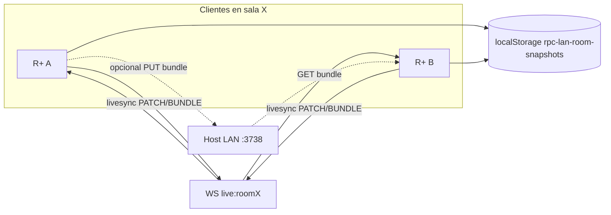

# LiveSync por sala — agenda de procedimientos y pendientes

> **Para implementación:** tras aprobación de este archivo, usar **superpowers:writing-plans** para el plan por tareas; no mezclar otras skills de implementación en la misma transición.

**Fecha:** 2026-05-16  
**Estado:** Especificación de producto aprobada en brainstorming.

## Objetivo

Sincronizar en tiempo real, **solo dentro de una sala LiveSync** (`live:{roomId}`), la **agenda de procedimientos** (`rpc-scheduled-procedures`) y los **pendientes por paciente** (`rpc-todos`), sin tocar notas, laboratorio, medicamentos ni listado de problemas en esta versión.

## Decisiones de producto (cerradas)

| Tema | Decisión |
|------|----------|
| Alcance | Agenda + pendientes |
| Ámbito | Solo miembros de la sala activa |
| Al salir / desconexión | Snapshot local por `roomId`; reconciliar al reentrar |
| Conflictos | Última escritura gana por `updatedAt` (LWW) por entidad (`id`) |
| Enfoque técnico | Relay WS en vivo + snapshots en cliente + bundle opcional en host |

## Fuera de alcance v1

- Sync sin estar unido a una sala.
- Expediente completo, notas, indicaciones, labs, meds, listado de problemas.
- Motor CRDT / rama `beta/live-sync` completa (solo protocolo JSON acordado aquí).
- Resolución manual de conflictos en UI.

## Arquitectura



### Componentes

| Pieza | Responsabilidad |
|-------|-----------------|
| `lan-squad/ws-hub.js` | Sin cambio de modelo: relay JSON en canales `live:*` (ya existe). |
| `lan-squad/host-router.js` + `host-store.js` | **Opcional v1:** `GET/PUT /api/lan/v1/rooms/:id/sync-bundle` — último bundle subido por cualquier cliente al salir. |
| `public/js/live-sync-room.mjs` | Protocolo, merge LWW, snapshots, estado de sala activa. |
| `public/js/lan-client.mjs` | Exponer envío en canal live sin cerrar canal `sync` (hoy un solo `_ws`; requiere segundo socket o multiplex — ver nota de implementación). |
| `public/js/storage.js` | `updatedAt` en todos; helpers de snapshot por sala. |
| `public/js/app.js` | Enganchar `joinLanRoom` / salida WS; emitir parches tras guardar agenda/pendientes si hay sala activa. |

### Nota de implementación — dos WebSockets

Hoy `LanClient` usa un único `_ws`: `connectSyncChannel()` y `connectLiveChannel()` se excluyen. Para sync en sala **sin perder** notificaciones del canal `sync` (p. ej. pacientes), la implementación debe mantener **dos conexiones** (sync + live) o un hub multiplexado. El plan de implementación debe elegir una opción y documentarla; el comportamiento de producto no cambia.

## Protocolo WebSocket (`live:{roomId}`)

Todos los mensajes son JSON. El servidor reenvía tal cual a los demás clientes del mismo canal (incluye al emisor; aceptable en v1).

| `type` | Payload | Cuándo |
|--------|---------|--------|
| `livesync:hello` | `{ roomId, clientId, snapshotAt, generation }` | Al unirse o reconectar al live channel. |
| `livesync:bundle` | `{ roomId, clientId, savedAt, generation, agenda: Event[], todos: Record<patientId, Todo[]> }` | Respuesta a hello o tras snapshot completo. |
| `livesync:patch` | `{ roomId, entity: 'agenda' \| 'todo', op: 'upsert' \| 'delete', id, patientId?, body?, updatedAt, clientId }` | Tras cada guardado local en sala activa. |
| `livesync:leave` | `{ roomId, clientId, bundle?: … }` | Al salir de sala o antes de `disconnect` del live WS; puede incluir bundle completo. |

`clientId`: UUID estable en `localStorage` (`rpc-lan-client-id`), generado una vez.

`generation`: entero monótono por cliente; incrementa en cada snapshot local guardado.

## Modelo de datos

### Agenda (sin cambio de forma)

Usar el modelo de [`2026-05-14-procedure-agenda-week-view-design.md`](2026-05-14-procedure-agenda-week-view-design.md): `id`, `patientId`, `procedure`, `location`, `materialApproved`, `anesthesiaScheduled`, `start`, `createdAt`, `updatedAt`.

### Pendientes — campo nuevo

Cada todo debe incluir **`updatedAt`** (ISO 8601). Al crear o modificar (texto, `completed`, `priority`): `updatedAt = new Date().toISOString()`. `createdAt` se mantiene.

Normalización en `storage.getTodos` / `saveTodos`: si falta `updatedAt`, usar `createdAt` o epoch al leer; siempre persistir en escritura.

### Snapshot local por sala

Clave: **`rpc-lan-room-snapshots`**

```javascript
{
  "<roomId>": {
    savedAt: "2026-05-16T12:00:00.000Z",
    generation: 3,
    agenda: [ /* copia de getScheduledProcedures() filtrada sin demo- */ ],
    todos: {
      "<patientId>": [ /* getTodos(patientId) */ ]
    }
  }
}
```

Al salir de sala, perder live WS, o `beforeunload` con sala activa: escribir snapshot desde estado actual de storage.

### Bundle opcional en host

En `lan-squad-host-state.json`, por sala:

```javascript
rooms: [ /* existente: id, displayName */ ],
roomSyncBundles: {
  "<roomId>": {
    updatedAt: "ISO",
    uploadedByClientId: "string",
    agenda: [],
    todos: {}
  }
}
```

`PUT` reemplaza el bundle entero (LWW del bundle por `updatedAt` del envelope, no por ítem). `GET` devuelve 404 si no hay bundle.

## Algoritmo de reconciliación (LWW)

Entrada: conjunto de fuentes `{ localSnapshot?, remoteBundles[], livePatches[] }`.

1. Indexar entidades por clave:
   - Agenda: `id`
   - Todo: `patientId + ':' + id`
2. Para cada clave, conservar la versión con mayor `updatedAt` (comparación lexicográfica ISO).
3. `op: 'delete'` con `updatedAt` T gana sobre upsert con `updatedAt` < T.
4. Aplicar resultado a `storage.saveScheduledProcedures` y `storage.saveTodos` por paciente.
5. Refrescar `renderProcedureAgendaPanel` y `renderTodoForm` si visibles.

**Al unirse a sala (`joinLanRoom`):**

1. Conectar live WS (y mantener sync WS — ver nota arriba).
2. Enviar `livesync:hello`.
3. Recibir `livesync:bundle` de pares; opcional `GET sync-bundle` del host.
4. Merge con snapshot local `rpc-lan-room-snapshots[roomId]` si existe.
5. Aplicar a storage; fijar `activeLiveSyncRoomId = roomId`.

**Durante la sesión:** cada guardado de agenda/todo → `livesync:patch` por live WS.

**Al salir:** `livesync:leave` (con bundle opcional) → snapshot local → opcional `PUT sync-bundle` → limpiar `activeLiveSyncRoomId` → cerrar solo live WS.

## Reglas de negocio

- Pacientes `demo-*`: no entran en patches ni snapshots persistidos.
- Sin sala activa: comportamiento actual (solo local); cero mensajes livesync.
- WS caído con sala “lógica” activa: banner LAN existente; ediciones locales siguen; snapshot al reconectar; merge LWW puede sobrescribir según timestamps.
- **IDs de paciente v1:** se asume el mismo `patientId` entre clientes de la sala (sin remapeo automático en este spec). El mapa `rpc-lan-host-patient-map` queda para evolución si el equipo usa altas LAN.

## UI

- Panel LAN / indicador: “Sala: {nombre} · sincronizando agenda y pendientes” cuando `activeLiveSyncRoomId` y live WS abierto.
- Sin live WS: “Sala: {nombre} · solo local (sin sync en vivo)”.
- No bloquear edición local por falta de sync; el usuario siempre puede trabajar offline en su máquina.

## Errores

- JSON inválido en WS: ignorar mensaje.
- Patch con `entity` desconocida: ignorar.
- `PUT sync-bundle` sin código LAN válido: 401.
- Bundle host más antiguo que snapshot local tras merge: el merge LWW por ítem decide; el envelope del bundle solo ordena fuentes completas si `savedAt` del bundle es mayor que `snapshotAt` del hello.

## Pruebas

| Área | Qué probar |
|------|------------|
| `live-sync-room.mjs` | Merge LWW agenda (dos upserts, delete vs upsert); merge todos por paciente; merge tres fuentes (local + dos bundles). |
| `storage.js` | `updatedAt` en todos al guardar; snapshot round-trip. |
| Humo manual | Dos instancias, misma sala: crear evento agenda y todo; ver reflejo; salir y reentrar con un solo cliente + bundle host. |

## Relación con otros documentos

- Agenda UI y campos: [`2026-05-14-procedure-agenda-week-view-design.md`](2026-05-14-procedure-agenda-week-view-design.md) (v1 local; este spec es la capa LiveSync v2 por sala).
- Infra LAN base: [`2026-05-13-lan-host-livesync-calendario-global.md`](../plans/2026-05-13-lan-host-livesync-calendario-global.md) (plan técnico; calendario global host retirado; salas + relay siguen vigentes).

## Anexo — feature independiente (ya implementada)

Botón **Copiar prompt IA** en pestaña Listado de problemas: copia texto fijo (`listado-problemas-ai-prompt.mjs`) al portapapeles; no forma parte del sync LiveSync.
