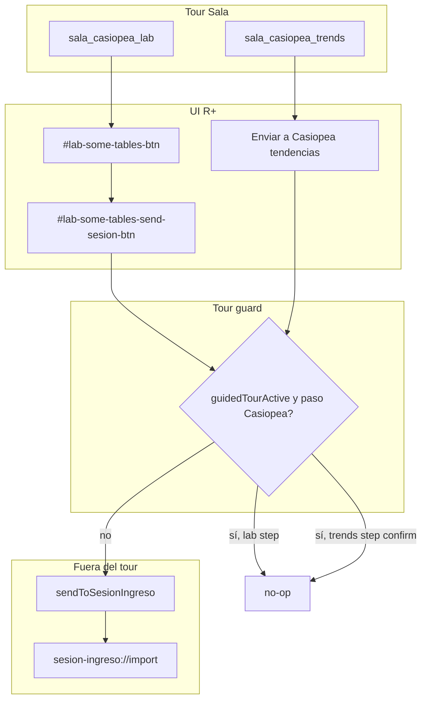

# R+ 5.2 — Integración Casiopea (copy + tour Sala)

> **Para implementación:** tras aprobación de este archivo, usar **superpowers:writing-plans** para el plan por tareas.

**Fecha:** 2026-05-23  
**Estado:** Especificación de producto (brainstorming).

## Objetivo

Preparar **R+ 5.2** para la integración con **Casiopea** (nombre externo de la app antes llamada Sesión de Ingreso): alinear copy visible con la marca nueva y enseñar en el **tutorial modo Sala** dónde están los botones de envío, **sin abrir Casiopea ni enviar datos** durante el tour.

## Contexto / compatibilidad

| Capa | Estado |
|------|--------|
| Deep link | `sesion-ingreso://import?payload=…` / `?file=…` — **sin cambios** |
| IPC Electron | `sesion-ingreso-send` → `electronAPI.sendToSesionIngreso` — **sin cambios** |
| Payload | `source: 'r-plus'`, `kind: 'lab-tables'` (v1), `lab-trends` (v2) — **sin cambios** |
| App Casiopea | Registra solo `sesion-ingreso://` (alias dual no requerido en R+) |

Los hooks técnicos internos (`sesion-ingreso-*` en archivos, DOM, IPC) **permanecen**; solo cambia texto visible al usuario.

## Decisiones de producto (cerradas)

| Tema | Decisión |
|------|----------|
| Rebranding | Solo **copy visible** → “Casiopea” |
| Tour | Dos pasos **informativos** en rama **Sala** únicamente |
| Ubicación pasos | Embebidos: tras `lab_view` y tras `sala_tend_chart` |
| Envío en tour | **No** abrir Casiopea; **no** llamar `sendToSesionIngreso` |
| Modal SOME en tour lab | Usuario **sí** puede pulsar `#lab-some-tables-btn` para abrir el modal (comportamiento normal) |
| Botón Enviar en tour lab | `#lab-some-tables-send-sesion-btn` **no hace nada** mientras `tourStepId === 'sala_casiopea_lab'` |
| Botón Enviar en tour tendencias | Abre modal de selección **o** no-op en confirm — ver comportamiento abajo |
| Avance del tour | **Siguiente** visible; pasos **no** entran en `ACTION_STEPS` |
| Interconsulta | Sin pasos Casiopea |
| Centro de ayuda | Fuera de alcance (copy-only A) |
| Rename código interno | Fuera de alcance |

## Tour Sala — orden actualizado

```
map_sidebar → pase_enter → pase_board → map_tabs → map_lab_teaser → servicio_default
→ lab_parse → lab_view
→ sala_casiopea_lab          ← nuevo
→ sala_tend → sala_tend_chart
→ sala_casiopea_trends         ← nuevo
→ estado_actual → sala_med → listado_problemas
→ livesync_desktop → livesync_mobile → wrap
```

Total pasos Sala: **16 → 18**.

## Pasos nuevos — UX

### `sala_casiopea_lab`

- **Pestaña:** Laboratorio (`appTab: 'lab'`).
- **Spotlight:** `#lab-some-tables-btn` (abrir tablas SOME).
- **Texto dock:** Tras procesar el lab de ejemplo, abre **Tablas SOME** y localiza **Enviar a Casiopea** para mandar estudios al paso Paraclínicos en Casiopea (app aparte en el mismo equipo).
- **Interacción:**
  1. Usuario pulsa `#lab-some-tables-btn` → modal SOME se abre (normal).
  2. Usuario pulsa **Enviar a Casiopea** dentro del modal → **no-op** en tour (sin IPC, sin toast de error). Opcional: toast informativo breve tipo “En el tutorial solo mostramos el botón; fuera del tour aquí se abre Casiopea”.
  3. Usuario pulsa **Siguiente** en el dock para continuar.

### `sala_casiopea_trends`

- **Pestaña:** Expediente → Tendencias (`appTab: 'nota'`, `innerTab: 'tend'`).
- **Spotlight:** botón toolbar **Enviar a Casiopea** (selector estable, p. ej. `[data-tour="casiopea-trends-send"]` o clase existente en toolbar).
- **Texto dock:** Con varios laboratorios en el tiempo, **Enviar a Casiopea** manda gráficas agrupadas al flujo de paraclínicos en Casiopea.
- **Interacción:**
  1. Usuario puede pulsar **Enviar a Casiopea** → abre modal de selección (comportamiento normal de UI).
  2. Confirmar envío en el modal → **no-op** en tour (`tourStepId === 'sala_casiopea_trends'`).
  3. **Siguiente** avanza a `estado_actual`.

> **Simetría lab/tendencias:** abrir modales para **ver** el flujo; bloquear solo la acción que dispararía `sendToSesionIngreso`.

## Copy visible — “Casiopea”

Reemplazar “Sesión de Ingreso” / “Enviar a Sesión” en strings de usuario:

| Ubicación | Antes (ej.) | Después |
|-----------|-------------|---------|
| `#lab-some-tables-send-sesion-btn` | Enviar a Sesión | Enviar a Casiopea |
| Modal lab send title | Enviar a Sesión de Ingreso | Enviar a Casiopea |
| Modal lab send hint | …en Sesión de Ingreso | …en Casiopea |
| Modal trends title | Enviar tendencias a Sesión de Ingreso | Enviar tendencias a Casiopea |
| Modal trends hint | …Sesión de Ingreso | …Casiopea |
| Toolbar tendencias | Enviar a Sesión | Enviar a Casiopea |
| Toasts éxito/error | Sesión de Ingreso | Casiopea |

Archivos: `public/index.html`, `public/partials/chrome/overlays.html`, `sesion-ingreso-send-modal.mjs`, `sesion-ingreso-trends-send-modal.mjs`, `lab-panel.mjs`, `tendencias.mjs`.

## Arquitectura técnica



### Componentes a tocar

| Archivo | Cambio |
|---------|--------|
| `public/js/tour-targets.mjs` | Insertar `sala_casiopea_lab`, `sala_casiopea_trends` en `SALA_STEPS`; targets y spotlight |
| `public/js/features/settings-help.mjs` | `renderTourStep` cases; export helper `isCasiopeaTourSendBlocked()` o leer `getGuidedTourContext()` |
| `public/js/features/lab-some-tables-modal.mjs` | En `triggerSesionIngresoSend`, salir temprano si tour bloquea envío lab |
| `public/js/features/sesion-ingreso-send-modal.mjs` | En confirm, no `sendPayload` si tour bloquea |
| `public/js/features/sesion-ingreso-trends-send-modal.mjs` | Idem confirm trends |
| `public/js/tour-targets.test.mjs` | Orden 18 pasos; índices de nuevos pasos |
| `package.json` | `5.2.0` |
| `docs/RELEASE_NOTES_5.2.txt` | Nota breve Casiopea + tour |

### Helper de guard (recomendado)

Centralizar en `settings-help.mjs` (ya exporta `getGuidedTourContext`):

```js
export function isCasiopeaTourSendBlocked(kind) {
  // kind: 'lab' | 'trends'
  const { active, stepId } = getGuidedTourContext();
  if (!active) return false;
  if (kind === 'lab') return stepId === 'sala_casiopea_lab';
  if (kind === 'trends') return stepId === 'sala_casiopea_trends';
  return false;
}
```

Importar desde modales de envío (evitar acoplar tour a export payload).

### `onboardingAdvanceAfterSend`

**Sin cambios funcionales** respecto al flujo pre-Casiopea: ese hook avanza desde `lab_view` solo cuando `tourStepId === 'lab_view'`. Los nuevos pasos no usan envío real; el avance es manual con **Siguiente**.

## Errores y edge cases

| Caso | Comportamiento |
|------|----------------|
| Usuario fuera del tour pulsa Enviar | Envío normal vía IPC |
| Web / móvil (sin Electron) | Toast existente “Integración disponible solo en escritorio” |
| Usuario cierra modal SOME en paso tour | Puede reabrir con el mismo botón; **Siguiente** sigue disponible |
| Rama Interconsulta | Lista de pasos sin cambios (18 pasos inter ≠ afectados) |

## Testing

1. **`tour-targets.test.mjs`**
   - `getSalaTourSteps().length === 18`
   - `sala_casiopea_lab` inmediatamente después de `lab_view`
   - `sala_casiopea_trends` inmediatamente después de `sala_tend_chart`
   - `stepRequiresUserAction('sala_casiopea_lab') === false`
2. **Manual (escritorio):** tour Sala → paso lab → abrir SOME → Enviar no abre Casiopea → Siguiente → paso tendencias → confirm no envía → Siguiente.
3. **Regresión:** envío real fuera del tour sigue abriendo `sesion-ingreso://`.

## Fuera de alcance v5.2

- Renombrar archivos `sesion-ingreso-*`, IPC o protocol URL.
- Pasos Casiopea en Interconsulta.
- Artículo en Centro de ayuda.
- Detección “Casiopea instalada” / deep link de solo apertura.
- Cambios en la app Casiopea.

## Release

- Versión **5.2.0** en `package.json`.
- `docs/RELEASE_NOTES_5.2.txt`: integración Casiopea (copy), dos pasos en tutorial Sala, protocolo `sesion-ingreso://` sin cambios.
