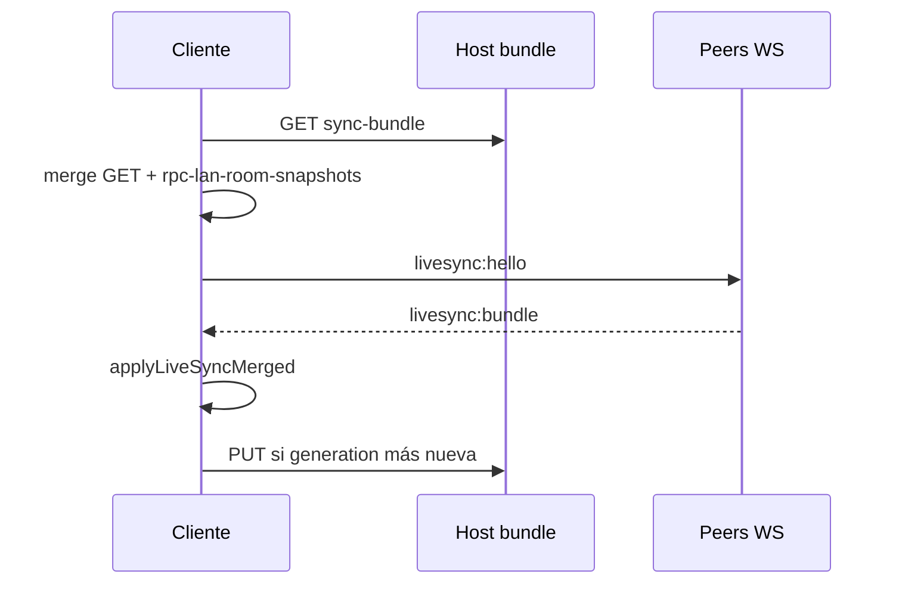

# Diseño: Manejo modular + sala LAN persistente (room drive)

**Fecha:** 2026-05-26  
**Estado:** Aprobado en brainstorming (2026-05-26)  
**Relación:** Extiende `2026-05-16-livesync-agenda-todos-room-design.md`, `2026-05-19-modular-app-refactor-design.md`, `2026-05-26-manejo-guia-clinica-design.md`.

> **Para implementación:** tras revisión de este archivo, usar **superpowers:writing-plans** para el plan por tareas.

---

## 1. Resumen

Dos iniciativas acopladas en un solo programa de trabajo:

1. **Sala LAN persistente (“room drive”)** — Los datos del turno (pacientes, labs, agenda, pendientes, Manejo de equipo) viven en un documento por `roomId`, con LWW por entidad. El servidor squad es **disco compartido + relay WS**, no dueño clínico de los datos. Membresía **pegajosa**: al reabrir R+ se reentra y se reconecta hasta que el usuario pulse **Salir de sala**.

2. **Refactor de Manejo** — Partir `manejo.mjs` (~4 900 líneas) en módulos alineados al resto de la app (~800–1 000 líneas por archivo), eliminar UI legacy muerta post–guía clínica, y enlazar datos de Manejo al documento de sala.

**Modelo de red v1 (D1):** Un proceso R+ anfitrión por turno (`http://IP:3738`) con REST + WebSocket relay. Los clientes son pares en vivo; la persistencia fría es `GET/PUT sync-bundle` en esa máquina. Failover de anfitrión (D2) y P2P sin servidor (D3) quedan fuera de v1.

---

## 2. Problema

| Área | Síntoma |
|------|---------|
| Manejo | `manejo.mjs` monolítico; ~1 500 líneas de renderers legacy sin uso; guía clínica depende de un contexto gigante. |
| LiveSync | Push solo con WS en vivo; bundle en host opcional; al reiniciar la app no se restaura membresía de sala. |
| Producto | El equipo espera “carpeta del turno”: alta/baja de paciente y labs visibles para todos, incluso tras cerrar R+; borrado con deshacer. |
| Pendientes | Texto de ayuda obsoleto sugiere auto-reposición electrolitos; listas saturadas con `Repo …` históricos. |

---

## 3. Objetivos

1. Documento de sala canónico, reconciliable offline/online, último escritor gana por entidad.
2. Membresía de sala hasta acción explícita **Salir de sala**; reconexión automática al abrir la app.
3. Pacientes en sala: unión de no-demo (B); alta persiste; baja propaga con ventana **⌘Z**.
4. Labs dentro de `patient entry` con merge por `lab set id` (extender disciplina `updatedAt`).
5. Manejo de equipo (protocolos custom, overrides, favoritos/recientes) en `RoomSnapshot.manejo`.
6. `manejo.mjs` orquestador < 400 líneas; sin renderers legacy.

## 4. No objetivos v1

- P2P sin servidor (WebRTC / mesh).
- Failover automático de anfitrión (D2).
- CRDT / resolución manual de conflictos en UI.
- Sync de nota Word completa o export masivo fuera del entry ya incluido.
- Reescritura de `labs.js` parser.

---

## 5. Arquitectura de red (D1)

```text
                    ┌─────────────────────────────┐
                    │  R+ anfitrión (1 por turno)   │
                    │  :3738 REST + WS relay         │
                    │  roomSyncBundles[roomId]       │
                    └──────────────┬────────────────┘
           HTTP/WS               │               HTTP/WS
      ┌──────────┐        live:roomX       ┌──────────┐
      │ Cliente  │◄────── broadcast ──────►│ Cliente  │
      └──────────┘                         └──────────┘
```

| Capa | Rol |
|------|-----|
| WS `live:{roomId}` | Relay JSON; todos los clientes son pares en tiempo real. |
| `GET/PUT …/rooms/:id/sync-bundle` | “Google Drive” del turno; LWW del envelope por `updatedAt` / `generation`. |
| Cliente | Snapshot local `rpc-lan-room-snapshots` + cola `rpc-lan-sync-outbox`. |

**Principio:** Quien escribió último gana por entidad; el anfitrión no invalida cambios de clientes al reconectar.

---

## 6. Modelo de datos — `RoomSnapshot`

Persistido en host (`roomSyncBundles[roomId]`) y cliente (`rpc-lan-room-snapshots[roomId]`).

```typescript
// Forma lógica (JSON en disco)
interface RoomSnapshot {
  roomId: string;
  savedAt: string;           // ISO
  generation: number;        // monótono por cliente al materializar
  uploadedByClientId: string;

  agenda: ProcedureEvent[];  // LWW por event.id
  todos: Record<patientId, Todo[]>;  // LWW por todo.id; Todo.updatedAt obligatorio

  entries: PatientEntry[];   // ver buildPatientEntry
  patientDeletes: PatientDeleteTombstone[];

  manejo?: {
    customProtocols: CustomProtocol[];  // LWW por protocol.id
    overrides: Record<protocolId, Override>;  // LWW por protocolId + updatedAt
    favorites: string[];
    recent: string[];
    updatedAt: string;
  };
}

interface PatientDeleteTombstone {
  id: string;
  registro?: string;
  updatedAt: string;
  deleted: true;
}

interface PatientEntry {
  patient: Patient;
  note: object;
  indicaciones: object;
  labHistory: LabSet[];      // mergeLabHistorySets por set.id
  medReceta?: object;
  listadoProblemas?: object;
  todos?: Todo[];
}
```

### Pacientes (decisión B + permanencia)

- Mientras hay **membresía activa**, cada cliente contribuye sus pacientes no-demo al merge (unión).
- **Alta:** nueva `entry` en bundle → persiste en host; otros la reciben al unirse/reconciliar.
- **Baja:** ver §8 (diferida + ⌘Z).
- **Al salir de la app:** no se abandona la sala; solo snapshot + outbox flush.

### Laboratorios

- Van en `entry.labHistory`; merge existente en `lan-patient-merge.mjs` (`labSetTimestamp`, `mergeLabHistorySets`).
- Toda escritura de set debe persistir `updatedAt` (crear al insertar/reprocesar).

### Manejo de equipo

- Hoy en `localStorage`: `rpc-manejo-custom-protocols`, `rpc-manejo-protocol-overrides`, favoritos/recientes.
- En sala activa: leer/escribir vía `manejo-room-data.mjs` contra `RoomSnapshot.manejo`; merge LWW; hidratar cache local de trabajo.

---

## 7. Membresía pegajosa y reconexión

### Estado local

```text
rpc-lan-room-membership = {
  roomId, label, joinedAt
}
```

Distinto de `rpc-lan-known-rooms` (atajos) y de `rpc-lan-last-room` (legacy; migrar a membership).

### Ciclo de vida

| Evento | Acción |
|--------|--------|
| Usuario **Unirse** / crear sala | Set membership; `joinLanRoom`; reconciliar |
| Cierre de app / sleep / pérdida red | Mantener membership; snapshot; outbox |
| **Arranque de R+** con LAN configurado | `resumeLiveSyncRoom()` desde membership |
| WS caído | `liveSyncReconnectLoop` backoff 1s→30s |
| Host REST caído | Reintentar GET/PUT; badge “sin respaldo en host” |
| **Salir de sala (LiveSync)** | `leaveLiveSyncRoom`; clear membership; dejar de reintentar |
| Cambiar de sala | leave silencioso + nueva membership |

### Arranque (`bootLanRoomMembership`)

1. `initLanClientFromStorage()` (canal sync).
2. Si `rpc-lan-room-membership.roomId` → restaurar `activeLiveSyncRoomId`.
3. `reconcileLiveSyncRoom(roomId)` (GET host ⊕ snapshot local).
4. `applyLiveSyncMerged`.
5. `connectLiveChannel` + hello/bundle.
6. Iniciar loop de reconexión si no hay WS.

### UI

- Chrome ⇄: `Sala: {label} · sincronizando` | `· reconectando…` | `· solo local`.
- Única salida explícita de membresía: botón existente **Salir de sala (LiveSync)** (renombrar si hace falta para claridad).

---

## 8. Borrado de paciente con ⌘Z

| Paso | Comportamiento |
|------|----------------|
| Confirmar eliminar | `pushUndoSnapshot(label)`; ocultar en UI; `pendingPatientDeletes[id]` local |
| **⌘Z** (undo global) | Restaurar desde snapshot; no emitir patch ni tombstone |
| Undo consumido o timeout ~30 s | `livesync:patch` `entity: patient`, `op: delete`; tombstone en bundle; flush outbox + PUT host |
| Peers | `applyLiveSyncPatientDeletes` (existente) |

No propagar borrado a la sala mientras exista undo restaurable para esa acción.

---

## 9. Protocolo sync y cola offline

### Cola

```text
rpc-lan-sync-outbox[roomId] → [
  { kind: 'bundle' | 'patch', payload, enqueuedAt, clientId }
]
```

### Flush

- Debounce post-`saveState` (900 ms, como hoy).
- Al salir de sala / `beforeunload`.
- Al reconectar WS o canal sync.
- Timer de respaldo ~60 s si outbox no vacío.
- **PUT host** si hay URL LAN aunque no haya peers en WS.

### Reconciliación al unirse / reanudar



Mensajes WS existentes (`livesync:hello`, `bundle`, `patch`, `leave`) se mantienen; ampliar payloads de bundle con `manejo` y tombstones ya soportados en merge de entries.

### Errores

| Caso | UX |
|------|-----|
| Host caído, WS ok | Sync en vivo; PUT reintenta |
| WS caído, host ok | Bundle + outbox; “sin vivo” |
| Bundle > 12–16 MB | Toast; sugerir limpieza |
| Conflicto mismo registro | LWW; sin UI v1 |

---

## 10. Refactor Manejo (Fase B)

### Mapa de módulos

| Módulo | Líneas objetivo | Responsabilidad |
|--------|-----------------|-----------------|
| `manejo.mjs` | < 400 | Subtabs, `renderManejo`, runtime, disclaimer |
| `manejo-electrolitos.mjs` | ~600–900 | Tarjetas, evaluación, banner peso/vía |
| `manejo-some-ui.mjs` | ~400–600 | Bloques SOME (si flag UI) |
| `manejo-proto-detail.mjs` | ~800–1000 | Detalle infusión, calculadora |
| `manejo-proto-editor.mjs` | ~400–600 | Modal editor |
| `manejo-atb-ui.mjs` | ~400–600 | Lectura ATB, chips RIS |
| `manejo-guia-context.mjs` | ~150–250 | Objeto `ui` para guía |
| `manejo-room-data.mjs` | ~200–400 | Merge/persist `RoomSnapshot.manejo` |

**Ya existentes:** `manejo-guia*.mjs`, `manejo-patologias.mjs`, `public/js/manejo-*.mjs` (dominio clínico).

### Eliminación legacy (mismo release o PR previo)

- `renderManejoProtocolos`, `renderManejoAtb`, `renderManejoCadEhh` y helpers exclusivos.
- Estimado −1 200 a −1 800 líneas sin cambio visible (guía ya activa).

### Dependencias

- Features Manejo no se importan entre sí excepto guía → context / cores.
- Sin imports cruzados entre features (regla modular app).

### Orden sugerido

1. `manejo-guia-context.mjs` + cableado.
2. Electrolitos + SOME UI.
3. Proto detail + editor + ATB UI.
4. `manejo.mjs` delgado.

---

## 11. Pendientes y reposiciones automáticas

| Regla | Detalle |
|-------|---------|
| Electrolitos | **No** auto-agregar a pendientes; solo botón **+ Pendiente** en Manejo. |
| Hb < 7 | Mantener `applyLabClinicalSuggestions` (hb-transfusion) salvo cambio explícito de producto. |
| Ayuda | Corregir texto en `settings-help.mjs` (quitar “REPO DE POTASIO” automático). |
| Limpieza opcional | Acción archivar pendientes con `labRuleId` `manejo:*` o texto `^Repo ` |

---

## 12. Fases de entrega

| Fase | Entregable |
|------|------------|
| **A1** | `RoomSnapshot` ampliado; outbox; PUT siempre; GET/merge al resume |
| **A2** | Membresía pegajosa + `bootLanRoomMembership` + reconnect loop |
| **A3** | Borrado paciente diferido + ⌘Z |
| **A4** | `manejo` en sala + `manejo-room-data.mjs` |
| **A′** | Ayuda + limpieza legacy pendientes |
| **B** | Refactor módulos Manejo + eliminar legacy UI |

---

## 13. Pruebas mínimas

- `live-sync-room.mjs` — bundle con `manejo`, tombstones.
- `lan-patient-merge.mjs` — labs, delete, re-alta por registro.
- `host-store.test.js` — `putRoomSyncBundle` LWW con entries grandes.
- `manejo-room-data.test.mjs` — merge favoritos/custom.
- Integración — membership resume sin WS; patch delete tras undo timeout (mock).
- Regresión — `manejo-guia-*.test.mjs` tras extraer context.

---

## 14. Archivos tocados (referencia)

| Área | Archivos principales |
|------|----------------------|
| Sync | `lan-sync.mjs`, `live-sync-room.mjs`, `lan-patient-merge.mjs`, `storage.js` |
| Host | `lan-squad/host-store.js`, `host-router.js` |
| Cliente LAN | `lan-client.mjs` |
| Manejo | `features/manejo.mjs`, nuevos `manejo-*.mjs`, `manejo-guia-*.mjs` |
| Pacientes | `features/patients.mjs` (delete deferido) |
| Labs | `features/lab-panel.mjs` (`updatedAt` en sets) |
| UI | `partials/chrome/header.html` (estado sala) |

---

## 15. Decisiones cerradas (brainstorming)

| Tema | Decisión |
|------|----------|
| Alcance sala | Agenda + pendientes + pacientes (entries) + labs + Manejo equipo |
| Roster | B — unión no-demo en merge |
| Red v1 | D1 — un anfitrión squad por turno |
| Verdad | LWW; no el anfitrión como autoridad clínica |
| Membresía | Pegajosa hasta **Salir de sala**; auto-reconnect al abrir app |
| Borrado | Propaga a todos; ⌘Z antes de confirmar en sala |
| Manejo código | Refactor modular Fase B tras room drive A |

---

## 16. Riesgos

- Bundle grande con muchos pacientes/labs → límites PUT y tiempo de merge; mitigar con debounce y alertas.
- Un solo anfitrión caído → sin relay ni REST hasta volver (aceptado en D1).
- Borrado accidental remoto → mitigado con ventana undo local antes de emitir patch.
