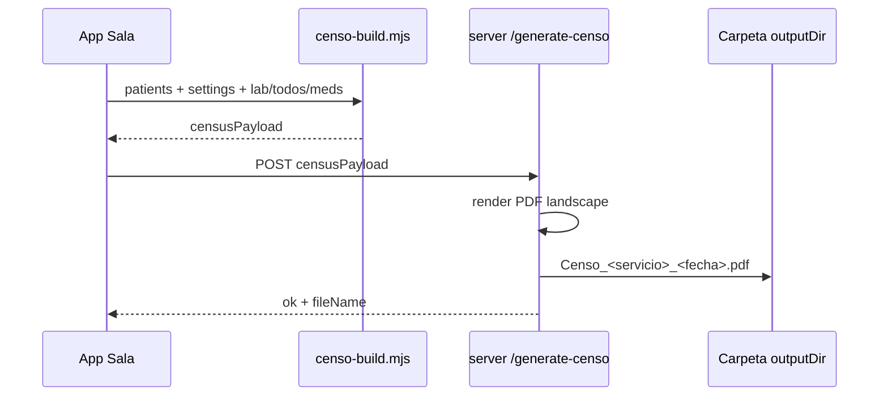

# Censo de guardia (PDF) — Spec de diseño

**Fecha:** 2026-05-29  
**Objetivo:** Exportar un **censo PDF de todos los pacientes activos** desde R+ en **modo Sala**, reemplazando la hoja de cálculo en Google Drive. El PDF se genera automáticamente desde el expediente, con campos editables mínimos en **Datos del paciente** y **Mi Perfil**. No se replica la grilla del Sheet en la UI.  
**Status:** Aprobado — ver plan en `docs/superpowers/plans/2026-05-29-censo-pdf.md`.

---

## 1. Contexto y problema

En guardia de **Sala**, el equipo mantiene un censo en Google Sheets (una fila por paciente: identificación, diagnósticos, ATB, labs, accesos, cultivos, pendientes). R+ ya concentra esa información **por paciente** (Medicamentos, laboratorios, cultivos, to-do, Estado actual, datos demográficos), pero no ofrece un **documento único de guardia** listo para imprimir o archivar sin Drive.

**Nota de evolución** e **Interconsulta** son un flujo distinto; **no deben condicionar ni bloquear** el censo de Sala.

---

## 2. Decisiones validadas (brainstorming)

| Tema | Decisión |
|------|----------|
| Entregable principal | **PDF** multipaciente (no UI tipo spreadsheet) |
| Alcance de pacientes | Todos los **activos no archivados** (opcional incluir archivados en diálogo) |
| Modo de trabajo | Solo **Sala** (`isModeSala`); acción de exportación oculta o deshabilitada en Interconsulta |
| Layout PDF | **Landscape compacto** — una fila por paciente, columnas fijas, texto truncado con reglas de altura |
| Diagnósticos en PDF | Solo **`patient.diagnosticos`** (Datos del paciente) |
| Nota / VPO | **Editables**; al abrir precargan desde Datos del paciente si hay contenido; **no** escriben a Datos automáticamente; **no** alimentan el censo |
| Comparación Nota ↔ Datos | **No** (sin sección preflight ni avisos de divergencia al exportar) |
| Mes en encabezado | **Automático** desde la fecha actual (`MAYO 2026`, locale es-MX) |
| Equipo en encabezado | Campos en **Mi Perfil**, agrupados bajo etiqueta **Equipo** → **R2** (y R1 opcional si se desea en v1) |
| ATB / Meds en PDF | Fuente: **Medicamentos** (receta SOME procesada); texto **editable** por paciente antes de exportar |
| Accesos | `viaAcceso` + **fecha de acceso** en Datos del paciente |
| Preflight | **No** requerido — exportación directa |
| Generación | Servidor local (mismo patrón que receta HU): payload JSON → `/generate-censo` → PDF en carpeta de documentos del perfil |

---

## 3. Modelo de datos

### 3.1 Paciente (`patients[]`)

Campos nuevos o extendidos:

| Campo | Tipo | Uso |
|-------|------|-----|
| `diagnosticosList` | `string[]` | Canónico para censo; misma semántica que VPO (`parseDiagnosticosText`, mayúsculas, filas, pegado con `+`) |
| `diagnosticosText` | `string` | Texto unido para PDF (`formatDiagnosticosCopy`) |
| `censoMedsText` | `string` | Bloque ATB/Meds del censo; **editable**; si vacío al exportar, se rellena desde Medicamentos |
| `accesoFecha` | `string` | Fecha del acceso (DD/MM/AAAA); va a columna Accesos junto con `viaAcceso` |

Campos existentes reutilizados: `nombre`, `registro`, `edad`, `sexo`, `cuarto`, `cama`, `servicio`, `viaAcceso`, `area`, etc.

**Migración:** Si `diagnosticosList` está vacío al abrir Datos o al exportar, poblar una vez desde `vpoByPatient[id].diagnosticosList` si existe (Sala/VPO); **no** desde `notes[id].diagnosticos` (Interconsulta). No borrar nota ni VPO.

### 3.2 Ajustes globales (`settings`)

Nuevos campos en Mi Perfil, sección **Equipo** (debajo de Profesor / Grado o agrupados visualmente):

| Campo | UI label | Uso en encabezado PDF |
|-------|----------|------------------------|
| `residenteR2` | R2 | Línea de equipo (ej. nombre del R2) |
| `residenteR1` | R1 (opcional v1) | Segunda línea de residentes |
| `profesorName` | (existente) Profesor / responsable | Encabezado |
| `doctorName` | (existente) Médico tratante | Si aplica en pie o encabezado |

**Mes:** derivado en runtime de `new Date()` — no campo editable.

**Fecha del censo:** fecha actual al exportar (DD/MM/AAAA).

Extensiones telefónicas del Sheet: **fuera de v1** (se puede añadir `censoExtensionesText` en settings más adelante).

### 3.3 Persistencia y sync

- Guardar con `saveState` / `storage` / merge LAN e import-export de paciente (`buildPatientEntry`).
- `censoMedsText` y diagnósticos viajan con el paciente; no hay estado global de “último censo” salvo auditoría opcional (`exportedAt` solo en respuesta del servidor, no obligatorio en v1).

---

## 4. UI — Datos del paciente (Sala)

En `buildPatientDemographicsCardHtml` / pestaña **Datos**:

1. **Diagnósticos** — reutilizar patrón UI de VPO (lista, pegado `+`, agregar fila). Persistir en `patient.diagnosticosList` / `diagnosticosText`.

2. **Accesos** — junto a selector `viaAcceso`, campo **Fecha** (`accesoFecha`, input tipo texto o date con máscara DD/MM/AAAA).

3. **Censo — ATB / Medicamentos** — textarea `censoMedsText` con:
   - Placeholder orientativo
   - Botón **Tomar de Medicamentos** → genera texto compacto desde `medRecetaByPatient` (misma lógica de resumen que Pase/Medicamentos: fármaco, vía, frecuencia, día de curso si calculable)
   - El usuario puede editar libremente después

**Nota y VPO (sin acoplar al censo):**

- Al renderizar Nota o VPO, si `patient.diagnosticosList` tiene ítems, **precargar** campos locales solo cuando el borrador local está vacío o en primera apertura del paciente (misma política que “Tomar de la nota” invertida: datos → nota/vpo).
- Ediciones en Nota/VPO **no** actualizan `patient.diagnosticos` ni disparan avisos.
- Botones opcionales v1: **Enviar diagnósticos a Datos del paciente** (acción explícita) en Nota/VPO para quien quiera sincronizar manualmente.

---

## 5. Agregador de censo (`censo-build.mjs`)

Función pura `buildCensusPayload(settings, patients, context)` → objeto serializable para el servidor.

Por cada paciente activo (orden: `cuarto`/`cama` numérico si parseable, luego `nombre`):

| Columna PDF | Fuente |
|-------------|--------|
| # | Índice 1…n en el orden elegido |
| Cama | `cuarto` / `cama` |
| Paciente | `nombre`, `registro`, `edad`, `sexo` |
| Diagnósticos | `patient.diagnosticosText` |
| ATB / Meds | `patient.censoMedsText` o auto desde Medicamentos si vacío |
| Signos | Último `monitoreo.textoGuardado` o resumen Estado actual (una línea) |
| Laboratorios | Últimos 1–2 sets de `labHistory` (texto condensado por fecha, sin gráficas) |
| Accesos | Etiqueta de `viaAcceso` + `accesoFecha` |
| Cultivos | Misma regla que Pase (`filterCultivoRowsSignificantFlip`), máx. 2–3 líneas |
| Pendientes | To-do abiertos (`storage.getTodos`), texto corto |

Celdas vacías: `—`. Truncado por columna con elipsis y altura máxima de fila en el renderer PDF.

---

## 6. Exportación PDF

### 6.1 Entrada en la app

- Menú **Ayuda** o acciones globales: **Exportar censo (PDF)**.
- Visible solo si `isModeSala(settings)`.
- Diálogo mínimo:
  - Fecha: solo lectura (hoy)
  - Mes: solo lectura (derivado)
  - Checkbox: **Incluir pacientes archivados** (off por defecto)
  - Sin lista preflight de diagnósticos

### 6.2 Pipeline

- Módulo Node: `generate-censo.js` con **pdf-lib** (o HTML→PDF si se prefiere en plan; default pdf-lib tabular).
- Encabezado: mes, fecha, `profesorName`, `residenteR2`, `residenteR1`, `defaultServicio` si aplica.
- Nombre archivo sugerido: `Censo_<servicioSlug>_<YYYY-MM-DD>.pdf`.

### 6.3 Errores

- Sin pacientes activos → toast, no llamar servidor.
- Sin `outputDir` → mismo flujo que otros documentos (pedir carpeta en Mi Perfil).
- Offline → mensaje coherente con receta HU.

---

## 7. Arquitectura de archivos (propuesta)

| Archivo | Responsabilidad |
|---------|-----------------|
| `public/js/censo-build.mjs` | Armar payload por paciente |
| `public/js/censo-build.test.mjs` | Orden, truncado, fallback meds |
| `public/js/censo-export.mjs` | UI diálogo, llamada API, toasts |
| `public/js/censo-meds-format.mjs` | Texto compacto desde `medRecetaByPatient` |
| `generate-censo.js` | Render PDF landscape |
| `server.js` | Ruta `POST /generate-censo` |
| `public/js/features/expediente.mjs` | Secciones Datos (dx, accesos, censo meds) |
| `public/js/features/profile.mjs` + `index.html` | Campos R2/R1 Equipo |
| `public/js/vpo-data.mjs` | Reexportar helpers dx compartidos si hace falta |

Integración bundle: entradas en `app-shell.mjs` / build según convención del repo.

---

## 8. Fuera de alcance (v1)

- Réplica UI del Google Sheet en pantalla.
- Extensiones telefónicas del hospital en encabezado.
- Vista previa HTML del censo (solo generar y guardar).
- Volcado automático Nota → Datos o VPO → Datos.
- Censo en modo Interconsulta.
- Edición colaborativa del PDF o subida a Drive desde R+.

---

## 9. Pruebas

- Unit: `buildCensusPayload` orden, meds fallback, truncado, paciente sin labs.
- Unit: formato meds desde receta SOME.
- Manual: 3+ pacientes con datos reales → PDF legible en impresora A4 landscape.
- Manual: export solo en Sala; Interconsulta no muestra acción.
- Manual: editar `censoMedsText` y verificar que el PDF respeta el texto editado.

---

## 10. Criterios de aceptación

1. En **modo Sala**, el usuario exporta un PDF con **todos los pacientes activos** en una tabla landscape legible.
2. El encabezado muestra **mes y fecha actuales** y el **equipo** desde Mi Perfil (**R2** bajo sección Equipo, profesor existente).
3. **Diagnósticos** en el PDF salen solo de **Datos del paciente**.
4. **ATB/Meds** salen de **Medicamentos** por defecto y son **editables** en Datos antes de exportar.
5. **Accesos** muestran vía + **fecha**.
6. No hay paso preflight ni dependencia de la nota de evolución de Interconsulta.
7. El archivo se guarda en la carpeta de documentos configurada, como otros PDF de R+.
