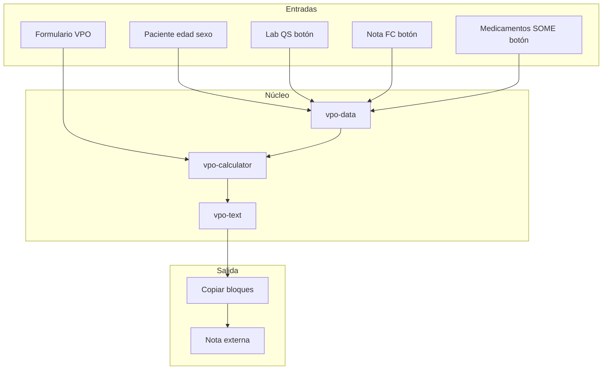

# Valoración preoperatoria (VPO) — Spec de diseño

**Fecha:** 2026-05-29  
**Objetivo:** Pestaña/segmento **VPO** en R+ para armar valoración preoperatoria con calculadora de riesgo (Excel CALCULADORA VPO), machotes EKG/Rx editables, plan farmacológico perioperatorio derivado de la receta SOME, y bloques copiables para **nota externa** (no Casiopea, sin volcado automático a Nota/Indicaciones de R+).  
**Referencias:** `CALCULADORA VPO.xlsx` (hojas Calculadora PRO, Estratificación y riesgo, Lookups), PDF OAAD VPO integral, PDF manejo perioperatorio de fármacos.  
**Status:** Diseño aprobado en brainstorming — listo para plan de implementación.

---

## 1. Contexto y problema

En **Interconsulta** (y ocasionalmente en **Sala**), el internista realiza VPO con estratificación de riesgo, interpretación de EKG/Rx y recomendaciones sobre medicamentos de casa. Hoy esto se hace fuera de R+ (Excel + copiar/pegar manual).

R+ ya ofrece:
- Expediente consolidado con segmentos en **Clínico** (Interconsulta) y **Salida** (Sala).
- Pestaña **Medicamentos** con parseo TSV desde SOME (`medRecetaByPatient`).
- Laboratorios con creatinina, hemoglobina, eTFG (`labHistory`, `manejo-atb-renal.mjs`).
- Signos vitales en Nota (`note.fc`, etc.).
- Patrón **copiar al portapapeles** (Manejo, Medicamentos, labs).

Falta un módulo dedicado que una calculadora, plantillas institucionales y fármacos del paciente en un flujo persistido por paciente.

---

## 2. Decisiones validadas (brainstorming)

| Tema | Decisión |
|------|----------|
| Destino del texto | **Nota externa** vía portapapeles; **no** Casiopea; **no** volcado automático a campos de Nota/Indicaciones en v1 |
| Persistencia | **Por paciente** (`vpoByPatient[patientId]`), guardado con debounce + al cambiar paciente |
| Ubicación UI | **Interconsulta:** segmento **VPO** en **Clínico** (junto Nota e Indicaciones). **Sala:** segmento **VPO** en **Salida** (junto Listado y Receta HU) |
| Alcance v1 | Calculadora **completa** del Excel (ASA, RCRI/Lee, Gupta MICA, ARISCAT, Caprini) + machotes EKG/Rx + fármacos perioperatorios |
| Procedimiento | Dropdown **Gupta** del Excel con **búsqueda**; al elegir → AHA quirúrgico, coeficiente Gupta, sitio ARISCAT, flag RCRI alto riesgo (override manual permitido) |
| AHA clínico | Sugerido desde ASA/comorbilidades; **editable** |
| Labs (Cr, Hb, eTFG) | **Sugeridos:** aviso si hay QS reciente + botón **“Tomar del laboratorio”**; no autoescritura al abrir |
| FC en EKG | **Sugerida** desde `note.fc` + botón **“Tomar FC de la nota”** |
| EKG / Rx | **Textareas editables** con plantilla institucional por defecto |
| Fármacos | Lista desde **`medRecetaByPatient`** (SOME procesado en pestaña Medicamentos); guía perioperatoria por matching nombre/clase |
| Actualizar fármacos | **Solo agregar** ítems nuevos con sugerencias; **no** reemplazar filas existentes ni sobrescribir ediciones |
| Arquitectura | **Núcleo VPO único** montado en dos segmentos según `appMode` (enfoque 2 del brainstorming) |

---

## 3. Arquitectura

### 3.1 Módulos propuestos

| Módulo | Responsabilidad |
|--------|-----------------|
| `vpo-panel.mjs` | UI: formulario, textareas, botones copiar, wiring expediente |
| `vpo-data.mjs` | Modelo, persistencia (`vpoByPatient`), merge fármacos, apply labs/FC |
| `vpo-calculator.mjs` | Funciones puras: ASA, RCRI, Gupta, ARISCAT, Caprini (fidelidad Excel) |
| `vpo-lookups.mjs` | Catálogos estáticos (procedimientos Gupta, menús ASA, incisiones ARISCAT, etc.) |
| `vpo-text.mjs` | Generación bloques copiables (plantilla institucional + riesgos) |
| `vpo-periop-meds.mjs` | Catálogo guía fármacos + matching sobre `nombreRaw` SOME |
| `vpo-calculator.test.mjs` | Casos de regresión vs valores conocidos del Excel |

**Integración expediente** (`expediente-tabs.mjs`):
- Interconsulta: `getClinicoSections()` incluye `'vpo'` → orden: `notas`, `indica`, `vpo`, `manejo` (si visible).
- Sala: `SALIDA_SECTIONS_SALA` → `listado`, `vpo`, `recetaHu`.
- `GRANULAR_TABS`, `granularToConsolidatedMap`, `paneMountSpec`, `syncConsolidatedSegmentBarVisibility` actualizados.
- Nuevo pane `#itab-content-vpo` montado en `.exp-segment-body--clinico` o `.exp-segment-body--salida` según modo.

**Estado global** (`app-state.mjs`, `storage.js`, `buildPatientEntry`, LAN merge/import): extender con `vpoByPatient` y `vpo` en export/import de paciente.

### 3.2 Diagrama de flujo (alto nivel)



---

## 4. Modelo de datos (`vpoByPatient[patientId]`)

```js
{
  // Entradas numéricas
  edad: "",
  creatinina: "",
  hemoglobina: "",
  spo2: "",
  duracionCirugiaHoras: "",

  // Menús / selección
  asaSeverityKey: "",           // clave lookup → ASA I–V
  dependenciaFuncional: "",       // Independent | Partially | Totally
  procedimientoGuptaId: "",       // id estable en vpo-lookups

  // Flags RCRI (sí/no)
  rcri: {
    cardiopatiaIsquemica: false,
    insuficienciaCardiaca: false,
    evc: false,
    dmInsulina: false,
    cirugiaAltoRiesgo: false,     // auto desde procedimiento; override manual
    urgente: false,
  },

  // Flags ARISCAT
  ariscat: {
    infeccionRespiratoriaUltimoMes: false,
    incisionKey: "",              // auto desde procedimiento; override
    cirugiaMayor45Min: false,
    urgente: false,
  },

  // Flags Caprini
  caprini: {
    imcMayor25: false,
    insuficienciaVenosa: false,
    reposoMovilidadReducida: false,
    antecedenteEvc: false,
    trombofilia: false,
    esteroideCronico: false,
    artritisInflamatoria: false,
  },

  // Riesgo AHA (editable; quirúrgico sugerido por procedimiento)
  ahaClinico: "",                 // Bajo | Intermedio | Alto
  ahaQuirurgico: "",

  // Textos editables (plantillas por defecto institucionales)
  ekgText: "",
  rxText: "",
  diagnosticosText: "",
  valoracionIntro: "SE REALIZA VALORACIÓN PREOPERATORIA. SE OTORGA RIESGO QUIRÚRGICO:",

  // Fármacos perioperatorios en VPO
  farmacos: [
    {
      sourceMedId: "",            // id del ítem medReceta
      nombreDisplay: "",
      sugerencia: "",             // texto guía
      notaEditable: "",           // línea final para copiar
      addedAt: "",                // ISO opcional
    },
  ],

  // Meta aplicación externa
  lastLabApplied: { fecha: "", creatinina: "", hemoglobina: "" },
  lastFcApplied: "",
}
```

**Reglas de persistencia:**
- Guardar en `saveState` con debounce (~300–500 ms) en `input`/`change`.
- `stash` al cambiar de paciente (mismo patrón que Medicamentos).
- No incluir pacientes `demo-*` en persistencia durable si la app ya los excluye en otros módulos.

---

## 5. Calculadora (fidelidad Excel)

### 5.1 Entradas (hoja *Calculadora PRO*)

| Campo | Fuente UI |
|-------|-----------|
| Edad | Manual; sugerir parsear de `patient.edad` al abrir (sin autoescribir) |
| Creatinina, Hb, SpO₂, duración (h) | Manual + **Tomar del laboratorio** |
| ASA | Select desde *Lookups* |
| Dependencia funcional | Select |
| Procedimiento Gupta | **Combobox con búsqueda** (~20 procedimientos del Excel) |
| RCRI / ARISCAT / Caprini | Checkboxes y selects según Excel |

### 5.2 Derivados al elegir procedimiento

- `procedimientoGuptaId` → coeficiente Gupta, categoría procedimiento NSQIP-style.
- **AHA quirúrgico:** mapeo interno procedimiento → Bajo / Intermedio / Alto (tabla en `vpo-lookups`; alinear con criterios clínicos del servicio).
- **RCRI cirugía alto riesgo:** sí si procedimiento ∈ {intraperitoneal, intratorácica, vascular suprainguinal} según definición Excel/nota instrucciones.
- **ARISCAT sitio incisión:** peripheral / abdominal superior / intrathoracic según procedimiento.

Usuario puede **sobrescribir** AHA quirúrgico, flag RCRI alto riesgo e incisión ARISCAT tras la sugerencia.

### 5.3 Salidas

| Escala | Presentación UI | Línea en texto valoración |
|--------|-----------------|---------------------------|
| ASA | Clase I–V | (en bloque resumen si se desea; AHA clínico cubre parte del mensaje) |
| RCRI (Lee) | Puntos + categoría % | `LEE: N PUNTOS, CLASE X%` |
| Gupta MICA | % + interpretación | `GUPTA: X% RIESGO DE INFARTO…` |
| ARISCAT | Puntos + riesgo | `ARISCAT: N PUNTOS, RIESGO …` |
| Caprini | Puntos + riesgo TEV | `CAPRINI: N PUNTOS, … RIESGO …` |
| AHA | Dos líneas | `AHA CLÍNICO: …` / `AHA QUIRÚRGICO: …` |

Interpretaciones textuales desde hoja *Estratificación y riesgo* (cortes 0/1/2/≥3 RCRI, ARISCAT 0–25 / 26–44 / ≥45, etc.).

**Nota:** Gupta MICA en Excel es aproximación automatizada; mostrar hint breve en UI (como nota del Excel).

### 5.4 Pruebas

- Tests unitarios con fila de ejemplo del Excel (ASA IV, RCRI 0, Gupta ~2.17%, ARISCAT 51 Alto, Caprini 3 Moderado) ± tolerancia numérica en Gupta.

---

## 6. Plantillas de texto (institucionales)

### 6.1 Defaults (editables en textarea)

**ELECTROCARDIOGRAMA** (extracto validado por usuario):

```
ELECTROCARDIOGRAMA DE 12 DERIVACIONES, RITMO SINUSAL, EJE ELÉCTRICO NORMAL (ENTRE 0 Y 90 GRADOS), FC ___ LPM, ONDA P PRESENTE Y DE MORFOLOGÍA NORMAL, INTERVALO PR CONSERVADO (120-200 MS), COMPLEJO QRS DE DURACIÓN NORMAL (<120 MS), SIN SUPRA O INFRA DESNIVELES DEL SEGMENTO ST, ONDAS T SIMÉTRICAS SIN INVERSIONES, INTERVALO QTC DENTRO DE PARÁMETROS NORMALES. SIN DATOS DE BLOQUEO, HIPERTROFIA, ISQUEMIA O NECROSIS.
```

**RADIOGRAFÍA DE TÓRAX:**

```
RADIOGRAFÍA DE TÓRAX AP, SIN ROTACIÓN, ADECUADA PENETRACIÓN, TEJIDOS BLANDOS SIN ALTERACIONES, MARCO ÓSEO ÍNTEGRO, CAMPOS PULMONARES SIN REDISTRIBUCIÓN DE FLUJO, ÁNGULOS CARDIOFRÉNICOS Y COSTODIAFRAGMÁTICOS LIBRES, ÍNDICE CARDIOTORÁCICO <50% SIN CARDIOMEGALIA, SILUETA MEDIASTINAL NORMAL, TRÁQUEA CENTRAL. SIN INFILTRADOS, DERRAME PLEURAL, CONSOLIDACIONES NI MASAS.
```

**Valoración** (intro fija editable + líneas generadas).

### 6.2 Diagnósticos

- Encabezado `DIAGNÓSTICOS:` en bloque copiado.
- Botón **“Tomar de la nota”** (opcional v1): volcar `note.diagnosticos` numerados a `diagnosticosText` sin sobrescribir si el usuario ya editó (misma filosofía que fármacos: merge o confirmación).
- `textarea` editable.

### 6.3 FC

- Campo numérico **FC (lpm)** + sustitución de `___` en `ekgText` al copiar (o preview en vivo).
- **Tomar FC de la nota** si `note.fc` existe.

### 6.4 Acciones copiar

| Botón | Contenido |
|-------|-----------|
| Copiar EKG | Solo bloque EKG (con FC sustituida) |
| Copiar Rx | Solo Rx |
| Copiar riesgos | Intro + líneas AHA/Lee/Caprini/Gupta/ARISCAT |
| Copiar fármacos | Plan perioperatorio editado |
| **Copiar valoración completa** | EKG + Rx + Diagnósticos + Valoración (orden institucional) |

Patrón técnico: reutilizar helper tipo `copyToClipboard` de `manejo-proto-detail.mjs`.

---

## 7. Fármacos perioperatorios

### 7.1 Fuente

- Ítems activos de `medRecetaByPatient[patientId].items` donde `suspendido !== true`.
- Requiere haber pulsado **Receta** en pestaña **Medicamentos** con pegado SOME válido.

### 7.2 Botón “Tomar de Medicamentos (SOME)”

| Situación | Comportamiento |
|-----------|----------------|
| Sin `medReceta` procesado | Toast + enlace **Ir a Medicamentos** (`switchAppTab('med')`) |
| Primera carga | Crear `farmacos[]` con una fila por ítem + `sugerencia` del catálogo |
| Cargas posteriores | **Solo agregar** ítems cuyo `sourceMedId` (o nombre normalizado) **no** exista en `farmacos[]` |
| Ítems ya en lista | **No modificar** `sugerencia` ni `notaEditable` |
| Ítem suspendido en SOME | No agregar; si ya estaba en VPO, opcional badge *“No en receta actual”* (no borrar) |

### 7.3 Catálogo guía (`vpo-periop-meds.mjs`)

- Estructura derivada del PDF *Resumen manejo perioperatorio de farmacos* (categorías: cardiovascular, anticoagulantes, hipoglicemiantes, etc.).
- Cada regla: `keywords[]`, `sugerencia` (CONTINUAR / SUSPENDER día cirugía / etc.), `notaBreve`.
- Matching: normalizar `nombreRaw` (mayúsculas, sin acentos), buscar primera regla que coincida.
- Sin coincidencia: sugerencia *“Revisar manualmente — no en catálogo”*.

### 7.4 UI

- Lista editable: nombre (solo lectura desde SOME), sugerencia (editable), nota para copiar (editable, prellenada desde sugerencia).
- Disclaimer compacto: contenido orientativo; decisión del médico tratante.
- **Copiar plan farmacológico:** una línea por fármaco (`nombre — recomendación — nota`).

---

## 8. Integración con datos existentes

| Dato | Origen | Mecanismo |
|------|--------|-----------|
| Edad / sexo | `patient` | Hint al render; no autoescritura |
| Creatinina, Hb | Último QS en `labHistory` | `resolveLatestQsValues` (reutilizar patrón ATB renal) + botón |
| eTFG | Calculada si hay Cr + edad + sexo | Mostrar informativo; opcional no guardar en VPO |
| FC | `notes[patientId].fc` | Botón Tomar FC |
| Diagnósticos | `notes[patientId].diagnosticos` | Botón opcional Tomar de la nota |
| Medicamentos | `medRecetaByPatient` | Botón Tomar de Medicamentos (merge) |

---

## 9. UI / UX

### 9.1 Layout del panel (una columna, scroll)

1. **Riesgo** — formulario calculadora + tarjeta resumen (ASA, RCRI, Gupta %, ARISCAT, Caprini).
2. **Estudios** — EKG y Rx (textareas) + FC.
3. **Diagnósticos** — textarea.
4. **Fármacos** — lista + Tomar de Medicamentos.
5. **Barra de acciones** — botones copiar (sticky opcional en viewport ancho).

Estilo: reutilizar `card`, `field-group`, `manejo-copy-btn` donde existan.

### 9.2 Segmentos expediente

- **Interconsulta:** barra `#exp-segment-clinico` muestra botón **VPO** entre Indicaciones y Manejo.
- **Sala:** barra `#exp-segment-salida` muestra **VPO** entre Listado y Receta HU.
- Ocultar VPO si `hideClinicoTab` en Sala elimina toda la pestaña Clínico — en Sala VPO sigue en Salida.

### 9.3 Modo Pase

- Fuera de scope v1: en Pase no se muestra VPO (igual que otras pestañas complejas); sin cambio obligatorio en v1.

---

## 10. Fuera de scope v1

- Export Word/PDF dedicado de VPO.
- Volcado automático a Nota de evolución / Indicaciones.
- Integración ACS-NSQIP online (solo enlace de ayuda opcional).
- Casiopea / HIS.
- Calculadora Fragilidad CFS, troponina serial postop (texto guía estático opcional en ayuda).
- Auto-solicitud de estudios (Choosing Wisely): no implementar lógica de pedidos.

---

## 11. Migración y compatibilidad

- Nuevo mapa `vpoByPatient: {}` en estado; sin migración de datos legacy (feature nueva).
- Backup/export paciente: incluir `vpo` en `buildPatientEntry` y rutas LAN/import.
- Versión de app: minor (nueva funcionalidad visible).

---

## 12. Pruebas

| Área | Tipo |
|------|------|
| `vpo-calculator` | Unit: puntos RCRI, ARISCAT, Caprini, Gupta vs Excel |
| `vpo-periop-meds` | Unit: matching warfarina, metformina, metoprolol |
| `vpo-data` | Unit: merge farmacos solo nuevos |
| `expediente-tabs` | Unit: `getClinicoSections` incluye vpo en Inter; `getSalidaSections` incluye vpo en Sala |
| Manual | Copiar valoración completa; persistencia al cambiar paciente; Tomar lab/FC/meds |

---

## 13. Criterios de aceptación

1. En **Interconsulta**, Expediente → Clínico → **VPO** muestra el panel completo.
2. En **Sala**, Expediente → Salida → **VPO** muestra el **mismo** panel.
3. Los datos VPO persisten al cambiar de paciente y al reiniciar la app.
4. Procedimiento con búsqueda actualiza sugerencias AHA quirúrgico y flags asociados.
5. Calculadora reproduce el ejemplo del Excel dentro de tolerancia razonable en Gupta.
6. EKG y Rx son editables; FC se puede tomar de la nota.
7. **Tomar de Medicamentos** agrega solo fármacos nuevos sin borrar ediciones previas.
8. **Copiar valoración completa** produce el orden: EKG, Rx, Diagnósticos, Valoración con líneas de riesgo.
9. Ningún flujo escribe en Casiopea ni en campos de Nota sin acción explícita del usuario.

---

## 14. Próximo paso

Tras revisión de este archivo por el usuario → invocar skill **writing-plans** para plan de implementación por fases (expediente + estado → calculadora → textos → fármacos → pruebas).
