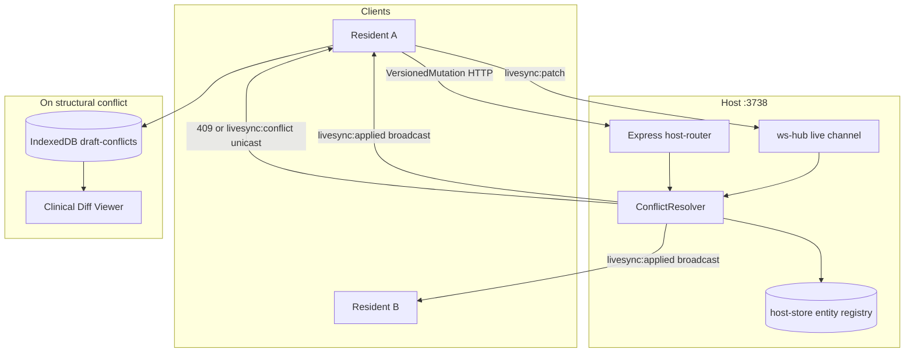

# Clinical Conflict Resolution — Unified Versioned Sync

> **For implementation:** After this spec is approved in review, use **superpowers:writing-plans** for a task-by-task plan. Implement **after** LAN security hardening (`docs/superpowers/specs/2026-05-30-lan-security-hardening-design.md`) so WebSocket auth and Bearer HTTP exist before the hub becomes a state arbiter.

**Date:** 2026-05-30  
**Status:** Design approved in brainstorming (§1–§6).  
**Supersedes (partial):** LiveSync in-room patch handling in `docs/superpowers/specs/2026-05-16-livesync-agenda-todos-room-design.md` — patches use versioned resolver instead of blind LWW relay; bulk `GET/PUT sync-bundle` may remain LWW for full snapshots.

## Problem statement

R+ LAN sync today mixes models:

- **HTTP patients:** optimistic `expectedVersion` → binary 409, no field-level merge.
- **WebSocket LiveSync:** dumb relay on `live:{roomId}` — no server validation; clients reconcile with **clock-based LWW**, which is ambiguous when clocks skew or edits overlap.
- **UI:** no clinical diff surface; failed writes risk silent loss if the clinician dismisses an error.

In a multi-resident ward environment, the host must be the **authoritative state arbiter**, not a fire-and-forget relay.

## Goals (success criteria)

- [ ] Every entity mutation (patient, agenda item, todo) uses a **versioned mutation envelope**.
- [ ] A single **`ConflictResolver`** serves Express and the WebSocket hub.
- [ ] **Auto-merge** when concurrent edits touch **disjoint top-level keys** (key-set intersection).
- [ ] **409 Conflict** (HTTP) or **`livesync:conflict`** (WS unicast) when the same keys collide.
- [ ] **Clinical Diff Viewer** modal for structural conflicts, with side-by-side highlighted fields.
- [ ] On any conflict, **local draft** persisted to **IndexedDB** (`draft-conflict:*`) before the modal opens — no work lost if the modal is force-closed.
- [ ] Legacy agenda/todo **arrays** remain materialized for existing UI; entity map holds versioned truth.

## Non-goals (v1)

- Deep nested merge / CRDT for arbitrary JSON trees (top-level `changedKeys` only).
- Conflict resolution for Python `/generate` or non-LAN storage.
- Manual three-way merge UI beyond “use server” / “edit local draft” / “discard draft”.
- Multi-host replication (single LAN host process).

## Architecture overview



### New / modified modules

| Module | Role |
|--------|------|
| `lan-squad/conflict-resolver.js` | Single source of truth: applyMutation, auto-merge, ConflictError |
| `lan-squad/conflict-resolver.test.js` | Disjoint merge, overlap 409, delete tombstones |
| `lan-squad/host-store.js` | Entity registry per room; materialized agenda/todos arrays; patient versions |
| `lan-squad/host-router.js` | `PUT /patients/:id` → envelope → resolver |
| `lan-squad/ws-hub.js` | Intercept `livesync:patch`; apply via resolver; unicast conflicts |
| `public/js/versioned-mutation.mjs` | Builder: `changedKeys`, `baseData`, envelope from UI edits |
| `public/js/draft-conflict-store.mjs` | Native IndexedDB wrapper (no new npm deps) |
| `public/js/features/clinical-conflict-viewer.mjs` | Side-by-side diff modal |
| `public/js/features/lan-sync.mjs` | Wire builders, 409 handler, `livesync:conflict` listener |
| `public/js/lan-client.mjs` | `lan-conflict` CustomEvent |

---

## §1: Versioned mutation envelope

All writes (HTTP or WebSocket) use the same shape.

### TypeScript reference

```ts
type EntityType = 'patient' | 'agenda' | 'todo';

type VersionedMutation = {
  entityType: EntityType;
  entityId: string;
  expectedVersion: number;       // 0 or omit = create
  data: object;                  // entity body or delete marker
  changedKeys: string[];         // top-level keys the client modified (required)
  baseData?: object;             // snapshot client edited from (required when expectedVersion > 0)
  op?: 'upsert' | 'delete';
  roomId?: string;               // required for agenda | todo
  patientId?: string;            // required for todo
  clientId?: string;             // WS: stable rpc-lan-client-id
};
```

### HTTP mapping

`PUT /api/lan/v1/patients/:id` body:

```json
{
  "expectedVersion": 3,
  "changedKeys": ["cuarto", "cama"],
  "baseData": { "id": "p1", "nombre": "…", "cuarto": "101", "cama": "A", "version": 3 },
  "data": { "id": "p1", "nombre": "…", "cuarto": "102", "cama": "A" }
}
```

Legacy flat patient body without envelope → reject `400` with `error: 'versioned_mutation_required'` (post-migration).

### WebSocket mapping

Replace flat `livesync:patch` fields with:

```json
{
  "type": "livesync:patch",
  "roomId": "room_abc",
  "clientId": "uuid",
  "mutation": { /* VersionedMutation */ }
}
```

### Success response (HTTP 200 / applied WS)

```json
{
  "ok": true,
  "entityType": "patient",
  "entityId": "p1",
  "version": 4,
  "data": { },
  "autoMerged": false
}
```

When auto-merge ran: `"autoMerged": true`.

### Structural conflict payload (HTTP 409)

```json
{
  "error": "conflict",
  "entityType": "patient",
  "entityId": "p1",
  "expectedVersion": 3,
  "serverVersion": 5,
  "serverData": { },
  "clientData": { },
  "conflictingKeys": ["cuarto", "nombre"]
}
```

---

## §2: ConflictResolver

**File:** `lan-squad/conflict-resolver.js`

```js
class ConflictError extends Error {
  constructor(details) {
    super('conflict');
    this.code = 'CONFLICT';
    Object.assign(this, details);
  }
}

function createConflictResolver({ store }) {
  return {
    applyMutation(mutation, ctx) { /* … */ },
  };
}
```

### Algorithm (deterministic, thin)

1. **Load** server entity `S = { version, data }` via `store.getEntity(entityType, entityId, { roomId, patientId })`.
2. **Create:** if no `S` and (`!expectedVersion` or `expectedVersion === 0`): persist `version: 1`, materialize views, return ok.
3. **Fast path:** if `expectedVersion === S.version`: write `data` (respect `op: delete`), `version++`, materialize, return ok.
4. **Concurrent path** (`expectedVersion !== S.version`):
   - Require `baseData` and `changedKeys`.
   - `serverChangedKeys = { k | S.data[k] !== baseData[k] }` (top-level only; `undefined` vs missing treated per `Object.hasOwn`).
   - `overlap = serverChangedKeys ∩ changedKeys`.
   - If `overlap` empty: **auto-merge**  
     `merged = { ...S.data, ...pick(data, changedKeys) }`, increment version, persist, `autoMerged: true`.
   - Else: **throw `ConflictError`** with `conflictingKeys: [...overlap]`, `serverData: S.data`, `clientData: data`, `serverVersion: S.version`.

### Deletes

`op: 'delete'`: `changedKeys` may be `['*']` or entity id field. Conflict if `overlap` non-empty or server advanced version with substantive change on tracked keys.

### Why `changedKeys` + `baseData`

Avoids deep-merge heuristics. The resolver stays **O(keys)** and auditable — appropriate for clinical accountability.

### Callers

| Transport | Success | Structural conflict |
|-----------|---------|---------------------|
| HTTP | `200` + body | `409` JSON |
| WS | broadcast `livesync:applied` to `live:{roomId}` | **unicast** `livesync:conflict` to initiating socket only |

---

## §3: Host storage model

### Patients (existing array)

Keep `state.patients[]` entries with `version`, `updatedAt`, and clinical fields. Resolver reads/writes through `getEntity('patient', id)` adapter that maps to array index.

### Room entity registry

Per `roomSyncBundles[roomId]`:

```json
{
  "updatedAt": "ISO",
  "uploadedByClientId": "string",
  "entities": {
    "agenda:evt_1": { "version": 2, "data": { }, "updatedAt": "ISO" },
    "todo:p1:td_9": { "version": 1, "data": { }, "updatedAt": "ISO" }
  },
  "agenda": [],
  "todos": {}
}
```

**Entity keys:**

- Agenda: `agenda:${eventId}`
- Todo: `todo:${patientId}:${todoId}`

After each successful mutation, **materialize**:

- `agenda` = sorted live agenda entities (non-deleted)
- `todos[patientId]` = live todo entities for that patient

Existing components that read arrays continue to work. New code may read `entities` for debugging.

### Bulk bundle `PUT`

Full-room snapshot replace remains **LWW by bundle `updatedAt`** (optional v1). Per-entity patches during a session use the resolver. Document in UI: bulk import may overwrite room bundle without per-field merge.

### Hash / LAN security

Independent of `teamCodeHash` rotation — clinical entities are not wiped on token migration (see LAN security spec `rehashLanHostState`).

---

## §4: WebSocket protocol updates

### Applied (broadcast to room)

```json
{
  "type": "livesync:applied",
  "roomId": "room_abc",
  "entityType": "todo",
  "entityId": "td_9",
  "version": 4,
  "data": { },
  "autoMerged": true,
  "patientId": "p1"
}
```

Clients merge into local storage using existing apply paths; respect `autoMerged` for optional toast (“Cambios combinados automáticamente”).

### Conflict (unicast to sender only)

```json
{
  "type": "livesync:conflict",
  "roomId": "room_abc",
  "entityType": "todo",
  "entityId": "td_9",
  "patientId": "p1",
  "conflictingKeys": ["text", "completed"],
  "server": { "version": 5, "data": { } },
  "client": { "version": 3, "data": { } },
  "expectedVersion": 3
}
```

**ws-hub rules:**

1. Only handle `livesync:patch` after WS **first-frame auth** (LAN security spec).
2. Resolve mutation; on success relay `livesync:applied` (not raw patch).
3. On `ConflictError`, send `livesync:conflict` to the socket that sent the patch (`clientId` match or socket reference).
4. Do **not** broadcast failed patches — prevents UI thrashing for other residents.

### Deprecated

Blind relay of unvalidated `livesync:patch` to the room (remove after client migration).

---

## §5: Safety buffer and Clinical Diff Viewer

### IndexedDB — native wrapper

**File:** `public/js/draft-conflict-store.mjs` (~80 lines, no `idb` package)

- Database: `rplus-clinical`, version `1`
- Object store: `draft-conflicts`, keyPath `id`
- Index: `savedAt`

### Draft record

```json
{
  "id": "uuid",
  "savedAt": "ISO",
  "transport": "http",
  "entityType": "patient",
  "entityId": "p1",
  "roomId": null,
  "patientId": null,
  "localSnapshot": {
    "expectedVersion": 3,
    "changedKeys": ["cuarto"],
    "baseData": { },
    "data": { },
    "fullEntry": { }
  },
  "serverSnapshot": {
    "version": 5,
    "data": { }
  },
  "conflictingKeys": ["cuarto", "nombre"]
}
```

`fullEntry` captures adjacent local state (note, todos map) when available — aids manual recovery.

### Client flow (mandatory ordering)

```text
onConflict(payload):
  1. draftId = await saveDraftConflict(buildDraft(payload))  // await before UI
  2. openClinicalConflictViewer({ ...payload, draftId })
```

**HTTP:** `fetch` receives `409` → run flow before throwing to caller.

**WS:** `lan-client` emits `lan-conflict` → `lan-sync` listener runs same flow.

### Clinical Diff Viewer

**File:** `public/js/features/clinical-conflict-viewer.mjs`

- Reuse `lab-conflict-backdrop` / `lab-conflict-modal` CSS from `public/js/features/patients.mjs`
- Two columns: **Tu cambio** | **Servidor**
- Rows for union of keys; **highlight** keys in `conflictingKeys`
- Actions:
  - **Usar servidor** — apply `serverSnapshot`, dismiss, delete draft
  - **Editar mi borrador** — load `localSnapshot` into editor, keep draft
  - **Cerrar** — dismiss only; draft remains in IDB

### Recovery entry point

LAN / Settings: **Borradores de conflicto (N)** — list `draft-conflicts` by `savedAt` desc; tap to reopen viewer.

---

## §6: Client mutation builders and tests

### `versioned-mutation.mjs`

Builder pattern — avoids rewriting every UI handler:

```js
export function createMutationBuilder(entityType, entityId) {
  let base = null;
  let keys = new Set();
  return {
    captureBase(snapshot) { base = structuredClone(snapshot); return this; },
    change(key, value) { keys.add(key); /* accumulate into working data */ return this; },
    build(extra) {
      return {
        entityType,
        entityId,
        expectedVersion: base?.version ?? 0,
        baseData: base,
        changedKeys: [...keys],
        data: { ...base, ...working },
        ...extra,
      };
    },
  };
}
```

Integrate at **save boundaries** in `lan-sync.mjs` (patient push, `emitLiveSyncTodoUpsert`, agenda emits).

### Tests

| File | Coverage |
|------|----------|
| `lan-squad/conflict-resolver.test.js` |_disjoint auto-merge; overlap conflict; create; delete_ |
| `lan-squad/ws-hub.test.js` | applied broadcast; conflict unicast only to sender |
| `lan-squad/host-router.test.js` | 409 body shape; 200 autoMerged flag |
| `public/js/draft-conflict-store.test.mjs` | put/get/delete draft (fake-indexeddb or manual mock) |
| `public/js/versioned-mutation.test.mjs` | builder changedKeys / baseData |
| `public/js/clinical-conflict-viewer.test.mjs` | HTML highlights conflictingKeys |

Run `npm run bundle:renderer` after renderer changes.

---

## Implementation ordering

1. **LAN security hardening** (Bearer, WS auth, rate limits) — prerequisite.
2. **host-store** entity registry + materialization helpers.
3. **conflict-resolver** + unit tests.
4. **host-router** + **ws-hub** integration.
5. **draft-conflict-store** + **clinical-conflict-viewer**.
6. **versioned-mutation** + **lan-sync** / **lan-client** wiring.
7. End-to-end manual test: two clients, same patient field vs disjoint fields.

---

## Security and logging

- Do not log `baseData` / Bearer / full patient PHI in production errors — use LAN `redact-secrets` patterns for conflict debug logs.
- Conflict payloads over LAN HTTP remain on trusted local network (no TLS v1).

---

## Design validation (approved notes)

| Theme | How this design delivers |
|-------|---------------------------|
| Host as authoritative arbiter | Resolver + entity registry; no clock LWW for patches |
| Zero data loss | IndexedDB draft before modal; `baseData` preserved for manual re-apply |
| Low friction | Disjoint key union auto-merge (~90% concurrent edits silent) |
| Backwards compatibility | Materialized `agenda` / `todos` arrays unchanged for readers |
| Professional sync model | Versioned envelopes + optimistic concurrency (Figma/Notion class) |

---

*Spec written from approved brainstorming §1–§6. Review this file before invoking writing-plans.*
