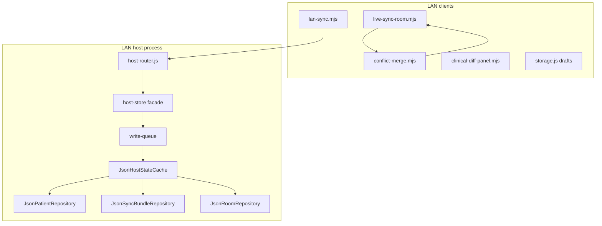

# LAN host concurrency, versioning, and conflict UX

> **For implementation:** After this spec is approved, use **superpowers:writing-plans** to produce the task-by-task implementation plan. Do not mix other implementation skills in that transition.

**Date:** 2026-05-30  
**Status:** Approved. **Plan:** [`docs/superpowers/plans/2026-05-30-lan-host-concurrency.md`](../plans/2026-05-30-lan-host-concurrency.md).  
**Scope:** Phase 3a — Option **B** (host + LAN clients), storage Option **C** (repository + async JSON first; SQLite later).

## Objective

Eliminate silent clinical data loss from client-clock Last-Write-Wins (LWW) on the LAN host and concurrent network layer. Replace with server-authoritative **revision + per-entity version** merging, non-blocking serialized I/O, append-only audit trails, and clinician-safe **409 resolution** (key-level auto-merge, Clinical Diff Viewer, local draft buffer).

## Context

| Component | Today | Problem |
|-----------|--------|---------|
| `lan-squad/host-store.js` | Sync `readFileSync` / `atomicWriteJson` on full state | Main-thread blocking; full-file rewrite per op |
| `putRoomSyncBundle` | Envelope LWW on `incoming.updatedAt` | Stale writes silently dropped (HTTP 200, server unchanged) |
| `upsertPatient` | Optimistic `expectedVersion` when provided | Clients do not send `expectedVersion`; blind merge when omitted |
| `live-sync-room.mjs` | `compareIso(updatedAt)` per agenda/todo key | Concurrent edits to different keys can lose data when bundled |
| `lan-sync.mjs` | Pushes bundle with client `savedAt` as `updatedAt` | Propagates clock-based arbitration to host |

**Out of scope (Phase 3a):** SQLite provider, IndexedDB drafts, main-app `storage.js` patient persistence, CRDT/Yjs, P2P without host, manual conflict for unrelated keys.

**Related product phases (strategic):**

- Phase 1 (Engine): Math & safety.
- Phase 2 (Security): Token rotation & pairing.
- Phase 3 (Concurrency): This spec.

---

## Architecture

### Boundaries

| In scope | Out of scope |
|----------|----------------|
| `host-store.js` facade, write queue, JSON repositories | `Sqlite*Repository` (Phase 3b) |
| `host-router.js` HTTP 409 contracts | `storage.js` expediente sync |
| `live-sync-room.mjs`, `lan-sync.mjs`, new conflict modules | WS hub relay semantics change (forward-only) |
| `rpc-lan-sync-drafts` via `storage.js` | Full vector clocks |

### Layering



- **`host-store.js`:** Thin facade; no `readFileSync` on mutation paths.
- **`WriteQueue`:** Single serialized chain of async mutations; one in-flight disk commit at a time.
- **`JsonHostStateCache`:** In-memory copy of host state; **reads** hit cache only; **writes** update cache then `atomicWriteJson`; on write failure, reload from disk into cache (rollback). Invalidate/reload only on failed write—not after every successful write.
- **Repositories:** `IPatientRepository`, `IRoomRepository`, `ISyncBundleRepository` — JSON implementations now; SQLite swap later without changing `host-router.js` or conflict rules.

### Versioning model (recommended approach #3)

- **Bundle level:** monotonic `revision` (host-assigned).
- **Entity level:** `entityVersions` map with stable keys:
  - `a:{eventId}` — agenda item
  - `t:{patientId}:{todoId}` — todo
  - `p:{patientId}` — patient-scoped bundle slice when needed
  - `manejo` — single key for manejo blob when present
- **Conflict rule:** same key and `clientBaseVersion !== serverVersion` → structural conflict (409 or client-side diff queue). Disjoint keys → shallow union (auto-merge).
- **`updatedAt` / `savedAt`:** display and audit only; **not** used for merge decisions on the network layer.

---

## Host state schema (v2)

File: `lan-squad-host-state.json` (path unchanged).

```json
{
  "version": 2,
  "teamCodeHash": "...",
  "patients": [],
  "rooms": [],
  "roomSyncBundles": {}
}
```

### `HostPatient`

Existing clinical fields plus:

| Field | Type | Notes |
|-------|------|--------|
| `version` | integer | Required on update; host increments |
| `updatedAt` | ISO string | Set on server commit |
| `audit_log` | array | Append-only; ring cap 500 |

### `HostRoom`

| Field | Type | Notes |
|-------|------|--------|
| `id`, `displayName`, `createdAt` | — | Unchanged |
| `version` | integer | Per room row |
| `audit_log` | array | Ring cap 500 |

### `HostSyncBundle`

**Materialized view:** `agenda`, `todos`, `entries`, and `manejo` remain the authoritative payload shape for existing UI and APIs. **`entityVersions`** is the parallel fingerprint map used only for merge/conflict detection (O(1) per key), not a replacement structure for rendering lists.

| Field | Type | Notes |
|-------|------|--------|
| `revision` | integer | Monotonic per room bundle |
| `entityVersions` | `Record<string, number>` | Per-key fingerprint |
| `agenda`, `todos`, `entries`, `manejo` | — | Same shapes as today |
| `uploadedByClientId` | string | Informational |
| `committedAt` | ISO string | Server commit time (replaces conflict use of `updatedAt`) |
| `audit_log` | array | Ring cap 500 |

**Deletes:** Prefer tombstone objects in agenda/todo arrays (`deleted: true`) with version bump so deletes sync without clock arbitration.

---

## HTTP API

### `PUT /api/lan/v1/patients/:id`

- **Create:** body without `expectedVersion` → `version: 1`.
- **Update:** `expectedVersion` **required**; mismatch → **409**.

**409 body:**

```json
{
  "error": "conflict",
  "patient": { },
  "conflict": { "type": "patient", "fields": ["nombre"] }
}
```

### `PUT /api/lan/v1/rooms/:id/sync-bundle`

**Request:**

```json
{
  "bundle": {
    "baseRevision": 4,
    "baseEntityVersions": { "a:e1": 2, "t:p1:t1": 5 },
    "agenda": [],
    "todos": {},
    "entries": [],
    "manejo": null
  },
  "clientId": "uuid"
}
```

**Server behavior:**

1. Load bundle from cache.
2. For each key in client payload: if key new → insert; if `baseEntityVersions[key] === server entityVersions[key]` → apply; else → record conflict.
3. Keys omitted from client payload → **unchanged** (partial PUT is not wipe-all).
4. Bump `revision` and touched `entityVersions` on success.

**200:**

```json
{
  "bundle": { },
  "merged": true,
  "autoMergedKeys": ["t:p1:t2"]
}
```

**409:**

```json
{
  "error": "conflict",
  "bundle": { },
  "conflicts": [
    {
      "key": "t:p1:abc",
      "kind": "todo",
      "patientId": "p1",
      "local": { },
      "server": { },
      "localBaseVersion": 2,
      "serverVersion": 3
    }
  ]
}
```

### `GET` endpoints

Return full `revision`, `entityVersions`, and `version` fields so clients can populate bases before push.

---

## Persistence (Phase 3a — async JSON)

### Write queue

- All mutations: `enqueue(async () => { mutate cache; await atomicWriteJson(path, cache.get()); })`.
- Use `fs.promises` for read/write; keep **write temp file + rename** atomicity (existing pattern).

### Atomic migration (v1 → v2)

Migration runs inside the write queue on first host start:

1. Read disk once; if already `version === 2`, skip.
2. Transform in memory only:
   - Each `roomSyncBundles[rid]`: set `revision: 1`, build `entityVersions` from agenda/todos keys (initial `1`), set `committedAt` from legacy `updatedAt` if present.
   - Patients/rooms: ensure `version`, `audit_log: []`.
3. Set top-level `version: 2`.
4. **Single atomic write** to `path.tmp` then `rename` to final path.

**Failure safety:** If migration or write fails, **do not** leave a partial v2 on disk. Either the old v1 file remains or the new v2 file is complete. Never a corrupted hybrid.

### Phase 3b (future)

`SqlitePatientRepository`, `SqliteSyncBundleRepository`, `SqliteRoomRepository` implementing the same interfaces; one-time import from JSON on first SQLite open.

---

## Client layer

### New modules

| Module | Role |
|--------|------|
| `public/js/conflict-merge.mjs` | Key-level union; version compare; build `ConflictDescriptor[]` |
| `public/js/clinical-diff-panel.mjs` | Two-column modal; per-field Mine/Server; string merge |

### Changes to existing modules

| Module | Change |
|--------|--------|
| `live-sync-room.mjs` | Replace `compareIso` merge tie-breaks with `entityVersion` / `revision` |
| `lan-sync.mjs` | Send `baseRevision` / `baseEntityVersions` on PUT; handle 409 → draft + panel |
| `storage.js` | `saveSyncDraft`, `getSyncDraft`, `clearSyncDraft`, `listSyncDrafts` |

### WebSocket `livesync:patch` (additive)

```json
{
  "type": "livesync:patch",
  "entity": "todo",
  "op": "upsert",
  "id": "...",
  "patientId": "...",
  "baseEntityVersion": 4,
  "body": { },
  "clientId": "..."
}
```

Relay unchanged in 3a; receivers apply version-aware merge.

### Clinical Diff Viewer

- **Header:** `Conflict detected — {roomLabel | patientName}`.
- **Columns:** *Your local changes (unsaved)* | *Server version (current)*.
- **Per field:** radio *Use mine* / *Use server*; optional *Merge* for strings (`\n---\n` separator).
- **Actions:** *Apply resolution* (retry PUT with resolved payload and updated bases) · *Save draft & close*.

### Draft buffer

- **Key:** `rpc-lan-sync-drafts` (localStorage via `storage.js` facade).
- **Shape:**

```javascript
{
  "room:{roomId}": {
    savedAt: "ISO",
    roomId: "...",
    localBundle: { },
    baseRevision: 4,
    baseEntityVersions: { },
    conflicts: [ ]
  }
}
```

**409 / unresolved conflict:**

1. Never replace in-memory editor state with server payload automatically.
2. `saveSyncDraft(scopeKey, ...)`.
3. Badge on LAN/LiveSync UI when drafts exist.
4. On successful resolution → `clearSyncDraft(scopeKey)`.

IndexedDB backend may replace localStorage in Phase 3b using the same `storage.js` API.

### Merge algorithm (client)

1. **Disjoint keys** → shallow union (auto-merge).
2. **Same key, matching base version** → apply incoming.
3. **Same key, version mismatch** → conflict (panel / 409); no silent LWW.

---

## Audit trail

Append on every host mutation:

```json
{
  "at": "2026-05-30T12:00:00.000Z",
  "clientId": "uuid-or-host",
  "action": "bundle.put",
  "detail": { "revision": 5, "keys": ["t:p1:x"] }
}
```

- **Cap:** 500 events per `audit_log` (ring buffer; drop oldest).
- Never remove events from the middle.

---

## Testing

| Area | Coverage |
|------|----------|
| `host-store.test.js` | Stale `baseRevision` → 409; disjoint key merge; cache/disk coherence; migration atomicity (mock fs failure leaves v1) |
| `host-router.test.js` | 409 JSON shape |
| `conflict-merge.test.mjs` | Union + conflict detection |
| `live-sync-room.test.mjs` | Version-based merge; remove LWW tests |
| Manual | Two clients edit different todos → both persist; same todo id → diff + draft survives reload |

---

## Eradication checklist (LWW on network layer)

| Location | Action |
|----------|--------|
| `putRoomSyncBundle` | Remove `updatedAt` comparison; use revision + entityVersions |
| `mergeLiveSyncBundles` | Version compare per key |
| `hostBundleBodyFromEnvelope` | Send `baseRevision` / `baseEntityVersions`, not client clock as authority |
| Product spec `2026-05-16-livesync-agenda-todos-room-design.md` | Superseded for conflict policy by this document |

---

## Non-goals (Phase 3a)

- SQLite implementation
- IndexedDB drafts (API-ready only)
- Changing main expediente local persistence
- CRDT / Yjs
- Host failover (D2) or P2P-only sync (D3)
