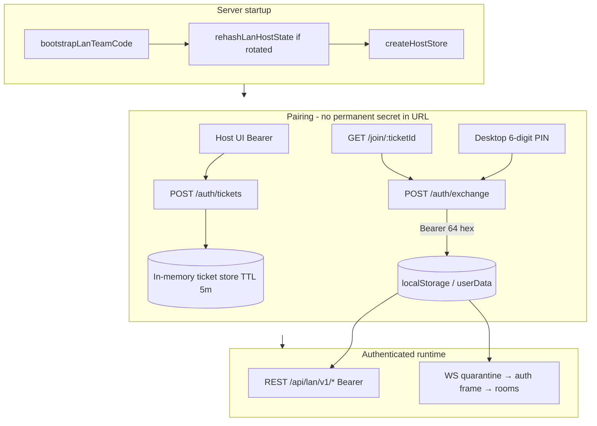
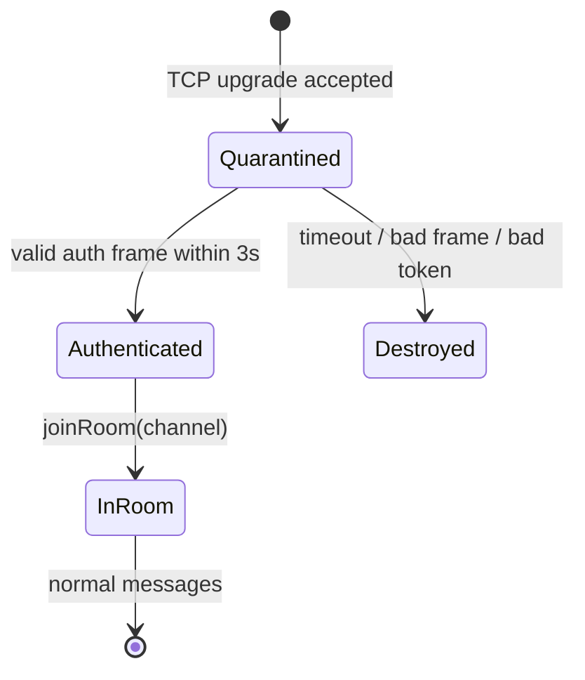

# LAN Security Hardening — Authentication, Pairing, and DoS Protection

> **For implementation:** After this spec is approved in review, use **superpowers:writing-plans** to produce the task-by-task implementation plan. Do not start coding from this document alone.

**Date:** 2026-05-30  
**Status:** Design approved in brainstorming (sections 1–6).  
**Related:** `docs/superpowers/specs/2026-05-30-r-plus-security-architecture-remediation-design.md` (broader program; this spec is the focused LAN slice).

## Problem statement

The LAN squad host on port `3738` was optimized for plug-and-play at the expense of security:

1. **Weak authentication:** `DEFAULT_LAN_TEAM_CODE = '1234'` and migration logic that *downgraded* prior random tokens to `1234`.
2. **Credential leakage:** Team secrets passed via `?code=` query strings (HTTP and WebSocket), appearing in proxy logs, server access logs, and browser history.
3. **No rate limiting:** Unbounded Express traffic and Python `/generate*` subprocesses can starve the event loop and degrade real-time WebSocket sync.
4. **Data loss risk:** `host-store.js` resets clinical state when `teamCodeHash` mismatches during token rotation.

This design closes those gaps while preserving **zero clinical data loss** on migration and **iPad Safari compatibility** for WebSockets.

## Goals (success criteria)

- [ ] No hardcoded or weak default LAN token; server refuses to start without a secure token.
- [ ] Token rotation updates `teamCodeHash` in `lan-squad-host-state.json` without clearing `patients` or `rooms`.
- [ ] Permanent Bearer token never appears in URLs, fragments, or WebSocket upgrade query strings.
- [ ] Pairing uses single-use, 5-minute TTL tickets (opaque path) or 6-digit PINs; burn after successful exchange.
- [ ] All LAN REST calls use `Authorization: Bearer <token>` only.
- [ ] WebSocket clients authenticate via first-frame JSON within 3 seconds before joining broadcast rooms.
- [ ] Tiered `express-rate-limit` on global, `/generate*`, and auth endpoints.
- [ ] Host UI can show a one-time “Security upgrade” notice when auto-rotation occurred.
- [ ] Logs and error responses never contain Bearer tokens, pairing PINs, or ticket IDs (redaction enforced in middleware and error handlers).

## Non-goals (v1)

- TLS on LAN (still trusted local network; document remains HTTP).
- Python `/generate` concurrency queue (rate limit only; queue deferred to v2).
- SQLCipher / CRDT / medical calculator changes (other specs).
- Multi-host or clustered ticket store (single Electron host process).

---

## Architecture overview



### New / modified modules

| Module | Role |
|--------|------|
| `lan-squad/effective-team-code.js` | Secure bootstrap, env validation, auto-rotation, `rehashLanHostState`, migration notice flag |
| `lan-squad/ticket-store.js` | In-memory single-use tickets + PIN index, 5-minute TTL |
| `lan-squad/auth-router.js` | `POST /auth/tickets`, `POST /auth/exchange`, `GET /host-status` |
| `lan-squad/host-router.js` | Bearer-only middleware; remove `?code=` and `X-Lan-Team-Code` |
| `lan-squad/ws-hub.js` | Quarantine + first-frame auth; no `?code=` |
| `lan-squad/host-store.js` | **No auto-wipe** on hash mismatch; fail with explicit error |
| `server.js` | Call bootstrap before store; rate limiters; CORS; `/join/:ticketId` route |
| `public/js/lan-client.mjs` | Bearer on `fetch`; WS auth frame on `open` |
| `public/js/lan-join-link.mjs` | Ticket URLs only |
| `public/js/features/lan-sync.mjs` | Migration modal; host mint UI; legacy `?code=` re-pair prompt |
| `main.js` | IPC `lan-guest-write-bearer` for Electron guest persistence |
| `lan-squad/redact-secrets.js` | Shared redaction for logs, errors, and debug dumps |
| `server.js` | Request-scoped redaction middleware + terminal error handler |

---

## Section 1: Token lifecycle and migration

### Remove weak defaults

- Delete `DEFAULT_LAN_TEAM_CODE` and all exports/usages of `'1234'`.
- Delete `migratePlugAndPlayTeamCode` (it downgraded legacy hex tokens to `1234`).
- Replace `ensureLanTeamCodeFile` behavior: never write a weak token.

### Secure token format

- **Permanent LAN Bearer secret:** `crypto.randomBytes(32).toString('hex')` → **64 hexadecimal characters** (256 bits).
- Stored as the first non-empty line of `userData/lan-team-code.txt`.
- Humans do not type this value; pairing uses PIN or `/join/:ticketId` only.

### Weak token detection

A token is **weak** if any of:

- Exact match `1234`
- Matches legacy pattern `/^[a-f0-9]{32}$/i` (previous opaque 128-bit hex tokens treated as deprecated)
- Length `< 32` characters (applies to env and file)

### Option D bootstrap: `bootstrapLanTeamCode({ userDataPath, hostStatePath })`

Returns:

```ts
{
  token: string;           // 64 hex
  source: 'file' | 'env' | 'created';
  requiresMigrationNotice: boolean;
}
```

**Algorithm:**

1. If `R_PLUS_LAN_TEAM_CODE` is set:
   - If weak → log fatal error to stderr and **throw** (caller exits process with code 1).
   - Else use env value as token; `source: 'env'`.
2. Else read `lan-team-code.txt`:
   - If missing → generate secure token, write file atomically, `source: 'created'`, `requiresMigrationNotice: false`.
   - If weak → generate new secure token, write file, set `requiresMigrationNotice: true`, remember `rotated: true`.
   - Else use file token, `source: 'file'`.
3. If `rotated === true` (or env token replaced file hash): call **`rehashLanHostState(hostStatePath, token)`** before any store load.
4. If token cannot be established (write failure, empty result) → throw; **no server listen**.

### `rehashLanHostState(hostStatePath, plainToken)` — zero data loss

When the team secret changes but clinical data must remain:

1. If `hostStatePath` does not exist → no-op (store will create fresh state with correct hash on first use).
2. Read and parse existing JSON.
3. Preserve: `patients`, `rooms`, `roomSyncBundles`, `version`, and any other clinical fields present.
4. Set `teamCodeHash = hashTeamCode(plainToken)` (existing `lan-squad/team-code.js`).
5. Atomic write (same pattern as `host-store.js` `atomicWriteJson`).
6. **Do not** reset arrays to empty defaults.

### `host-store.js` behavior change

**Remove** the branch in `load()` that replaces state with `defaultState()` when `s.teamCodeHash !== teamCodeHash`.

**Replace with:** throw a descriptive error, e.g. `LAN_HOST_STATE_HASH_MISMATCH`, instructing operator to run bootstrap/rehash or restore backup. This prevents silent clinical data loss if bootstrap is skipped or manual file edits desync hash and token.

### Startup (`server.js`)

```text
const boot = bootstrapLanTeamCode({ userDataPath, hostStatePath });
if (!boot.token) process.exit(1);
appExpress.locals.lanRequiresMigrationNotice = boot.requiresMigrationNotice;
const lanStore = createHostStore({ filePath, teamCodePlain: boot.token });
```

### Migration notice API

`GET /api/lan/v1/host-status` (requires host Bearer):

```json
{
  "ok": true,
  "requiresMigrationNotice": true,
  "lan": true
}
```

Host UI reads this once after connect and shows **“Security upgrade”** modal: new pairing links/PIN required; clinical data on host preserved.

---

## Section 2: Ticket pairing (mobile and desktop)

### In-memory ticket store (`lan-squad/ticket-store.js`)

**Backing:** `Map` in process memory (recommended approach). Tickets lost on process restart — acceptable for 5-minute pairing window.

**Record shape:**

```ts
{
  ticketId: string;      // e.g. req_8f72a9b1c2d3
  pin: string;           // 6 digits, 100000–999999
  expiresAt: number;     // epoch ms
  used: boolean;
}
```

**Indexes:**

- `tickets: Map<ticketId, record>`
- `pins: Map<pin, ticketId>` for O(1) PIN lookup

**TTL:** 5 minutes from `mint()`. Background sweep every 60s (or lazy delete on access) for expired entries.

### Mint tickets (host only)

`POST /api/lan/v1/auth/tickets`

- **Auth:** `Authorization: Bearer <host-token>` (64 hex).
- **Rate limit:** 30 requests / minute / IP.
- **Response:**

```json
{
  "ticketId": "req_8f72a9b1c2d3",
  "pin": "482917",
  "expiresAt": "2026-05-30T12:05:00.000Z",
  "joinUrl": "http://192.168.1.5:3738/join/req_8f72a9b1c2d3"
}
```

- `ticketId` prefix: `req_` + 12 hex chars from `randomBytes(6)`.
- `pin`: `crypto.randomInt(100000, 1000000)` with collision retry (max 10 attempts).

### Exchange (guest, unauthenticated)

`POST /api/lan/v1/auth/exchange`

**Body (exactly one field):**

```json
{ "ticket": "req_8f72a9b1c2d3" }
```

or

```json
{ "pin": "482917" }
```

**Rate limit:** 10 requests / minute / IP.

**Success (200):**

```json
{
  "token": "<64-hex-bearer>",
  "hostUrl": "http://192.168.1.5:3738",
  "persist": true,
  "storageTarget": "userData"
}
```

**Burn after reading:** delete ticket and PIN from maps immediately after one successful exchange.

**Failures:**

| Condition | Status | Body |
|-----------|--------|------|
| Expired | 410 | `{ "error": "ticket_expired" }` |
| Already used / unknown | 401 | `{ "error": "invalid_ticket" }` |
| Both ticket and pin in body | 400 | `{ "error": "ambiguous_credentials" }` |
| Neither field | 400 | `{ "error": "missing_credentials" }` |

### Mobile flow (iPad Safari)

1. User opens `GET /join/:ticketId` (no query secrets).
2. `server.js` serves mobile shell; inline boot script reads `ticketId` from path.
3. `POST /auth/exchange` with `{ ticket }`.
4. Store Bearer in `localStorage` key `rplus.lan.bearer` (and `hostUrl` in existing LAN config).
5. **`history.replaceState({}, '', '/mobile')`** so bookmarks point at clean `/mobile`.
6. Subsequent visits: rehydrate Bearer from `localStorage`; open WS with first-frame auth.

### Desktop guest flow

1. Host displays 6-digit PIN (and optional QR for join URL).
2. Guest Electron/renderer enters PIN → `POST /auth/exchange` with `{ pin }`.
3. On `persist: true` + `storageTarget: "userData"`:
   - Renderer: `storage.saveLanConfig({ hostUrl, teamCode: token })` (Bearer as team secret).
   - Electron: `ipcMain.handle('lan-guest-write-bearer', …)` writes `lan-bearer.json` or updates `lan-team-code.txt` under `app.getPath('userData')` for auto-reconnect.

### Invite link builder

`buildLanJoinUrls(hostUrl, ticketId)` → `{ joinUrl: host + '/join/' + ticketId, … }` — **never** embed permanent Bearer.

### Legacy `?code=` links

`parseLanInviteInput` may still detect old URLs for UX only: show message **“Este enlace ya no es válido. Pide al anfitrión un nuevo enlace o PIN.”** Do not send legacy code to server.

---

## Section 3: HTTP authentication

### Bearer extraction

```js
function getBearerToken(req) {
  const h = req.get('authorization') || '';
  const m = /^Bearer\s+(\S+)\s*$/i.exec(h);
  return m ? m[1] : '';
}
```

### Middleware (`teamCodeMiddleware` → `bearerAuthMiddleware`)

- Validate with `verifyTeamCode(token, st.teamCodeHash)`.
- Apply to all `/api/lan/v1` routes except:
  - `POST /auth/exchange` (public, rate-limited)
  - Optional: `GET /api/lan/v1/ping` removed from public or kept without PHI (prefer **all LAN routes protected**; health check is authenticated `/ping`).

**Remove:**

- `req.query.code`
- `X-Lan-Team-Code` header

### CORS (`server.js`)

Update preflight:

```js
'Access-Control-Allow-Headers': 'Content-Type, Authorization'
```

Remove `X-Lan-Team-Code`.

---

## Section 4: WebSocket first-frame authentication

### Upgrade URL

- Path: `/api/lan/v1/ws`
- Allowed query: `channel` only (e.g. `sync`, `live:roomId`) — **not secret**
- **Forbidden:** `code`, `token`

### Quarantine state machine



1. On upgrade: do **not** call `joinRoom`.
2. Set `ws.__authenticated = false`, start 3000ms timer.
3. On `message`:
   - If not authenticated: parse JSON; require `{ type: 'auth', token: string }`.
   - Verify token; on success clear timer, set `__authenticated = true`, `joinRoom(ws, channel from upgrade URL)`.
   - On failure: `socket.destroy()`.
4. If timer fires before auth: `socket.destroy()`.
5. While quarantined: ignore all non-auth messages (do not broadcast).

### Client (`lan-client.mjs`)

```js
const ws = new WebSocket(`${base}/api/lan/v1/ws?channel=${encodeURIComponent(channel)}`);
ws.onopen = () => {
  ws.send(JSON.stringify({ type: 'auth', token: bearerToken }));
};
```

---

## Section 5: Rate limiting and DoS prevention

**Dependency:** `express-rate-limit` (add to `package.json`).

| Limiter | Mount | Window | Max / IP |
|---------|-------|--------|----------|
| `globalLimiter` | `appExpress` (after JSON parser) | 15 min | 300 |
| `generateLimiter` | Each `POST /generate*` | 1 min | 8 |
| `authExchangeLimiter` | `POST /api/lan/v1/auth/exchange` | 1 min | 10 |
| `authTicketLimiter` | `POST /api/lan/v1/auth/tickets` | 1 min | 30 |

**Response on limit:** `429` with `{ "error": "rate_limit_exceeded" }`.

**Acknowledged residual risk:** Python subprocesses in `/generate*` can still block the event loop under allowed rates. A concurrency queue is **out of scope v1**; monitor in hospital pilots.

---

## Section 6: Frontend, UX, and tests

### Renderer changes

| File | Changes |
|------|---------|
| `lan-sync.mjs` | Remove `DEFAULT_LAN_TEAM_CODE`; host mint ticket UI; migration modal from `host-status`; legacy link re-pair message |
| `lan-client.mjs` | `Authorization: Bearer`; WS first-frame auth |
| `lan-join-link.mjs` | Ticket path URLs; deprecate `code=` in builders |
| `storage.js` | Optional dedicated `rplus.lan.bearer` key or continue `teamCode` field holding Bearer |

### Electron (`main.js`)

- `lan-guest-write-bearer` IPC for guest persistence signal from exchange payload.
- Update `lan-get-effective-team-code` to use `bootstrapLanTeamCode` / read file (host only; never log token).

### Tests (required)

| Test file | Coverage |
|-----------|----------|
| `lan-squad/effective-team-code.test.js` | Weak detection, env fail, rotation + rehash preserves patients |
| `lan-squad/ticket-store.test.js` | TTL, burn-after-read, PIN collision |
| `lan-squad/host-router.test.js` | Bearer only; 401 without header; reject `?code=` |
| `lan-squad/ws-hub.test.js` | Quarantine timeout; auth frame; room join only after auth |
| `lan-squad/host-store.test.js` | Hash mismatch throws instead of wipe |
| `public/js/lan-join-link.test.mjs` | Ticket URLs; legacy parse messaging |
| `public/js/lan-client.test.mjs` | Auth frame sent on open (mock WS) |

### Bundle

Run `npm run bundle:renderer` after `public/js` changes so `app.bundle.mjs` stays in sync for Electron.

---

## Section 7: Logging policy and secret redaction

Security tokens often leak through **generic 500 handlers**, `console.error(err)` on failed requests, and middleware that dumps `req.headers` or `req.body` when something throws mid-flight. This is a **required** part of the LAN hardening implementation—not optional hardening.

### Module: `lan-squad/redact-secrets.js`

Pure helpers (unit-tested):

| Function | Behavior |
|----------|----------|
| `redactBearerHeader(value)` | Replace `Bearer <token>` with `Bearer [REDACTED]`; leave scheme visible for debugging |
| `redactAuthorizationHeaders(headers)` | Clone headers object; redact `authorization` / `Authorization` |
| `redactAuthBody(body)` | If object: set `pin`, `ticket`, `token`, `code` to `[REDACTED]` (shallow clone) |
| `redactUrlSecrets(url)` | Strip `code=`, `token=` query pairs from URL strings used in logs |
| `redactForLog(value)` | Deep-safe stringify helper: walks plain objects/arrays, redacts known keys and Bearer patterns in strings |

**Never** log full `req` objects. If request context is needed, log only: `method`, `path` (query redacted), `status`, opaque `requestId`.

### Express middleware (early in `server.js`, before routes)

`requestRedactionMiddleware`:

- Attach `req.__safeForLog = { method, path: redactUrlSecrets(req.originalUrl), ip }` for optional debug use.
- Do **not** replace `req.headers` / `req.body` in place (handlers need real credentials); redact only at log/write boundaries.

### Terminal error handler (last middleware)

```js
appExpress.use((err, req, res, _next) => {
  const safe = {
    message: err && err.message,
    code: err && err.code,
    path: redactUrlSecrets(req.originalUrl),
    method: req.method,
  };
  console.error('[express]', safe); // never err.req, never raw req.headers
  res.status(500).json({ error: 'internal_error' }); // never e.message if it might echo user input with secrets
});
```

**Rules for 500 JSON bodies:**

- Do **not** return raw `err.message` to clients on LAN auth or `/auth/*` routes if the handler touched `Authorization`, `pin`, or `ticket`.
- Prefer stable codes: `internal_error`, `invalid_ticket`, etc.
- Route-level `catch` blocks that today do `res.status(500).json({ error: e.message })` on `/generate*` must use a **sanitized** message (generic Spanish/English hospital-safe text) or a redacted string via `redactForLog`.

### WebSocket / ws-hub

- On auth failure or quarantine timeout: log `channel` and `reason` only—**never** the first-frame `token` field.
- If logging raw frames for debug, gate behind `R_PLUS_LAN_DEBUG=1` and run payload through `redactAuthBody`.

### WS first-frame auth failures

Invalid auth JSON may contain the token in memory; do not include `msg` in `console.error` without `redactAuthBody(msg)`.

### Tests (`lan-squad/redact-secrets.test.js`)

- Bearer header redaction
- Body `{ pin: '123456', ticket: 'req_abc' }` → redacted
- URL `?code=secret&room=x` → `code=[REDACTED]`
- Nested object with `authorization` key

### Implementation plan requirement

The writing-plans task list **must** include an explicit task: install redaction module, wire middleware + error handler, audit all `console.error` / `res.status(500).json({ error: e.message })` in `server.js`, `host-router.js`, `auth-router.js`, and `ws-hub.js`.

---

## Security properties summary

| Threat | Mitigation |
|--------|------------|
| Default PIN `1234` | Removed; fail-closed bootstrap |
| Token in access logs | Bearer header + first-frame WS only |
| Bookmarked secrets | `replaceState` to `/mobile`; Bearer in storage |
| Brute-force pairing | Rate limits on exchange; 6-digit PIN + short TTL |
| Stolen join link reuse | Single-use ticket burn |
| Rotation data loss | `rehashLanHostState` + no store auto-wipe |
| LAN DoS | Tiered rate limits |
| Token leak via 500 / stack traces | Section 7 redaction middleware + sanitized error handler |

---

## Open items for implementation plan

1. Exact `localStorage` keys and migration from old `saveLanConfig` shape.
2. Whether host displays QR encoding `joinUrl` (recommended; use existing UI patterns).
3. `GET /join/:ticketId` static route ordering vs `express.static`.
4. Deprecate exported `readEffectiveLanTeamCode` weak fallbacks in renderer-facing IPC; host reads token only via bootstrap or explicit file read without `'1234'` default.

---

*Spec written from approved brainstorming sections 1–6. Review this file before invoking writing-plans.*
