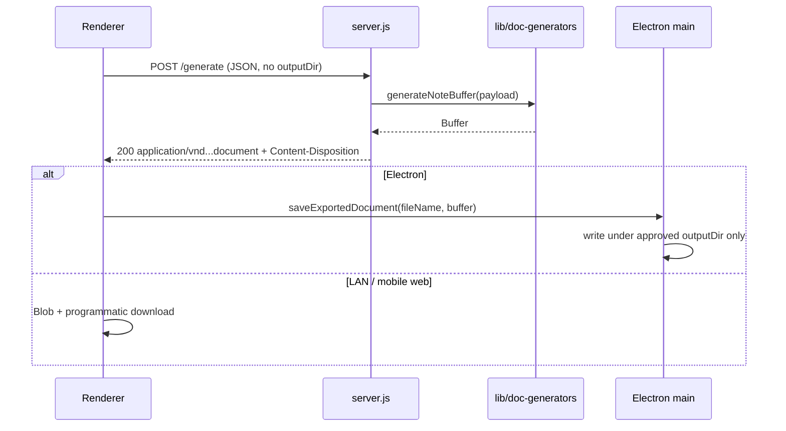

# Native Document Generation (JSZip + Streaming)

**Date:** 2026-05-30  
**Status:** Approved (brainstorming)  
**Replaces:** Python subprocess generation (`generate_note.py`, `generate_indicaciones.py`, `generate_listado.py`)

## Summary

R+ clinical Word exports currently spawn embedded or system Python to fill hospital `.docx` templates. That creates ARM64/cross-platform risk, cold-start latency, and a large `python-runtime` bundle. This design removes Python entirely for the three DOCX flows by porting the existing **stdlib zip + surgical XML string mutation** approach to Node (`jszip`), streaming the result over HTTP, and persisting PHI only on the client (Electron IPC to an approved folder, or browser download on LAN/mobile).

## Goals

1. **Eradicate Python** — No `spawn`/`execSync` of Python from `server.js`; remove `python-runtime` from Electron builds.
2. **Native Node generation** — Port the three Python scripts to `lib/doc-generators/*` using JSZip + string/regex XML edits (Approach 1).
3. **PHI lifecycle** — Server never writes durable clinical files; optional `os.tmpdir()` files deleted in `finally`; only the resident-chosen destination retains a copy (desktop via IPC).

## Non-goals (this phase)

- Streaming refactor for `/generate-censo` and `/generate-receta-hu` (already native JS; may adopt `document-export-client.mjs` later).
- Retagging templates for docxtemplater or rebuilding layouts with the `docx` npm package.
- Changing template `.docx` files unless a port bug requires a sentinel fix.

---

## Architecture



| Module | Responsibility |
|--------|----------------|
| `lib/doc-generators/note.js` | Nota de evolución (`template.docx`) |
| `lib/doc-generators/indicaciones.js` | Indicaciones (`template_indicaciones.docx`) |
| `lib/doc-generators/listado.js` | Listado de problemas (`template_listado.docx`) |
| `lib/doc-generators/shared.js` | Template resolution (asar.unpacked), `esc()`, `replaceT()`, optional namespace-safe helpers |
| `lib/document-export-client.mjs` | `fetch` → blob → Electron IPC vs browser download |
| `server.js` | Validate JSON, generate buffer, stream response; no PHI persistence |
| `main.js` | Approved `outputDir` registry + hardened `save-exported-document` IPC |

**Hybrid persistence rationale:** Desktop users keep Mi Perfil `outputDir` via main-process writes. LAN/iPad clients cannot target the host’s filesystem safely; they receive an attachment download only.

---

## Native generation: JSZip + XML port (Approach 1)

### Why not docxtemplater / `docx` npm

- Templates rely on **paragraph-index surgery**, duplicate header blocks, table cell replacement, and dynamic `numbering.xml` injection (`generate_listado.py`).
- Retagging or rebuilding would risk layout drift from Microsoft Word expectations at the hospital.

### Porting rules

1. **Treat `word/document.xml` as UTF-8 text** for find/replace, same as Python (`replace_t`, `re.sub`, paragraph regexes).
2. **Avoid DOM parsers that rewrite namespaces** unless a sub-task truly needs structure; prefer string/regex to preserve `w:`, `wp:`, `mc:` prefixes and attribute order Word expects.
3. **`lib/doc-generators/shared.js`** provides:
   - `esc(text)` — XML entity escape (`&`, `<`, `>`, `"`).
   - `replaceT(xml, old, new)` — both `<w:t>` and `<w:t xml:space="preserve">` variants.
   - `resolveTemplatePath(baseDir, fileName)` — `__dirname` + `app.asar.unpacked` (mirror `generate-receta-hu.js`).
   - Optional `readDocxZip(templatePath)` / `writeDocxZip(files)` wrapping JSZip.
4. **In-memory only** — Load template zip → mutate `files['word/document.xml']` (and `word/numbering.xml` when needed) → `Buffer` out; no intermediate disk in the happy path.
5. **Parity tests** — Port assertions from `tests/test_generate_listado.py` to Node; keep one golden payload per generator.

### Dependency

- Add **`jszip`** (production dependency). Keep **`pdf-lib`** for existing PDF flows.

---

## Server API

### Endpoints

| Route | Generator | Filename pattern |
|-------|-----------|------------------|
| `POST /generate` | `generateNoteBuffer` | `Nota_Evolucion_{nombre}_{fecha}.docx` |
| `POST /generate-indicaciones` | `generateIndicacionesBuffer` | `Indicaciones_{nombre}_{fecha}.docx` |
| `POST /generate-listado` | `generateListadoBuffer` | `Listado_Problemas_{nombre}_{fecha}_{HH-mm-ss}.docx` |

### Request

JSON body only. Fields unchanged except **`outputDir` is removed** — the server must not receive or honor export paths.

### Success response

```http
HTTP/1.1 200 OK
Content-Type: application/vnd.openxmlformats-officedocument.wordprocessingml.document
Content-Disposition: attachment; filename="Nota_Evolucion_....docx"

<raw DOCX bytes>
```

Use `safeName()` for the filename segment in `Content-Disposition` (RFC 5987 `filename*` optional follow-up if non-ASCII names require it).

### Error response

```http
Content-Type: application/json
{ "error": "..." }
```

Preserve familiar Spanish messages where the UI depends on them (e.g. missing `patient` / `note`).

### Controller pattern

```javascript
let tmpPath = null;
try {
  const buf = await generateXBuffer(payload);
  res.setHeader('Content-Type', 'application/vnd.openxmlformats-officedocument.wordprocessingml.document');
  res.setHeader('Content-Disposition', `attachment; filename="${fileName}"`);
  res.send(buf);
} catch (e) {
  if (!res.headersSent) res.status(500).json({ error: e.message });
} finally {
  if (tmpPath) {
    try { await fs.promises.unlink(tmpPath); } catch { /* log */ }
  }
}
```

**Security properties**

- Server is **blind to document destination** — no `DOWNLOADS`, no `outputDir`, no `writeFileSync` on these routes.
- PHI exists in server RAM only for the duration of the request (plus TCP buffers).

### Removed from `server.js`

- `resolvePython`, `runPython`, `PYTHON`, `SCRIPTS_DIR` (for Python)
- `const { spawn }` for Python (retain `execSync` only if still used for port-hint diagnostics on macOS)

---

## Electron IPC

### Approved output directory

`outputDir` remains in renderer `localStorage` (`rpc-settings.outputDir`). On load and after folder picker:

```javascript
electronAPI.setApprovedOutputDir(settings.outputDir || '');
```

Main process stores a single resolved absolute path.

### Handlers (`main.js`)

**`set-approved-output-dir`**

- Validate directory exists and is writable (`fs.promises.access(W_OK)`).
- Store `path.resolve(dir)` or fall back to OS Downloads when empty.

**`save-exported-document`**

```javascript
ipcMain.handle('save-exported-document', async (_event, { fileName, buffer }) => {
  const dir = approvedOutputDir || defaultDownloadsDir();
  const safe = path.basename(String(fileName || ''));
  if (!safe || safe !== fileName) throw new Error('Nombre de archivo inválido');
  const fullPath = path.join(dir, safe);
  // Path traversal guard: resolved file must stay under resolved dir
  const resolvedDir = await fs.promises.realpath(dir);
  await fs.promises.mkdir(resolvedDir, { recursive: true });
  await fs.promises.writeFile(fullPath, Buffer.from(buffer));
  const resolvedFile = await fs.promises.realpath(fullPath);
  if (!resolvedFile.startsWith(resolvedDir + path.sep) && resolvedFile !== resolvedDir) {
    await fs.promises.unlink(fullPath).catch(() => {});
    throw new Error('Ruta de exportación no permitida');
  }
  return { success: true, path: fullPath };
});
```

**`preload.js`**

- `setApprovedOutputDir(dir)`
- `saveExportedDocument({ fileName, buffer })` — `ArrayBuffer` or `Uint8Array`

---

## Client: `document-export-client.mjs`

Central export helper used by nota, indicaciones, and listado UI.

```javascript
export async function exportGeneratedDocument({ url, buildPayload, defaultFileName }) {
  const res = await fetch(url, {
    method: 'POST',
    headers: { 'Content-Type': 'application/json' },
    body: JSON.stringify(buildPayload()),
  });
  if (!res.ok) {
    const body = await res.json().catch(() => ({}));
    throw new Error(body.error || 'No se pudo generar el documento.');
  }
  const blob = await res.blob();
  const fileName =
    parseContentDispositionFilename(res.headers.get('Content-Disposition')) ||
    defaultFileName;

  if (window.electronAPI?.saveExportedDocument) {
    const arrayBuffer = await blob.arrayBuffer();
    const result = await window.electronAPI.saveExportedDocument({ fileName, buffer: arrayBuffer });
    return result;
  }

  const objectUrl = URL.createObjectURL(blob);
  try {
    const a = document.createElement('a');
    a.href = objectUrl;
    a.download = fileName;
    a.click();
  } finally {
    URL.revokeObjectURL(objectUrl);
  }
  return { success: true };
}
```

### Output-dir fallback (Electron)

Move `handleOutputDirFallback` logic client-side:

1. IPC write fails (missing dir / not writable) → prompt `selectOutputDir()` → `setApprovedOutputDir` → retry export.
2. Remove `outputDir` from `buildPayload` for DOCX endpoints.

### Call sites

- `public/js/features/notes-indicaciones.mjs` — `/generate`, `/generate-indicaciones`
- `public/js/features/expediente.mjs` — `/generate-listado`
- Deprecate `requestDocumentJson` for these three routes (keep for censo/receta until migrated).

---

## Testing and build

### Tests

| File | Purpose |
|------|---------|
| `lib/doc-generators/listado.test.js` | Port `tests/test_generate_listado.py` cases |
| `lib/doc-generators/note.test.js` | Smoke + key replacements |
| `lib/doc-generators/indicaciones.test.js` | Smoke + table cell presence |
| `public/js/document-export-client.test.mjs` | `Content-Disposition` parsing; Electron branch mock |

Remove `python3 -m unittest tests/test_generate_listado.py` from `package.json` `test` script after port passes.

### Build / release

Remove from `package.json` `build`:

- `extraResources` entries for `python-runtime/*`
- `files` / `asarUnpack` entries for `generate_*.py`

Remove or stop invoking:

- `scripts/fetch-python-mac.js`
- `scripts/fetch-python.js`

Delete (post-port verification):

- `generate_note.py`, `generate_indicaciones.py`, `generate_listado.py`
- `_clean_listado_template.py` (dev-only; keep template file)
- `tests/test_generate_listado.py` after Node tests land

Update `scripts/lib/release-git.js` file lists accordingly.

---

## Rollout and risks

| Risk | Mitigation |
|------|------------|
| Subtle XML drift vs Python | Golden byte comparison on fixed payloads for listado; manual Word open on nota/indicaciones |
| Large port (~800 LOC) | One generator per PR/task; shared.js first |
| Electron download vs IPC regression | E2E smoke: generate nota → file appears in configured folder |
| LAN mobile behavior change | Files no longer land on host Downloads when phone triggers generate; attachment saves on device (intended) |

---

## Server audit logging (no PHI in logs)

On successful or failed generation, log a **single structured line** per request:

- Document type (`nota` | `indicaciones` | `listado`)
- Opaque patient identifier safe for logs: `registro` if present, else truncated hash of `nombre` — **never** full clinical narrative, note body, listado text, or file bytes
- Outcome (`ok` | `error`) and HTTP status
- Byte length of response (on success)

**Do not log:** `outputDir`, client save path, `Content-Disposition` beyond type, document XML, or stdin JSON payloads.

Example:

```javascript
console.log('[doc-export]', JSON.stringify({
  type: 'listado',
  registro: patient.registro || null,
  status: 200,
  bytes: buf.length,
}));
```

Use `console.error` with the same shape (no stack bodies containing patient text) on failure.

---

## Success criteria

- [ ] All three DOCX endpoints return valid streams; Word opens output without repair prompts on golden cases.
- [ ] No Python invocations in `server.js`; no `python-runtime` in shipped artifacts.
- [ ] Server process leaves no DOCX under `os.tmpdir()` after requests (audit with temp dir watch during tests).
- [ ] Electron saves only under approved `outputDir`; `../../` filename rejected.
- [ ] LAN/mobile receives browser download; no server-side write.

---

## References

- Existing native PDF pattern: `generate-receta-hu.js`, `generate-censo.js`
- Prior output-dir design: `docs/superpowers/specs/2026-04-13-output-dir-duplicate-warning-design.md`
- Security remediation plan (Task 5): `docs/superpowers/plans/2026-05-30-r-plus-security-architecture-remediation-plan.md`
