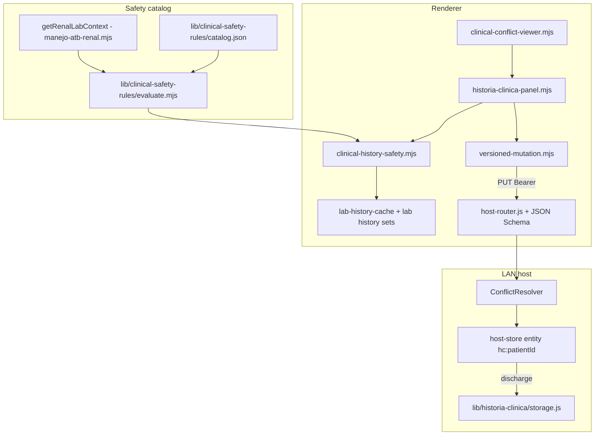

# Static Clinical History (Historia Clínica de Ingreso)

> **For implementation:** After this spec is approved in review, use **superpowers:writing-plans** to produce the task-by-task implementation plan. Do not start coding from this document alone.

**Date:** 2026-05-30  
**Status:** Design approved in brainstorming.  
**Related specs:**  
- `docs/superpowers/specs/2026-05-30-lan-host-concurrency-design.md` (write queue, `audit_log`, entity versions)  
- `docs/superpowers/specs/2026-05-30-clinical-conflict-resolution-design.md` (`ConflictResolver`, Clinical Diff Viewer, versioned mutations)  
- `docs/superpowers/specs/2026-05-30-lan-security-hardening-design.md` (Bearer auth on host routes)  
- `docs/superpowers/specs/2026-05-30-clinical-calculator-safety-design.md` (`ClinicalSafetyError` pattern; separate from text-rule catalog)  
- Source catalog: *Módulo de Seguridad Clínica* (20 high-risk drug–contraindication scenarios)

## Problem statement

R+ captures rich per-patient clinical data (labs, manejo, notas) but lacks a **versioned, ward-safe admission history** that:

1. Freezes an **ingreso snapshot** (ficha, antecedentes, labs at admission) for medico-legal traceability while remaining editable under controlled **Edit** mode.
2. Supports **concurrent residents** editing different sections without silent loss (AHF vs APP vs Ficha).
3. Surfaces **high-risk contraindications** when APP text conflicts with **live lab context** (e.g. metformina + eGFR &lt; 30).
4. Persists **acknowledged overrides** in the **audit trail**, not in bloated entity state.
5. **Archives** discharged patients off the hot host store.

## Goals (success criteria)

- [ ] `historiaClinica` registered as a **versioned entity** in `host-store.js` with section-level `changedKeys` for field-level merge via `ConflictResolver`.
- [ ] Overlapping edits on the same section → **409** + **Clinical Diff Viewer** + IndexedDB draft (existing conflict UX).
- [ ] UI panel `public/js/features/historia-clinica-panel.mjs`: collapsible bento grid; desktop two columns; mobile read-only summary.
- [ ] **Lab-at-admission** selector (hybrid **C**): settings default lookback (e.g. 48h), one-time confirm on first create per patient, frozen display snapshot; **Re-sincronizar labs** updates anchor; cross-field rules evaluate against **latest** renal context with re-scan on lab save.
- [ ] **APP** (Antecedentes Personales Patológicos) wired to predicate-based safety rules from PDF catalog; **APNP** (No Patológicos) excluded from drug rules.
- [ ] Each successful save appends **audit_log** entry with `changedKeys`, `sections`, `safety[]` (ruleId, acknowledged, labContext) — audit is **source of truth** for risk acceptance.
- [ ] Mutations only via Bearer-authenticated host routes with **JSON Schema** validation before `ConflictResolver`.
- [ ] On patient discharge, entity **archived** to `storage/archive/` and removed from active host entity map.
- [ ] `lib/historia-clinica/storage.js` encapsulates archive I/O and path conventions.

## Non-goals (v1)

- NLP / ML classification of free text; rules are **keyword/predicate** only (Spanish clinical vocabulary).
- Server-side execution of safety rules (client evaluates; server validates envelope + persists audit payload from client).
- Deep nested JSON merge inside a section (top-level section keys only for conflict resolution).
- Changing expediente lab pipeline or Python exports.
- Cross-patient or room-level shared historia (always **per `patientId`**).

---

## Terminology

| Abbrev | Meaning | Panel column |
|--------|---------|----------------|
| **Ficha** | Identifying / admission demographics slice | Left |
| **AHF** | Antecedentes Heredo-Familiares | Left |
| **APP** | Antecedentes Personales **Patológicos** | Left (safety rules) |
| **APNP** | Antecedentes Personales **No** Patológicos | Left |
| **PEEA** | Padecimiento actual / examen / contexto de ingreso | Right |
| **Labs** | Lab-at-admission structured snapshot + selector | Right |

---

## Architecture overview



### New / modified modules

| Module | Role |
|--------|------|
| `lan-squad/host-store.js` | Register `historiaClinica`; `getEntity` / `setEntity`; discharge hook |
| `lan-squad/entity-keys.js` | `historiaClinicaEntityKey(patientId)` → `hc:{patientId}` |
| `lan-squad/host-router.js` | `PUT/GET .../historia-clinica`; Ajv/schema gate |
| `lan-squad/schemas/historia-clinica-mutation.json` | Server-side mutation + payload shape |
| `lib/historia-clinica/storage.js` | Archive paths, read/write, list |
| `lib/clinical-safety-rules/catalog.json` | 20 PDF scenarios as predicate rules |
| `lib/clinical-safety-rules/evaluate.mjs` | Clause + context predicate engine |
| `lib/clinical-safety-rules/evaluate.test.js` | Golden cases per priority scenario |
| `public/js/features/historia-clinica-panel.mjs` | Bento UI, edit toggle, lab selector |
| `public/js/clinical-history-safety.mjs` | Debounced scan, acknowledge modal, save gate |
| `public/js/features/expediente.mjs` (or shell) | Mount panel tab/section when patient active |

---

## Data model

### Entity identity

| Field | Value |
|-------|--------|
| `entityType` | `historiaClinica` |
| `entityId` | `{patientId}` |
| Storage key | `hc:{patientId}` in `roomSyncBundles[roomId].entities` **or** patient-scoped map (see placement below) |

**Placement (recommended):** Store under the patient’s **room sync bundle** `entities['hc:{patientId}']` so LAN room broadcast and materialization stay consistent with agenda/todo. Alternative: dedicated `state.historiaClinicaByPatientId` — only if bundle coupling is undesirable; default to bundle entity for v1.

### Document shape (`data`)

```ts
type HistoriaClinica = {
  patientId: string;
  createdAt: string;          // ISO
  updatedAt: string;          // ISO — server-set on commit
  editMode: boolean;          // UI only; default false after create
  labLookbackHours: number;   // e.g. 48 — copied from settings at create
  labAnchor: {
    setId: string;            // stable id from lab history set
    fecha: string;
    egfr: number | null;
    creatinineMgDl: number | null;
    source: 'lab' | 'computed';
    capturedAt: string;       // ISO when anchored
  } | null;
  labsAtAdmission: {
    setId: string;
    fecha: string;
    qsSummary: string;        // optional condensed display
    parsedBySection?: object; // subset for UI — QS focus
  } | null;
  sections: {
    ficha: string;            // plain text or light markdown per existing R+ conventions
    ahf: string;
    app: string;
    apnp: string;
    peea: string;
  };
  meta?: {
    createdByClientId?: string;
    admissionConfirmedLabs?: boolean; // first-create confirm done
  };
};
```

**Intentionally absent from entity:** `safetyAcknowledgements`, `ruleIds`, override flags — those live only in **`audit_log`** entries (see § Audit).

### Versioning & `changedKeys`

Section-level keys only (top-level keys inside `data` for resolver purposes):

| `changedKeys` value | Maps to |
|---------------------|---------|
| `ficha` | `sections.ficha` |
| `ahf` | `sections.ahf` |
| `app` | `sections.app` |
| `apnp` | `sections.apnp` |
| `peea` | `sections.peea` |
| `labsAtAdmission` | `labsAtAdmission` + optional `labAnchor` when re-sync |
| `meta` | `meta` |

Client sends mutation:

```json
{
  "entityType": "historiaClinica",
  "entityId": "p_abc",
  "patientId": "p_abc",
  "roomId": "room_xyz",
  "expectedVersion": 2,
  "changedKeys": ["app"],
  "baseData": { "sections": { "app": "…" }, "version": 2 },
  "data": { "sections": { "app": "…updated…" } },
  "audit": {
    "sections": ["app"],
    "safety": [
      {
        "ruleId": "metformina-egfr-lt30",
        "severity": "high",
        "acknowledged": true,
        "message": "Metformina con TFGe < 30 mL/min/1.73m²",
        "labContext": { "egfr": 22, "fecha": "30/05/26", "setId": "set_1", "source": "computed" }
      }
    ]
  }
}
```

Server merges `sections.*` from `data` into stored entity; **`audit` block is append-only to `audit_log`**, not persisted inside `data`. The host applies mutation + audit inside **one `WriteQueue` transaction** (`putHistoriaClinicaQueued`) so audit append cannot race a separate `persistState` snapshot.

---

## Concurrency (ConflictResolver)

Reuse `lan-squad/conflict-resolver.js` algorithm unchanged:

1. **Disjoint sections** → auto-merge (`autoMerged: true`).
2. **Same section key in `changedKeys` overlap** → `ConflictError` → HTTP **409** / `livesync:conflict`.
3. Client opens **`clinical-conflict-viewer.mjs`** with draft in IndexedDB (`draft-conflict:*`).

`host-store.getEntity` / `setEntity` extended:

```js
if (type === 'historiaClinica') {
  const key = historiaClinicaEntityKey(patientId || id);
  const rec = bundle.entities[key];
  // version + data: HistoriaClinica
}
```

`materializeRoomViews` unchanged (historia does not appear in agenda/todos arrays).

---

## Lab-at-admission (hybrid C)

### Settings

| Setting | Default | Location |
|---------|---------|----------|
| `historiaClinica.labLookbackHours` | `48` | Mi Perfil / settings object (mirror existing settings patterns) |

### Create flow

1. User opens Historia Clínica for patient with no entity → **create wizard**.
2. Show lab sets from patient history within `labLookbackHours` (chronological sort via `sortLabHistoryChronological` / existing lab history APIs).
3. **First create only:** confirm dialog — “Usar labs de las últimas **N** horas” (default from settings; user may adjust N once).
4. On confirm: set `labsAtAdmission`, `labAnchor` from selected set; `meta.admissionConfirmedLabs = true`.
5. Entity saved with `editMode: false` (read-only presentation).

### Re-sincronizar labs

- Explicit control in Labs column; user picks set again → mutation `changedKeys: ['labsAtAdmission']` updates anchor + display snapshot.
- Does **not** rewrite APP/APNP text.

### Cross-field evaluation source (Approach 3)

| Purpose | Lab source |
|---------|------------|
| Display / export / audit reproducibility | `labAnchor` + `labsAtAdmission` |
| **Safety predicates** (`getContext('renal')`) | **Latest** parsed QS set from lab history (same pipeline as `getRenalLabContext(latestLabSet, patient)`) |
| Re-scan triggers | APP text change (debounced); lab set saved (`bumpLabHistoryRevision`); Re-sincronizar |

When a rule fires, audit entry **`labContext`** must include the values used for that evaluation (from latest), plus optional `anchorEgfr` for comparison.

---

## Clinical safety rules

### Design principles

- **Two-tier:** Ship all **20 scenarios** from *Módulo de Seguridad Clínica* in `catalog.json`; engine is generic.
- **APP text** is primary scan target for drug mentions; **PEEA** and patient demographics participate in **context predicates** (pregnancy, bleeding, etc.).
- **APNP:** no drug–contraindication rules in v1.
- **Predicate model** (maintainable catalog):

```ts
type Rule = {
  id: string;
  severity: 'high' | 'moderate';
  title: string;
  message: string;
  reference?: string;
  scope: 'text' | 'cross_field';
  clauses: Array<{ anyOf: string[] }>;  // AND across clauses, OR within clause — applied to normalized text
  requires?: Array<'renal' | 'patient' | 'peea'>;
  predicate?: string;  // e.g. "renal.egfr < 30" — only when scope === 'cross_field'
};
```

**Evaluation:**

- **Text rules:** `matchAllClauses(normalize(section.app))`  
- **Cross-field rules:** `matchAllClauses(normalize(section.app)) && evalPredicate(predicate, context)`  
- **Context** built once per scan:

```js
const context = {
  renal: getRenalLabContext(latestLabSet, patient), // existing export
  patient: { sexo, edadYears },
  peea: normalize(sections.peea),
  app: normalize(sections.app),
};
```

Supported predicates (v1 minimal set):

| Predicate | Meaning |
|-----------|---------|
| `renal.egfr < N` | Numeric compare when egfr finite |
| `renal.egfr <= N` | |
| `renal.creatinineMgDl > N` | |
| `patient.sexo === 'F' && clauseMatch(peea, pregnancyTerms)` | Pregnancy scenarios |
| `peea` clause groups | Bleeding, ERC stage phrases from PDF |

Use **eGFR** label in UI copy; store as `egfr` in context (matches `getRenalLabContext`).

### UI behavior

- Debounce APP input ~400ms.
- On match: non-blocking **banner** + blocking **acknowledge** on save (same severity family as electrolyte alerts; reuse toast/modal tokens).
- Save blocked until user confirms **“Continuar con riesgo documentado”** for each firing `ruleId`.
- Client attaches `audit.safety[]` to mutation; server **does not** re-run rules but **validates** schema and appends audit.

### Catalog maintenance

- `catalog.json` entries map 1:1 to PDF “Patrones de Activación” (clauses as `anyOf` Spanish tokens/synonyms).
- Unit tests: at least one positive + one negative per **priority 1–5** scenarios; spot checks for scenarios 6–20.

---

## Audit flow (source of truth)

On every successful `historiaClinica` mutation, host calls `appendAudit` on the **bundle** or **patient** `audit_log` (follow existing concurrency spec — bundle-level if entity lives in bundle):

```json
{
  "at": "2026-05-30T12:00:00.000Z",
  "clientId": "rpc-lan-client-id",
  "action": "historia_clinica.save",
  "detail": {
    "patientId": "p_abc",
    "entityVersion": 3,
    "changedKeys": ["app"],
    "sections": ["app"],
    "autoMerged": false,
    "safety": [
      {
        "ruleId": "metformina-egfr-lt30",
        "severity": "high",
        "acknowledged": true,
        "message": "…",
        "labContext": { "egfr": 22, "creatinineMgDl": 1.8, "fecha": "30/05/26", "setId": "set_1", "source": "computed" }
      }
    ]
  }
}
```

- **Ring cap:** 500 (existing `audit-log.js`).
- Medico-legal review queries **`audit_log`**, not entity JSON.
- If save has no fired rules, `safety: []` omitted or empty.

---

## HTTP API & security

All routes under existing LAN mount (`/api/lan/v1/...`) with **`createBearerAuthMiddleware`**.

| Method | Path | Description |
|--------|------|-------------|
| `GET` | `/patients/:patientId/historia-clinica` | Returns `{ version, data }` or 404 |
| `PUT` | `/patients/:patientId/historia-clinica` | Versioned mutation + `audit` block |

**Validation order:** Bearer → JSON parse → **Ajv** schema (`historia-clinica-mutation.json`) → `ConflictResolver.applyMutation` → `appendAudit` from body.audit → 200.

**409** body: same shape as clinical-conflict-resolution spec (`conflictingKeys`, `serverData`, `clientData`).

**Reject** flat body without `expectedVersion` + `changedKeys` when updating (align with patient PUT migration).

WebSocket (optional v1.1): `livesync:patch` with `entityType: 'historiaClinica'` — same envelope; defer if HTTP-only ships first.

---

## Archive lifecycle (discharge)

**Trigger:** Patient marked discharged / removed from active census per existing patient lifecycle (hook in `host-store` or patient delete/archive handler).

**Steps:**

1. Load `hc:{patientId}` entity if present.
2. `lib/historia-clinica/storage.js` → write  
   `storage/archive/{patientId}/historia-clinica.json`  
   `{ archivedAt, teamCodeHash, version, data, auditSnapshot? }`  
   (`auditSnapshot` optional: last N audit entries for that patient from bundle log).
3. Delete `entities['hc:{patientId}']` from active bundle; bump bundle `revision`.
4. Idempotent: no-op if no entity.

Active production store stays lean; archived file is read-only for future export/review tools.

---

## UI specification

**File:** `public/js/features/historia-clinica-panel.mjs`

### Layout

| Viewport | Behavior |
|----------|----------|
| Desktop (`min-width` per R+ breakpoint) | CSS grid **2 columns** — Left: Ficha, AHF, APP, APNP; Right: PEEA, Labs |
| Mobile | **Read-only summary** (single column): section teasers + labs summary; no edit controls |

### Pattern

- **Collapsible bento grid:** each section is a `card` with `card-header` + collapse toggle (match `estado-actual-panel.mjs` / expediente `card` tokens).
- **Edit toggle** (desktop): global or per-section — v1 **global** “Editar historia” switches `editMode`; fields `readonly` when false.
- **Labs column:** lookback label, set picker, confirm on first create, **Re-sincronizar labs** button, readonly table/summary of anchored QS (Cr, eTFG, key chemistries).

### Integration

- Register runtime deps like other feature panels (`registerHistoriaClinicaRuntime`).
- Wire into Expediente (e.g. Clínico sub-tab **Historia de ingreso**) or dedicated shell tab — exact tab id chosen at implementation to match `app-body.html` structure.

### Safety UX

- APP textarea: banner list of active rules; acknowledge modal before PUT.
- After lab save elsewhere in app: if patient has historia and APP mentions trigger drug, show banner without requiring open panel (subscribe to `bumpLabHistoryRevision` / patient id).

---

## Error handling

| Case | Response / UX |
|------|----------------|
| Schema validation fail | 400 `validation_error` + paths |
| Version conflict | 409 + diff viewer |
| No Bearer | 401 |
| Historia missing on GET | 404 |
| Archive write fail | 500; entity **not** deleted from active store |
| Rule fire without acknowledge | Client blocks PUT; no server round-trip |

---

## Testing strategy

| Layer | Tests |
|-------|--------|
| `evaluate.mjs` | Clause match, predicates, renal edge cases (null egfr) |
| `host-store` | get/set historia entity, discharge archive removes key |
| `host-router` | Schema reject, 409 overlap on same section, audit append |
| `storage.js` | Archive path, idempotent discharge |
| `historia-clinica-panel` (light) | changedKeys builder per section |
| Integration | Two clients edit `app` vs `ficha` → auto-merge; both edit `app` → 409 |

---

## Implementation order (suggested)

1. `entity-keys` + `host-store` entity type + tests  
2. `lib/historia-clinica/storage.js` + discharge hook  
3. JSON schema + `host-router` routes + audit append  
4. `catalog.json` + `evaluate.mjs` + tests (priority 5 scenarios first)  
5. `clinical-history-safety.mjs`  
6. `historia-clinica-panel.mjs` + expediente mount  
7. Lab selector + hybrid C flows  
8. Bundle rebuild; manual ward scenario QA  

---

## Open decisions (resolved)

| Question | Decision |
|----------|----------|
| Lab lookback | Hybrid **C** (settings default, first-create confirm, Re-sincronizar) |
| Safety content | Two-tier: 20 PDF rules + extensible catalog |
| APP vs APNP | Rules on **APP** only; APNP social/habits only |
| Audit | **C** — per save + `safety[]` with ruleId + labContext; **audit_log only** |
| Cross-field | **Approach 3** — anchor for display/audit; **latest** labs for predicates |
| Ack storage | **Not** on entity |

---

## Spec self-review (2026-05-30)

- [x] No TBD sections; placement default is bundle entity with explicit alternative noted once.
- [x] Consistent with ConflictResolver top-level `changedKeys` — section keys map to `sections.*` merge in `setEntity` implementation (implementation must shallow-merge `sections` when applying partial `data`).
- [x] Audit-only acknowledgements align with user direction; entity schema has no override map.
- [x] Scope bounded to single patient historia; archive path defined.
- [x] Security: Bearer + schema before store; no PHI in new server files beyond existing host state.
