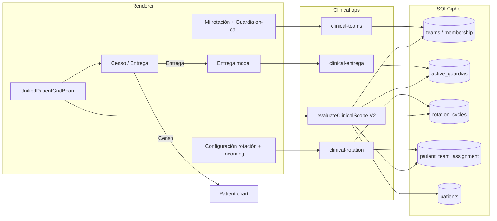

# Clinical Teams, Entrega & Scope V2 Design

**Date:** 2026-05-31  
**Status:** Approved (brainstorming)  
**Component:** V2 clinical operations — self-serve teams, strict scope, Entrega workflows, rotation cycles  
**Application:** r-mas (R+) — local-first Electron, SQLCipher, optional LAN LiveSync  
**Builds on:** [2026-05-31-clinical-access-controls-design.md](./2026-05-31-clinical-access-controls-design.md) (V1 schema + permissive scope + Guardia grid)

## Summary

V2 makes **Modo Guardia** operationally complete: residents self-assign rank, teams, and **Guardia** (on-call); transfer coverage via **Entrega** on the same high-density patient grid; enforce rank/team scope in `evaluateClinicalScope`; support rotation transitions with an Incoming preview strip. One design, **phased implementation PRs**. Interconsult V2 ships **Follow-up pin on R4 only**; Ephemeral_VPO sign-drop is deferred.

## Already shipped (V1 — do not re-litigate)

- SQL: `users`, `teams`, `team_membership`, `active_guardias`; patient `interconsult_type` / `interconsult_status`
- `evaluateClinicalScope` — **permissive** (all registered users read/write); replace in V2 PR 3
- Clinical registration, crypto signing, `db:clinical-access-bootstrap`, `db:guardia-census`
- `UnifiedPatientGridBoard`, Modo Guardia, R4 sector dividers
- Profile **Equipo** — free-text PDF labels only (not `teams`)
- LAN LiveSync **salas** — device sync rooms, not clinical teams

## Product decisions (brainstorming lock)

| Topic | Decision |
|--------|----------|
| Release shape | Single V2 spec; phased PRs; **Entrega required** for Guardia ops |
| Teams / rank / on-call | **Self-assigned**; honor system (last-write + audit) |
| Rotation reset | **Nueva rotación** — any registered user; archives teams/membership, clears `active_guardias`; patients/charts kept |
| Transition | **Incoming** strip: read-only preview; chart locked until `effective_at` |
| Cycle calendar | **Configurable per program** — R4/Admin set `month_end_at` + `preview_days` each cycle |
| Grid UX | Same grid; toggle **Censo \| Entrega** (internal `GUARDIA` \| `HANDOFF`) |
| On-call UI label | **Guardia** (per-team “on call today”) |
| Entrega flows | All: R1↔R1, R2↔R2, R2↔R4, R3+suggestions, generic assign |
| Interconsult V2 | **Follow-up pin** on R4 morning board only; VPO drop later |

### UI naming (Spanish)

- **Entrega** — handoff mode and transfer modal (code enum may remain `HANDOFF`)
- **Guardia** — self-serve “on call today” per team (not the Censo/Entrega toggle)
- **Censo** — grid segment where chip click opens patient chart (internal `GUARDIA`)
- **Modo Guardia** — existing board entry point (unchanged name)

## Recommended architecture

**Bounded modules** (extend existing tree; avoid monolith growth in `clinico-access.mjs`):

| Module | Responsibility |
|--------|----------------|
| `public/js/features/clinical-teams.mjs` | Self-serve team CRUD, membership, Guardia on-call flags |
| `public/js/features/clinical-rotation.mjs` | `rotation_cycles`, program calendar, Incoming strip, Nueva rotación |
| `public/js/features/clinical-entrega.mjs` | Entrega modal, `active_guardias` upsert, eligibility lists |
| `public/js/clinico-access.mjs` | `evaluateClinicalScope` V2 orchestrator |
| `public/js/features/unified-patient-grid-board.mjs` | Mode toggle, chip routing, Incoming row |
| `lib/db/clinical-access-db.mjs` | IPC-backed persistence (extend) |

**No materialized access cache table** for V2 — scope from live joins on open and after team/guardia/rotation mutations. Revisit if census performance requires it.



## Schema extensions (backward-compatible)

### `rotation_cycles`

| Column | Purpose |
|--------|---------|
| `cycle_id` | PK |
| `month_end_at` | Program-defined end of outgoing rotation |
| `preview_days` | Default 2 — days before `effective_at` preview opens |
| `preview_start_at` | Computed: `effective_at - preview_days` |
| `effective_at` | Writable access / full chart (typically 1st 00:00 local) |
| `archived_at` | Set on Nueva rotación |
| `created_by` | User who created cycle row |
| `created_at` | Timestamp |

### `patient_team_assignment`

| Column | Purpose |
|--------|---------|
| `patient_id` | FK patients |
| `team_id` | Incoming/outgoing team |
| `effective_at` | When assignment becomes writable |
| `created_at` | Audit |

### `teams` archive

Add `archived_at` (nullable). Nueva rotación sets `archived_at` on active teams; does not delete rows.

Existing `active_guardias`, `interconsult_*` columns unchanged.

## Rotation & transition behavior

1. **Configuración rotación** (R4 or Admin): set `month_end_at`, `preview_days` → derive `preview_start_at`, `effective_at`.
2. **Pre-effective window** (`preview_start_at ≤ now < effective_at`):
   - Patients bound to future team appear in **Incoming** strip (bed, dx, metadata).
   - **Read-only**; chart locked (`evaluateClinicalScope` → `readable: true`, `writable: false`, `incomingPreview: true`).
3. **`effective_at` reached**: normal scope for team/guardia bindings.
4. **Nueva rotación** (any registered user): confirm → archive teams/membership, clear `active_guardias`, mark cycle archived; residents re-create teams. Incoming assignments for the new cycle are configured separately (handoffs during transition may be inconsistent — expected).
5. Theory: patients **entregados** to incoming team before month turn; app enforces visibility per dates above (honor system for who clicks Nueva rotación).

## Scope rules V2 (`evaluateClinicalScope`)

**Default deny.** Return shape unchanged:

```js
{ readable, writable, reasoning, audit, incomingPreview?: boolean }
```

### Rank matrix

| Rank | Read | Write |
|------|------|--------|
| **Admin** | All patients + ops metadata | All + integrity/audit surfaces |
| **R4** | **Sala** + **Interconsultas** full census; else team/guardia | Same macro domains; bypass team bucket limits for Sala + Interconsultas |
| **R3** | Own teams + Torre HU / Eme / UX where member or covering | Team patients; on-call day match → cross-coverage write per declared `on_call_day_index` |
| **R2** | Sala / Eme / Área A via team + guardia | Team patients; Sala ABCDEF rule; guardia coverage |
| **R1** | `sub_area_fraction` on joined teams + guardia | Same fraction + guardia |

### Sala ABCDEF (R2 deficit)

- Sala teams A–F with `on_call_day_index` (0–6).
- If **no** R2 declared **Guardia** for Sala *X* today → other Sala R2s on **Guardia** that day receive **temporary write** to **entire Sala census** until local midnight or until *X* declares Guardia.
- **Eme** / **Área A**: standard guardia cross-coverage only (no ABCDEF pool).

### Entrega eligibility (modal targets)

| Flow | Targets |
|------|---------|
| R1↔R1 | R1 same team or `sub_area_fraction` |
| R2↔R2 | R2 on same service team; Sala deficit includes other on-call Sala R2s |
| R2↔R4 | Any R4 |
| R3 | Suggest users on teams with `on_call_day_index === today`; user confirms |
| Generic | Any registered user → `covering_user_id` (honor + audit) |

**Censo mode:** writes require scope pass. **Entrega mode:** assignment allowed per rules above; deny with toast + audit entry.

## Interconsult (V2 slice)

- **Follow-up** with status Active/Pending: pinned sector on **R4** morning grid until Resolved/discharged.
- **Ephemeral_VPO**: no sign-to-drop; column values only until a later release.

## UI specification

### Modo Guardia grid

- Segmented control: **Censo | Entrega** (persist preference in `localStorage`).
- **Censo:** chip click → patient chart.
- **Entrega:** chip click → `openEntregaModal(patientId, guardiaId?)` → covering user, optional pendientes / critical / vitals frequency.
- **Incoming** collapsible strip when in preview window.
- **R4:** existing sector dividers + Follow-up pin row.

### Mi rotación (new; not Profile Equipo)

- Create/join `teams` (`service`, `sub_area_fraction`, `on_call_day_index`, name).
- **Guardia:** per-team on-call today (honor; LAN last-write).
- Membership: add/remove by username or LAN peer list.

### Configuración rotación

- R4/Admin: `month_end_at`, `preview_days`.
- **Nueva rotación:** any user, confirm dialog, archive + clear guardias.

## IPC (extend clinical-access)

| Channel | Purpose |
|---------|---------|
| `db:clinical-teams-*` | Teams CRUD, membership, list by service |
| `db:rotation-cycle-*` | Active cycle, program config, archive |
| `db:guardia-*` | Census read + Entrega upsert |
| `db:clinical-access-bootstrap` | Unchanged entry |

## LAN LiveSync

- Replicate `teams`, `team_membership`, `active_guardias`, `rotation_cycles`, `patient_team_assignment` via existing merge/ledger patterns.
- Conflicts: last-write for on-call and team metadata; **never** silent patient delete.
- Nueva rotación: signed event; peers apply archive + guardia clear on merge.
- LiveSync room names unchanged (not clinical teams).

## Implementation phases (one spec)

| PR | Deliverable |
|----|-------------|
| 1 | `rotation_cycles`, program calendar, Incoming strip, chart lock |
| 2 | Self-serve teams, membership, **Guardia** on-call flags |
| 3 | `evaluateClinicalScope` V2 + Sala ABCDEF |
| 4 | **Censo \| Entrega** toggle + modal + all Entrega flows |
| 5 | R4 Follow-up pin |

## Testing

- Scope: R4 macro, R1 fraction, R2 Sala deficit, preview read-only, post-effective write
- Rotation: `preview_start_at` / `effective_at` from program config
- Entrega: eligibility per rank pair; `active_guardias` upsert
- Nueva rotación: archives teams, clears guardias, preserves patients
- Grid: Censo → chart; Entrega → modal

## Out of scope (later)

- Ephemeral_VPO cryptographic sign → remove from morning grid
- Admin integrity dashboard beyond audit log
- Fully automated R3 handoff without user confirm
- Hospital central schedule import

## Error handling

- Scope deny: show `reasoning` string.
- Entrega to user outside team: allowed (generic flow); always audit.
- Nueva rotación with active guardias: confirm resolve/clear.

## Relation to V1 blueprint

V1 document describes schema, crypto, and grid with `HANDOFF` / `openHandoffAssignmentModal` naming. V2 supersedes **scope** and **handoff UX** sections; renames user-facing **Entrega** / **Guardia**; adds rotation and self-serve teams. V1 permissive scope remains until PR 3 ships.

---

*Approved via brainstorming 2026-05-31. Next step: implementation plan (`writing-plans` skill), not code.*
