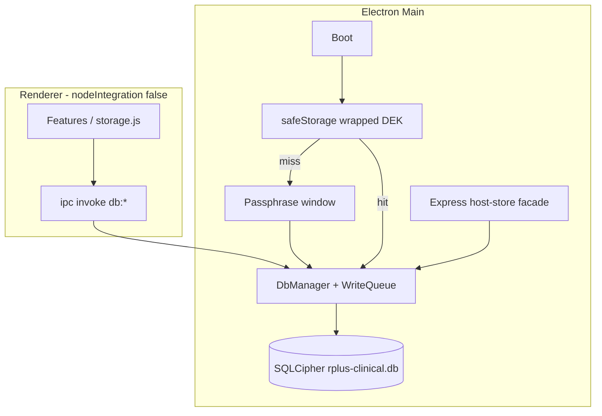

# SQLCipher Clinical Store & Forensic Audit Ledger

> **For implementation:** After this spec is approved in review, use **superpowers:writing-plans** to produce the task-by-task implementation plan. Do not start coding from this document alone.

**Date:** 2026-05-31  
**Status:** Implemented. Plan: [`docs/superpowers/plans/2026-05-31-sqlcipher-forensic-audit.md`](../plans/2026-05-31-sqlcipher-forensic-audit.md). Ops: [`docs/db-encryption.md`](../../db-encryption.md).  
**Related:**
- `docs/superpowers/specs/2026-05-30-r-plus-security-architecture-remediation-design.md` (program context; Phase 3b persistence)
- `docs/superpowers/specs/2026-05-30-lan-host-concurrency-design.md` (WriteQueue; host-store facade)
- `docs/superpowers/specs/2026-05-30-lan-security-hardening-design.md` (audit events for `lan.ticket.*`, `lan.token.rotate`)

---

## 1. Problem statement

R+ persists high-stakes clinical data in the renderer via `localStorage` (`public/js/storage.js`) and LAN host state in plaintext JSON (`lan-squad-host-state.json`). Audit trails are capped, mutable, and not tamper-evident (`rpc-audit-log`, in-memory LAN `audit_log` arrays).

Hospital workstations are shared; PHI on disk must be encrypted. Forensic review requires an append-only, hash-chained ledger for state and security events—not per-chart read tracking in v1.

---

## 2. Goals (success criteria)

- [ ] Single encrypted SQLite database in Electron **main process** holds desktop clinical blobs **and** LAN host authoritative state.
- [ ] Unlock via user passphrase (Argon2id); optional **Recordar en este dispositivo** via `safeStorage` (wrapped DEK, not raw passphrase).
- [ ] Lock closes DB handle, zeros key material, rejects LAN host writes with `DB_LOCKED`.
- [ ] One-shot migration from `localStorage` clinical keys + host JSON inside a single transaction; legacy files renamed to `.migrated.backup`.
- [ ] Append-only `forensic_audit_chain` with SHA-256 block linking (Option C scope: clinical + LAN + security events).
- [ ] Settings backup: **JSON export** (plaintext, unlocked session only, with warning) **and** encrypted **`.db`** copy (`VACUUM INTO`).
- [ ] Native SQLCipher module fails fast on ABI mismatch—no silent fallback to JSON/plaintext.
- [ ] Renderer `storage.js` public API preserved; internals use async IPC.

## 3. Non-goals (v1)

- Third-normal-form normalization (patients/labs/HC as separate tables)—deferred to v2.
- Hash-chaining chart open/read/access (Option D)—optional non-chained `access_log` later.
- RBAC, cloud sync, scheduled institutional backup.
- Moving UI prefs/tour/LAN client id into the encrypted DB.
- Replacing Phase 2 LAN hardening or Phase 3 JSON WriteQueue before this lands (orthogonal; repository swap).

---

## 4. Scope locks (brainstorming decisions)

| Topic | Decision |
|-------|----------|
| Encrypted store | Desktop clinical payloads + `lan_host_state` (unified DB) |
| UI / non-PHI | Remain in `localStorage` (`theme`, tour, `rpc-settings`, `rpc-lan-client-id`, etc.) |
| Key model | Passphrase → Argon2id (`m=65536, t=3, p=4`) → SQLCipher 256-bit key; remember-me = `safeStorage.encryptString(DEK)` |
| Audit scope | Clinical + LAN/host mutations + security checkpoints (unlock/lock/fail, pairing, token rotation, output dir)—not routine read/access |
| Schema strategy | **Blob-first** (`clinical_blob`, `lan_host_state.json` column); normalize later |
| Backups | Option **C**: JSON + encrypted `.db` in Settings |
| Approach | Unified DB (not dual-DB; not long-term JSON shadow) |

---

## 5. Runtime architecture



### 5.1 Unlock / lock lifecycle

1. **Cold start:** `db:status` → if wrapped DEK in `app_meta` + `safeStorage` decrypt OK → open DB; else show passphrase UI.
2. **First run:** user creates passphrase → derive key → run migrations → optional remember-me.
3. **Lock:** close SQLCipher, zero derived key buffer, `auth.lock` audit, host-store returns `DB_LOCKED` for mutations.
4. **Passphrase change:** `PRAGMA rekey` + re-wrap DEK if remember-me enabled.

### 5.2 Native stack

- SQLite 3 + SQLCipher via Electron-compatible native binding (implementation plan pins package; rebuild for Electron 41 on macOS arm64/x64 and Windows).
- **ABI mismatch:** modal dialog + `app.quit()`; no plaintext fallback.

### 5.3 Orthogonality

Phase 3 JSON `WriteQueue` and in-memory host cache remain; persistence backend changes from atomic JSON files to SQLite transactions.

---

## 6. Schema (v1)

**File:** `{userData}/rplus-clinical.db`  
**Pragmas:** `WAL`, `foreign_keys=ON`, single writer on main thread queue.

```sql
CREATE TABLE app_meta (
  key   TEXT PRIMARY KEY,
  value TEXT NOT NULL
);
-- Keys: schema_version, created_at, migration_source, kdf_salt, kdf_params_json, wrapped_dek (optional)

CREATE TABLE clinical_blob (
  namespace  TEXT NOT NULL DEFAULT 'desktop',
  blob_key   TEXT NOT NULL,
  json       TEXT NOT NULL,
  updated_at TEXT NOT NULL,
  PRIMARY KEY (namespace, blob_key)
);

CREATE TABLE lan_host_state (
  id              INTEGER PRIMARY KEY CHECK (id = 1),
  version         INTEGER NOT NULL,
  team_code_hash  TEXT NOT NULL,
  json            TEXT NOT NULL,
  updated_at      TEXT NOT NULL
);

CREATE TABLE forensic_audit_chain (
  id            INTEGER PRIMARY KEY AUTOINCREMENT,
  timestamp     TEXT NOT NULL,
  client_id     TEXT NOT NULL,
  event_type    TEXT NOT NULL,
  payload_hash  TEXT NOT NULL,
  previous_hash TEXT NOT NULL,
  current_hash  TEXT NOT NULL
);

CREATE INDEX idx_audit_ts ON forensic_audit_chain(timestamp);
CREATE INDEX idx_audit_type ON forensic_audit_chain(event_type);
```

### 6.1 `clinical_blob.blob_key` (v1 import set)

Mirrors `storage.saveAll` and related clinical keys:

`patients`, `notes`, `indicaciones`, `labHistory`, `medRecetaByPatient`, `listadoProblemas`, `recetaHuByPatient`, `vpoByPatient`, `medPharmProfileByPatient`, plus keys used outside `saveAll` if present at migration: `medCatalog`, `todos`, `scheduled-procedures`, `lan-room-snapshots`, `lan-host-patient-map` (final list verified during import inventory).

### 6.2 Remain in `localStorage`

`theme`, font zoom, tour flags, `rpc-settings` (non-PHI prefs), `rpc-lan-client-id`, LAN UI hints, disconnect banner prefs, guided tour keys.

---

## 7. Forensic hash chain

### 7.1 Payload hash

1. Build metadata object (no raw clinical narrative): `action`, `entityType`, `entityId`, `patientId`, `changedKeys`, `result`, `byteLength`, etc.
2. Canonical JSON (sorted keys, recursive).
3. `payload_hash = SHA256(UTF8(canonical))` as lowercase hex.

### 7.2 Block hash

```
current_hash = SHA256(
  id + "|" + timestamp + "|" + client_id + "|" + event_type + "|" + payload_hash + "|" + previous_hash
)
```

- **Genesis:** `id = 1`, `previous_hash =` 64× `'0'`.
- **Storage:** lowercase hex, 64 chars.

### 7.3 Atomic append (required sequence)

Within one SQLite transaction on the WriteQueue:

1. `BEGIN`
2. `UPDATE`/`UPSERT` data (`clinical_blob` and/or `lan_host_state`)
3. Compute `payload_hash`
4. Read `current_hash` from row `id = MAX(id)` (or genesis if empty)
5. `INSERT` new `forensic_audit_chain` row
6. `COMMIT`

Crash or error → `ROLLBACK` (no un-audited commits, no orphan audit rows).

### 7.4 Event catalog (v1)

| Category | Examples |
|----------|----------|
| Auth | `auth.unlock.success`, `auth.unlock.fail`, `auth.lock`, `auth.remember_enabled`, `auth.passphrase_change` |
| Clinical desktop | `clinical.patients.save`, `clinical.notes.save`, `clinical.labs.save`, `clinical.med_pharm.save`, `clinical.backup.import`, `clinical.backup.export` |
| LAN host | `lan.host.commit`, `lan.patient.put`, `lan.entity.put`, `lan.conflict.resolve`, `lan.historia.put` |
| LAN security | `lan.token.rotate`, `lan.ticket.mint`, `lan.ticket.exchange`, `lan.auth.fail` |
| System | `system.migration.complete`, `system.output_dir.register` |

### 7.5 Verification

- **Quick (startup):** validate last block links to predecessor.
- **Full:** Settings → walk chain by `id`; report `brokenAtId` on mismatch.
- **Export:** chained JSON for compliance review.

### 7.6 UI bitácora

Deprecate `rpc-audit-log` for new events; surface user-facing subset from `forensic_audit_chain` (filter by `event_type` prefix) or dual-read one release.

---

## 8. IPC contract

Channels (renderer → main). DB must be unlocked except `db:status` / unlock flow.

| Channel | Purpose |
|---------|---------|
| `db:status` | Lock state, schema version, migration pending |
| `db:unlock` | `{ passphrase, remember }` |
| `db:lock` | Drop handle, quarantine host writes |
| `db:change-passphrase` | `{ current, next, remember }` |
| `db:clinical-get-blob` | Single blob read |
| `db:clinical-set-blob` | Single blob write + audit |
| `db:clinical-save-all` | Batch upsert (replaces multi localStorage set) + one audit |
| `db:clinical-load-all` | Boot hydration (avoid IPC storm) |
| `db:audit-verify` | `{ mode: 'full' \| 'quick' }` |
| `db:audit-export` | Export ledger |
| `db:backup-export-json` | Legacy-compatible decrypted bundle + PHI warning |
| `db:backup-export-db` | `VACUUM INTO` encrypted copy |
| `db:backup-import-json` | Import + audit |

**Rules:** No SQL or key material over IPC; JSON strings and audit metadata only.

**Renderer:** `storage.js` stays the facade; boot loads all blobs once into existing app-state cache; writes async.

---

## 9. Migration

### 9.1 Detection

- `{userData}/lan-squad-host-state.json` exists, **or**
- Renderer reports clinical `rpc-*` keys via pre-unlock probe.

### 9.2 Sequence

```
BEGIN
  UPSERT clinical_blob rows from localStorage export
  UPSERT lan_host_state from host JSON
  INSERT forensic_audit_chain genesis + system.migration.complete
COMMIT
  Rename lan-squad-host-state.json → .migrated.backup
  Write clinical-localStorage-export.migrated.backup.json
  Strip migrated rpc-* keys from renderer (keep UI keys)
```

### 9.3 Failure

`ROLLBACK`; if first empty DB, remove partial file; show error; legacy files untouched.

### 9.4 LAN team code hash

Unchanged: mismatch with `lan-team-code.txt` refuses load and does **not** wipe patients (Phase 2 behavior).

---

## 10. Failure modes

| Scenario | Behavior |
|----------|----------|
| ABI / native load failure | Dialog + quit; no JSON fallback |
| Wrong passphrase | `auth.unlock.fail` (rate-limited) |
| Corrupt DB / broken chain | Block or warn; verify UI shows break index |
| Forgot passphrase | No recovery except backups (JSON or `.db` + passphrase) |
| `safeStorage` unavailable | Remember-me disabled; passphrase each launch |
| Host locked | LAN mutations `DB_LOCKED` |

---

## 11. Main-process modules (new)

| Module | Role |
|--------|------|
| `lib/db/db-manager.mjs` | Unlock/lock, queue, `withTransaction` |
| `lib/db/schema.mjs` | DDL + migrations |
| `lib/db/migrate-from-legacy.mjs` | One-shot import |
| `lib/db/forensic-audit.mjs` | Canonical hash + append + verify |
| `lib/db/clinical-blobs.mjs` | Blob CRUD |
| `lib/db/lan-host-persistence.mjs` | Host row load/save |
| `lib/db/crypto.mjs` | Argon2id, safeStorage, rekey |

**Refactor:** `lan-squad/host-store.js` uses `lan-host-persistence` inside existing cache + WriteQueue; router/conflict-resolver APIs unchanged.

---

## 12. Testing

| Area | Coverage |
|------|----------|
| `forensic-audit` | Genesis, append, tamper detect, canonical JSON |
| `migrate-from-legacy` | Fixture import row counts |
| `db-manager` | Rollback leaves no audit on forced error |
| `host-store` | Suite on temp DB instead of temp JSON |
| CI | Rebuild native module; smoke tests mac + win |

**Manual QA:** first passphrase, remember-me, lock + iPad reject, migration, JSON round-trip, chain verify, export warnings.

---

## 13. Phasing

| Workstream | Order |
|------------|-------|
| Phase 2 LAN security | Ship first; wire security audit types when DB lands |
| Phase 3 JSON WriteQueue | Stable before DB swap |
| **This spec (3b)** | New branch; repository replacement behind host-store + `storage.js` |

---

## 14. Spec self-review (2026-05-31)

| Check | Result |
|-------|--------|
| Placeholders / TBD | None |
| Internal consistency | Blob-first + WriteQueue + single transaction append aligned |
| Scope | Single implementation plan; normalization explicitly v2 |
| Ambiguity | `blob_key` final list flagged for import inventory step in plan |
| Contradictions with LAN security spec | None; event types complementary |

---

## 15. Resolved decisions log

| Question | Answer |
|----------|--------|
| Store scope | B — clinical + LAN host in one DB |
| Key model | B — passphrase + optional remember-me |
| Audit scope | C — state + security, not reads |
| Schema | Blob-first v1 |
| Backups | C — JSON + `.db` |
| Architecture | Unified DB, main process only |
