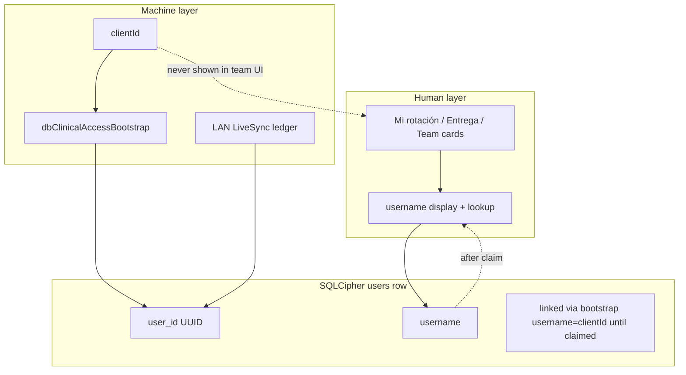

# Clinical Identity, Guardia UX & Team Onboarding Design

**Date:** 2026-06-01  
**Status:** Approved (brainstorming)  
**Component:** Human identity (LAN username), Modo Guardia shell clarity, Mi rotación wizard + sala team directory  
**Application:** R+ (r-mas) — local-first Electron, SQLCipher, optional LAN LiveSync  
**Builds on:** [2026-05-31-clinical-teams-handoff-v2-design.md](./2026-05-31-clinical-teams-handoff-v2-design.md)

## Summary

Residents get a **chosen LAN username** for all human-facing flows; **`clientId` stays the machine identity** for bootstrap, crypto, and sync. **Mi rotación** becomes a **wizard then steady-state panel**: claim username → create or join a team → browse **all teams in your Sala** with visible members. **Modo Guardia** controls are renamed/disambiguated; **Configuración rotación** is disabled (not toast-only) for non–R4/Admin. Rank and profile changes persist to SQLCipher, not only `localStorage`.

## Product decisions (locked)

| Topic | Decision |
|--------|----------|
| Human id | **Username** — stable handle (e.g. `mgarcia`), lowercase `^[a-z][a-z0-9_]{2,31}$`, unique per local DB |
| Machine id | **`clientId`** unchanged — bootstrap, IPC pairing, LiveSync device identity |
| Team add (human) | Resolve by **username** only; never ask user for `clientId` |
| Team add (machine) | `user_id` UUID in DB and sync payloads |
| Username edits | **Editable anytime** with confirm (“Los equipos verán el nuevo usuario”) |
| Sala directory | Everyone sees **only their assigned Sala**; change Sala in perfil to switch directory |
| R4/Admin sala switcher | **No** (option A) — no cross-sala browse in v1 |
| Onboarding order | **Username first** → **create or join team** → steady-state Mi rotación |
| Join primary UX | **Unirme** on sala team card; “Invitar por usuario” secondary |
| Config rotación | R4/Admin only; button **disabled + tooltip** for others |

## Identity architecture

### Bootstrap & claim

1. First open: `ensureClinicalUser` creates/finds row with `username = clientId` (legacy).
2. **Paso 1** wizard: resident sets real `username`; DB uniqueness check; update `users.username`.
3. Subsequent bootstrap: find user by `clientId` mapping (existing row); display uses claimed `username`.
4. **Migration:** If `username` still equals `clientId` (or matches legacy `lc_*` pattern), block team actions and show **“Elige tu usuario LAN”** until claimed.

### Profile persistence

| Field | Storage | Notes |
|-------|---------|--------|
| `username` | `users.username` | Human handle; IPC `db:clinical-username-claim` or profile upsert |
| `clinical_name` | `users.clinical_name` | Display name (“Dr. Pérez”) |
| `rank` | `users.rank` | Source of truth in DB; `rpc-settings.clinicalRank` cache only |
| `sala` | `users.sala` | Gates team directory filter |

**Cambiar rango / editar perfil:** call `dbClinicalProfileUpsert` (extend if needed for username change), refresh `clinicalSessionContext`, re-fetch scope + teams. **No `prompt()`** — inline form in Mi rotación.

### Display rules

- Lists: **`username`** primary; `clinical_name` secondary if present (`mgarcia · Dr. Pérez`).
- **Never show `clientId`** in Mi rotación, team directory, Entrega modal, or toasts.
- Debug/advanced surfacing of `clientId`: out of scope (default off).

## Onboarding wizard (replaces fragmented registration)

### Paso 1 — Tu usuario (required)

Merged with **Registro de guardia**:

| Field | Required | Validation |
|-------|----------|------------|
| Usuario LAN | Yes | Format + unique |
| Nombre en guardia | Yes | Non-empty |
| Rango | Yes | R1–R4, Admin |
| Sala | Yes | Sala 1 / Sala 2 / Sala E (or program list) |

- Save: `dbClinicalProfileUpsert` + username claim API.
- URL prefill: support `?user=` in addition to existing `name`, `rank`, `sala`.
- `clinicalRegistered = true` in settings after success.

### Paso 2 — Tu equipo (required when rank requires team)

Segmented choice:

**Crear equipo**

- Fields: nombre del equipo (líder), servicio, posición en ciclo, sala (default = profile sala).
- `dbClinicalTeamsCreate` + auto `dbClinicalTeamsMemberAdd({ userId })`.
- Enforce existing rules: max 4 teams/sala, R2 one team, R1 one team per sala, max 2 R1s/team.

**Unirme a un equipo**

- Load **`db:clinical-teams-list-by-sala`** with `sala = user.sala`.
- Render directory cards (see below).
- **Unirme** → `db:clinical-teams-join` (`teamId`, `userId`).
- Show server validation errors inline (not generic toast only).

**Skip policy:** Ranks that do not require team membership (if any, e.g. Admin-only ops) may skip Paso 2 — define in implementation from `validateSalaTeamMembership` matrix; default **require team for R1/R2/R3**, optional for R4/Admin.

### Steady-state Mi rotación

After wizard complete, same modal/panel shows:

1. **Mi perfil** — username, nombre, rango, sala; **Guardar** / edit handle with confirm.
2. **Equipos en Sala {X}** — directory (X = `user.sala`).
3. **Mis equipos** — highlighted subset where user is member.
4. **Guardia hoy** — per-team checkbox (unchanged semantics).
5. **Crear equipo** — only if rules allow.
6. **Invitar por usuario** — secondary; username lookup for peers who completed Paso 1 on this DB.

## Sala team directory (option A)

### Visibility

- Query: active teams where `teams.sala = users.sala` and `archived_at IS NULL`.
- User **cannot** browse other salas unless they **change Sala** in perfil (then directory reloads).
- No R4 global switcher in v1.

### Team card (directory)

Each card shows:

- Team name (líder), servicio, ciclo (`sub_area_fraction`), día en ciclo.
- **Members:** `username (rank)` for each `team_membership` row.
- **Slots:** e.g. `R1: 1/2` when relevant.
- **Guardia hoy:** who declared (username).
- Actions:
  - **Unirme** — if eligible and not already member.
  - (Member) **Guardia** checkbox on own teams only.

### Join eligibility (server-side)

Reuse `validateSalaTeamMembership`:

- R1: at most one team per sala.
- R2: at most one team total (leader).
- Team: max 2 R1s; max 4 teams per sala.
- Return structured errors for UI.

### Demoted: primary “Agregar” flow

- Keep **Invitar por usuario** on teams you lead or for post-wizard invites.
- Not the main path for self-joining.

## Modo Guardia & rotation toolbar (§2)

| Current UI label | New label | State |
|------------------|-----------|--------|
| Header “Modo Guardia” | **Vista guardia** | `uiDensity === 'guardia'` |
| Board toggle | **Solo mis entregas** / **Censo completo** | `clinicalSessionContext.guardiaMode` |
| Team checkbox | **Guardia hoy** | `team_guardia_today` |
| Censo \| Entrega | unchanged | `guardia.gridMode` |

**LAN hub** checkbox stays synced with board filter via `guardia-mode-sync.mjs` (not layout).

**Configuración rotación:**

- `openRotationConfigModal` only for R4/Admin.
- Others: `disabled` + `title` / tooltip: “Solo R4 o Admin pueden configurar la rotación.”

## Entrega & Censo (unchanged behavior)

- **Entrega** mode: chip → entrega modal; targets resolved by rank rules; dropdown labels use **username (rank)**.
- **Censo** mode: chip → chart.
- Scope V2 and `active_guardias` logic per V2 spec — no regression.

## IPC additions

| Channel | Payload | Returns |
|---------|---------|---------|
| `db:clinical-username-claim` | `{ userId, username }` | `{ ok, error? }` — uniqueness |
| `db:clinical-teams-list-by-sala` | `{ sala }` | `{ teams: [{ team, members, guardia_today, joinEligible, joinReason? }] }` |
| `db:clinical-teams-join` | `{ teamId, userId }` | `{ ok, error? }` |
| `db:clinical-profile-upsert` | extend | allow `username` update with uniqueness |

Existing: `db:clinical-teams-create`, `member-add` (by username), `guardia-set`, rotation cycle APIs.

## LAN sync

- Replicate `users.username`, `teams`, `team_membership`, `team_guardia_today` as today.
- **Conflict:** if username changed on two devices, last-write-wins on `users` row; show toast on merge if handle changed.
- **Do not** sync display of `clientId` to peers.
- Team join events: existing membership merge patterns.

## UI / visual direction (Mi rotación overhaul)

- Wizard steps with progress indicator (1 → 2).
- Card-based sala directory; clear “Mis equipos” vs “Otros equipos en tu sala”.
- Remove wall of muted legal text at top; one short lead line.
- Replace `prompt()` rank change with select + Guardar.
- Legacy claim banner: prominent, non-dismissible until username ≠ clientId.

## Out of scope

- Cross-sala directory (option B/C deferred).
- Host-assigned usernames.
- Renaming other users’ handles.
- Global username uniqueness across hospitals.
- Ephemeral VPO / interconsult V2 beyond existing Follow-up pin.

## Testing focus

- Username claim: unique violation, format, legacy `lc_*` migration banner.
- Join: R1 double-sala, R2 second team, full team, successful join by directory.
- Profile: rank change updates `evaluateClinicalScope` and Entrega targets.
- Config rotación button disabled for R1.
- Header vs board toggle labels do not share state incorrectly.
- `clientId` bootstrap still works when `username` already claimed.

## Implementation phases (suggested PRs)

| PR | Deliverable |
|----|-------------|
| 1 | Username claim API + Paso 1 wizard + migration banner + DB persist rank/profile |
| 2 | `list-by-sala` + join IPC + Paso 2 directory + Unirme UX |
| 3 | Mi rotación steady-state layout + demote Agregar + invite secondary |
| 4 | Modo Guardia rename + config button disabled + remove `prompt()` |
| 5 | Tests + LAN merge spot-check |

## Relation to V2 spec

This design **does not replace** [clinical-teams-handoff-v2](./2026-05-31-clinical-teams-handoff-v2-design.md); it **fixes UX and identity gaps** left after V2 backend work: human handles, onboarding order, sala directory join, and Modo Guardia naming collision.
