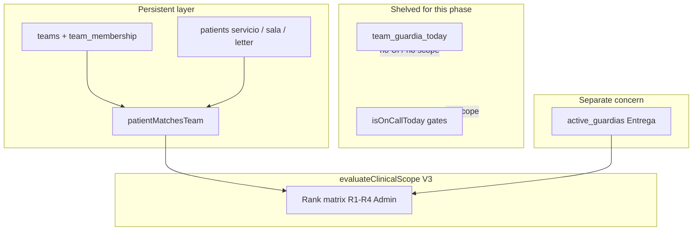

# LAN Teams Decoupled from On-Call Design

**Date:** 2026-06-01  
**Status:** Approved (brainstorming)  
**Component:** Clinical teams as persistent squads — creation, structural patient filtering, R4/Admin global view  
**Application:** R+ (r-mas) — local-first Electron, SQLCipher, optional LAN LiveSync  
**Supersedes in part:** [2026-06-01-clinical-identity-guardia-teams-ux-design.md](./2026-06-01-clinical-identity-guardia-teams-ux-design.md) (Guardia hoy on teams, R4 browse gated on program admin only)  
**Amends:** [2026-05-31-clinical-teams-handoff-v2-design.md](./2026-05-31-clinical-teams-handoff-v2-design.md) (scope must not require on-call day for team access in this phase)

## Summary

Clinical **teams** (`teams`, `team_membership`) are **persistent operational units**, independent of **on-call shift** declarations. Teams are defined by sala, service, and cycle position (`sub_area_fraction`); patients associate via **structural match** (`patientMatchesTeam`). The mistaken fusion of team UX with per-team **“Guardia hoy”** (`team_guardia_today`, `isOnCallToday` gates) is **shelved** for this overhaul.

**In scope:** team creation/join, Mi rotación and LAN hub surfaces, scope-aware patient sidebar, **global view** for **R4** and **Admin** (all patients read/write, cross-sala team directory).

**Shelved (UI + scope gates, DB rows may remain):** per-team Guardia hoy checkbox, using `isOnCallToday` or `team_guardia_today` to grant chart access.

**Kept separate:** **Entrega** / `active_guardias` for R2→R2 handoffs (not the same as shelved team on-call).

## Product decisions (locked)

| Topic | Decision |
|--------|----------|
| Team ↔ patient | **Structural match** — `patientMatchesTeam(patient, team)`; no on-call required |
| On-call shift (team) | **Shelved** — no Guardia hoy UI; no scope gates from `team_guardia_today` or `isOnCallToday` |
| R4 / Admin | **Global** — all salas teams + full program census; read/write all patients |
| R1 | Read + write **all patients in assigned sala** (any team in that sala) |
| R2 | **Own team (structural) + R2 handoffs** via `active_guardias` (any sala) |
| R3 | **Joined team structural** + **Torre HU / Eme / UX** teams (member + match); **no on-call gate** |
| Entrega | **Unchanged** in this overhaul — handoffs still use `active_guardias` |
| Modo Guardia board | **Out of scope** for this pass unless scope conflicts force alignment later |
| Elevated browse | **Rank R4 or Admin** (plus `is_program_admin`), not program-admin checkbox alone |

## Problem statement

Prior specs and implementation treated **having a team** and **being on call today** as one workflow: Mi rotación pushed “declara Guardia hoy,” scope used calendar letter matching (`isOnCallToday`), and R4 global directory required `is_program_admin` instead of rank **R4**. Teams must exist and function **without** any on-call declaration.

## Architecture



### Modules

| Module | Responsibility |
|--------|----------------|
| `public/js/clinical-privileges.mjs` | Add `hasElevatedTeamPrivileges` (R4, Admin, program admin) |
| `public/js/clinico-access.mjs` | `evaluateClinicalScope` V3 rank matrix; keep `patientMatchesTeam`, handoff helpers |
| `public/js/features/clinical-teams.mjs` | Mi rotación — teams only; remove Guardia hoy UI |
| `public/js/features/patients.mjs` | Scope-aware sidebar + elevated filters |
| `public/js/features/lan-sync.mjs` | LAN hub R4 — global teams/census, not guardia counts |
| `lib/db/clinical-access-db.mjs` | Stop UI-driven writes to `team_guardia_today` (IPC may remain dormant) |

## Access matrix (normal mode)

Evaluated in `evaluateClinicalScope` after admin/R4 bypass, incoming preview, and active-guardia coverage.

| Rank | Read | Write |
|------|------|--------|
| **Admin / `is_program_admin`** | All patients | All patients |
| **R4** | All patients | All patients |
| **R1** | Patients in **user.sala** | Same |
| **R2** | Structural match on **any joined team** OR **handoff** (`patientCoveredByGuardia`) | Same |
| **R3** | Structural match on joined team OR team on **Torre HU / Eme / UX** with structural match | Same |
| **Default** | Deny | Deny |

### R1 sala matching

Use `patient.sala` when set; otherwise infer sala from patient `servicio` / sub-area consistent with existing sala letter helpers (`extractSalaLetter`, service normalization). Patient must resolve to the same sala string as `user.sala` (e.g. `"Sala 1"`).

### R3 extended services

Reuse `R3_EXTENDED_SERVICES` (`torre hu`, `eme`, `ux`): user must be a **member** of a team whose normalized service is in that set, and `patientMatchesTeam(patient, team)` must be true.

### Shelved scope rules (do not apply in V3)

- `isOnCallToday(team, rank, now)` for read/write  
- `team_guardia_today` / `hasSalaGuardiaDeclaredForLetter` / `canR2SalaAbcdefDeficitWrite`  
- Requiring declared Guardia hoy to create, join, or list teams  

### Handoffs (R2)

`active_guardias` with `covering_user_id === current user` grants read/write regardless of sala. R2 also receives access to patients structurally matched to any **joined** team.

## UI — Mi rotación

| Element | Behavior |
|---------|----------|
| Lead | “Administra tus equipos y membresía en la sala.” |
| Joined cards | Name, members (username + rank), service, cycle letter, sala — **no** Guardia checkbox |
| Directory | Cards without `guardia_today`; **Unirme** / invite unchanged |
| Browse salas | `hasElevatedTeamPrivileges` → per-sala + **Todas las salas** |
| Create team | Unchanged form; cycle letter = team position only |
| Removed | `handleGuardiaCheck`, `.clinical-teams-guardia-check`, guardia labels on cards |

Onboarding Paso 2: create/join team only — no declare-guardia step.

## UI — Patient sidebar

When `clinicalSessionContext.user` is set, `patientsVisibleInSidebar()` filters by scope **readable** (or equivalent predicate shared with `evaluateClinicalScope`).

| Rank | Sidebar set |
|------|-------------|
| R4 / Admin / program admin | All patients |
| R1 | All in assigned sala |
| R2 | Joined-team structural ∪ handoff patients |
| R3 | Joined-team structural ∪ extended-service structural |

**Elevated toolbar** (only `hasElevatedTeamPrivileges`): filters on top of full list — **Sala**, **Equipo** (from teams in context), optional **Servicio** — client-side, does not widen R1–R3 scope.

Optional patient card meta: sala / team letter for census scanning.

## UI — LAN hub (R4 / Admin)

Replace guardia-count-only “Vista censo” with:

1. **Equipos** — sala switcher + “Crear equipos” → `openClinicalTeamsPanel()`  
2. **Censo global** — per-sala team/patient counts + action to apply sidebar filters  
3. Retain host/mobile/rotation actions already on hub  

R1/R2 sections: keep join-team flow; remove copy implying guardia declaration is required for teams.

## Privileges helper

```javascript
// clinical-privileges.mjs (renderer + lib mirror)
function hasElevatedTeamPrivileges(user) {
  if (!user) return false;
  if (hasProgramAdminPrivileges(user)) return true;
  return effectiveClinicalRank(user) === 'R4';
}
```

Use for: `resolveBrowseSala`, directory `allSalas`, sidebar filter toolbar, LAN hub elevated blocks.

`canConfigureRotation` unchanged (R4 + program admin).

## Data & IPC

- **No schema migration** for v1.  
- **`team_guardia_today`:** no UI writes; merge on LAN sync may continue but consumers ignore for scope/UI.  
- **`db:clinical-teams-guardia-set`:** dormant; do not call from Mi rotación.  
- **`db:clinical-teams-list-by-sala`:** may omit or ignore `guardia_today` in responses.  
- **`db:clinical-teams-list-by-sala` with `allSalas: true`:** for elevated users (existing IPC; wire to R4 rank).

## LAN sync

- Continue replicating `users`, `teams`, `team_membership`.  
- `team_guardia_today` in payload: last-write merge OK; **ignored** for product behavior until feature returns behind a flag.  
- Re-enabling team on-call = product flag + scope/UI PR, not a migration.

## Out of scope

- Modo Guardia density / board toggle behavior alignment  
- Cross-hospital username uniqueness  
- Removing `active_guardias` or Entrega flows  
- Automated R3 handoff without user confirm  
- Ephemeral VPO / interconsult V2 beyond existing follow-up pin  

## Testing

| Area | Cases |
|------|--------|
| Scope V3 | R1 sala write on other team’s patient in same sala; R2 handoff cross-sala; R2 team structural; R3 extended service; R4/Admin all; deny without rule |
| Shelved | Assert scope tests do not call `isOnCallToday` for access |
| Mi rotación | DOM has no `.clinical-teams-guardia-check` |
| Elevated | R4 has browse `__all__` without `is_program_admin` |
| Sidebar | R1 count = sala patients; R2 sees handoff id |
| Regression | Entrega creates `active_guardias`; recipient opens chart |

## Implementation phases (PRs)

| PR | Deliverable |
|----|-------------|
| 1 | `hasElevatedTeamPrivileges` + `evaluateClinicalScope` V3 + unit tests |
| 2 | Mi rotación decouple (UI, remove guardia-set calls) |
| 3 | `patientsVisibleInSidebar` scope filter + elevated toolbar |
| 4 | LAN hub R4 global teams/census |
| 5 | Manual QA checklist + doc cross-links |

## Relation to other specs

- **Identity / username** ([2026-06-01-clinical-identity-guardia-teams-ux-design.md](./2026-06-01-clinical-identity-guardia-teams-ux-design.md)): username, directory join, and wizard remain; **remove** steady-state Guardia hoy and use **R4 rank** for global browse.  
- **Handoff V2** ([2026-05-31-clinical-teams-handoff-v2-design.md](./2026-05-31-clinical-teams-handoff-v2-design.md)): Entrega and `active_guardias` remain; on-call-day requirements for R3/R2 sala deficit **deferred** with shelved team on-call.
