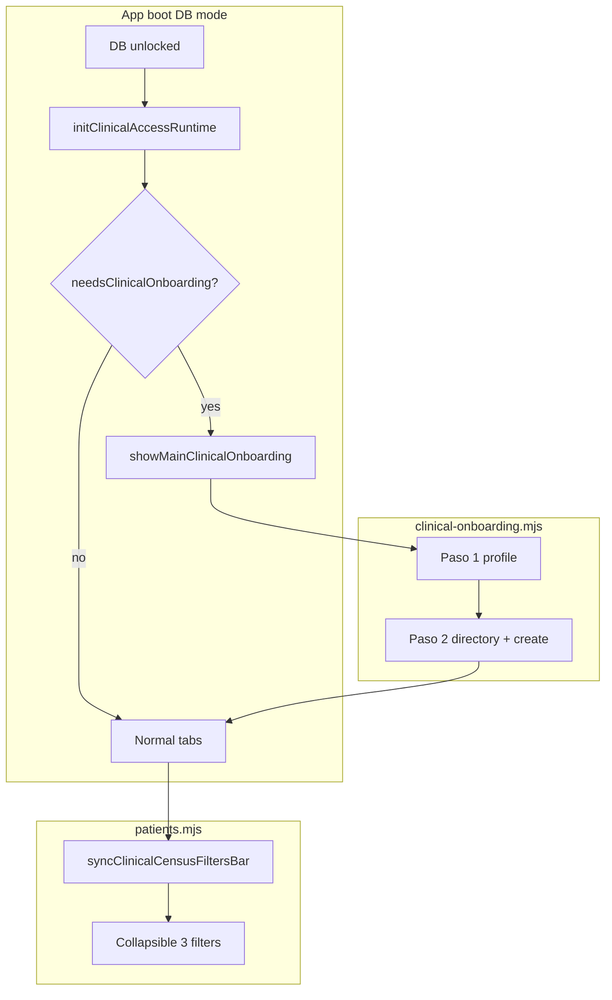

# Clinical Onboarding on Main Screen + Collapsible Census Filters

**Date:** 2026-06-02  
**Status:** Approved (brainstorming)  
**Component:** Clinical identity onboarding shell, elevated sidebar census filters  
**Application:** R+ (r-mas) — Electron renderer, SQLCipher clinical DB  
**Builds on:** [2026-06-01-clinical-identity-guardia-teams-ux-design.md](./2026-06-01-clinical-identity-guardia-teams-ux-design.md), [2026-06-01-lan-teams-decoupled-design.md](./2026-06-01-lan-teams-decoupled-design.md)

## Summary

Residents complete **clinical onboarding** (usuario LAN → buscar equipos → unirse o crear) on the **main work surface** after DB unlock, not inside the Guardia tab or the Mi rotación modal. The legacy **Registro de guardia** modal is folded into the same wizard. For **R4 / Admin / program admin**, the **Sala / Equipo / Servicio** filter block in the patient sidebar is **collapsible**; profile, search, and patient list stay visible.

## Product decisions (locked)

| Topic | Decision |
|--------|----------|
| Onboarding shell | **Variant A** — inline, blocking panel in `#main-area` (default Lab tab visible behind dimmed chrome if needed) |
| Onboarding trigger | Auto after `initClinicalAccessRuntime` when `needsClinicalOnboarding()`; optional entry from header / Mi rotación |
| Registration modal | **Removed as separate gate** — Paso 1 replaces `clinical-registration-backdrop` first-run flow |
| Team step location | Paso 2 (directory + crear equipo) on main panel, **not** only via Guardia → Mi rotación |
| Mi rotación after onboarding | Steady-state management (perfil, directorio, invitar); opens in existing modal; if onboarding incomplete, scroll/focus main panel instead of duplicating wizard in modal |
| Collapsible scope | **Only** `#clinical-census-filters` (3 controls), not whole `patient-sidebar` |
| Collapsible audience | `hasElevatedTeamPrivileges(user)` only — **R4, Admin, program admin**; R1/R2/R3 never see the filter block |
| Filter visibility | Same gate as collapse: `syncClinicalCensusFiltersBar()` removes `#clinical-census-filters` when `!hasElevatedTeamPrivileges` |
| Collapsed state persistence | `localStorage` key `rpc.clinicalCensusFiltersCollapsed` (`'1'` = collapsed) |
| Default collapsed | **Expanded** on first use |

## Problem

1. **Onboarding is buried** — Users must open Guardia → **Mi rotación** to claim username and join/create a team, while a separate **Registro de guardia** modal runs at boot. Two entry points, guard-centric discovery.
2. **Elevated filters consume sidebar height** — R4/Admin always see three stacked filters above the patient list; no way to tuck them away while keeping search and list.

## Onboarding — main-area panel

### Placement

- Host element: `#clinical-onboarding-main` inserted as first child of `#main-area` (or dedicated wrapper inside `main-col` above tab panels).
- When active: add `html.clinical-onboarding-active` (or class on `#main-area`) to:
  - Show the onboarding card centered or full-width in main column.
  - Optionally dim/disable tab content (`pointer-events: none` on `#appcontent-*`) without hiding sidebar (user still sees profile chip updating).
- When `needsClinicalOnboarding()` is false: remove host and class; normal app tabs work.

### Flow (unchanged logic, new host)

Reuse `clinical-onboarding.mjs` rendering; refactor host from `getClinicalTeamsPanelHost()` to a shared `renderOnboardingInto(host)` used by both main and (fallback) modal.

| Step | Content | Completion |
|------|---------|------------|
| **Paso 1** | Usuario LAN, nombre en guardia, rango, sala (+ recuperar usuario) | `handleUsernameStepSubmit` → `persistClinicalUserBinding`, `clinicalRegistered = true` |
| **Paso 2** | Directorio `dbClinicalTeamsListBySala` + **Unirme** + `renderCreateTeamForm` | Join or create → `needsTeamOnboarding()` false for ranks that require team |

**Rank skip:** R4/Admin may skip team requirement per existing `needsTeamOnboarding` / `validateSalaTeamMembership` matrix (unchanged).

### Boot sequence change

Current (`app.js`):

```
promptClinicalRegistrationIfNeeded → initClinicalAccessRuntime
```

New:

```
initClinicalAccessRuntime → if needsClinicalOnboarding() → showMainClinicalOnboarding()
else if legacy clinicalRegistered false only → treat as needsUsernameClaim (same wizard)
```

- `promptClinicalRegistrationIfNeeded` / `openClinicalRegistrationModal` **deprecated** for first-run; keep `submitClinicalRegistration` IPC path inlined in Paso 1 handler.
- URL prefill (`?user=`, `name`, `rank`, `sala`) applies to Paso 1 fields on main panel mount.

### Mi rotación modal behavior

| State | Action |
|-------|--------|
| Onboarding incomplete | `openClinicalTeamsPanel()` → toast or inline hint: «Completa tu perfil en la pantalla principal»; do **not** mount full wizard inside modal |
| Onboarding complete | Current steady-state `renderClinicalTeamsPanel()` in modal |

Guardia toolbar **Mi rotación** button unchanged; discovery copy in release notes can mention header/profile.

### Visual

- Card style aligned with existing clinical forms (`clinical-teams-*`, `clinical-registration-lead`).
- Progress indicator: existing `clinical-onboarding-progress` (1 → 2).
- Title: **«Configura tu rotación»** (or «Bienvenido a R+ — identidad clínica»).
- No close/dismiss until Paso 1 done; Paso 2 dismiss allowed only if rank skips team (else blocked).

## Collapsible census filters (R4 / Admin)

### Structure

Wrap dynamic filters in:

```html
<div id="clinical-census-filters" class="clinical-census-filters">
  <button type="button" id="btn-clinical-census-filters-toggle" class="clinical-census-filters-toggle" aria-expanded="true" aria-controls="clinical-census-filters-body">
    Filtros censo
  </button>
  <div id="clinical-census-filters-body" class="clinical-census-filters-body">
    <!-- Sala, Equipo, Servicio labels -->
  </div>
</div>
```

### Behavior

- Toggle collapses **only** `#clinical-census-filters-body`.
- `aria-expanded` on button; body `hidden` or `max-height` transition per existing motion tokens.
- **Collapsed summary (optional v1):** single line of muted text under toggle, e.g. `Sala 1 · Todos · —` from `elevatedPatientFilters`; omit if scope tight.
- Filter values **persist** when collapsed; changing filters while expanded still calls `renderPatientList()`.
- `syncClinicalCensusFiltersBar()` in `patients.mjs` creates toggle once; reads/writes `rpc.clinicalCensusFiltersCollapsed` on toggle.

### CSS

- Extend `.clinical-census-filters` in `pase-board.css`: toggle row, collapsed body, chevron rotation.
- Do not alter `sidebar-auto-hide` behavior.

## Architecture



## Files to touch

| File | Change |
|------|--------|
| `public/js/features/clinical-onboarding.mjs` | Export `renderOnboardingInto(host)`; main-host helpers; remove modal-only completion copy |
| `public/js/features/clinical-onboarding-main.mjs` (new, small) | `showMainClinicalOnboarding`, `hideMainClinicalOnboarding`, boot hook |
| `public/js/app.js` | Boot: drop registration modal gate; call main onboarding after clinical runtime |
| `public/js/features/clinical-registration.mjs` | Deprecate modal first-run; redirect to main onboarding or thin wrapper |
| `public/js/features/clinical-teams.mjs` | `openClinicalTeamsPanel` onboarding incomplete → focus main |
| `public/js/features/clinical-panel-host.mjs` | Optional: shared host resolver |
| `public/js/features/patients.mjs` | Collapsible filter markup + persistence |
| `public/styles/pase-board.css` | Toggle / collapsed styles |
| `public/index.html` + `public/partials/layout/app-body.html` | Optional static placeholder for `#clinical-onboarding-main` (can be纯 JS) |
| Tests | `clinical-onboarding.test.mjs`, new `patients-clinical-filter` or patients test for collapse state |

**Bundle:** `npm run build:ui && node scripts/bundle-renderer.mjs`

## IPC / data

No schema or IPC changes. Existing channels: `dbClinicalProfileUpsert`, `dbClinicalTeamsListBySala`, `dbClinicalTeamsJoin`, `dbClinicalTeamsCreate`.

## Error handling

- Main panel: reuse `safeRenderClinicalTeamsPanel` pattern → inline error in host.
- DB locked: show «Desbloquea la base de datos para continuar» in main host (same as modal today).
- Join/create errors: inline on cards + toast (unchanged).

## Testing

| Case | Expect |
|------|--------|
| Fresh DB, boot | Main onboarding Paso 1 visible; no registration modal |
| Complete Paso 1 → Paso 2 | Directory loads for sala |
| Join team R2 | Onboarding clears; main panel removed |
| R4 skip team if allowed | Panel clears per rules |
| `openClinicalTeamsPanel` mid-onboarding | Hint / focus main, no duplicate wizard |
| R4 user | Filter toggle visible; collapse hides 3 inputs only |
| R1 user | No filter block, no toggle |
| Collapse persisted | Reload keeps collapsed state |
| Filter while collapsed | List still filtered (values unchanged) |

## Out of scope

- Moving **Mi rotación** steady-state UI out of modal onto main (future).
- Collapsing profile section or patient search.
- LAN hub layout changes.
- New sala switcher for R4 in sidebar (unchanged).

## Success criteria

1. New resident can set username, browse sala teams, and join/create **without opening Guardia**.
2. Single first-run path (no duplicate registration + onboarding modals).
3. R4/Admin can collapse census filters to reclaim sidebar space; search and list remain usable.
