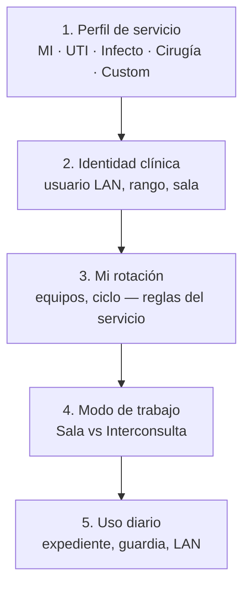
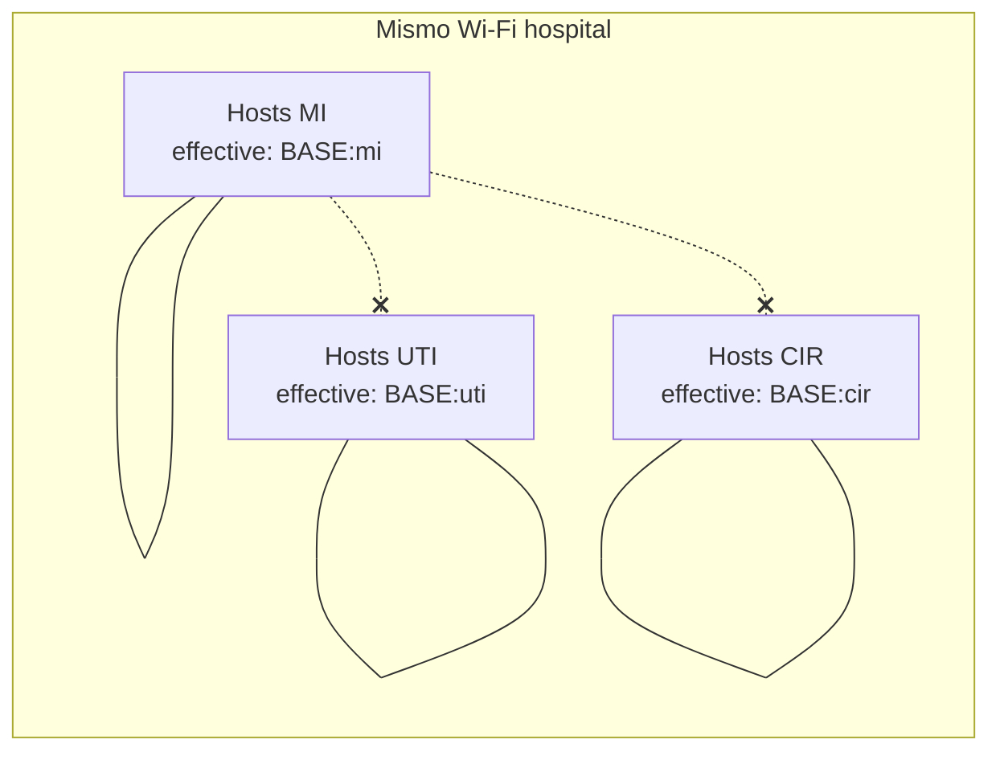

# Perfiles de servicio hospitalario — diseño

**Fecha:** 2026-06-02  
**Estado:** Aprobado (brainstorming)  
**Componente:** Modos modulares por servicio (MI, UTI, Infectología, Cirugía) + LAN lógica separada + sandbox de configuración  
**Aplicación:** R+ (r-mas) — Electron local-first, LAN LiveSync, identidad clínica / Mi rotación

## Resumen

R+ incorpora una capa **`serviceProfile`** (perfil de servicio hospitalario) **anterior** a Mi rotación y ortogonal al modo Sala/Interconsulta. Cada perfil define:

1. **Manifiesto modular** — qué módulos/pestañas y variantes de guardia/rotación aplican.
2. **LAN lógica separada** — mismo Wi‑Fi del hospital, distinto canal por sufijo derivado del perfil (sin congestión cruzada entre servicios).
3. **Pestaña sandbox** — probar presets y toggles antes de aplicar; exportar manifiesto JSON.

**Prioridad de producto:** aislamiento LAN entre servicios, manteniendo movilidad de host **dentro** de un servicio (modelo descentralizado actual).

**Enfoque elegido:** Perfil de servicio + manifiesto declarativo (Enfoque 1 del brainstorming). **No** se elige servicio en Mi rotación.

---

## Decisiones de producto (bloqueadas)

| Tema | Decisión |
|------|----------|
| Ubicación del selector | **Antes** de Mi rotación (onboarding + Ajustes); Mi rotación solo consume reglas del perfil activo |
| Aislamiento LAN | Mismo Wi‑Fi; **código efectivo distinto por servicio** (derivado de token base + sufijo) |
| Movilidad de host | Sin cambios **intra-servicio** (escaneo, handoff por rango Admin > R4 > … > R1) |
| Modo Sala / Interconsulta | Capa **ortogonal** al perfil de servicio |
| Agenda de procedimientos | **`procedureAgenda: true` por defecto en los cuatro presets** |
| Instalaciones legacy | Perfil implícito `legacy` → sufijo LAN vacío → comportamiento actual |
| Sandbox | Preview no toca LAN hasta “Aplicar”; banner “Vista previa — no guardado” |

---

## Jerarquía de configuración



### Dónde se elige el servicio

| Momento | Superficie | Comportamiento |
|---------|------------|----------------|
| Primera vez (post desbloqueo DB) | Pantalla **“Elige tu servicio”** antes del onboarding clínico | Bloquea Mi rotación hasta confirmar servicio |
| Cambio posterior | **Ajustes → Servicio hospitalario** (no Mi rotación) | Confirmación fuerte: desconecta LAN, puede requerir re-onboarding de equipos |
| Laboratorio / QA | **Ajustes → Configuración de servicio** | Preview sin persistir, o “Aplicar en esta sesión” |

### Cambio de servicio (regla)

Al cambiar `serviceProfileId` en Ajustes:

1. Desconectar LAN del sufijo anterior.
2. Limpiar o archivar membresía de equipos del servicio anterior.
3. Reabrir flujo de Mi rotación con reglas del nuevo manifiesto.

---

## Manifiesto de servicio (v1)

Presets embebidos en código (`public/js/service-profiles/` o `lib/service-profiles/`). Override custom opcional en userData (R4/Admin).

```json
{
  "id": "uti",
  "label": "Terapia Intensiva",
  "lan": { "teamCodeSuffix": "uti" },
  "modules": {
    "estadoActual": true,
    "monitoreo": true,
    "eventualidades": false,
    "manejo": true,
    "manejoGuia": true,
    "procedureAgenda": true,
    "guardiaBoard": true,
    "historiaClinica": true,
    "labPanel": true,
    "medicamentos": true,
    "vpo": true,
    "driveImport": true
  },
  "rotation": {
    "cycleModel": "weekly",
    "teamServices": ["UTI", "Eme"]
  },
  "guardia": {
    "boardVariant": "uti",
    "salaRooms": ["sala-1", "sala-2", "sala-e"]
  },
  "defaults": {
    "servicioCenso": "TERAPIA INTENSIVA",
    "appMode": "sala"
  },
  "onboarding": {
    "curriculumBranch": "uti"
  }
}
```

### Presets iniciales — módulos por defecto

| Módulo | MI | UTI | Infecto | Cirugía |
|--------|:--:|:---:|:-------:|:-------:|
| Estado actual / monitoreo | ✓ | ✓ | ✓ | ○ |
| Eventualidades | ✓ | ○ | ✓ | ✓ |
| Manejo / guías | ✓ | ✓ | ✓ | ○ |
| **Agenda procedimientos** | **✓** | **✓** | **✓** | **✓** |
| Guardia board | ✓ | ✓ | ✓ | ✓ |

*(○ = off en preset embebido; ajustable en sandbox. Agenda siempre ✓ en los cuatro.)*

### Variantes ligadas al manifiesto

| Campo | Propósito |
|-------|-----------|
| `rotation.cycleModel` | Modelo de ciclo (p. ej. `monthly-abcdef` vs `weekly`) |
| `rotation.teamServices` | Servicios de equipo visibles en Mi rotación |
| `guardia.boardVariant` | Layout/comportamiento del tablero de guardia |
| `guardia.salaRooms` | Subconjunto de salas LiveSync (`sala-1`, `sala-2`, `sala-e`) |
| `defaults.servicioCenso` | Pre-llenado de censo |
| `onboarding.curriculumBranch` | Rama del tour guiado por servicio |

### Resolución en runtime

Función única `resolveServiceModules(settings)` (y helpers de variantes) consumida por:

- Sidebar y pestañas de expediente (`expediente-tabs.mjs`, `mode-features.mjs`)
- Guardia / pase board
- Hub LAN (etiqueta de servicio, salas)
- Mi rotación (filtro de `teamServices`, ciclo)

Persistencia:

- `rpc-settings.serviceProfileId` — perfil activo
- `rpc-settings.serviceManifest` — merge opcional sobre preset
- `localStorage.servicePreviewState` — solo durante sandbox (efímero)

---

## LAN por servicio

### Token efectivo

Se conserva el **token base hospitalario** (`lan-team-code.txt` o `R_PLUS_LAN_TEAM_CODE`). El perfil agrega aislamiento lógico:

```
effectiveTeamCode = derive(baseToken, serviceProfileId)
```

Implementación recomendada: concatenación normalizada `baseToken + ":" + serviceProfileId` antes de `hashTeamCode` (misma función que hoy en `lan-squad/team-code.js`).

| Perfil | `serviceProfileId` | Sufijo LAN |
|--------|-------------------|------------|
| Medicina Interna | `mi` | `mi` |
| Terapia Intensiva | `uti` | `uti` |
| Infectología | `infecto` | `infecto` |
| Cirugía | `cir` | `cir` |
| Legacy (sin perfil) | *(vacío)* | *(vacío — comportamiento actual)* |

Host y cliente autentican con el **mismo Bearer efectivo** del perfil activo.

### Descubrimiento y filtrado

1. Mensajes `livesync:hello` y respuestas `/api/lan/v1/host-rank` incluyen `serviceProfileId`.
2. Cliente **ignora** peers con `serviceProfileId` distinto al local.
3. `scanLanHosts` / `pingLanHostUrl` / auto-conexión solo consideran hosts del mismo canal.

**Intra-servicio sin cambios:** handoff de host por rango, salas LiveSync, relay WebSocket, outbox.



### Hub LAN — UX

- Etiqueta de solo lectura: **“Red: [nombre servicio]”** (cambio solo en Ajustes → Servicio hospitalario).
- Estado: “Conectado a la red del servicio” / “Sin red — buscando…”.
- Salas y equipos acotados al manifiesto activo.

### Migración LAN

| Escenario | Comportamiento |
|-----------|----------------|
| Install sin `serviceProfileId` | Perfil `legacy`; sufijo vacío; sin regresión |
| Primera elección de servicio | Aplica sufijo derivado; re-escaneo |
| Cambio de servicio | Desconectar → nuevo effective code → re-escaneo |

---

## Pestaña «Configuración de servicio» (sandbox)

### Ubicación

| Bloque | Ubicación | Audiencia |
|--------|-----------|-----------|
| Servicio hospitalario | Mi Perfil | Todos — elección productiva |
| Configuración de servicio | Ajustes | Preview/toggles; custom apply R4/Admin |

### Flujo sandbox

1. Seleccionar preset (MI / UTI / Infecto / Cirugía).
2. **Preview en vivo** con banner “Vista previa — no guardado”.
3. Toggles experimentales por módulo.
4. Exportar manifiesto JSON.
5. **Aplicar** — persiste + reconecta LAN (confirmación).
6. **Descartar** — restaura perfil guardado; descarte automático al cerrar Perfil/Ajustes si quedó preview activo.

Preview **no** modifica LAN ni equipos hasta “Aplicar”.

### Permisos

| Acción | R1–R3 | R4 / Admin |
|--------|-------|------------|
| Elegir preset | ✓ | ✓ |
| Preview sandbox | ✓ | ✓ |
| Toggles + aplicar custom | ○ | ✓ |
| Exportar manifiesto | ✓ | ✓ |
| Cambiar servicio activo | ✓ (confirmación) | ✓ |

---

## Manejo de errores

| Situación | Comportamiento |
|-----------|----------------|
| Peer LAN con otro `serviceProfileId` | Ignorar silenciosamente (sin toast) |
| Cambio de servicio con LAN conectada | Modal confirmación; cancelar aborta |
| Manifiesto inválido | Fallback a preset embebido; toast advertencia |
| Preview olvidado | Banner persistente; descarte al cerrar ajustes |

---

## Archivos / módulos afectados

| Capa | Cambio |
|------|--------|
| `lan-squad/effective-team-code.js` | Derivar token efectivo con `serviceProfileId` |
| `lan-squad/host-router.js`, auth | Validar Bearer con hash efectivo |
| `lan-squad` hello / host-rank | Exponer `serviceProfileId` |
| `public/js/features/lan-sync.mjs` | Filtrar peers; etiqueta de servicio en hub |
| `public/js/storage.js`, `rpc-settings` | `serviceProfileId`, `serviceManifest` |
| `public/js/service-profiles/*.mjs` | Presets embebidos |
| `public/js/service-modules.mjs` (nuevo) | `resolveServiceModules`, merge manifiesto |
| `public/js/features/clinical-onboarding.mjs` | Paso “Elige tu servicio” antes de usuario/equipo |
| `public/js/features/profile.mjs` | UI Servicio hospitalario + sandbox entry |
| `public/js/expediente-tabs.mjs`, sidebar, guardia | Consumir resolución de módulos |

---

## Pruebas

| Área | Validación |
|------|------------|
| `effective-team-code` | Distinto sufijo → distinto hash; legacy = hash actual |
| Descubrimiento | Dos hosts (MI vs UTI) misma red: sin cross-sync |
| `resolveServiceModules` | Presets + agenda on en los cuatro |
| Sandbox | Preview no persiste LAN; Apply reconecta |
| Migración | Upgrade sin `serviceProfileId` sin regresión |

Tests: `node --test` para derivación de token, manifiestos, resolución de módulos.

---

## Rollout por fases

| Fase | Entrega |
|------|---------|
| **1 — LAN + perfil** | `serviceProfileId`, token efectivo, filtro peers, selector onboarding/Ajustes |
| **2 — Manifiestos preset** | Cuatro presets + `resolveServiceModules`; agenda on en todos |
| **3 — Sandbox** | Preview, toggles, export JSON; variantes rotación/guardia |
| **4 — Custom overrides** | R4/Admin persiste manifiesto custom en userData |

Fase 1 entrega la separación LAN (prioridad). Fases 2–3 habilitan iteración con cada servicio en la pestaña de configuración.

---

## Fuera de alcance (v1)

- VLANs / subredes físicas distintas por servicio
- Códigos LAN administrados manualmente por IT por servicio (el sufijo es derivado en app)
- Selector de servicio dentro de Mi rotación
- Sincronización de manifiestos vía servidor central (solo local + export JSON)

---

## Relación con specs existentes

| Spec | Relación |
|------|----------|
| `2026-06-01-sala-based-lan-rooms-design.md` | Salas fijas se mantienen; opcionalmente filtradas por manifiesto |
| `2026-06-01-guardia-lan-hub-design.md` | Hub gana etiqueta de servicio; descubrimiento filtrado |
| `2026-06-01-lan-teams-decoupled-design.md` | Equipos siguen persistentes; acotados por `rotation.teamServices` del perfil |
| `2026-05-19-modular-app-refactor-design.md` | Manifiesto consume módulos `features/*.mjs` |

---

## Criterios de éxito

1. Dos instalaciones en el mismo Wi‑Fi (MI vs UTI) **no** intercambian bundles LiveSync ni compiten por el mismo host lógico.
2. Dentro de un servicio, cualquier máquina puede ser host con prioridad por rango (comportamiento actual).
3. Cambiar preset en sandbox muestra diff de módulos sin desconectar LAN hasta “Aplicar”.
4. Los cuatro presets tienen **`procedureAgenda: true`** por defecto.
5. Instalaciones legacy siguen funcionando sin elegir servicio (perfil `legacy`).
