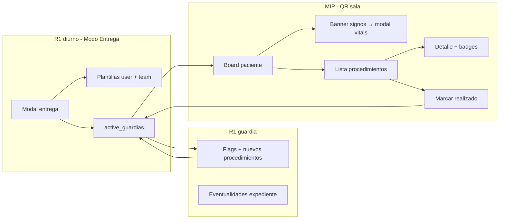

# Modo Entrega — Pendientes estructurados y flujo a guardia / internos

**Date:** 2026-06-02  
**Status:** Approved  
**Dependencies:** [2026-05-31-clinical-teams-handoff-v2-design.md](./2026-05-31-clinical-teams-handoff-v2-design.md), [2026-06-01-sala-guardia-v3-design.md](./2026-06-01-sala-guardia-v3-design.md), [2026-06-02-interno-guardia-mobile-design.md](./2026-06-02-interno-guardia-mobile-design.md)  
**Amends:** Interno board pendientes behavior; `active_guardias.pendientes_json` shape

## Summary

Pendientes de **entrega** son independientes del expediente (`rpc-todos`). El R1 diurno los define en **Modo Entrega** usando plantillas estructuradas (v1: **procedimiento/estudio**). Los signos del handoff siguen en campos de `active_guardias` (crítico, frecuencia, `last_vitals_check`), no como ítems de lista. El flujo llega al **R1 de guardia** vía `active_guardias` y a **internos (MIP)** en el board QR: signos con cuenta regresiva y tap → modal de vitals; estudios con hora, detalle, badges de requisitos, y marcar **realizado**.

## Product decisions (brainstorming lock)

| Topic | Decision |
|--------|----------|
| vs expediente | **Independiente** — no leer ni sincronizar `rpc-todos` |
| Captura v1 | **Plantillas** — procedimiento/estudio estructurado; múltiples por paciente |
| Signos | **No** en `pendientes` items — `is_critical`, `vitals_frequency`, banner + modal interno |
| Plantillas reutilizables | **Por usuario** y **por equipo/sala** (SQL + LAN) |
| R1 diurno | Crear/editar/eliminar procedimientos; definir hora, tipo, requisitos; guardar/aplicar plantillas |
| R1 guardia | **No borrar** ítems del diurno (`lockedBase`); **actualizar flags** (comentado, autorizado, agendado); **agregar** nuevos procedimientos; **eventualidades** en expediente cuando alcance |
| Interno | Ver signos (countdown) + estudios (hora); **detalle** al tap; **badges** si faltan requisitos; **marcar realizado** |
| Data approach | **Enfoque 1** — extender `pendientes_json` v2 + tablas de plantillas (no tabla normalizada v1) |

## Architecture



### Modules (target)

| Module | Responsibility |
|--------|----------------|
| `public/js/features/clinical-entrega.mjs` | Modal v2, lista procedimientos, plantillas picker, persist upsert |
| `lib/db/clinical-access-db.mjs` | `pendientes_json` v2 read/write; template CRUD IPC |
| `lib/db/schema.mjs` | `entrega_template_user`, `entrega_template_team` |
| `lib/interno/interno-board.mjs` | Board DTO: procedimientos, badges, completed state |
| `lib/interno/interno-router.js` | `PATCH` completar pendiente |
| `public/interno/interno-app.mjs` | UI signos + estudios + detalle + marcar hecho |

## Data model

### `active_guardias.pendientes_json` (v2)

```json
{
  "version": 2,
  "items": [
    {
      "id": "uuid",
      "type": "procedimiento",
      "kind": "imagen",
      "label": "TAC tórax con contraste",
      "scheduledAt": "2026-06-02T14:00:00",
      "comentado": false,
      "autorizado": true,
      "agendado": true,
      "requires": {
        "familiar": false,
        "consentimiento": true,
        "anestesia": false
      },
      "lockedBase": true,
      "createdBy": { "userId": "…", "rank": "R1" },
      "updatedAt": "ISO",
      "completedAt": null,
      "completedBy": null
    }
  ]
}
```

- `kind`: `"imagen"` | `"otro"` (extensible later).
- `lockedBase: true` when created by departing R1 at handoff → guardia cannot delete; guardia may toggle status flags only.
- Items added by guardia: `lockedBase: false`; guardia may delete own items only.
- **Signos** remain: `is_critical`, `vitals_frequency`, `last_vitals_check` on the guardia row.

### Migration / compatibility

- Legacy `string[]` JSON → on read, map to `{ version: 2, items: [{ type: "legacy_text", text, id }] }` or preserve display via `parsePendientesJson` dual support.
- On next write from modal v2, persist canonical v2.

### Template tables

**`entrega_template_user`**

| Column | Purpose |
|--------|---------|
| `template_id` | PK |
| `user_id` | Owner |
| `name` | Display label |
| `payload_json` | Defaults: `kind`, `label`, `requires`, default flags (no `scheduledAt`) |
| `created_at` | Audit |

**`entrega_template_team`**

| Column | Purpose |
|--------|---------|
| `template_id` | PK |
| `team_id` | FK teams (Sala team) |
| `name` | Display label |
| `payload_json` | Same shape as user templates |
| `created_by` | Audit |
| `created_at` | Audit |

LAN: replicate via existing clinical ops sync; last-write on template metadata.

## Permissions matrix

| Action | R1 diurno (entrega) | R1 guardia | Interno |
|--------|---------------------|------------|---------|
| Set vitals frequency / critical | ✓ | ✓ (same modal if in scope) | — |
| Add procedimiento | ✓ | ✓ | — |
| Delete procedimiento | ✓ (any own session) | ✓ only `lockedBase: false` | — |
| Edit label / hour / kind | ✓ | ✓ only own additions | — |
| Toggle comentado / autorizado / agendado | ✓ | ✓ on all items in scope | — |
| Toggle requires.* | ✓ at create | ✓ (updates badges) | — |
| Mark completed | — | — (v1) | ✓ |
| Eventualidades (expediente) | — | ✓ when scope allows | — |

## UI — Modal Entrega (R1)

Replaces free-text `entrega-pendientes` textarea.

1. **Upper block (unchanged):** covering user, source team, critical, vitals frequency.
2. **Procedimientos list:** cards with label, time, status chips, requirement chips; edit/delete per permissions above.
3. **+ Agregar procedimiento:** form with kind, label, scheduled time, status checkboxes, requires checkboxes; **Añadir a lista** | **Guardar como plantilla** (scope: me / team).
4. **Aplicar plantilla:** picker Mis plantillas | Del equipo → prefill form → adjust time → add.
5. **Confirmar entrega / Guardar:** upsert `active_guardias` with v2 JSON.

**Modo Guardia:** el censo abre el expediente al tocar un chip. El botón **Entrega** (no toggle Censo|Entrega) activa la fase de entrega: resuelve el R1 de guardia de la sala, muestra estado «Entregando a …» y hace que cada chip abra el modal de entrega con ese cubridor preseleccionado. **Salir de entrega** restaura el censo normal.

**Eventualidades:** separate expediente tab; not stored in `pendientes_json`.

## UI — Interno board (MIP)

Per patient card:

- **Signos row:** `calcVitalsBanner` only; tap → existing vitals modal (`POST /vitals`).
- **Estudios list:** sorted by `scheduledAt`; show time + label.
- **Badges:** show when `requires.*` is true and corresponding workflow flag not satisfied (e.g. consentimiento pending).
- **Tap estudio:** read-only detail sheet (all fields + flags).
- **Mark realizado:** row action → `PATCH` → sets `completedAt` / optional `completedBy` reporter name.

Interno cannot edit flags, add/delete items, or manage templates.

## API extension (interno)

| Method | Path | Body | Notes |
|--------|------|------|-------|
| `PATCH` | `/api/interno/v1/patients/:patientId/pendientes/:itemId` | `{ completed: true, reporterName?: string }` | Token + scope; idempotent if already completed |

Response: updated item or 403/404. Broadcast `board-changed` + existing patient sync as vitals.

## LAN / IPC

- Extend `db:guardia-upsert` payload validation for v2 `pendientesJson`.
- New IPC: `db:entrega-template-list`, `db:entrega-template-save`, `db:entrega-template-delete` (user + team variants).
- Clinical ops sync includes template tables and v2 pendientes on guardia rows.

## Error handling

- Scope deny: 403 with short Spanish message.
- Complete unknown item / wrong patient: 404.
- Guardia delete on `lockedBase` item: reject in UI + server validation.
- Malformed legacy JSON: treat as empty list + log once.

## Testing

- Parser: legacy string array → v2 display; v2 round-trip.
- Permissions: guardia cannot delete locked; can add and flag-update.
- Interno: PATCH complete; badges for missing consentimiento/anestesia/familiar.
- Template: save user + team; apply prefill.
- LAN merge: two clients edit flags on same item → last-write per `updatedAt` on item.

## Out of scope (later)

- Plantilla «Otro» texto libre as first-class type (use `kind: otro` + label).
- `scheduledAt` on another calendar day / «mañana» quick pick.
- R2 double-handoff procedimiento copies.
- Interno edit flags.
- Auto-pull from agenda / labs into entrega items.
- Admin catalog global (Enfoque C templates).

## Relation to expediente pendientes (`rpc-todos`)

No linkage in v1. Residents may duplicate content manually if needed. Pase / expediente pendientes remain the diurnal working list; entrega pendientes are the handoff contract for guardia + MIP.
