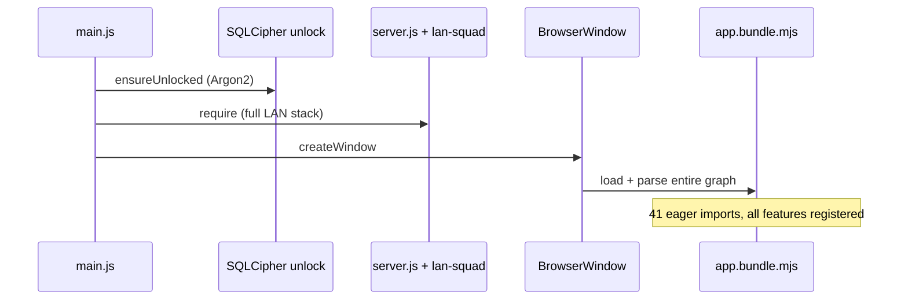
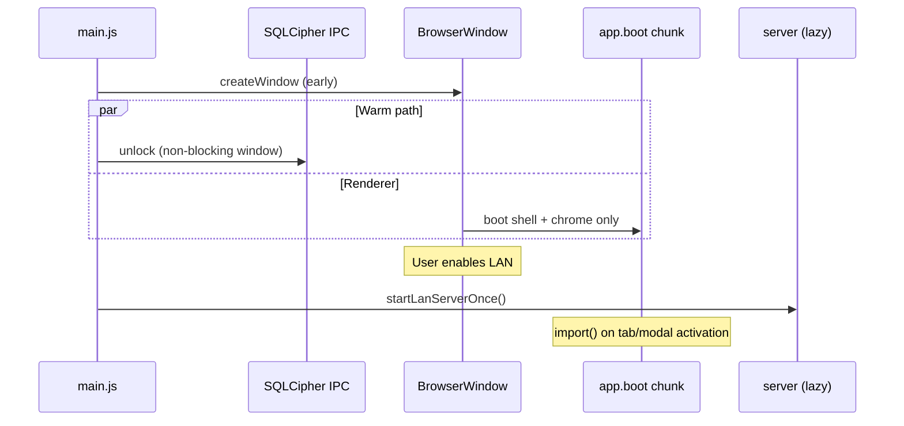

# Cold Start & Code Navigation — Design Spec

> **For implementation:** Use **superpowers:executing-plans** (or subagent-driven-development) with the task-by-task plan. Ship in phases; do not combine main-process boot changes with esbuild code-splitting in one PR.

**Date:** 2026-06-03  
**Status:** Approved (design) — pending implementation  
**Plan:** [`docs/superpowers/plans/2026-06-03-cold-start-navigation.md`](../plans/2026-06-03-cold-start-navigation.md)  
**Trigger:** Thermo-nuclear repo audit (lag + navigation); complements LAN modularization already shipped.

## Related work

| Document | Relationship |
|----------|----------------|
| [`2026-06-02-modularization-metrics-design.md`](2026-06-02-modularization-metrics-design.md) | Debt score, Tier 1 budgets, god-file burn-down order — **BN-00 executes this** |
| [`plans/2026-06-02-modularization-metrics.md`](../plans/2026-06-02-modularization-metrics.md) | Metrics pipeline tasks (not yet fully implemented) |
| [`2026-06-03-lan-sync-improvements-design.md`](2026-06-03-lan-sync-improvements-design.md) | LAN split into push/room/transport/panel — **BN-04** finishes navigation story |
| [`2026-05-19-modular-app-refactor-design.md`](2026-05-19-modular-app-refactor-design.md) | Feature extraction pattern (`register*Runtime`, `windowHandlers`) |
| `.cursor/rules/technical-debt-accounting.mdc` | Authoritative debt formula and gates |

---

## Problem statement

R+ is **modular on disk but monolithic at runtime**. Two user-facing goals are blocked:

1. **Avoid lag** — Cold start pays for work the user may never use on that session.
2. **Ease of navigation** — Contributors cannot map a concern (settings, LAN, teams) to a bounded file; god-files exceed 1k–3k lines.

### Evidence (baseline, 2026-06-03)

| Signal | Observation |
|--------|-------------|
| Main boot | `main.js` runs `ensureUnlocked()` (Argon2) then `require('./server')` (Express + WS + `lan-squad/`) **before** `createWindow()` |
| Renderer bundle | Single esbuild output (~76k lines dev); **no** `splitting`; `app.js` has **41** eager static imports |
| Boot hubs | `app-runtimes.mjs` **854** lines, **54** imports; `app-shell.mjs` **1061** lines |
| God-files | 13 feature files > 1000 lines; worst: `settings-help` 3197, `platform` 2613, `clinical-teams` 2593 |
| Lazy loading | Sparse `import()` inside features; registration still eager via boot hubs |
| Governance | `scripts/metrics/baseline.json` empty; `npm run metrics` not wired — debt gate is documented but inactive |
| Vendor JS | `chart.umd.min.js` + `sortable.min.js` loaded in `index.html` before bundle |

A prior modular refactor increased file count without shrinking the **load graph**, causing perceived regression. This spec couples navigation improvements to **measurable** boot/debt budgets so splits do not repeat that mistake.

---

## Goals

| ID | Goal | Measurable outcome |
|----|------|-------------------|
| G1 | **Faster time-to-window** | `createWindow()` runs without waiting for LAN server construction; LAN server starts only when LAN is first enabled |
| G2 | **Smaller cold parse** | Initial JS parse/execute excludes at least settings-tour, platform audit, and one 1k+ feature domain (lazy route) |
| G3 | **Predictable navigation** | Every major concern has a directory or prefix; no file > 1000 lines after its BN split task without explicit waiver |
| G4 | **Enforced ratchet** | `npm run metrics:check` fails PRs that increase `totalScore` or add eager boot imports |

## Non-goals

- Rewriting clinical/LAN merge semantics (LWW, conflict resolver, SQLCipher model).
- Replacing esbuild with another bundler.
- Eliminating `windowHandlers` / HTML `onclick` in one release.
- Full migration of all 47 files over 600 lines in one initiative (ratchet over multiple PRs).
- Cloud/P2P architecture (IM-14–16 territory).

---

## Design principles

1. **Behavior first, structure second** — Each PR is behavior-preserving; perf/navigation follow measured extracts.
2. **Shrink the load graph, not just file count** — New modules must not add static imports to `app.js` / `app-runtimes.mjs` / `app-shell.mjs` unless justified and recorded in `bootGraph`.
3. **Lazy by activation** — Defer work to first user action (tab, mode, modal, LAN toggle), not arbitrary timeouts.
4. **Clinical safety unchanged** — DB unlock still gates clinical data in renderer; moving unlock relative to window creation must not expose patient data before auth.
5. **One concern per PR** — Main boot, metrics, each god-file split, and code-splitting are separate merge units.

---

## Architecture today



## Architecture target



---

## Improvement catalog

| ID | Phase | Title | Effort | Primary paths |
|----|-------|-------|--------|---------------|
| **BN-00** | 0 | Wire metrics pipeline + seed baseline | M | `scripts/metrics/*`, `package.json` — see modularization-metrics plan |
| **BN-01** | 0 | Main-process boot: early window, lazy LAN server | S | `main.js`, `server.js` export shape |
| **BN-02** | 0 | Renderer boot step list (replace promise ladder) | S | `public/js/app.js`, optional `public/js/boot/boot-steps.mjs` |
| **BN-03** | 0 | Collapse `app-runtimes` DI adapter boilerplate | S | `public/js/app-runtimes.mjs` |
| **BN-04** | 1 | LAN navigation: folder + thin orchestrator barrel | M | `public/js/features/lan/`, `lan-sync.mjs`, `lan-sync-*.mjs` moves |
| **BN-05** | 1 | Split `settings-help.mjs` by concern | L | `settings-help/`, tour, help, dropdown |
| **BN-06** | 1 | Split `platform.mjs` by concern | L | `platform/` audit, offline, import |
| **BN-07** | 1 | Split `clinical-teams.mjs` (halt growth) | L | `clinical-teams/` + existing `import()` |
| **BN-08** | 1 | Trim `app-shell.mjs` — chrome/toast/defer only | M | `app-shell.mjs`, move doc-export/confetti/defaults |
| **BN-09** | 2 | Chart.js UMD in HTML + `loadChartJs()` fallback | S | `index.src.html`, `vendor-loader.mjs`, chart call sites |
| **BN-10** | 2 | Feature lazy routes (stub register + `import()`) | L | `app-runtimes.mjs`, per-feature stubs |
| **BN-11** | 2 | esbuild `splitting` + chunk naming | M | `scripts/bundle-renderer.mjs`, `index.html` |
| **BN-12** | 2 | Boot graph regression test | S | `app-boot-imports.test.mjs`, `boot-graph.mjs` |

**Effort:** S ≤ 1 day, M ≤ 3 days, L ≤ 1 week per ID (single engineer, tests green).

---

## Phase 0 — Boot path & governance (BN-00 – BN-03)

### BN-00 — Metrics gate (prerequisite)

**Problem:** Without `metrics:check`, god-files and boot imports regress silently.

**Required:** Implement Phase 1 of [`plans/2026-06-02-modularization-metrics.md`](../plans/2026-06-02-modularization-metrics.md) through baseline seed; add `metrics:check` to `pretest` or documented PR checklist.

**Acceptance:**

- [ ] `npm run metrics` produces `scripts/metrics/report.json`
- [ ] `npm run metrics:check` passes on `main` with committed `baseline.json` (`totalScore` numeric)
- [ ] Boot hub static import hash stored in baseline

### LAN host when the primary laptop leaves (product model)

R+ does **not** keep your laptop’s process alive after you quit or sleep. Continuity is **failover to another desktop**, not an always-on daemon on the departed machine.

| Role | What runs `:3738` | When you leave |
|------|-------------------|----------------|
| **Your laptop (primary host)** | Embedded `server.js` in your Electron main process | Server stops with the app; peers see ping/WS failure |
| **Other ward Macs (join / client mode)** | Each has its own embedded server (today: started at every app boot) | One may **promote to surrogate host** (`promoteSelfToSurrogateHost` in `lan-sync-room.mjs`) |
| **iPad / mobile** | Never hosts; connects to current `hostUrl` | Must reconnect or receive `livesync:host-handoff` after promotion |

**Failover sequence (already implemented):**

1. Clients in a live room lose connection → `scheduleSurrogateFailoverCheck` → `runSurrogateFailoverCheck`.
2. Retry primary URL (`getPrimaryHostUrl`) and peer URLs (`listLivePeerHostUrls`).
3. If all fail and this Mac is Electron **join mode** (`isLanRemoteJoinMode`), after `surrogateElectionDelayMs` jitter → `promoteSelfToSurrogateHost()`: switch config to **this Mac’s** `resolveLanHostUrlAuto()`, push bundle, broadcast `livesync:host-handoff`.
4. When your laptop returns and pings OK → `maybeRevertSurrogateToPrimary()` can hand authority back.

**Implication for BN-01 (lazy server):** Deferring `startLanServer()` until “open ⇄ panel” would **break** surrogate promotion on a Mac that joined a room but never opened the panel. Lazy start must use **tiered triggers** (below), not panel-only.

**Optional product knobs (unchanged by this spec):** pinned host (`rpc-lan-pinned-host-url`), rank-based supersession (`scanLanHosts`), IM-08 shift-host confirm — see `lan-sync-improvements` IM-08.

### BN-01 — Main-process boot reorder + tiered LAN server start

**Problem:** Every launch constructs Express/WS/`lan-squad` **before** first paint, even when the user will only ever be a offline solo clinician.

**Required behavior:**

1. `createWindow()` runs **without awaiting** full LAN server listen or `ensureUnlocked()`.
2. Extract idempotent `startLanServer()` from eager listen-on-`require`; **`before-quit`** still calls `stopLanServer()` if started.
3. DB native load + IPC registration may run before window; unlock runs in parallel with UI (renderer `db-unlock` gates clinical data).
4. **Tiered `startLanServer()` triggers** (renderer or main, document in plan):

   | Tier | When | Why |
   |------|------|-----|
   | **A — deferred warm** | After window, if persisted LAN role is `host` or `client`, or active room membership / surrogate state in storage | Ward Macs that participate in sync must have `:3738` ready for failover without opening ⇄ |
   | **B — on demand** | First ⇄ action, explicit “Actuar como anfitrión”, join room, connect sync channel | Solo laptops with no LAN config |
   | **C — mandatory before surrogate** | `promoteSelfToSurrogateHost()` (and host self-URL advertise) must `await ensureLanServerReady()` | Surrogate cannot promote if local server never listened |

5. **Solo / never-LAN path:** No tier A signal → no listen until tier B (saves cold start for non-guardia use).

**Acceptance:**

- [ ] Solo clinician, no LAN config: `:3738` not listening until user opens ⇄ or joins
- [ ] Mac joined to guardia room (client mode): server listening within N s after window (tier A), without opening ⇄
- [ ] Surrogate promotion after primary leaves: second Mac becomes pingable at its LAN URL; handoff WS received (manual or scripted test)
- [ ] Primary returns: revert path still works
- [ ] Window visible before Argon2 + LAN listen complete
- [ ] `lan-squad/host-router.test.js` and LAN tests green

**Risks:** Race on first connect — `ensureLanServerReady()` IPC with retry in `lan-sync-transport` / `promoteSelfToSurrogateHost`.

### BN-02 — Boot step registry

**Problem:** `app.js` `runDomBootAfterState()` is a growing `.then()` chain (clinical access → onboarding → teams → URL join).

**Required:**

- Ordered array of `{ id, run(ctx) }` steps with centralized error logging.
- New boot features add a step object, not a nested `.then`.

**Acceptance:**

- [ ] Same boot order as before (verify with existing tests + manual join-link)
- [ ] `app-boot-imports.test.mjs` still green

### BN-03 — Collapse runtime DI adapters

**Problem:** `registerPaseBoardRuntime({ getActiveAppTab: function () { return rt.getActiveAppTab(); }, … })` repeats hundreds of lines.

**Required:**

- Pass `rt` (or frozen `getRuntimeContext()`) into registrars; features read from context object.
- No behavior change; line count of `app-runtimes.mjs` drops materially (target: **≤ 600** lines after BN-03, before lazy routes).

**Acceptance:**

- [ ] All `register*Runtime` calls updated
- [ ] `npm test` subset for pase-board, patients, lan-sync green
- [ ] `metrics:check` — no new boot imports

---

## Phase 1 — Navigation & decomposition (BN-04 – BN-08)

Follow **extract `*-core.mjs` → tests → shrink shell** from modularization-metrics spec.

### BN-04 — LAN folder consolidation

**Problem:** `lan-sync-panel.mjs` (1783) lives outside `features/`; `lan-sync.mjs` (1719) is mislabeled “facade” but owns merge logic.

**Target layout:**

```text
public/js/features/lan/
  orchestrator.mjs      # thin: re-exports + high-level wire
  push.mjs              # moved from lan-sync-push.mjs
  room.mjs
  transport.mjs
  panel.mjs
  runtime.mjs
  clinical-ops-bridge.mjs
public/js/lan-client.mjs   # stays root (shared client)
```

**Acceptance:**

- [ ] `features/lan-sync.mjs` ≤ 400 lines OR renamed `orchestrator.mjs` with barrel only
- [ ] dependency-cruiser: `lan` domain imports only allowed targets
- [ ] All `lan-sync*.test.mjs` green

### BN-05 – BN-07 — God-file splits

| File | Split into (minimum) |
|------|----------------------|
| `settings-help.mjs` | `settings-dropdown.mjs`, `settings-help-content.mjs`, `tour-runtime.mjs`, `onboarding-advance.mjs` |
| `platform.mjs` | `platform-audit.mjs`, `platform-offline.mjs`, `platform-import-backup.mjs` |
| `clinical-teams.mjs` | `teams-roster.mjs`, `teams-invite.mjs`, `teams-guardia-bridge.mjs` + existing lazy chunks |

**Acceptance (each):**

- [ ] No file in split set > 1000 lines
- [ ] `windowHandlers` merged in one shell ≤ 200 lines
- [ ] Domain tests added/updated for extracted cores
- [ ] `metrics:check` — `totalScore` not increased

### BN-08 — App shell trim

Move non-chrome concerns out of `app-shell.mjs`:

- Document export request/response → `features/platform` or `document-export-client` owner
- Confetti / celebration → productivity or chrome
- “Defaults for new patient” → `patients` or `profile`

**Acceptance:**

- [ ] `app-shell.mjs` ≤ 800 lines
- [ ] No new static imports in boot hubs for moved code (use existing feature imports)

---

## Phase 2 — Lazy load & code splitting (BN-09 – BN-12)

### BN-09 — Chart.js loading (revised)

**Decision:** Keep `chart.umd.min.js` synchronously in `index.src.html` before the app bundle (reliability over lazy-only). `vendor-loader.mjs` provides `loadChartJs()` that resolves the global or injects UMD if missing; **no** ESM/`chart-chunk.json` path.

**Acceptance:**

- [x] `index.src.html` loads Chart UMD before `app.bundle.mjs`
- [x] Chart call sites use `loadChartJs()`; tendencias shows toast on failure
- [x] Tour/demo paths still render charts when opened

### BN-10 — Feature lazy routes

**Pattern (canonical):**

```javascript
// app-runtimes.mjs — synchronous stub only
let settingsHelpModule;
export function ensureSettingsHelp() {
  if (!settingsHelpModule) {
    settingsHelpModule = import('./features/settings-help/index.mjs');
  }
  return settingsHelpModule;
}
```

Activation triggers (minimum v1):

| Domain | Trigger |
|--------|---------|
| Settings / Help / Tour | First open settings dropdown or help |
| Platform audit / import | First open platform modal or Ajustes section |
| Drive import | Open drive import modal |
| Entrega modal | Open entrega UI |
| Clinical teams (heavy) | Enter guardia / teams mode (extend existing dynamic imports) |

**Acceptance:**

- [ ] Boot hub import list excludes heavy module bodies (verified by `boot-graph.mjs`)
- [ ] First activation matches pre-lazy behavior (manual + tests)

### BN-11 — esbuild code splitting

- Enable `splitting: true`, `format: 'esm'`, multiple chunks under `public/js/chunks/`.
- `index.html` loads entry chunk; dynamic `import()` maps to chunk files.
- Prod build: chunk size budget documented in `app.bundle.meta.json` comparison.

**Acceptance:**

- [ ] `npm run build:ui` / `bundle:renderer:prod` succeeds
- [ ] Initial downloaded JS reduced vs baseline metafile (target: **≥ 15%** fewer bytes parsed before first tab interaction — measure and record in PR)
- [ ] Electron packaged app loads all chunks from `file://` correctly

### BN-12 — Boot graph regression test

Extend `app-boot-imports.test.mjs` or `scripts/metrics/boot-graph.mjs`:

- Fail CI if `app.js` / `app-runtimes.mjs` / `app-shell.mjs` add static import to a **lazy-only** module path (denylist file).

**Acceptance:**

- [ ] Adding `import './features/settings-help.mjs'` to `app-runtimes` fails test

---

## Success metrics (release checklist)

| Metric | Baseline (pre) | Target (post Phase 2) |
|--------|----------------|------------------------|
| Time to window visible | Measure locally (stopwatch / trace) | ≥ 30% faster when LAN off |
| `app.bundle.mjs` dev line count | ~76k | Entry chunk ≤ 55k; rest in lazy chunks |
| Files > 1000 lines in `features/` | 13 | ≤ 5 (remaining on burn-down backlog) |
| `metrics:check` in CI | absent | required on PR |
| Boot static import count (`app.js`) | 41 | ≤ 25 (stubs only) |

Record before/after in PR description for BN-01 and BN-11.

---

## Risks & mitigations

| Risk | Mitigation |
|------|------------|
| Renderer connects before LAN server up | IPC `lanServerReady` + retry/backoff in `lan-sync-transport` |
| Lazy route race with URL team join | Run join consumer after `ensureClinicalTeams()` in boot steps |
| Code-split `file://` path breaks in Electron | Use relative chunk paths; test packaged dmg |
| Split PR breaks `onclick` handlers | Keep `windowHandlers` export surface stable in shell |
| Clinical data flash before unlock | Never hydrate patients from DB in renderer until `clinical-access-runtime` ready |

---

## Approval bar

Ship Phase 0 before Phase 2. Do not enable esbuild splitting until BN-00 is green and at least one god-file split (BN-05 or BN-04) proves the extract workflow under `metrics:check`.

**Presumptive blockers:**

- Merging BN-10/11 without BN-00 (unmeasured regressions).
- Increasing eager boot imports without boot-graph waiver entry in PR.
- Pushing any file over 3000 lines in this initiative.

---

## Changelog entry (on merge)

When implementation lands, add to `.cursor/rules/project-context.mdc`:

```markdown
- **2026-06-03** `cold-start-navigation`: early window, lazy LAN server, metrics gate, lazy feature routes; `main.js`, `app-runtimes.mjs`, `scripts/metrics/`, `docs/superpowers/specs/2026-06-03-cold-start-navigation-design.md`.
```
