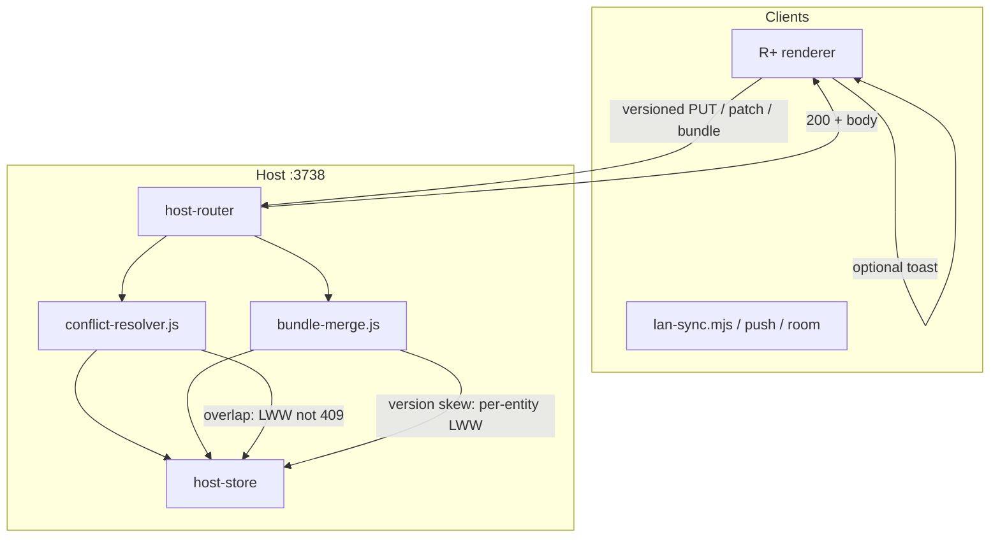

# LAN Sync — Full LWW, No Blocking Conflict Modal

> **For implementation:** After this spec is approved in review, use **superpowers:writing-plans** for a task-by-task plan. Do not implement until the written spec is reviewed.

**Date:** 2026-06-03  
**Status:** Design approved in brainstorming (approach **A**, global LWW + optional toast).  
**Supersedes (behavior):** Structural conflict UX in [`2026-05-30-clinical-conflict-resolution-design.md`](2026-05-30-clinical-conflict-resolution-design.md) (409 + Clinical Diff Viewer + mandatory IndexedDB draft on overlap). Versioning and host authority remain; **overlap resolution policy** changes to LWW.  
**Related:** [`2026-05-30-lan-host-concurrency-design.md`](2026-05-30-lan-host-concurrency-design.md), [`2026-06-03-lan-sync-improvements-design.md`](2026-06-03-lan-sync-improvements-design.md).

---

## Problem statement

The versioned LAN model (May–June 2026) stops silent data loss but introduces a **blocking Clinical Conflict Viewer** and IndexedDB draft queue. In production guardia:

1. **Host clinicians** see repeated modals even when their local state is ahead of `host-store` (version skew on the same Mac).
2. **Patient saves (A)** and **todos (B)** are the worst offenders; more residents ⇒ more key overlap ⇒ more interruptions.
3. The team prefers **continuity of work** over interactive merge: acceptable risk of **silent overwrite** vs. modal fatigue.

**Decision:** Revert **overlap policy** to **Last-Write-Wins (LWW)** on **all** LAN entity paths. Replace the modal with an **optional, non-blocking toast**.

---

## Goals (success criteria)

- [x] No automatic opening of `clinical-conflict-viewer` on any LAN write conflict.
- [x] **Patient, agenda, todo** (HTTP + WS): structural key overlap resolves with LWW on the host; clients receive success (`200` / `livesync:applied`), not `409` / `livesync:conflict` for overlap.
- [x] **Room sync-bundle** (`PUT sync-bundle`): revision / `entityVersions` mismatch does **not** block with 409; per-entity LWW inside the bundle merge (see §3).
- [x] **clinicalOps** snapshot: retain existing table-level merge (`mergeClinicalOpsSnapshotsData`); on revision conflict, **incoming wins** at snapshot level (LWW), no modal.
- [x] **Optional toast** when a write overwrote divergent server data (user-toggle, default **on**); debounced, no modal, no draft required to continue.
- [x] Host machine: after successful apply, **client caches** (`rememberLiveSyncEntity`, `setHostBundleBases`) updated so “server behind” false conflicts drop sharply.
- [x] Tests updated: overlap → success; LWW tie-break documented; no regression on disjoint key auto-merge.

## Non-goals (v1)

- CRDT / three-way merge / “keep both” UI.
- Restoring the Clinical Diff Viewer as the default path (module may remain for diagnostics or later).
- IndexedDB `draft-conflict:*` as mandatory workflow (stop creating drafts on LWW; optional cleanup of stale drafts).
- Changing LAN security (Bearer, WS auth, tickets).
- P2P or multi-host failover.

---

## Design principles

| Principle | Choice |
|-----------|--------|
| Clinician UX | **Never block** the ward workflow for merge decisions |
| Data safety | **Explicit trade-off:** concurrent edits to the **same field** may lose silently |
| Server role | Host remains **authoritative applier**; LWW is the rule inside `ConflictResolver` / `mergeBundlePut`, not blind client relay |
| Disjoint edits | **Keep** key-set auto-merge where already implemented (no intersection ⇒ merge without LWW) |
| Feedback | Toast is **optional** (Ajustes); when off, LWW is fully silent |

---

## Architecture overview

### Modules touched

| Module | Change |
|--------|--------|
| `lan-squad/conflict-resolver.js` | On key overlap: `pickLwwWinner(base, server, incoming)` → apply → return `{ ok: true, lwwApplied: true, overwrittenKeys }` |
| `lan-squad/conflict-resolver.test.js` | Overlap → 200 path; `updatedAt` ordering |
| `lan-squad/bundle-merge.js` | On `conflicts[]`: merge each key with LWW instead of `ok: false` |
| `lan-squad/bundle-merge.test.js` | Stale `baseRevision` / entity version → still `ok: true` with LWW |
| `lan-squad/host-router.js` | Stop returning 409 for overlap (resolver no longer throws for overlap) |
| `lan-squad/ws-hub.js` | Unicast `livesync:conflict` removed for overlap; always broadcast `livesync:applied` when apply succeeds |
| `public/js/features/lan-sync.mjs` | Remove `openClinicalConflictViewer` from hot path; apply server body; sync entity bases on host |
| `public/js/lan-sync-push.mjs` | Bundle / clinicalOps 409 → accept LWW response; no `saveDraftConflict` |
| `public/js/lan-client.mjs` | `lan-conflict` event unused in prod path (or reserved for telemetry) |
| `public/js/features/settings` or `storage.js` | Preference `lanLwwOverwriteToast` (boolean, default `true`) |
| `public/js/features/clinical-conflict-viewer.mjs` | **No auto-open**; optional future “diagnostics” only |
| `public/js/draft-conflict-store.mjs` | No new drafts on sync; migration note to clear old drafts |

---

## §1: LWW policy (all entities)

### 1.1 Timestamp source

Use **`updatedAt`** (ISO 8601 string) on the entity record:

| Entity | Field |
|--------|--------|
| `patient` | `lanUpdatedAt` if present, else `updatedAt`, else treat incoming as newer |
| `agenda` event | `updatedAt` |
| `todo` | `updatedAt` (required by room model) |
| Bundle `entries` | Per-entry `updatedAt` if present; else incoming wins |
| `manejo` | Envelope `updatedAt` on `manejo` object |
| `clinicalOps` | Snapshot-level: higher `revision` or `updatedAt` on wrapper; else **incoming snapshot replaces** after `mergeClinicalOpsSnapshotsData` only when both sides sent ops (keep existing merge helper for row-level tables) |

### 1.2 Tie-break

If timestamps are equal or missing:

1. Prefer **incoming** write (current session should not stall).
2. Increment entity `version` / bundle `revision` monotonically as today.

### 1.3 Disjoint keys (unchanged)

If `changedKeys` ∩ `serverChangedKeys` is **empty**, apply **auto-merge** (existing `conflict-resolver` branch). No toast unless incoming also overwrote non-changed server fields (optional: no toast for pure auto-merge).

### 1.4 Versioned envelope

`expectedVersion` / `baseData` remain on the wire for diagnostics and future use, but **must not** produce 409 on overlap. Mismatch with valid `baseData` triggers LWW branch, not `ConflictError`.

**Delete ops:** tombstone wins if either side has `op: 'delete'` with newer `updatedAt`; else delete wins over upsert when timestamps equal (safer for “quitar pendiente”).

---

## §2: HTTP patients (`PUT /api/lan/v1/patients/:id`)

- `resolver.applyMutation` returns **200** with `{ version, data, lwwApplied?, overwrittenKeys? }`.
- Renderer `lanPushPatientVersioned`: on success, `rememberLiveSyncEntity('patient', …)` and refresh UI; **no** `handleSyncConflict`.
- If host Electron: `setHostBundleBases` / patient version map aligned when bundle revision hint received.

---

## §3: WebSocket LiveSync (`livesync:patch`)

- Agenda + todo patches through `ConflictResolver` with same LWW overlap rule.
- Hub broadcasts `livesync:applied` to room; **no** `livesync:conflict` for overlap.
- Client `lan-conflict` listener becomes no-op or logs debug only.

---

## §4: Room sync-bundle (`PUT …/sync-bundle`)

Today `mergeBundlePut` returns `ok: false` when `baseRevision !== serverRevision` or per-key `entityVersions` drift.

**New behavior:**

1. **Revision skew:** Do not abort whole bundle. Take incoming payload keys and merge into server bundle with **per-key LWW** (agenda/todo/manejo/entries/clinicalOps).
2. **Per-key version skew:** Compare local vs server entity via `updatedAt` (extract with existing `extractPayloadForKey`); winner written; `entityVersions[key]++`.
3. **clinicalOps:** If both snapshots present, run `mergeClinicalOpsSnapshotsData` then, if still conflict at snapshot metadata, **incoming** snapshot wins (align with IM-13a “host wins” ward ops).
4. Response always **`200`** with full `bundle` when any payload keys present; include `lwwAppliedKeys: string[]` for client toast.

Client `pushRoomSyncBundleToHost`: remove branch that calls `saveDraftConflict` / opens viewer; on `lwwAppliedKeys.length`, call toast helper if enabled.

---

## §5: Optional toast (UX)

### Preference

- Key: `lanLwwOverwriteToast` in renderer storage (e.g. `storage.js` or Ajustes ⇄ LAN).
- Default: **`true`**.
- Label (ES): *“Avisar cuando la sala sobrescribió un cambio concurrente”*.

### When to show

- Only if `lwwApplied === true` or `lwwAppliedKeys.length > 0` **and** server had non-equal data on at least one overwritten key (skip toast for pure auto-merge).
- **Debounce:** max one toast per `(entityType, entityId)` or per bundle push per 60s.
- Style: existing `showToast(..., 'info')` — **no backdrop, no focus trap**.

### Copy (examples)

- Patient: *“Paciente sincronizado; otro cambio en la sala pudo reemplazar cuarto/cama.”*
- Todo: *“Pendiente sincronizado; se aplicó la versión más reciente.”*
- Bundle: *“Sala actualizada; algunos datos se fusionaron por fecha.”*

### When preference off

- LWW fully silent; user relies on audit log / ⇄ panel if needed later.

---

## §6: Remove blocking conflict UX

| Removed from hot path | Replacement |
|----------------------|-------------|
| `openClinicalConflictViewer` on 409/WS conflict | Auto-apply server response |
| `saveDraftConflict` on sync overlap | None (optional one-time cleanup of old drafts) |
| ⇄ “Borradores de conflicto” as required step | Panel section hidden or shows only **legacy** drafts with “Descartar todos” |
| `deferLanConflictModalForMs` / suppression counters | Delete or no-op (no modal to defer) |
| `withSuppressedLanConflictViewer` | Keep for imports only if still needed; otherwise remove call sites |

`clinical-conflict-viewer.mjs` and tests may remain in repo but **must not** be imported from `lan-sync` push/apply paths.

---

## §7: Host cache coherence (mitigate false conflicts)

Even with LWW, reduce churn:

1. After every successful **host-origin** `PUT` / applied patch / bundle PUT, update `rememberLiveSyncEntity` and `setHostBundleBases(roomId, { revision, entityVersions })` from response body.
2. On `livesync:applied` received by host client for own `clientId`, skip redundant re-push for 500ms (optional coalescing).

---

## §8: Error handling

| Case | Behavior |
|------|----------|
| Auth 401/403 | Unchanged |
| Invalid payload (missing `id`, malformed JSON) | 400 |
| Clinical access denied (signing) | Unchanged |
| Network failure | Outbox retry unchanged |
| True impossibility (entity deleted on server, client upserts orphan) | 400 or create-new path per entity rules |

**No 409** for version/overlap on clinical entities or bundle in v1.

---

## §9: Testing

| Area | Tests |
|------|--------|
| `conflict-resolver.test.js` | Overlap same key → merged + `lwwApplied`; newer `updatedAt` wins |
| `bundle-merge.test.js` | Stale revision → `ok: true`; conflicting todo keys → LWW |
| `host-router.test.js` | Replace 409 overlap tests with 200 + `lwwAppliedKeys` |
| `ws-hub.test.js` | Remove/unskip conflict unicast expectation |
| `lan-sync-clinical-ops.test.mjs` | 409 → 200 LWW; no `saveDraftConflict` |
| Renderer | Toast debounce unit test optional |

---

## §10: Documentation & metrics

- Update `.cursor/rules/project-context.mdc` Domain index: LAN conflicts → LWW policy.
- Amend [`2026-06-03-lan-sync-improvements-design.md`](2026-06-03-lan-sync-improvements-design.md) principle “no silent LWW” → **superseded** by this spec for overlap.
- Debt: prefer small helpers (`pickLwwByUpdatedAt` in `lan-squad/lww-utils.js`) over growing `conflict-resolver.js` past Tier 1 budgets.

---

## Risks (accepted)

- Two clinicians editing the **same patient field** concurrently → one edit lost without prompt.
- More users ⇒ more real overwrites (invisible if toast off).
- Audit trail (`audit_log` on bundle) remains for **post-hoc** review, not real-time merge.

---

## Rollout

1. Ship host + client together (6.6.x patch).
2. Release note: conflict modal removed; enable toast in Ajustes if desired.
3. Optional: one-time `clearAllDraftConflicts()` on upgrade.

---

## Approval record

- **Brainstorming:** User chose approach **A** (full LWW), optional toast, scope **all** LAN entities (2026-06-03).
