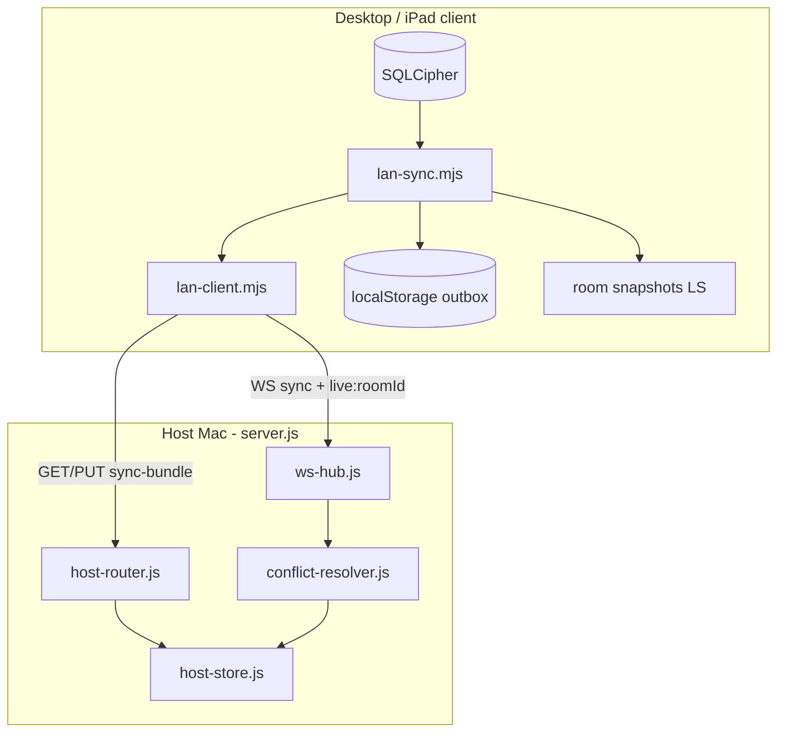
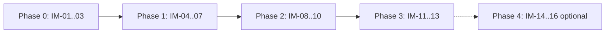

# LAN Sync Improvements — Design Spec

> **For implementation:** Use **superpowers:executing-plans** (or subagent-driven-development) with the task-by-task plan below. Ship in phases; do not big-bang rewrite.

**Date:** 2026-06-03  
**Status:** Approved. **Plan:** [`docs/superpowers/plans/2026-06-03-lan-sync-improvements.md`](../plans/2026-06-03-lan-sync-improvements.md).  
**Scope:** Reliability, UX, and maintainability of guardia LAN / LiveSync — **without** replacing hub-and-spoke topology or SQLCipher local-first model.

## Related work

| Document | Relationship |
|----------|----------------|
| [`2026-05-30-lan-host-concurrency-design.md`](2026-05-30-lan-host-concurrency-design.md) | Revision + per-entity versioning (implemented) |
| [`2026-05-30-clinical-conflict-resolution-design.md`](2026-05-30-clinical-conflict-resolution-design.md) | ConflictResolver, diff viewer, drafts |
| [`2026-05-30-lan-security-hardening-design.md`](2026-05-30-lan-security-hardening-design.md) | Bearer auth, WS auth, tickets |
| [`2026-06-01-sala-based-lan-rooms-design.md`](2026-06-01-sala-based-lan-rooms-design.md) | `sala-1` / `sala-2` / `sala-e` room IDs |
| [`2026-06-01-guardia-lan-hub-design.md`](2026-06-01-guardia-lan-hub-design.md) | ⇄ panel, auto-discovery (partial overlap with §8–10) |
| [`2026-06-01-lan-teams-decoupled-design.md`](2026-06-01-lan-teams-decoupled-design.md) | `clinicalOps` tables, directorio |
| Release **6.6.0** | @usuario sin ⇄ obligatorio; ticket `forceNew`; directorio fixes |

## Problem statement

Guardia LAN sync (hub host on `:3738`, clients on SQLCipher + room bundles) is **architecturally appropriate** for ward-scale offline-first use. Production pain comes from:

1. **Implementation bugs** — e.g. profile push reopening live WebSocket and reporting success incorrectly.
2. **Overlapping transports** — full bundles on both HTTP and WS increase merge churn and 409 rates.
3. **Implicit state** — `activeLiveSyncRoomId`, membership, and WS flags can diverge.
4. **Fragile offline queue** — `localStorage` outbox vs durable clinical DB.
5. **Operational opacity** — 401, timeout, outbox depth, and host role switches are hard to diagnose on the ward.
6. **Monolith** — `public/js/features/lan-sync.mjs` (~4k lines) slows safe iteration.

This spec captures **all** proposed improvements (P0–P4) in one roadmap with acceptance criteria.

## Design principles (unchanged)

- **Local-first:** SQLCipher on each desktop remains authoritative for that device until host merge commits.
- **Hub-and-spoke:** One embedded host per guardia subnet; iPad/guest via ticket exchange — not full mesh P2P.
- **Clinical safety:** Structural conflicts → 409 / diff viewer; no silent LWW on clinical entities.
- **Domain merge, not generic CRDT:** Set merge + tombstones for `clinical_users`; OCC for patients/todos/agenda.
- **Debt:** No increase in `scripts/metrics/baseline.json` total score; prefer new focused modules over growing `lan-sync.mjs`.

---

## Architecture today (baseline)



**Cold path:** `GET/PUT /api/lan/v1/rooms/:id/sync-bundle` — revision + `entityVersions`, `clinicalOps` snapshot.  
**Hot path:** WebSocket `live:{roomId}` — `livesync:bundle`, `livesync:patch`, hello/leave.  
**Directory:** `clinical-profile-lan-sync.mjs` → `pushClinicalOpsLanNow` → bundle includes `clinicalOps`.

---

## Improvement catalog (complete)

| ID | Priority | Title | Effort |
|----|----------|-------|--------|
| **IM-01** | P0 | Fix profile push live WebSocket behavior | S |
| **IM-02** | P0 | Structured push result codes for UI | S |
| **IM-03** | P0 | Ticket expiry UX in ⇄ panel | S |
| **IM-04** | P1 | Room sync state machine | M |
| **IM-05** | P1 | Separate HTTP vs WS responsibilities | M |
| **IM-06** | P1 | SQLCipher-backed LAN outbox | M |
| **IM-07** | P1 | `clinical-ops` slice endpoint | M |
| **IM-08** | P2 | Explicit host role per shift | M |
| **IM-09** | P2 | Sync health panel (observability) | M |
| **IM-10** | P2 | Confirm inferred auto-join sala | S |
| **IM-11** | P3 | Split `lan-sync.mjs` into modules | L |
| **IM-12** | P3 | Domain merge registry | M |
| **IM-13** | P3 | Host `clinicalOps` in SQLCipher (incremental) | L |
| **IM-14** | P4 | CRDT for co-edited rich text (one field) | L |
| **IM-15** | P4 | True P2P mesh (optional product fork) | XL |
| **IM-16** | P4 | Cloud continuation layer | XL |

---

## Phase 0 — Bug fixes & honest UX (IM-01 – IM-03)

### IM-01 — Fix profile push live WebSocket behavior

**Problem:** `pushClinicalOpsLanNow` calls `connectLiveChannel(roomId)` when `lanClient.liveConnected`, which closes and reopens the socket; `sendLive` may run in `CONNECTING` state. `pushedLive` is set `true` unconditionally.

**Files:** `public/js/features/lan-sync.mjs` (or `lan-sync-push.mjs` after IM-11).

**Required behavior:**

1. If `liveConnected` and `liveRoomId === roomId` and `readyState === OPEN` → **do not** call `connectLiveChannel`; call `sendLive` only.
2. If live channel wrong room or closed → `connectLiveChannel` once; wait for `lan-live-status` connected (or timeout 3s) before `sendLive`.
3. `pushedLive = lanClient.sendLive(envelope) === true` (boolean from client).
4. Unit test (source contract): no `connectLiveChannel` between `liveConnected` check and `sendLive` without room mismatch.

**Acceptance:**

- [ ] Register @usuario with live sala connected: peer sees handle in directorio within one debounce cycle without WS drop in DevTools.
- [ ] Existing `lan-sync-clinical-ops.test.mjs` extended for “no reconnect when already live”.

---

### IM-02 — Structured push result codes

**Problem:** Callers only see `{ ok, code }`; cannot distinguish HTTP success vs live-only vs queued.

**API:**

```ts
// pushClinicalOpsLanNow / flushClinicalProfileToLan
type LanPushResult = {
  ok: boolean;
  code?: 'NO_LAN' | 'NO_ROOM' | 'NO_CLINICAL_OPS' | 'NO_SNAPSHOT' | 'PITCH_DEMO' | 'PUSH_FAILED';
  channels?: {
    http?: boolean;
    live?: boolean;
    outbox?: boolean;
  };
};
```

**Files:** `public/js/features/lan-sync.mjs`, `public/js/clinical-profile-lan-sync.mjs`, `public/js/features/clinical-registration.mjs`, `public/js/features/clinical-onboarding.mjs`, `public/js/features/clinical-teams.mjs`.

**UI:**

- Benign codes (`isBenignLanPushSkipCode`) — unchanged, no toast.
- `PUSH_FAILED` with `outbox: true` — info toast: “Guardado localmente; se publicará al reconectar.”
- `ok` with only `outbox` — same.
- `ok` with `http` or `live` — optional success hint in debug builds only.

**Acceptance:**

- [ ] Registration/onboarding tests assert `channels` shape when mocked.

---

### IM-03 — Ticket expiry UX

**Problem:** Tickets expire in 5 minutes (`lan-squad/ticket-store.js` `TTL_MS`); users copy stale links.

**UI (⇄ / interno QR panel):**

- After mint: show “Válido hasta HH:MM” (from `expiresAt`).
- When &lt; 60s remaining: subtle warning styling.
- On copy: toast includes expiry time.

**Files:** `public/js/features/lan-sync.mjs` (`mintLanPairingTicket`, `updateLanPairingDisplay`), `public/js/features/interno-qr-panel.mjs` if it reuses pairing.

**Acceptance:**

- [ ] Display updates on each `forceNew` mint.
- [ ] No server change required (already returns `expiresAt`).

---

## Phase 1 — Sync reliability (IM-04 – IM-07)

### IM-04 — Room sync state machine

**Problem:** `activeLiveSyncRoomId`, `getRoomMembership()`, `lanClient.connected`, `lanClient.liveConnected` are updated in many places; UI shows “reconectando” while pushes use stale room id.

**Model:**

```text
offline          — no LAN config or ping failed
configured       — hostUrl + teamCode, not in room
joining          — joinLanRoom called; WS opening
catching_up      — reconcileLiveSyncRoom in flight
live             — live WS open + last reconcile ok
degraded         — membership set but live down (reconnect loop)
```

**Module:** `public/js/lan-sync-state.mjs` (new).

**Exports:**

- `getRoomSyncPhase(roomId?)`
- `setRoomSyncPhase(roomId, phase, meta?)`
- `subscribeRoomSyncPhase(cb)` → unsubscribe

**Integration:** `joinLanRoom`, `leaveLiveSyncRoom`, `reconcileLiveSyncRoom`, `lan-live-status`, `lan-status`, `bootLanRoomMembership` transition phases only through this module.

**UI:** `#lan-livesync-status` and ⇄ panel read phase for copy (“Sincronizando…” / “Solo local” / “Reconectando…”).

**Acceptance:**

- [ ] Phase `live` implies `ensureEffectiveLiveSyncRoomId()` non-empty.
- [ ] `pushClinicalOpsLanNow` returns `NO_ROOM` when phase is `configured` without membership room.
- [ ] Tests: transition table for join → catching_up → live → degraded.

---

### IM-05 — Separate HTTP vs WebSocket responsibilities

**Problem:** `scheduleLiveSyncPush` sends full `livesync:bundle` on WS and PUTs full bundle on HTTP every ~900ms debounce — duplicate merges and bandwidth.

**Target split:**

| Transport | Responsibility |
|-----------|----------------|
| **HTTP** `sync-bundle` | Initial reconcile after join; profile push (`pushClinicalOpsLanNow`); periodic full reconcile (optional, e.g. every 5 min); outbox drain |
| **WS** `live:*` | `livesync:patch` (entity mutations); `livesync:hello` / `livesync:leave`; **optional** compact `livesync:revision` hint `{ roomId, revision, clientId }` — not full bundle |

**Changes:**

1. `scheduleLiveSyncPush`: default **HTTP only**; WS bundle only when `opts.includeWsBundle === true` (leave flow, manual “forzar sync”).
2. Peers on `livesync:revision` hint → debounced `reconcileLiveSyncRoom` (single flight).
3. Document in code comment at top of push scheduler.

**Files:** `public/js/features/lan-sync.mjs`, `lan-squad/ws-hub.js` (forward `livesync:revision`).

**Acceptance:**

- [ ] Normal edit stream does not send full bundle over WS more than once per explicit user action.
- [ ] Join room still applies server bundle via HTTP reconcile.
- [ ] No regression in `lan-sync-clinical-ops.test.mjs` / host-router bundle tests.

**Non-goals:** Change ConflictResolver semantics.

---

### IM-06 — SQLCipher-backed LAN outbox

**Problem:** `public/js/live-sync-outbox.mjs` uses `localStorage` (`rpc-lan-sync-outbox`), max 50 items/room — not durable across profile corruption, not visible when DB locked.

**Schema** (bump `lib/db/schema.mjs` version — migration required):

```sql
CREATE TABLE IF NOT EXISTS lan_sync_outbox (
  id INTEGER PRIMARY KEY AUTOINCREMENT,
  room_id TEXT NOT NULL,
  kind TEXT NOT NULL CHECK (kind IN ('bundle', 'patch', 'clinical_ops')),
  payload_json TEXT NOT NULL,
  enqueued_at TEXT NOT NULL,
  attempts INTEGER NOT NULL DEFAULT 0,
  last_error TEXT
);
CREATE INDEX IF NOT EXISTS idx_lan_outbox_room ON lan_sync_outbox(room_id, enqueued_at);
```

**IPC:** `dbLanOutboxEnqueue`, `dbLanOutboxDrain`, `dbLanOutboxCount` in `lib/db/ipc-handlers.mjs`.

**Renderer:** Replace `enqueueOutbox` / `drainOutbox` implementations to call IPC when DB unlocked; fallback to legacy LS queue **only** when DB unavailable (log once).

**Retention:** Max 50 per room (delete oldest on enqueue); increment `attempts` on failed drain; drop after 10 attempts + surface in health panel (IM-09).

**Acceptance:**

- [ ] `schema.test.mjs` covers migration.
- [ ] Outbox survives app restart (integration test with temp DB).
- [ ] `flushLiveSyncOutbox` uses SQL path when unlocked.

---

### IM-07 — Clinical-ops slice endpoint

**Problem:** Directory / @usuario push ships entire room bundle when census is large — slow, more 409s, `liveSyncBundleHasPayload` edge cases.

**HTTP API (host):**

```http
GET  /api/lan/v1/rooms/:roomId/clinical-ops
PUT  /api/lan/v1/rooms/:roomId/clinical-ops
Authorization: Bearer <teamCode>
Content-Type: application/json

PUT body: {
  "snapshot": { /* clinicalOps export shape */ },
  "baseRevision": number | null,
  "clientId": string
}

Response 200: { "snapshot": merged, "revision": number }
Response 409: { "conflicts": [...], "snapshot": server }  // same pattern as sync-bundle
```

**Server:** `lan-squad/host-router.js` + merge via `mergeClinicalOpsSnapshotsData` in `lib/db/clinical-ops-bundle-merge.cjs` (already used in `bundle-merge.js`).

**Client:** `pushClinicalOpsLanNow` tries PUT clinical-ops first; on success skip full bundle for ops-only push. Full bundle still used for join/reconcile.

**Acceptance:**

- [ ] `host-router.test.js` PUT clinical-ops merge + 409 stale revision.
- [ ] Profile push payload &lt; 100KB typical with 50+ patients in room (manual QA note in plan).
- [ ] Directorio refresh still merges via `reconcileLiveSyncRoom` full bundle path.

---

## Phase 2 — Ward operations (IM-08 – IM-10)

### IM-08 — Explicit host role per shift

**Problem:** `scanLanHosts` + rank supersede + `scheduleSurrogateFailoverCheck` can switch clients to another Mac without explicit user intent.

**Product rules:**

1. **Pinned host (default):** Settings key `rpc-lan-pinned-host-url` — when set, auto-discovery **never** supersedes unless user clears pin or uses “Seguir anfitrión detectado”.
2. **Shift host election (optional):** When primary ping fails N times, toast: “¿Usar [hostname/IP] como anfitrión del turno?” — Confirm applies `applyLanHostUrlSwitch`; Cancel enters `degraded` only.
3. **Rank supersede:** Disabled when pin active; when unpinned, only suggest (toast), do not auto-switch without IM-08 confirm (change from current auto `applyLanHostUrlSwitch` in scan).

**Files:** `public/js/features/lan-sync.mjs`, `public/js/lan-surrogate-host.mjs`, ⇄ panel UI, `public/js/storage.js` or `rpc-settings`.

**Acceptance:**

- [ ] Two Macs same rank: no silent host switch during guardia.
- [ ] User can pin current host from ⇄.
- [ ] Surrogate failover still works after explicit confirm.

**Related:** Partially overlaps [`guardia-lan-hub-design.md`](2026-06-01-guardia-lan-hub-design.md) auto-discovery — this spec **narrows** supersede behavior.

---

### IM-09 — Sync health panel (observability)

**Problem:** Ward debugging requires DevTools; clinicians report “no conecta” without actionable detail.

**UI location:** ⇄ panel collapsible **“Estado de sincronización”** (desktop); optional row in Ajustes → LAN.

**Fields (read-only):**

| Field | Source |
|-------|--------|
| Host URL | `lanClient.baseUrl()` |
| Last ping | timestamp + status code |
| WS sync / live | `lanClient.connected`, `liveConnected`, `liveRoomId` |
| Room phase | IM-04 `getRoomSyncPhase()` |
| Room revision | `host-bundle-bases.mjs` / last successful GET |
| Outbox count | IM-06 `dbLanOutboxCount` or legacy |
| Last error | ring buffer last 5: `{ at, op, code, message }` |
| Team code aligned | result of `ensureLanClientTeamCodeAligned` |
| Pinned host | IM-08 |

**API:** `export function getLanSyncDiagnostics()` from `lan-sync-diagnostics.mjs`.

**Acceptance:**

- [ ] Copy-to-clipboard “Informe para soporte” (redact team code → `***`).
- [ ] No new npm deps; no PHI in diagnostics (room id ok, no patient names).

---

### IM-10 — Confirm inferred auto-join sala

**Problem:** 6.6.0 `saveLanSettingsFromUi` auto-calls `joinLanRoom` from `resolveAutoJoinRoomId('')` — wrong sala in settings joins wrong room silently.

**Rules:**

1. **Explicit membership or URL `room` param** → auto-join without confirm (current behavior).
2. **Inferred only from `rpc-settings.clinicalSala`** → modal or confirm toast: “¿Unirte a [Sala X]?” with Confirm / Cancel.
3. **Create room** (IM from 6.6.0) — still auto-join created room (explicit action).

**Files:** `public/js/features/lan-sync.mjs` (`saveLanSettingsFromUi`, `resolveAutoJoinRoomId`).

**Acceptance:**

- [ ] Changing only `clinicalSala` in settings does not join until user confirms once per session (session flag `rpc-lan-auto-join-confirmed-sala`).

---

## Phase 3 — Maintainability & host data model (IM-11 – IM-13)

### IM-11 — Split `lan-sync.mjs`

**Goal:** Files ≤600 lines (Tier 1 debt); no new static imports in `app.js` / `app-runtimes.mjs` — re-export facade from thin `lan-sync.mjs`.

**Proposed modules:**

| Module | Responsibility |
|--------|----------------|
| `public/js/features/lan-sync.mjs` | Facade: `registerLanRuntime`, re-exports, `initLanHostPlugAndPlay` |
| `public/js/lan-sync-transport.mjs` | `LanClient` wiring, ping, `persistLanClientConfig`, bearer align |
| `public/js/lan-sync-room.mjs` | `joinLanRoom`, `leaveLiveSyncRoom`, membership, reconcile, IM-04 state |
| `public/js/lan-sync-push.mjs` | `scheduleLiveSyncPush`, `pushClinicalOpsLanNow`, outbox drain |
| `public/js/lan-sync-panel.mjs` | `renderLanPanel`, pairing UI, IM-03/09 UI |
| `public/js/lan-sync-failover.mjs` | Surrogate, host switch, IM-08 pin |
| `public/js/lan-sync-diagnostics.mjs` | IM-09 |

**Migration:** Move code without behavior change in first PR; IM-01–10 in follow-ups.

**Acceptance:**

- [ ] `app-runtimes.mjs` still imports only `./features/lan-sync.mjs`.
- [ ] `npm run metrics` total score ≤ baseline.
- [ ] All existing LAN tests pass.

---

### IM-12 — Domain merge registry

**Problem:** Merge logic spread across `live-sync-room.mjs`, `lan-patient-merge.mjs`, `clinical-ops-bundle-merge.mjs`, `bundle-merge.js`.

**Module:** `public/js/lan-merge-registry.mjs` (renderer) + `lan-squad/merge-registry.js` (host, thin wrapper over existing functions).

```js
// Renderer example
export const mergeRegistry = {
  agenda: mergeLiveSyncBundlesAgenda,
  todo: mergeLiveSyncBundlesTodos,
  patient: mergeLanPatientEntrySources,
  clinicalOps: mergeClinicalOpsFromSources,
  manejo: mergeManejoFromSources,
};
export function mergeRoomSources(sources) { /* dispatch per domain */ }
```

**Acceptance:**

- [ ] `mergeLiveSyncFullBundles` delegates to registry (no semantic change).
- [ ] New domain adds one registry entry + tests.

---

### IM-13 — Host clinical state in SQLCipher (incremental)

**Problem:** Host stores room bundles in `lan-squad-host-state.json` while clients use SQLCipher for `clinical_users` — dual persistence story.

**Incremental path (do not block IM-06–07):**

1. **Phase 13a:** Host process reads/writes `clinicalOps` slice via same `dbClinicalOpsExport/Merge` IPC when host DB unlocked (Electron main owns DB).
2. **Phase 13b:** `roomSyncBundles[].clinicalOps` becomes cache/materialized view refreshed from DB after merge.
3. **Phase 13c (optional):** Patient entities in host DB — out of scope until JSON host proven bottleneck.

**Acceptance:**

- [ ] Directorio on host matches client after push without JSON-only drift.
- [ ] `resetLanSquadHostState` docs updated: what is cleared vs DB.

**Non-goals (13 v1):** Remove JSON host file entirely.

---

## Phase 4 — Future product forks (IM-14 – IM-16)

> Implement only if product requirements explicitly expand. Documented here for completeness.

### IM-14 — CRDT for co-edited rich text (one field)

**When:** Shared real-time editing of a single note/body field (SOAP fragment).

**Approach:** Yjs or Automerge on that field only; host stores opaque Yjs update blob in entity map; **not** full-chart CRDT.

**Dependencies:** IM-11 module split, IM-12 registry entry `soapBody: yjsMerge`.

**Reference:** [CRDT Applications — field-level hybrid](https://hld.handbook.academy/curriculum/architecture-patterns/crdt-applications/).

**Acceptance (if built):** Two clients type concurrently in same note → no character loss; audit log records merge session id.

---

### IM-15 — True P2P mesh

**When:** Requirement “no designated host” or multi-hop across VLANs.

**Approach:** Replace hub with mesh library (e.g. WebRTC + sync protocol); store-and-forward encrypted messages per [medical P2P sync research](https://eprints.soton.ac.uk/432000/1/doc.pdf).

**Impact:** Supersedes ticket model, `server.js` LAN router, surrogate — **new product surface**.

**Acceptance:** Defined only in a future spec; **no implementation** under this document.

---

### IM-16 — Cloud continuation layer

**When:** Multi-site HIE or central backup beyond LAN.

**Approach:** Append-only event log per room → central Postgres (ElectricSQL / PowerSync / custom); LAN layer remains edge replica; FHIR export optional.

**Dependencies:** IM-13 host DB, stable event schema from IM-05 revision hints.

**Acceptance:** Defined only in a future spec; **no implementation** under this document.

---

## Cross-cutting requirements

### Security

- IM-07 clinical-ops endpoint: same Bearer middleware as sync-bundle.
- IM-09 diagnostics: redact secrets; no export of patient demographics.
- IM-15/16: require separate security review.

### Testing

| Area | Tests |
|------|--------|
| IM-01–02 | `lan-sync-clinical-ops.test.mjs`, `clinical-profile-lan-sync.test.mjs` |
| IM-06 | `lib/db/schema.test.mjs`, IPC handler tests |
| IM-07 | `lan-squad/host-router.test.js` |
| IM-04 | `lan-sync-state.test.mjs` (new) |
| IM-12 | `lan-merge-registry.test.mjs` (new) |

### Metrics & context

- Update `.cursor/rules/project-context.mdc` changelog when Phase 1+ ships modules/paths.
- Touch files in diff must satisfy Tier 1 budgets (`technical-debt-accounting.mdc`).

### i18n

- User-facing strings: Spanish, consistent with ⇄ panel.

---

## Implementation phases (recommended order)



| Phase | Items | Outcome |
|-------|-------|---------|
| **0** | IM-01, IM-02, IM-03 | Fewer directorio/iPad flakes; clearer errors |
| **1** | IM-04, IM-05, IM-06, IM-07 | Stable sync; durable queue; lighter profile push |
| **2** | IM-08, IM-09, IM-10 | Predictable host; ward-debuggable |
| **3** | IM-11, IM-12, IM-13 | Sustainable codebase; host DB alignment |
| **4** | IM-14, IM-15, IM-16 | Only if product expands |

---

## Success criteria (program level)

- [ ] Directorio: @usuario visible to peers within one reconcile cycle when LAN + sala joined (median &lt; 10s on LAN).
- [ ] No regression: `npm test` LAN-related suites green.
- [ ] Support: user can paste diagnostics from ⇄ without DevTools (IM-09).
- [ ] Debt: `totalScore` ≤ baseline after each phase.
- [x] Docs: implementation plan exists under `docs/superpowers/plans/2026-06-03-lan-sync-improvements.md`.

---

## Explicit non-goals

- Replacing hub-and-spoke with mesh (except IM-15 future fork).
- Full-chart CRDT migration (IM-14 is single-field only).
- Removing clinical conflict viewer or automatic merge on overlapping clinical keys.
- Changing LAN port, ticket crypto, or team code rotation (see security spec).
- Rewriting `storage.js` expediente persistence.

---

## Open questions

1. **IM-05:** Should `livesync:leave` still send full bundle on WS for peer merge, or HTTP-only leave snapshot?
2. **IM-08:** Should R4/Admin always be allowed to force supersede without confirm?
3. **IM-13:** Does host process always have clinical DB unlocked when acting as anfitrión?
4. **IM-07:** Max body size for clinical-ops PUT (default 1MB vs sync-bundle 16MB)?

Resolve in plan review before Phase 1 coding.

---

## Appendix A — File touch map

| Item | Primary files |
|------|----------------|
| IM-01–05, 08–11 | `public/js/features/lan-sync.mjs` → split modules |
| IM-06 | `lib/db/schema.mjs`, `lib/db/ipc-handlers.mjs`, `live-sync-outbox.mjs` |
| IM-07 | `lan-squad/host-router.js`, `clinical-ops-lan.mjs` |
| IM-09 | `lan-sync-panel.mjs`, `lan-hub-*.mjs` |
| IM-12 | `live-sync-room.mjs`, `lan-squad/bundle-merge.js` |
| IM-13 | `lan-squad/host-store.js`, `main.js`, `lib/db/*` |

---

## Appendix B — Changelog entry (on first merged phase)

```markdown
- **2026-06-03** `lan-sync-improvements`: spec for reliability, outbox SQL, clinical-ops endpoint, state machine; `docs/superpowers/specs/2026-06-03-lan-sync-improvements-design.md`.
```
