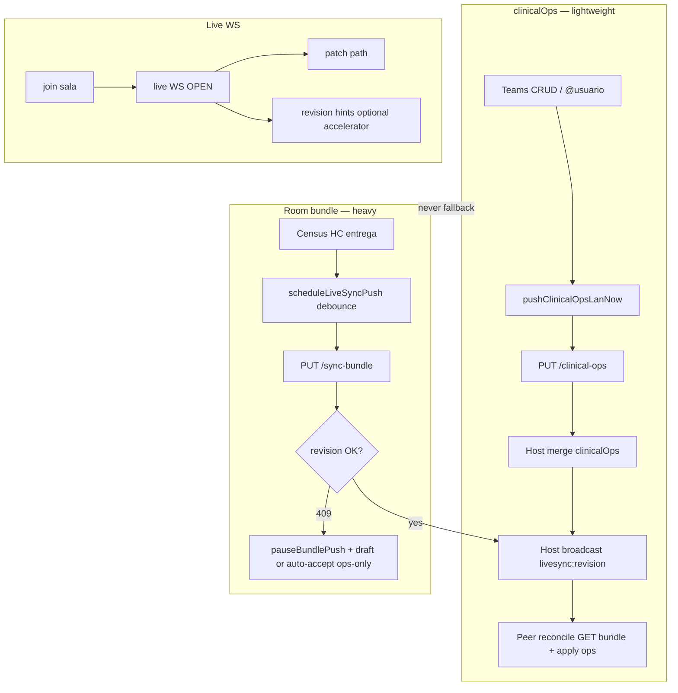

# LAN Ward-Ready Remediation — Design Spec

> **For implementation:** After this spec is approved in review, use **superpowers:writing-plans** for a task-by-task plan. Do not start coding from this document without an approved plan.

**Date:** 2026-06-03  
**Status:** Draft — pending user review  
**Scope:** Close all production LAN pain reported through 6.6.1 pilot: teams/directorio, `catching_up` stuck, bundle 409 storms, outbox/network confusion, conflict UX. Builds on **LAN sync improvements Phases 0–3** ([2026-06-03-lan-sync-improvements-design.md](./2026-06-03-lan-sync-improvements-design.md)) and uncommitted ward fixes in the working tree.

**Program choice:** **Approach 1** (complete the 6.6.1 HTTP-primary + `clinical-ops` model) plus **selective decoupling** (teams/directorio never escalate to full `sync-bundle`).

---

## Problem statement

Guardia LAN is architecturally sound (hub host, SQLCipher local-first, versioned patches, `clinical-ops` slice). Ward failures cluster into **three pipelines** that were conflated in UX and code:

| Pipeline | Transport | User-visible failure |
|----------|-----------|----------------------|
| **clinicalOps** | `PUT /clinical-ops` (~1 MB) | Partner blind to teams / @usuario |
| **Room bundle** | `PUT /sync-bundle` (heavy) | `NETWORK`, `409`, `outboxCount`, census lag |
| **Live channel** | WS `live:{roomId}` | `wsLive: false`, leave/rejoin, `catching_up` stuck |

Reported symptoms (6.5.9–6.6.1 pilot):

- Team visible on creator Mac, **not on partner** (4+ versions).
- Diagnostics show **`sync-bundle` errors** during team create (misread as “team create failed”).
- **`phase: catching_up`** with `wsLive: true` until leave/rejoin.
- **409 bundle conflicts** piling up (~1500 drafts); bulk clear froze app.
- **Directorio** empty while ⇄ “looks connected”.
- Patient/team filtering not updating when bundle path blocked.

**Already implemented in working tree (keep):**

- Leave team (`Salir del equipo`) + entrega guard + `publishClinicalTeamsToLan`.
- `reconcileLiveSyncRoom` `finally` → `applyRoomSyncPhaseAfterReconcile`.
- `ensureEffectiveLiveSyncRoomId`, `liveSyncRoomIdIsRelevant`.
- Host `broadcastLiveRevision` on `PUT clinical-ops` (tested).
- Mi rotación `pullClinicalOpsFromLanRoom` on open.
- Team create `toastTeamLanPublishResult`.
- Conflict drafts section wiring, bundle push pause, bulk server resolve (partial — must ship with this program).

---

## Success criteria (ship gate)

Homogeneous **6.6.1+** on all stations + host Mac, same `teamCode`, host DB unlocked when acting as anfitrión.

| # | Criterion | Measurement |
|---|-----------|-------------|
| 1 | Team create → partner sees team in Mi rotación | &lt; 15 s, no leave/rejoin; host `clinical-ops` revision increases |
| 2 | @usuario in directorio after register + push | Peer sees handle after one reconcile or Mi rotación open |
| 3 | `phase` not stuck in `catching_up` | After reconcile or failed GET, phase → `live` or `degraded` within 5 s |
| 4 | Team publish does not enqueue heavy bundle | `lastErrors` after team create has no `sync-bundle` unless user edited census |
| 5 | Outbox drains `clinical_ops` | `outboxCount → 0`; flush replays ops PUT before bundle |
| 6 | 409 storm bounded | No &gt; 3 room-bundle drafts per room without user action; pause prevents push loop |
| 7 | Bulk “usar servidor” completes | No UI freeze &gt; 2 s; app usable |
| 8 | `npm test` | LAN suites green; new tests in §4 |

**Explicit non-goals:** IM-14–16, mixed 6.6.0/6.6.1 turnos, P2P mesh, disabling patch/OCC for patient/todo/agenda.

---

## Architecture (target)



---

## Section 2 — Implementation by file

### 2.1 `public/js/lan-sync-push.mjs` (P0)

**IM-OPS-1 — No bundle fallback from `pushClinicalOpsLanNow`**

- Remove `pushRoomSyncBundleToHost` from the `clinical-ops` non-OK and `catch` paths.
- On network/HTTP failure: enqueue **`{ kind: 'clinical_ops', payload: { snapshot, baseRevision, clientId } }`** only.
- Return `lanPushResult(false, 'PUSH_FAILED', { outbox: true })` without attempting bundle.

**IM-OPS-2 — `clinical_ops` outbox drain**

- Extend `flushLiveSyncOutbox` to process `kind === 'clinical_ops'`:
  - `PUT /rooms/:id/clinical-ops` with stored payload.
  - On success: update `setHostBundleBases`, `emitLiveSyncRevisionHint` if WS open.
  - On failure: re-enqueue same item (increment attempts via DB layer if available).
- Order: drain **clinical_ops** items before **bundle** items for the same room.

**IM-OPS-3 — 409 on clinical-ops = success for publish UX**

- After `acceptServerClinicalOpsConflict` and host revision broadcast (peer will reconcile):
  - Return `lanPushResult(true, undefined, { http: true })` OR code `CONFLICT_RESOLVED` treated as success in `toastTeamLanPublishResult`.
- Keep `pauseBundlePushForRoom` to avoid immediate bundle fight.

**IM-OPS-4 — Reconcile phase (keep + harden)**

- Keep `finally { applyRoomSyncPhaseAfterReconcile }`.
- If `fetch sync-bundle` fails but `fetchAndApplyClinicalOpsFromHost` succeeds, still call `applyRoomSyncPhaseAfterReconcile` (may require bridge hook from `lan-sync-room.mjs`).

**IM-OPS-5 — Revision hint when WS down**

- Do not rely solely on `emitLiveSyncRevisionHint` (requires `liveConnected`).
- Document: peers depend on **host** `broadcastLiveRevision` after ops PUT (already implemented).

### 2.2 `lan-squad/host-router.js` (P0)

**IM-HOST-1 — Always broadcast revision on successful `sync-bundle` PUT**

```javascript
// After putRoomSyncBundle success:
broadcastLiveRevision(req.params.id, out.revision, body.uploadedByClientId || body.clientId);
```

Remove guard `if (out && (out.clinicalOps || body.clinicalOps))`.

**IM-HOST-2 — Keep clinical-ops broadcast** (already done; no change).

Add/extend test: `PUT sync-bundle` success emits `livesync:revision` even when body has no `clinicalOps`.

### 2.3 `public/js/features/clinical-teams.mjs` (P1 — mostly done)

- **Keep:** `publishClinicalTeamsToLan`, `toastTeamLanPublishResult`, `pullClinicalOpsFromLanRoom`, leave team, join-after-pull.
- **Extend `toastTeamLanPublishResult`:**
  - `ok` + `channels.http` → “Equipo creado y publicado en sala ⇄.”
  - `ok` + only `channels.outbox` → “Equipo creado; se publicará cuando vuelva la red (cola ⇄).”
  - `CONFLICT_RESOLVED` / merged 409 → “Equipo creado; directorio alineado con el servidor.”
- **Leave team:** already calls `publishClinicalTeamsToLan` after remove — verify tombstone/membership visible on host snapshot.

### 2.4 `public/js/lan-sync-room.mjs` (P1)

- **Join flow:** after membership set: `ensureEffectiveLiveSyncRoomId` → open live WS → `reconcileLiveSyncRoom` → `flushLiveSyncOutbox` (ops first).
- **`applyRoomSyncPhaseAfterReconcile`:** keep; if `wsLive` false for &gt; 30 s while membership valid, surface ⇄ copy “Reconectando sala en vivo…” (optional IM-09 enhancement).
- **`refreshLanClinicalDirectoryFromRoom`:** use `ensureEffectiveLiveSyncRoomId`; prefer `GET clinical-ops` then merge before full bundle GET when possible (optimization, P2).

### 2.5 `public/js/features/lan-sync.mjs` + panel (P1)

- **Keep:** `appendLanConflictDraftsSection` registered in `registerLanSyncPanelRuntime`.
- **`resolveAllConflictDraftsUseServer`:** keep 120s bundle pause + batched draft clear; ensure no synchronous per-draft modal in loop.
- **Do not create room-bundle draft** when failure originated from `pushClinicalOpsLanNow` (ops path only).

### 2.6 `public/js/lan-sync-bundle-push.mjs` (P1 — ship)

- Keep `pauseBundlePushForRoom`, `bundleConflictsAreClinicalOpsOnly`, `isBundlePushPaused`.
- Default pause after 409: 45s (teams), 120s (bulk clear).

### 2.7 `public/js/draft-conflict-store.mjs` (P1)

- Keep `clearAllDraftConflicts` for bulk resolve.
- Optional: cap list UI at 50 with “+ N más — usar servidor para todos”.

### 2.8 `lib/db/lan-sync-outbox.mjs` + IPC (P2)

- Confirm `normalizeKind` accepts `clinical_ops`.
- IPC drain returns items in stable order (FIFO); renderer orders ops before bundle.

### 2.9 Documentation / release

- Update `docs/LAN_SYNC_6.6.1_RISK_ANALYSIS.md` appendix: “ward-ready remediation” closes ops/bundle split.
- Release notes 6.6.2: homogeneous turno, checklist reference.

---

## Section 3 — Conflict and merge policy

### 3.1 Principles

1. **Directory data** (`clinicalOps`: teams, membership, `clinical_users`, assignments) → prefer **slice endpoint** and **set merge** on host; never trigger full-bundle PUT from profile/team actions.
2. **Clinical entities** (patients, todos, agenda, HC) → keep revision + `ConflictResolver`; patch path unchanged.
3. **Room bundle 409** → not silent; but **bounded** user pain.

### 3.2 clinical-ops conflicts

| Case | Behavior |
|------|----------|
| Stale `baseRevision` on PUT | 409 + server snapshot |
| Client handler | `acceptServerClinicalOpsConflict` → apply snapshot locally, update bases, **toast success**, `pauseBundlePush` 45s |
| Peer | Host already broadcast revision → debounced reconcile |

No room-bundle draft for ops-only 409.

### 3.3 Room bundle conflicts

| Case | Behavior |
|------|----------|
| `conflicts` all `clinicalOps` / `revision` / empty keys | Auto `acceptServerBundleConflict` if implemented; else single draft |
| Mixed / patient keys | One draft; open ⇄ → Borradores; **no auto-retry push** for 45–120s (`pauseBundlePushForRoom`) |
| User bulk action | `resolveAllConflictDraftsUseServer`: clear drafts, pause 120s, `applyServerAuthorityLight` + clinical-ops GET, drain outbox |

### 3.4 Preventing 1500-draft avalanches

| Control | Mechanism |
|---------|-----------|
| Stop push loop | `isBundlePushPaused` + skip `scheduleLiveSyncPush` |
| Stop ops→bundle escalation | IM-OPS-1 |
| No draft on suppressed viewer | `isLanConflictViewerSuppressed` during bulk |
| Debounce reconcile | 500ms on revision hint (unchanged) |
| Host broadcast | Every successful PUT emits revision (IM-HOST-1) |

### 3.5 Mixed-version turno

Still **unsupported**: document in ward rollout; version check in diagnostics optional (P3).

---

## Section 4 — Testing and ward checklist

### 4.1 Automated tests (add or extend)

| Test file | Case |
|-----------|------|
| `lan-sync-clinical-ops.test.mjs` | `pushClinicalOpsLanNow` does not call `pushRoomSyncBundleToHost` on simulated network error (source contract / mock) |
| `lan-sync-clinical-ops.test.mjs` | 409 ops response → push result `ok: true` or benign success code |
| `live-sync-outbox.test.mjs` (new or extend) | enqueue `clinical_ops` → flush calls ops PUT not bundle |
| `lan-squad/host-router.test.js` | `PUT sync-bundle` without `clinicalOps` still broadcasts `livesync:revision` |
| `clinical-teams.test.mjs` | leave team + publish hook (existing); toast strings for outbox/http |
| `lan-sync-bundle-push.test.mjs` | pause skips `scheduleLiveSyncPush` |
| `draft-conflict-store.test.mjs` | bulk clear |

Run: `npm test` (full suite before ship).

### 4.2 Manual ward checklist (~25 min, 2 Macs + host)

**Prep:** Both clients 6.6.1+, same team code, host unlocked SQLCipher, firewall 3738, pin host IP.

1. **Ping:** Browser `http://<host>:3738` OK on both.
2. **Join:** Both ⇄ sala-2 → diagnostics `phase: live`, `wsLive: true`, same `bundleRevision` ±1.
3. **@usuario:** A registers → B sees in directorio &lt; 15 s.
4. **Team create:** A creates team → toast mentions publish/queue → B opens Mi rotación → team visible without rejoin.
5. **Invite code:** B joins with 8-char code after step 4.
6. **Leave team:** B leaves (no active entrega) → A no longer sees B on roster after reconcile.
7. **Census:** A saves patient field → B sees &lt; 5 s (allow debounce).
8. **Offline ops:** A airplane mode → create team → toast “cola” → online → `outboxCount: 0`, partner sees team.
9. **409 recovery:** If 409 reproduced → ⇄ borradores → bulk “usar servidor” → app responsive, `lastErrors` cleared.
10. **Host restart:** Host app restart → directorio still consistent after client reconcile.

**Fail criteria:** Any step requiring leave/rejoin for teams; `catching_up` &gt; 30 s with healthy network; `sync-bundle` in `lastErrors` immediately after team-only action.

---

## Rollout

| Step | Action |
|------|--------|
| 1 | Land remediation on `main` / 6.6.2 pre-release |
| 2 | Pilot 2–3 Macs one guardia (homogeneous build) |
| 3 | Hospital wide only after checklist pass |
| 4 | Downgrade policy: end of turno only (avoid 6.6.0 + 6.6.1 mix) |

---

## Debt and metrics

- No new static imports in `app.js` / `app-shell.mjs`.
- Tier 1 budgets on touched files (`lan-sync-push.mjs`, etc.).
- `npm run metrics` if wired: `totalScore` ≤ baseline.

---

## Open questions (resolve in plan review)

1. Should `GET /clinical-ops` be the default reconcile path before full bundle GET (latency vs completeness)?
2. Max `clinical_ops` outbox retries before ⇄ warning (10, same as bundle)?
3. Force `connectLiveChannel` on team publish when `wsLive: false` but HTTP ok (battery vs visibility)?

---

## References

- [2026-06-03-lan-sync-improvements-design.md](./2026-06-03-lan-sync-improvements-design.md)
- [LAN_SYNC_6.6.1_RISK_ANALYSIS.md](../../LAN_SYNC_6.6.1_RISK_ANALYSIS.md)
- [2026-06-01-lan-teams-decoupled-design.md](./2026-06-01-lan-teams-decoupled-design.md)
- [2026-05-30-clinical-conflict-resolution-design.md](./2026-05-30-clinical-conflict-resolution-design.md)

---

## Appendix — Changelog entry (on merge)

```markdown
- **2026-06-03** `lan-ward-ready`: ops/bundle decouple, clinical_ops outbox drain, host revision on all PUTs, phase/conflict remediation; `docs/superpowers/specs/2026-06-03-lan-ward-ready-remediation-design.md`.
```
