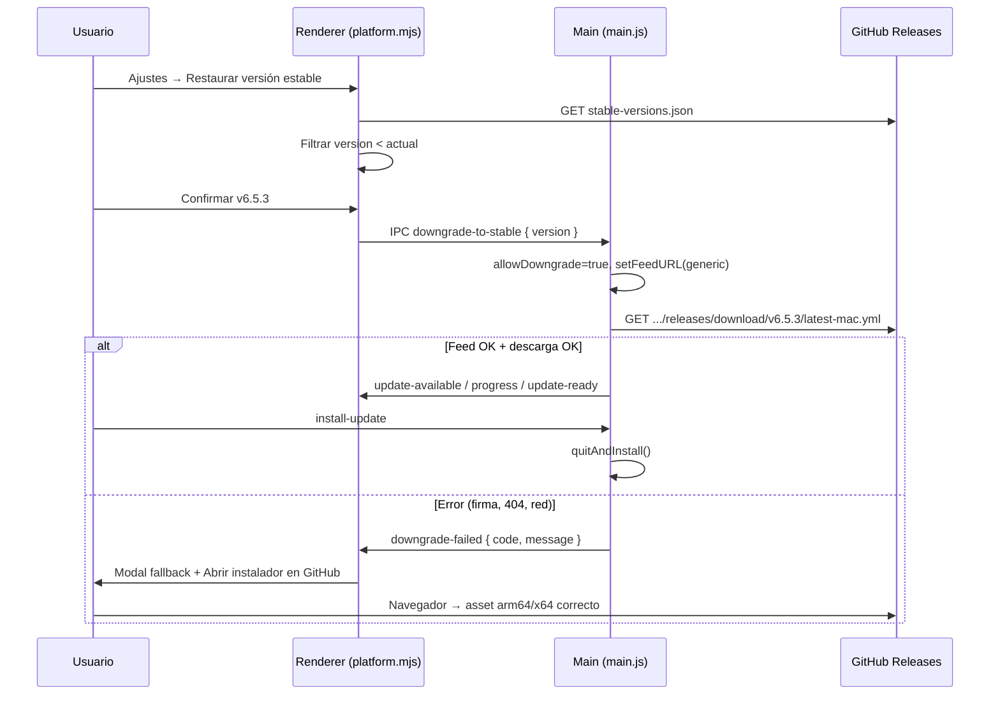

# Restaurar versión estable anterior — diseño

**Fecha:** 2026-06-03  
**Estado:** Aprobado (brainstorming — enfoque C híbrido)  
**Componente:** Downgrade a versiones estables curadas cuando la app falla o una release es defectuosa  
**Aplicación:** R+ (r-mas) — Electron + electron-updater, GitHub Releases

## Resumen

R+ incorpora un flujo **“Restaurar versión estable anterior”** en **Ajustes → Aplicación y actualizaciones**. El usuario elige una versión estable **anterior** a la instalada; la app intenta **descargar e instalar in-app** (mismo modal que las actualizaciones) y, si falla (firma macOS, red, feed ausente), ofrece **fallback guiado** a la release correcta en GitHub.

**Enfoque elegido:** **C — híbrido** (in-app + fallback manual).

**Alcance explícito:** solo **Electron de escritorio**. La versión web no tiene auto-update ni downgrade.

---

## Problema

Hoy R+ solo **sube** de versión:

- `autoUpdater.allowDowngrade = false` en canal Estable (`main.js`).
- `min-version.json` fuerza **mínimo hacia arriba**, nunca hacia abajo.
- La ayuda indica descargar manualmente desde Releases — sin lista curada ni deep link al artefacto correcto (arm64 vs x64).

Tras una release defectuosa (p. ej. 6.5.4 con error de arranque), el usuario necesita volver a la última estable conocida **sin perder datos locales** (`userData`, base clínica).

---

## Decisiones de producto (bloqueadas)

| Tema | Decisión |
|------|----------|
| Catálogo | **`stable-versions.json`** en repo (curado), no lista cruda de GitHub API |
| Quién aparece en la lista | Solo entradas con `version` **estrictamente menor** que la instalada (semver X.Y.Z) |
| Pre-releases | **No** listadas para downgrade (solo releases oficiales marcadas estables) |
| Datos locales | **No se borran** — downgrade cambia solo el binario; `userData` intacto |
| Ubicación UI | **Ajustes → Aplicación y actualizaciones**, debajo de “Buscar actualizaciones…” |
| Confirmación | Modal de confirmación antes de iniciar (versión destino + nota breve) |
| Canal beta | Downgrade **no cambia** el canal; tras restaurar, sigue Estable |
| `min-version.json` | **Sin cambio** — sigue bloqueando versiones demasiado viejas por compatibilidad de esquema |
| Telemetría | Reutilizar evento existente con `result: downgrade-success \| downgrade-fail` (opcional v1) |

---

## Catálogo remoto — `stable-versions.json`

Archivo en la raíz del repo, servido vía raw GitHub (mismo patrón que `min-version.json`).

```json
{
  "schema": 1,
  "updatedAt": "2026-06-03",
  "entries": [
    {
      "version": "6.5.3",
      "label": "6.5.3",
      "publishedAt": "2026-05-28",
      "summary": "Última estable antes de identidad LAN ampliada.",
      "recommended": true
    },
    {
      "version": "6.5.2",
      "label": "6.5.2",
      "publishedAt": "2026-05-20",
      "summary": "Parche de guardia y censo."
    }
  ]
}
```

### Reglas del catálogo

1. **`entries` ordenadas** de más reciente a más antigua (semver descendente).
2. Máximo **8 entradas** visibles (evitar lista interminable).
3. Campo opcional **`recommended: true`** — preseleccionar en el selector (solo una recomendada).
4. Mantenimiento: script en **`release.js` publish** añade/actualiza la versión que se publica; no automatizar borrado de entradas antiguas en v1 (edición manual OK).
5. URL de fetch (renderer):  
   `https://raw.githubusercontent.com/mausalas99/r-mas/main/stable-versions.json`  
   con `cache: 'no-store'`.

### Interacción con `min-version.json`

Si el usuario elige una versión **por debajo** de `minVersion`, mostrar aviso y **deshabilitar** in-app downgrade:

> “Esta versión ya no es compatible con tus datos. Contacta soporte o exporta un respaldo antes de continuar.”

Botón secundario: abrir Releases de todas formas (riesgo explícito del usuario).

---

## Flujo híbrido (in-app → fallback)



### Feed in-app (main process)

Para versión `V` y plataforma:

| Plataforma | URL base del feed (`provider: generic`) |
|------------|----------------------------------------|
| macOS | `https://github.com/mausalas99/r-mas/releases/download/v{V}/` |
| Windows | idem |

electron-updater resuelve `latest-mac.yml` o `latest.yml` dentro de esa URL (ya publicados en cada release).

```javascript
autoUpdater.allowDowngrade = true;
autoUpdater.autoDownload = true;
autoUpdater.setFeedURL({
  provider: 'generic',
  url: `https://github.com/mausalas99/r-mas/releases/download/v${version}/`,
});
autoUpdater.checkForUpdates();
```

Tras **éxito** o **cancelación**, restaurar feed por defecto (GitHub provider de `package.json`) y `allowDowngrade = false` para que las comprobaciones normales sigan subiendo.

### Fallback manual

Construir URL del instalador según `getPlatform()` + arquitectura:

| OS | Artefacto preferido |
|----|---------------------|
| darwin arm64 | `R+-{V}-arm64.dmg` |
| darwin x64 | `R+-{V}-x64.dmg` |
| win32 x64 | `R+-{V}-x64.exe` |

URL:  
`https://github.com/mausalas99/r-mas/releases/download/v{V}/{filename}`

Si el DMG falla en Mac por firma, el copy del modal ya menciona instalación manual — reforzar en fallback: *“Arrastra R+ a Aplicaciones; tus datos en userData se conservan.”*

---

## UI

### Ajustes (acordeón existente)

Debajo de **Buscar actualizaciones…**:

- `<select id="rpc-stable-downgrade-select">` — poblado al abrir acordeón o al expandir sección; vacío si no hay versiones anteriores.
- Botón **Restaurar versión seleccionada…** (`settings-downgrade-stable-btn`).
- Hint: *“Si la versión actual falla, puedes volver a una estable anterior. Tus pacientes y ajustes locales no se borran.”*

Solo visible si `window.electronAPI` existe.

### Modal de confirmación (nuevo, ligero)

- Título: **Restaurar versión estable**
- Cuerpo: versión destino, `summary` del catálogo, advertencia de reinicio.
- Acciones: **Cancelar** | **Descargar e instalar**

### Modal de progreso

**Reutilizar** `#update-modal-backdrop` con modo `downgrade`:

- Título: *Restaurando a v6.5.3…*
- Mismas barras de progreso que update.
- Al fallar: panel de error + **Abrir instalador en GitHub** + **Cerrar**.

---

## IPC / preload

| Canal | Dirección | Payload |
|-------|-----------|---------|
| `downgrade-to-stable` | renderer → main | `{ version: string }` |
| `downgrade-failed` | main → renderer | `{ version, code, message }` |
| `reset-update-feed` | renderer → main | (opcional) restaurar feed normal |

Preload expone:

- `downgradeToStable(version)`
- `onDowngradeFailed(cb)`

Handlers en `main.js`; lógica de feed aislada en `lib/update-downgrade.js` (testeable).

---

## Archivos a tocar (implementación)

| Archivo | Cambio |
|---------|--------|
| `stable-versions.json` | Nuevo catálogo |
| `lib/update-downgrade.js` | Feed URL, reset, detección plataforma/arch |
| `lib/update-downgrade.test.js` | URLs y semver filter |
| `main.js` | IPC handlers, integración allowDowngrade |
| `preload.js` | Exponer API |
| `public/js/features/platform.mjs` | Fetch catálogo, UI, confirmación, wire modal |
| `public/partials/chrome/header.html` | Controles en acordeón updates |
| `public/js/features/settings-help.mjs` | Ayuda “Restaurar versión estable” |
| `scripts/release.js` | Append entrada al publicar estable |

---

## Casos límite

| Caso | Comportamiento |
|------|----------------|
| Sin red al cargar catálogo | Selector vacío + hint “Sin conexión” |
| Catálogo vacío / parse error | Ocultar sección downgrade |
| Versión actual = dev / 0.0.0 | Ocultar downgrade |
| Usuario en Pre-releases | Downgrade sigue usando releases **estables** del catálogo |
| Downgrade a versión = actual | Botón deshabilitado |
| Mac code signature mismatch | Fallback GitHub + mensaje existente ampliado |
| Windows SmartScreen | Fallback .exe directo |
| Release sin `latest-mac.yml` en tag | `downgrade-failed` → fallback |

---

## Seguridad y confianza

- Solo URLs bajo `github.com/mausalas99/r-mas/releases/download/v*`.
- Validar `version` con regex semver antes de IPC.
- No ejecutar scripts arbitrarios; solo electron-updater + `openExternal`.

---

## Fuera de alcance (v1)

- Downgrade automático sin confirmación del usuario.
- Lista dinámica vía GitHub API sin curación.
- Rollback de **esquema de base de datos** (migraciones irreversibles).
- Downgrade en builds unsigned / sideload sin feed.

---

## Criterios de éxito

1. Usuario en v6.5.4 puede elegir v6.5.3 y completar downgrade in-app en Mac arm64 y Windows x64 cuando el feed existe.
2. Si in-app falla, un clic abre el DMG/exe correcto en GitHub.
3. Tras downgrade, pacientes y ajustes en `userData` persisten.
4. “Buscar actualizaciones” sigue funcionando con feed normal (upgrade).
5. Tests unitarios para filtrado semver y construcción de URLs.

---

## Relación con otros mecanismos

| Mecanismo | Dirección | Convive |
|-----------|-----------|---------|
| Auto-update Estable | ↑ upgrade | Sí — feed se resetea tras downgrade |
| `min-version.json` | ↑ mínimo obligatorio | Sí — bloquea downgrade por debajo del mínimo |
| Canal Pre-releases | ↑ betas | Ortogonal |
| Republish mismo tag | Distribución | Catálogo se actualiza al publicar estable |
