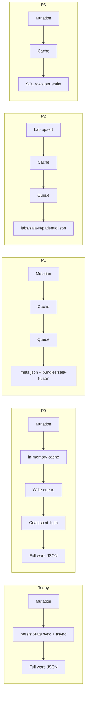

# LAN Host Persistence Optimization — Design Spec

> **For implementation:** After this spec is approved, use **superpowers:writing-plans** to produce the task-by-task implementation plan (one plan per phase or a single phased plan with PR boundaries). Do not start coding from this document alone.

**Date:** 2026-06-08  
**Status:** Approved — review incorporated; awaiting implementation plan  
**Related:** [`2026-05-30-lan-host-concurrency-design.md`](2026-05-30-lan-host-concurrency-design.md) (Phase 3a/3b repositories), [`2026-06-07-livesync-lightweight-networking-design.md`](2026-06-07-livesync-lightweight-networking-design.md) (typed mutations; client-side write amplification already reduced)  
**Plan:** [`docs/superpowers/plans/2026-06-08-lan-host-persistence-optimization.md`](../plans/2026-06-08-lan-host-persistence-optimization.md)

---

## Problem Statement

Client-side LiveSync was optimized in 7.1.x (typed mutations, delta replay, safety bundles). **Host-side persistence was not.** Every LAN mutation — a single lab set upsert, nota replace, HC delta, or bundle merge — still ends in `persistState()`, which:

1. **`JSON.stringify`s the entire ward state** — all salas, all `roomSyncBundles`, all `entries` including growing `labHistory` arrays (~78 patients on a full Mega-LAN turn).
2. **Blocks the Node event loop** on the JSON file path via synchronous `atomicWriteJson` (`writeFileSync`) before queuing a second async write of the same snapshot.
3. **Amplifies cost over the shift** — file size grows with labs processed; commit latency creeps even when each resident edits only their own patients.

The SQLCipher path (`lan_host_state` table via `lib/db/lan-host-persistence.mjs`) has the same logical problem: one row holding a monolithic JSON blob, rewritten on every commit.

### Observed symptoms

- Host Mac fan spikes on routine saves late in the shift.
- Typed HTTP endpoints return 200 slower as `lan-squad-host-state.json` grows.
- Join/reconcile `GET /sync-bundle` payloads remain large (secondary; addressed partly by gzip and client networking spec).

### Ward context (design target)

| Dimension | Typical value |
|-----------|----------------|
| Salas | 3 (`sala-1`, `sala-2`, `sala-e`) |
| Patients per sala | ~26 |
| Residents per sala | ~12 (4 teams × 3) |
| Edit pattern | Each team on own patients; no same-field contention |

---

## Design Principle

> **Mutate in memory immediately. Persist the smallest durable slice. Commit async, coalesced, and never twice.**

Reads always hit the in-memory cache (`host-state-cache.js`). Disk is a durability layer, not the authority for concurrent requests. HTTP handlers may await the queued commit for the mutation they initiated; they must not synchronously serialize the full ward to disk.

---

## Phased Overview

| Phase | Name | Goal | Risk |
|-------|------|------|------|
| **P0** | Async coalesced commit | Remove sync double-write; queue all mutations | Low |
| **P1** | Per-room JSON shards | Write ~⅓ of state per sala mutation | Medium |
| **P2** | Lab storage split | Stop `labHistory` from bloating the hot path | Medium |
| **P3** | Normalized SQLite repos | Per-entity writes; replaces monolithic blob | High |

Each phase is independently shippable and regression-tested. P1–P3 build on P0's commit pipeline.



---

## P0 — Async Coalesced Commit

### Objective

Eliminate event-loop blocking and redundant disk writes without changing the on-disk schema or HTTP contracts.

### Current behavior (to remove)

```javascript
// host-store.js persistState() — JSON path
atomicWriteJson(filePath, snapshot);           // sync — blocks event loop
return queue.enqueue(() => writeJsonAtomic(filePath, snapshot)); // duplicate
```

Typed endpoints (`replacePatientNota`, `replacePatientIndicaciones`, `upsertPatientLabHistorySet`) call `persistState()` inline on the request thread after mutating the cache.

### Target behavior

1. **`persistState()` → `schedulePersist()`** — enqueues a durable commit; never calls `writeFileSync` on the hot path.
2. **Single commit function `flushCacheToDisk()`** — async only (`writeJsonAtomic` or `persistCacheToDb`), invoked from the write queue tail.
3. **Coalescing window** — `COMMIT_COALESCE_MS = 150` (configurable constant). Multiple mutations within the window produce **one** disk flush of the latest cache snapshot.
4. **All mutation paths** use the same pattern as `putHistoriaClinicaQueued`:
   - Mutate cache synchronously (caller sees updated in-memory state).
   - `schedulePersist()` or `queue.enqueue(async () => flushCacheToDisk())` for durability.
5. **HTTP await policy** — host-router handlers for typed mutations **await** a shared flush promise (see below) so clients still get 200 only after durable write (preserves today’s durability semantics).

### Commit fan-out (shared flush promise)

Coalescing must not let request A return 200 before its data is durable, and must not strand requests B/C that share the same flush job.

Implement a **`CommitBarrier`** (name in plan; lives in `host-store.js` or `lan-squad/persistence/commit-barrier.js`):

```javascript
// Conceptual API
class CommitBarrier {
  /** Returns a promise that resolves when the next flush including this schedule completes. */
  scheduleCoalescedFlush(runFlush) { … }
  /** Immediate flush; resolves all pending waiters. */
  flushNow(runFlush) { … }
}
```

**Rules:**

| Rule | Detail |
|------|--------|
| One in-flight flush | At most one `flushCacheToDisk()` runs at a time (write queue). |
| Waiter set | Each `schedulePersist()` adds its resolver to `_flushWaiters: Set<resolve>`. |
| Coalesce timer reset | New mutation resets the 150ms timer; does **not** create a new waiter set — all waiters since last completed flush share the **same** upcoming flush. |
| Flush completion | On success: resolve **all** waiters in the set, then clear the set. On failure: reject all waiters, reload cache from disk, rethrow on the queue. |
| Generation guard | Optional monotonic `flushGeneration` so a slow handler cannot await a stale resolved promise from a prior flush (each `schedulePersist` captures `generation` at schedule time; resolve only when `completedGeneration >= captured`). |

**HTTP handler pattern:**

```javascript
const out = store.replacePatientNota(…);   // mutates cache synchronously
await store.awaitDurableCommit();            // waits on CommitBarrier, not a per-call file write
res.json(out);
```

**Test requirement:** Three concurrent `PUT /nota` requests coalesced into one disk write → all three `await` promises resolve **after** that single write; none resolve before it.

### Coalescing semantics

```
t=0ms   nota PUT   → cache updated → persist scheduled @ t=150ms
t=50ms  lab POST   → cache updated → persist rescheduled @ t=200ms
t=200ms           → single flushCacheToDisk()
```

- **Memory:** always latest cache (no stale reads on host).
- **Durability:** at most 150ms delay vs today’s sync write (acceptable; clients already debounce 900ms+).
- **`flush()` API:** must drain the queue immediately (no coalesce delay) for shutdown and tests.

### DB path (SQLCipher unlocked)

Same coalescing applies to `persistCacheToDb()`. Still writes monolithic JSON row in P0 — correct scope.

### Files

| File | Change |
|------|--------|
| `lan-squad/host-store.js` | Replace `persistState` with `schedulePersist` + `flushCacheToDisk`; route all `persistState()` call sites |
| `lan-squad/host-store.test.js` | Coalescing, no sync write, `flush()` drains, concurrent mutation ordering |
| `lan-squad/put-historia-clinica-queued.test.js` | Align with unified commit path |

### P0 acceptance criteria

| # | Criterion |
|---|-----------|
| 1 | No `writeFileSync` / `atomicWriteJson` on mutation paths (grep gate in test) |
| 2 | 10 rapid `upsertPatientLabHistorySet` calls → **1** disk write if within coalesce window (mock fs) |
| 3 | Typed mutation HTTP handler awaits commit; 200 after durable write |
| 4 | Three concurrent typed mutations coalesced to one flush → all three `awaitDurableCommit()` resolve after that flush, none before |
| 5 | `node --test lan-squad/host-store.test.js` green; no regression in `host-router.test.js` |
| 6 | `commitMs` + `byteLength` logged on each flush (extend existing `lan.host.commit` audit) |

---

## P1 — Per-Room JSON Shards

### Objective

Reduce `JSON.stringify` + write size from **full ward** to **one sala** (or meta only) per mutation.

### On-disk layout

Directory: `{userData}/lan-host/` (new; monolith path kept for migration)

```
lan-host/
  meta.json                 # { version, teamCodeHash, patients[], rooms[] }
  bundles/
    sala-1.json             # full HostSyncBundle for sala-1
    sala-2.json
    sala-e.json
  .migration-lock           # absent when migration complete
```

**Legacy:** `{userData}/lan-squad-host-state.json` — read once at migration; renamed to `lan-squad-host-state.json.pre-shard-backup` after successful import.

### Repository interfaces

Extract from `host-store.js` (aligns with Phase 3a concurrency spec):

| Module | Responsibility |
|--------|----------------|
| `lan-squad/persistence/json-meta-repository.js` | Read/write `meta.json` |
| `lan-squad/persistence/json-room-bundle-repository.js` | Read/write `bundles/{roomId}.json` |
| `lan-squad/persistence/sharded-host-persistence.js` | Orchestrate load-all, commit-meta, commit-room |

In-memory cache shape **unchanged** — `{ version, teamCodeHash, patients, rooms, roomSyncBundles }`. Sharding is a persistence adapter; `getState()` and merge logic stay the same.

### Commit routing

| Mutation | Shards written |
|----------|----------------|
| `replacePatientNota`, `replacePatientIndicaciones`, `upsertPatientLabHistorySet` | `bundles/{roomId}.json` only |
| `putRoomSyncBundle`, `putRoomClinicalOps`, delta/command on room | `bundles/{roomId}.json` only |
| `upsertPatient`, `createRoom`, `deleteRoom`, teamCodeHash align | `meta.json` (+ room bundle if new room) |
| `flush()` / coalesced tick with both meta and room dirty | Both shards, single queue job |

Track dirty flags: `_dirtyMeta`, `_dirtyRooms: Set<roomId>`.

### Atomicity

Each shard uses existing temp-file + rename (`atomic-json.js`). **No cross-shard filesystem transaction** — crash recovery must be explicit (below).

- Meta and bundle commits for a single logical op run in **one queue job**, ordered: **bundle shard(s) first, `meta.json` last** when both are dirty. Meta is the commit marker: if `meta.json` reflects revision *R*, all bundle shards referenced by that meta snapshot are expected to be at *R* or lower.
- Single-shard ops (typical typed mutation) touch only `bundles/{roomId}.json` — no meta write unless patient/room lists change.

### Crash recovery (P1 / P2)

If the process dies between writing `bundles/sala-1.json` and updating `meta.json`, or between sidecar and bundle, boot must detect and repair — not silently serve torn state.

**On load (inside write queue, before accepting traffic):**

1. Load `meta.json` (required). If missing but shards exist → **recovery mode** (see below).
2. For each `roomId` in `meta.rooms`, load `bundles/{roomId}.json` if present.
3. **Revision cross-check:** `meta.roomRevisions[roomId]` (new field) must equal `bundle.revision` when both exist. Mismatch → mark room `NEEDS_REPAIR`.
4. **P2 sidecar check:** for each entry with `labMeta`, if `labMeta.labHistoryVersion > 0`, require `labs/{roomId}/{patientId}.json` to exist. Missing sidecar with non-zero version → `NEEDS_REPAIR`.
5. **Repair policy (`NEEDS_REPAIR`):**
   - Prefer **newer shard wins**: if bundle file `mtime` / embedded `revision` &gt; meta’s recorded revision for that room, adopt bundle revision and update meta in one repair flush.
   - If meta is ahead of bundle (bundle missing or lower revision) → treat bundle as stale; re-export bundle from in-memory union of meta patient list + empty/minimal bundle shell, then log `host.repair.bundle_regenerated`.
   - Log all repairs to audit; expose count in host health (`GET /api/lan/v1/health` extras).
6. **Clients reconcile:** repair does not push to peers automatically; next `livesync:revision` or join reconcile propagates fixed state. Optional: broadcast revision hint after repair completes.

**`meta.json` additive fields:**

```typescript
interface HostMeta {
  version: number;
  teamCodeHash: string;
  patients: HostPatient[];
  rooms: HostRoom[];
  roomRevisions: Record<roomId, number>;  // last known durable bundle.revision per room
  shardedFrom?: 'monolith';
  labSidecarVersion?: number;
  lastRepairAt?: string;
}
```

Update `roomRevisions[roomId]` only when the corresponding bundle shard write succeeds (same queue job, before meta write).

### Migration (boot, inside write queue)

1. If `lan-host/meta.json` exists → load sharded layout; skip.
2. Else if `lan-squad-host-state.json` exists → read monolith → split → write all shards atomically → backup monolith → set flag in meta `{ shardedFrom: 'monolith', at: ISO }`.
3. Else → create empty sharded layout (same as today's `defaultState`).

`server.js` / `main.js` pass `hostStateDir` instead of (or in addition to) `hostStatePath`. IPC `lan-reset-squad-host-state` deletes the whole `lan-host/` directory.

### Backward compatibility

- **HTTP / WS:** unchanged.
- **Clients:** unaffected (host-internal).
- **Downgrade:** pre-shard builds cannot read `lan-host/` — backup monolith retained for manual recovery only; not auto-downgrade.

### P1 acceptance criteria

| # | Criterion |
|---|-----------|
| 1 | Lab upsert in `sala-1` rewrites only `bundles/sala-1.json` (fs mock asserts) |
| 2 | Monolith migration round-trips: export → shard → load equals original state |
| 3 | `lan-reset-squad-host-state` clears sharded dir |
| 4 | Commit byteLength in audit ≈ sala bundle size, not full ward |
| 5 | Steady-state typed commit **p50 &lt; 50ms** on dev Mac with 26-patient sala fixture |
| 6 | Simulated crash: bundle written, meta stale → boot repair adopts bundle revision and logs repair |
| 7 | Meta records `roomRevisions` only after successful bundle shard write |

---

## P2 — Lab Storage Split

### Objective

Prevent `labHistory` growth from inflating every sala bundle rewrite. Labs are the primary shift-long growth vector.

### Design

**Sidecar files** per patient lab history:

```
lan-host/
  labs/
    sala-1/
      {patientId}.json    # { sets: LabSet[], updatedAt }
  bundles/
    sala-1.json           # entries omit labHistory body; carry labMeta only
```

### Bundle entry shape (additive)

```typescript
interface BundleEntryLabMeta {
  labHistoryVersion: number;      // monotonic per entry
  labSetCount: number;
  latestSetAt?: string;           // ISO — guardia display hint
}

interface PatientBundleEntry {
  // ... existing fields ...
  labHistory?: LabSet[];          // legacy — absent in P2+ writes
  labMeta?: BundleEntryLabMeta;
}
```

### Host behavior

| Operation | Behavior |
|-----------|----------|
| `upsertPatientLabHistorySet` | Upsert in sidecar; bump `entry.labMeta.labHistoryVersion`; commit sidecar + room bundle (not full lab array in bundle) |
| `GET /sync-bundle` | **Assemble** entries: merge sidecar `sets` into each entry’s `labHistory` for response (read path pays cost, not write path) |
| `putRoomSyncBundle` with full `entries[].labHistory` | Legacy ingest: split labs into sidecars on merge; strip from persisted bundle |
| Safety bundle `entriesPartial` | Unchanged — `labHistory` already excluded from client safety pushes |

### Retention cap (host)

| Parameter | Value | Rationale |
|-----------|-------|-----------|
| `HOST_LAB_SET_CAP` | 20 per patient | Guardia/tendencias need recent sets; full history stays on client SQLCipher |
| Overflow | Drop oldest by sort key | Host is sync hub, not archival |

Cap applies on sidecar write; clients retain full local history.

### Efficient cap enforcement (write-path)

Capping must be **O(1) amortized** on the hot path — no full-array resort on every upsert.

**Sidecar on-disk shape:**

```typescript
interface LabSidecar {
  setsById: Record<setId, LabSet>;   // map, not array — upsert by id is O(1)
  orderedIds: string[];              // newest-first by sort key; max length HOST_LAB_SET_CAP
  updatedAt: string;
}
```

**Upsert algorithm (`upsertLabSidecar`):**

1. If `set.id` already in `setsById` → update in place; if id position in `orderedIds` unchanged, **skip reorder** (common case: reprocess same set).
2. Else if `orderedIds.length < CAP` → prepend id to `orderedIds`, store set.
3. Else → prepend id, **pop** last id from `orderedIds`, `delete setsById[poppedId]` — no sort, no filter over full history.
4. Sort key for “newest” position 0: `set.date` (YYYY-MM-DD) desc, tie-break `set.updatedAt` or `_clientTimestamp`.

**Assemble path (`GET /sync-bundle`):** convert `orderedIds` → `labHistory[]` in order (O(CAP) per patient, CAP=20). Acceptable on read; not on write.

**Bench gate:** 1000 sequential lab upserts on one patient with CAP=20 → p50 cap logic &lt; 1ms in-process (excludes disk); no growth in `orderedIds.length` beyond CAP.

### Delta log (optional P2b)

Record lab upserts in `bundle.deltaLog` so peers can Flow-B catch-up without full bundle pull (closes gap noted in networking spec). **Defer to P2b** if P2a sidecar scope is tight.

### Migration

On boot after P1 shards:

- For each entry with `labHistory.length > 0`: write sidecar, replace with `labMeta`, save room bundle.
- Idempotent; runs inside write queue once (`meta.labSidecarVersion = 1`).

### P2 acceptance criteria

| # | Criterion |
|---|-----------|
| 1 | After 25 lab upserts on one patient, `bundles/sala-1.json` byte size stable (±5%) |
| 2 | Sidecar holds ≤ `HOST_LAB_SET_CAP` sets |
| 3 | `GET /sync-bundle` response still includes `labHistory` arrays (assembled) — client contract unchanged |
| 4 | Joining client with empty local labs receives capped host labs correctly |
| 5 | Cap enforcement does not call `Array.sort` on write path (static grep / unit test) |
| 6 | Crash: sidecar written, bundle `labMeta` not updated → boot repair aligns meta from sidecar or regenerates from sidecar |

---

## P3 — Normalized SQLite Repositories

### Objective

Replace JSON blobs (file or `lan_host_state.json` column) with **per-entity SQL writes**. Implements Phase 3b from the concurrency spec.

### Scope

| Repository | Table(s) | Replaces |
|------------|----------|----------|
| `SqliteMetaRepository` | `lan_host_meta` | `meta.json` |
| `SqliteRoomBundleRepository` | `lan_room_bundles` | `bundles/{roomId}.json` |
| `SqliteBundleEntryRepository` | `lan_bundle_entries` | `bundle.entries[]` rows |
| `SqliteLabSetRepository` | `lan_lab_sets` | P2 sidecar files |
| `SqlitePatientRepository` | `lan_host_patients` | `meta.patients[]` |

### Schema sketch (schema version bump)

```sql
CREATE TABLE lan_host_meta (
  id INTEGER PRIMARY KEY CHECK (id = 1),
  version INTEGER NOT NULL,
  team_code_hash TEXT NOT NULL,
  updated_at TEXT NOT NULL
);

CREATE TABLE lan_room_bundles (
  room_id TEXT PRIMARY KEY,
  revision INTEGER NOT NULL,
  entity_versions_json TEXT,
  agenda_json TEXT,
  todos_json TEXT,
  manejo_json TEXT,
  clinical_ops_json TEXT,
  delta_log_json TEXT,
  committed_at TEXT,
  audit_log_json TEXT
);

CREATE TABLE lan_bundle_entries (
  room_id TEXT NOT NULL,
  patient_id TEXT NOT NULL,
  entry_json TEXT NOT NULL,          -- note, indicaciones, untyped fields; NOT labHistory
  nota_version INTEGER,
  indicaciones_version INTEGER,
  lab_meta_json TEXT,
  PRIMARY KEY (room_id, patient_id)
);

CREATE TABLE lan_lab_sets (
  room_id TEXT NOT NULL,
  patient_id TEXT NOT NULL,
  set_id TEXT NOT NULL,
  set_json TEXT NOT NULL,
  sort_date TEXT NOT NULL,           -- YYYY-MM-DD for cap eviction
  client_timestamp INTEGER NOT NULL,
  PRIMARY KEY (room_id, patient_id, set_id)
);
-- Intentionally NO secondary indexes on lan_lab_sets for v1.
-- Upsert is PK-only; cap eviction uses a small helper table (below).
```

`lan_host_state` monolithic table: **deprecated** after migration; row kept read-only for rollback window.

### Index and transaction policy (lab-heavy workload)

High-frequency lab upserts must not trigger broad index maintenance. Design constraints:

| Constraint | Rationale |
|------------|-----------|
| **PK-only writes on `lan_lab_sets`** | `INSERT OR REPLACE` by `(room_id, patient_id, set_id)` — no secondary index updates |
| **Cap via `lan_lab_set_order`** | Narrow table: `(room_id, patient_id, pos INTEGER, set_id)` with `pos ∈ [0, CAP-1]`. Eviction: `DELETE` one row at `pos = CAP-1`, shift positions in same transaction — still O(CAP), CAP=20 |
| **One transaction per lab upsert** | `BEGIN` → upsert set → update order table → bump `lan_bundle_entries.lab_meta_json` → `lan_room_bundles.revision++` → `COMMIT` |
| **Defer `lan_room_bundles` JSON column updates** | Room-level `agenda_json` / `todos_json` untouched on lab path |
| **No triggers** on lab tables for v1 | Keeps write path predictable; cap logic in repository code |
| **WAL mode** | Rely on existing SQLCipher/WAL settings; single-writer host process |

Optional later: partial index on `(room_id, patient_id, sort_date)` **only if** explain-query shows assemble bottlenecks — not in initial P3 schema.

### Write path

- `upsertPatientLabHistorySet` → single transaction (see above). No ward-scale `JSON.stringify`.
- Repository mirrors P2 cap semantics using `lan_lab_set_order` instead of JSON `orderedIds`.

### Migration

1. P3 runs only when SQLCipher unlocked (`dbManager` present).
2. Import from P1/P2 files in one transaction; set `lan_host_meta.migration_generation = 3`.
3. JSON shards retained as `.p3-sqlite-backup/` for one release.

When DB **locked** (guest host without clinical DB): continue P1/P2 JSON sharded path — P3 is an upgrade when host unlocks.

### P3 acceptance criteria

| # | Criterion |
|---|-----------|
| 1 | Lab upsert → single SQL transaction; no full-state JSON stringify |
| 2 | Import from P2 shard layout → byte-identical `GET /sync-bundle` vs pre-migration |
| 3 | Locked-host (no DB) still uses JSON shards — no regression |
| 4 | `lan_host_state` table no longer written on commit when P3 active |
| 5 | `lan_lab_sets` has no secondary indexes in v1 schema (migration test asserts) |
| 6 | 500 sequential lab upserts in SQL path → p50 transaction time stable (no linear growth) |

---

## Cross-Cutting Concerns

### Observability

Extend host commit audit (P0 onward):

```javascript
{
  action: 'host.commit',
  commitMs: number,
  byteLength: number,       // total or per-shard
  shards: ['meta'] | ['bundle:sala-1'] | ['labs:sala-1:pat_1'],
  coalesced: boolean,       // true if merged multiple schedules
  persistGeneration: 'json-monolith' | 'json-sharded' | 'sql-v3'
}
```

Optional: expose rolling p50/p95 in ⇄ diagnostics panel (host only).

### Write queue

Keep single `createWriteQueue()` chain. P1–P3 add dirty tracking; do not parallelize disk writes (preserves ordering, avoids torn shards).

### Tests

| Suite | Phases |
|-------|--------|
| `host-store.test.js` | P0–P3 unit + migration |
| `host-router.test.js` | Contract regression all phases |
| `host-store-clinical-ops-db.test.js` | P0 commit + P3 SQL |
| `put-historia-clinica-queued.test.js` | P0 unified commit |
| New: `sharded-host-persistence.test.js` | P1 |
| New: `lab-sidecar-persistence.test.js` | P2 |

Contract guards (source grep):

- No `writeFileSync` in `host-store.js` mutation paths after P0
- `upsertPatientLabHistorySet` does not stringify `roomSyncBundles` keys for other salas after P1

### PR boundaries (recommended)

| PR | Phase | Ships independently |
|----|-------|---------------------|
| 1 | P0 | Yes |
| 2 | P1 + migration | Yes (requires P0) |
| 3 | P2a sidecar + cap | Yes (requires P1) |
| 4 | P2b lab delta log | Optional follow-on |
| 5 | P3 | Yes (requires P2; gated on DB unlock) |

---

## Non-Goals

- Changing client sync protocol, WS message types, or `host-router.js` URL shapes (except internal assembly for `GET /sync-bundle` in P2).
- CRDT / OT for concurrent edits.
- Splitting Mega-LAN into per-sala **hosts** (still one process; sharded **files** only).
- Archival / long-term lab storage on host (clients + future export paths own that).
- Incremental `GET /sync-bundle?sinceRevision=N` (separate networking spec).

---

## Risks & Mitigations

| Risk | Mitigation |
|------|------------|
| Coalescing delays durability 150ms | `CommitBarrier` + `awaitDurableCommit()`; `flush()` on shutdown |
| Coalesced HTTP waiters resolve early/late | Shared waiter set + flush generation guard (P0) |
| Shard crash between bundle and meta | `roomRevisions` in meta; boot repair job (P1) |
| Sidecar / bundle `labMeta` torn | Sidecar version cross-check on boot (P2) |
| P2 assemble cost on large join | Cap=20 + gzip; P3 row reads; optional `?includeLabs=0` later |
| P3 index churn on lab upsert | PK-only `lan_lab_sets`; cap order table; no secondary indexes v1 |
| P2 cap sort overhead | `setsById` + `orderedIds` prepend/pop — no full sort on write |
| P3 complexity | Gated on DB unlock; JSON fallback remains |
| Downgrade after P1 | Backup monolith; document manual restore |

---

## Success Metrics (ward-scale)

Measured on fixture: 3 salas × 26 patients, 15 lab sets/patient, simulating 8h shift.

| Metric | Today (est.) | After P0+P1 | After P2 | After P3 |
|--------|--------------|-------------|----------|----------|
| Typed commit p50 | 80–300ms (grows) | &lt; 40ms stable | &lt; 30ms stable | &lt; 15ms stable |
| Typed commit p95 | 500ms+ | &lt; 120ms | &lt; 80ms | &lt; 50ms |
| Bytes written per lab upsert | Full ward | ~1 sala bundle | sala bundle + small sidecar | SQL row |
| Event-loop block per save | Yes (sync) | No | No | No |

---

## Changelog entry (on implementation)

When P0 ships, prepend to `project-context.mdc`:

`- **2026-06-08** `lan-host-persist`: async coalesced host commits (P0); sharded/sidecar/SQLite in follow-on PRs — `host-store.js`, `lan-squad/persistence/`.`
