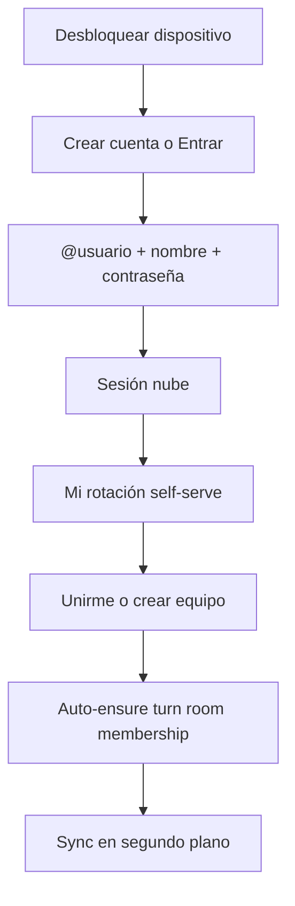

# Cloud Sync — Connection UX + Admin Ops Console (7.9)

> **For implementation:** After approval, use **superpowers:writing-plans**. Do not implement until this spec is reviewed.

**Date:** 2026-08-02  
**Status:** Design (PO decisions locked)  
**Branch:** `feature/cloud-sync-7.9`  
**Related:** [`2026-08-02-cloud-sync-free-pilot-design.md`](2026-08-02-cloud-sync-free-pilot-design.md)

---

## Problem

The bolted-on Nube block inside ⇄ feels like a second product. Residents already know **@usuario + nombre clínico** from LAN onboarding and **Mi rotación**. For Sala / Torre HU, cloud must feel like *the* connection path: create the same identity, join rotation, sync — not “paste room code after LAN host.”

R4 / program admin also need a **full ops console** over Cloudflare data (rooms, users, mutations, meters), not only a secret field like Equipos.

---

## PO decisions (locked)

| Decision | Choice |
|----------|--------|
| Admin audience | **R4** and **program admin** only |
| Admin depth | **Full ops console** (rooms, users, mutation log, Free-tier meters, inspect/purge) |
| Post-account placement | **Self-serve Mi rotación** (pick/join team), then cloud turn membership follows |
| Account fields | **Username + clinical name** — same UX semantics as today’s LAN registration |
| Identity across modes | **Same @usuario** on LAN and cloud — portable when switching rotations (e.g. Sala nube ↔ UX LAN) |
| User DB | **Wipe clinical users with 7.9** — teams re-register; recover patients via existing censo/cloud room data |
| Sala scope | Unchanged: Nube = Sala + Torre HU; Inters / UX / Eme / Área A = LAN only |

---

## Goals

- [ ] Crear cuenta / Entrar uses **@usuario + nombre** (plus cloud password — see Auth), matching onboarding language.
- [ ] After account, user is guided to **Mi rotación**; joining a team attaches them to the **canonical cloud turn room** for that sala (room code is secondary).
- [ ] Username uniqueness is **global** in cloud D1 and matches the local claimed `@usuario` format (`clinical-username.mjs` rules).
- [ ] Documented **user wipe** procedure for 7.9 upgrade; patients/censo not casually deleted.
- [ ] Admin console: overview meters, rooms, users, mutations, danger actions — Hallmark quiet workbench.
- [ ] ⇄ for Sala/Torre: no host PIN / surrogate; Conexión + status strip only.

## Non-goals

- Cloud for Inters / UX / Eme / Área A in this UX pass.
- Browser-only workbench.
- In-app rotation of `WORKER_DATA_KEY`.
- Building a general EMR admin product.

---

## Identity model

### One handle

```
@usuario  (normalizeUsername — same as LAN)
nombre clínico
(+ password for cloud API auth)
```

- **LAN salas:** local SQLCipher `users` + claimUsername as today; no Cloudflare session required.
- **Sala / Torre:** same fields create/login a **cloud user**; local row is upserted with the same `username` + `clinical_name` so directory and privileges stay coherent.
- Switching rotation (Torre → UX): keep `@usuario`; cloud session may idle; LAN host path used for UX.

### Password

Cloud needs a secret. UX: show **Contraseña** on Crear cuenta / Entrar for Sala/Torre only (min 10), not framed as a second identity. LAN-only salas never see it.

Optional later: “remember cloud session” via Electron `safeStorage` (sessionStorage is V1 stopgap).

### 7.9 user wipe

On upgrade / pilot cutover:

1. Wipe **local clinical user tables** (and related membership rows as required) — procedure in release notes + setup doc.
2. **Do not** wipe patient/lab blobs by default; teams re-register users and reclaim censo via cloud room / restore flow.
3. Cloud D1 `users` / `sessions` may be reset for the pilot D1 the same day (admin purge or recreate DB).
4. Copy: “Con 7.9 vuelves a registrar @usuario y nombre; tus pacientes del turno se recuperan al unirte a la sala nube / rotación.”

---

## Connection UX (Sala / Torre)

### Journey



### ⇄ panel structure (Hallmark)

1. **Estado** — chip: Al día / Sincronizando / Pendiente (N) / Sin conexión  
2. **Cuenta** — if logged out: Crear cuenta | Entrar (`@usuario`, nombre, contraseña). If logged in: `@handle · Nombre` + Cerrar sesión  
3. **Siguiente paso** — CTA “Ir a Mi rotación” when logged in but not on a team  
4. **Sala nube** — read-only: sala, room label/code (copy), revision; “Salir de la sala” rare  
5. **Avanzado** (collapsed) — URL cloud Worker  

**Removed for Sala/Torre:** host election, shift PIN, surrogate, “quién es el anfitrión.”

### Canonical turn room

- One active cloud room per `(sala, turnKey)` where `turnKey` defaults to calendar date (America/Mexico_City) or program-admin override later.  
- On successful team join in Mi rotación (cloud-eligible sala): client calls `ensureTurnRoom({ sala })` → join-or-create; no primary “paste code” path.  
- Room codes remain for admin share / recovery.

### Inters / UX / Eme / Área A

Existing LAN ⇄ UI unchanged. Username registration stays local onboarding / Mi rotación; no cloud password.

---

## Admin ops console

### Access

- UI entry: **⇄ → Administración nube** (only if `hasProgramAdminPrivileges` or rank R4).  
- API: cloud user with `role IN ('admin','program_admin')` **or** header `X-Sync-Admin-Key` matching `SYNC_ADMIN_KEY` secret for bootstrap.  
- First promote: admin key can `POST /admin/users/:id/promote`. Daily use: R4 logs in with same @usuario and admin role already set.

### Surfaces

| Section | Actions |
|---------|---------|
| **Resumen** | Est. Free-tier usage (from estimator + optional Worker counters), #users, #rooms, storage sum |
| **Salas** | Table by sala/code/revision/members/storage; open detail |
| **Sala detalle** | Members; rotate code; force leave all; archive/purge room; mutation tail; snapshot summary (counts only until confirm “Ver estado”) |
| **Usuarios** | Search @usuario; revoke sessions; disable; promote/demote admin; delete user |
| **Mutaciones** | Filter room + time; show revision, actor, clientMutationId, op path list (truncate values) |
| **Peligro** | Purge all sessions; wipe pilot D1 tables (double confirm + type sala name) |

### UI

- Dense tables, `card-header` / `card-body-bg`, IBM Plex, tokens only.  
- Spanish labels. Destructive buttons secondary/danger semantic, not accent spam.

---

## Worker API additions (sketch)

```
POST /api/sync/v1/auth/register  { username, password, displayName }  // displayName = nombre clínico
POST /api/sync/v1/auth/login     { username, password }

GET  /api/sync/v1/admin/overview
GET  /api/sync/v1/admin/rooms
GET  /api/sync/v1/admin/rooms/:id
POST /api/sync/v1/admin/rooms/:id/rotate-code
POST /api/sync/v1/admin/rooms/:id/purge
GET  /api/sync/v1/admin/rooms/:id/mutations?since=&limit=
GET  /api/sync/v1/admin/users?q=
POST /api/sync/v1/admin/users/:id/revoke-sessions
POST /api/sync/v1/admin/users/:id/promote
POST /api/sync/v1/admin/users/:id/disable
DELETE /api/sync/v1/admin/users/:id

POST /api/sync/v1/rooms/ensure-turn  { sala, turnKey? }  // join-or-create canonical room
```

Schema adds: `users.role` TEXT DEFAULT 'member'; `users.disabled` INTEGER; `rooms.turn_key` TEXT; unique `(sala, turn_key)` where active.

---

## Client modules (planned)

```
public/js/features/cloud-sync/
  panel-conexion.mjs          # replaces bolted panel-nube-section primary UX
  panel-admin.mjs             # ops console mount
  ensure-turn-room.mjs
  identity-bridge.mjs         # sync @usuario + clinical_name to local user row
public/styles/cloud-sync.css  # Hallmark; drop equipos-cloud-* reuse
```

Wire: onboarding / ⇄ for cloud salas → `panel-conexion`; Mi rotación join success → `ensureTurnRoom`; admin nav → `panel-admin`.

---

## Migration / wipe checklist (release)

1. Announce: re-register @usuario + nombre (+ contraseña nube for Sala/Torre).  
2. Local: wipe users/teams membership as documented (script or one-time migration flag `cloud_sync_7_9_user_reset`).  
3. Cloud: optional D1 reset for pilot.  
4. Patients: remain in local blobs / cloud room state; reclaim after re-join turn room.  
5. Inters/UX/Eme/Área A: re-register locally; LAN host as today.

---

## Success criteria

- Resident on Torre creates account with same fields they know from LAN, joins Mi rotación, sees sync chip Al día without touching room codes.  
- Same @usuario works after switching to a LAN-only sala.  
- R4 opens Administración nube and can list rooms, revoke a session, purge a stale room, and see mutation tail.  
- Post-wipe, two residents re-register and recover shared censo from the turn room.

---

## Open implementation notes

- Align `normalizeUsername` with `lib/db/clinical-username.mjs` / worker `normalizeUsername` (single ruleset).  
- Debounce full-bundle cloud pushes (prior pilot gap) remains a follow-up for Free tier.  
- `project-context.mdc` may be gitignored in worktree — update when committing from a context that tracks it.
