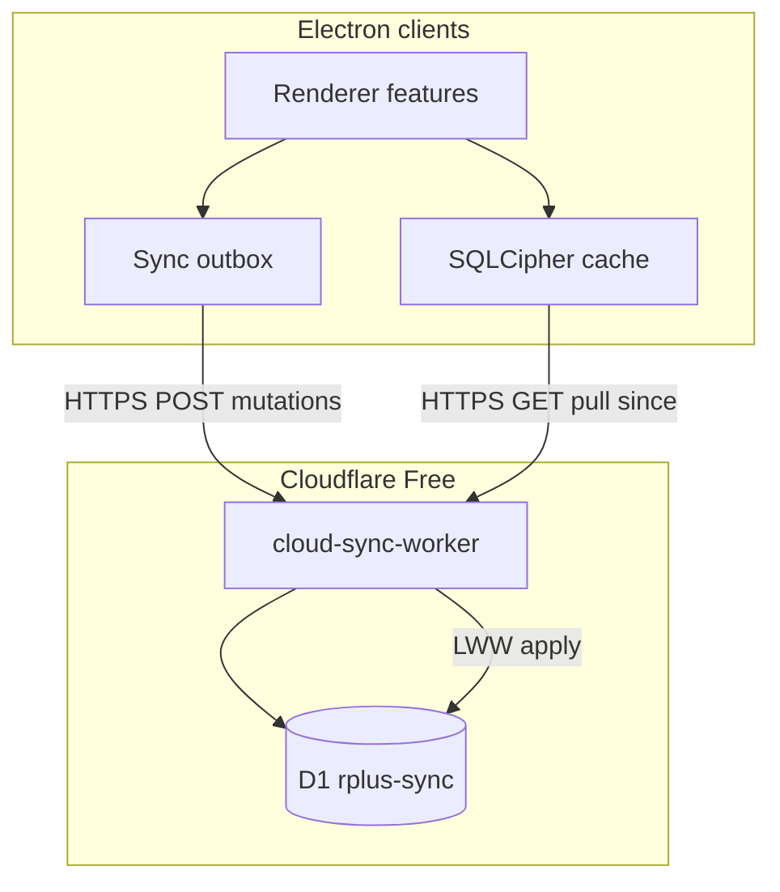

# Cloud Sync Free Pilot (R+ 7.9) — Design

> **For implementation:** After this spec is approved in review, use **superpowers:writing-plans** for a task-by-task plan. Do not implement until the written spec is reviewed.

**Date:** 2026-08-02  
**Status:** Approved for planning (Free pilot V1).  
**Release target:** **7.9.0** (current app: 7.8.1).  
**Related:** [`2026-06-03-lan-conflict-lww-design.md`](2026-06-03-lan-conflict-lww-design.md), Equipos Worker (`cloud/equipos-worker/`), plan [`../plans/2026-08-02-cloud-sync-7.9.md`](../plans/2026-08-02-cloud-sync-7.9.md).

**PO decisions (2026-08-02):**
- **Nube overrides LAN** for allowed salas — when a turn is on Nube, there is **no LAN host path** for that room (cloud is the only sync authority).
- **Sala allowlist (cloud V1):** only **Sala** and **Torre HU**.  
  **Stay on LAN for now:** **Interconsultas** (Inters), **UX**, **Eme**, **Área A/Pensionistas** (PENS / Área A).
- Registration/login for Nube lives in the **⇄ panel** (same chrome; for allowlisted salas it becomes cloud join, not LAN host).
- **Offline stays** — local SQLCipher + outbox when offline; flush when cloud returns.
- **Labs uncapped** — no per-patient lab-set cap in cloud V1; storage ceiling + Free-tier headroom are the brakes.

---

## Problem statement

Today’s LiveSync requires a **LAN host Mac** (`server.js` :3738 + `lan-squad/host-store`). When that host is offline, the team depends on surrogate election or loses a shared source of truth. Residents already think of collaboration like **Google Drive**: open the app, see the same censo, edits appear for everyone, no one has to “be the host.”

**Decision for 7.9 V1:** Cloud is the **authoritative** room store. Clients (Electron) are caches with an outbox. Pilot runs on **Cloudflare Workers Free** — reliability over “true realtime WebSockets.”

---

## Goals (success criteria)

- [ ] A room stays available when **no desktop is hosting** on LAN.
- [ ] Clinicians sign in with **username + password** (session token); join a **cloud room** for the turn.
- [ ] Saves **push to cloud first**; other signed-in clients **pull** and update automatically (Drive-style).
- [ ] Local SQLCipher remains an **offline cache** + write queue; reconnect flushes outbox.
- [ ] Conflict policy stays **LWW** (same spirit as LAN LWW design); optional toast, no blocking modal.
- [ ] Quotas keep the pilot inside Free tier: room live censo cap, thin tombstones, storage ceiling.
- [ ] For **Sala** / **Torre HU** cloud rooms: **no LAN host** — Nube fully overrides LAN sync for that turn.
- [ ] **Interconsultas, UX, Eme, Área A/Pensionistas** continue on **LAN-only** LiveSync (unchanged host/PIN).
- [ ] Offline local cache still works without Internet for the active mode.
- [ ] Spec + north star + knowledge-capture updated so “no cloud PHI” is explicitly replaced for this pilot.

## Non-goals (V1 Free pilot)

- Cloud sync for Interconsultas, UX, Eme, or Área A/Pensionistas.
- Dual authority (LAN + Nube) for the same Sala/Torre turn — **forbidden** (split brain).
- Persistent WebSocket LiveSync / presence cursors (Paid / later).
- Full browser workbench (Electron remains primary client).
- True E2EE where Cloudflare cannot decrypt (blocks server-side merge); V1 uses **at-rest encryption with app-held key**.
- Migrating Equipos into the same worker (keep `equipos-worker` separate).
- Multi-hospital tenancy UI, billing, SSO, Cloudflare Access mandatory gate.
- Replacing `.docx` generation with a Worker port (export stays on desktop).
- Automatic purge of all historical local data; tombstone policy is room-scoped.

---

## Product metaphor

**Google Drive for the guardia censo:**

| Drive | R+ 7.9 cloud room |
|-------|-------------------|
| File in the cloud | Room bundle (patients, notes, labs meta, clinicalOps) |
| Signed-in users with access | Room members after login + room code/invite |
| Edit → sync | Mutation → `POST` cloud → others poll/pull |
| Offline edits queue | Local outbox → flush on reconnect |
| No “who has the file open as host” | No LAN host required for cloud mode |

---

## Free-tier constraints (hard)

Workers Free relevant ceilings (account-level; exceed ⇒ **hard errors**, not billing):

| Resource | Free limit | V1 implication |
|----------|------------|----------------|
| Worker requests | 100k / day | Prefer batch pull; poll only when app focused |
| D1 rows written | 100k / day | Coalesce writes; sidecars for labs |
| D1 rows read | 5M / day | Generous for pilot |
| D1 storage | 500 MB / DB, 5 GB account | Quotas + thin tombstones |
| DO requests / duration | 100k / day, 13k GB-s / day | **No always-on WS**; optional short-lived DO later |
| R2 | 10 GB | Lab fat blobs / backups if needed |

**V1 sync transport: HTTP only** (push mutation + pull since-token). No Durable Object WebSocket hub in V1. A single Worker + D1 is enough for the pilot; Paid unlocks DO LiveSync later without rewriting auth/schema.

---

## Architecture overview



**Authority:** Cloud D1 room revision is canonical when the client is in **cloud sync mode**.  
**LAN fallback:** Existing `lan-squad` host path unchanged when user selects LAN or cloud is unreachable and they opt into LAN.

### Package layout (new)

```
cloud/sync-worker/           # new Worker (mirror equipos-worker patterns)
  wrangler.toml
  schema/001-init.sql
  src/
    index.js
    auth.js                  # register / login / session
    rooms.js                 # create / join / membership
    sync.js                  # pull / push / LWW
    quotas.js
    crypto-at-rest.js        # AES-GCM with WORKER_DATA_KEY secret
public/js/features/cloud-sync/   # renderer client
  auth-ui.mjs
  sync-client.mjs
  sync-outbox.mjs
  sync-pull-apply.mjs
  mode-toggle.mjs            # Cloud vs LAN for the turn
```

Reuse: `cloudflare/setup.mjs` patterns, CORS/error helpers from `cloud/equipos-worker/src/`.

---

## Auth model (users + passwords)

Today: device unlock passphrase + `clientId` + optional `@username` — **no** password login (`users.password_hash` is placeholder `local-device`).

### V1 cloud identity

| Field | Rules |
|-------|--------|
| `username` | 3–32 chars, `[a-z0-9._-]` unique (case-insensitive) |
| `password` | min 10 chars; stored as **Argon2id hash** in D1 (Worker-compatible lib or Web Crypto PBKDF2 if Argon2 WASM too heavy — prefer Argon2 WASM if bundle fits Free CPU) |
| `display_name` | clinical name shown on board |
| `session` | random 32-byte token, SHA-256 hashed at rest; header `Authorization: Bearer <token>` |

**Flows:**

1. **Register** → `POST /api/sync/v1/auth/register` → session.
2. **Login** → `POST /api/sync/v1/auth/login` → session.
3. **Logout** → revoke session row.
4. Desktop stores session token in Electron `safeStorage` (not plaintext localStorage).

**Link to local clinical user:** On first cloud login, map `clientId` ↔ `cloud_user_id` in local `app_meta` / settings so privileges/roster still work offline.

**Not in V1:** email verification, password reset email, OAuth, Cloudflare Access.

---

## Rooms & membership

| Concept | V1 behavior |
|---------|-------------|
| **Room** | Named month container (`sala` + `YYYY-MM` turn key in America/Mexico_City); one room code lasts the calendar month; holds revision + encrypted payload refs |
| **Create** | Authenticated user creates room → receives **room code** (6–8 chars) + becomes `owner` |
| **Join** | Login + room code → membership `member` |
| **Invite** | Same room code (Drive “anyone with the link” lite); optional rotate by owner |
| **Caps** | Max **50 live patients** per room; max **20 members** per room (pilot) |

Room code is **not** a substitute for user passwords — it only authorizes membership after login.

---

## Sync protocol (Drive-style)

### Entities (V1)

Port the LAN bundle fields that matter for a turn:

- `patients` / entry fields (censo, note, indicaciones, historiaClinica meta)
- `labHistory` via **sidecars** (**uncapped** set count in V1; size limited only by mutation body + room storage quota)
- `todos`, `agenda`, `clinicalOps` (roster snapshot)
- `entityVersions` + room `revision` (monotonic)

### Push

`POST /api/sync/v1/rooms/:roomId/mutations`

```json
{
  "baseRevision": 42,
  "clientMutationId": "uuid",
  "ops": [
    { "path": "entries/p1/note", "value": {...}, "updatedAt": "ISO", "actorId": "userId" }
  ]
}
```

Server applies **LWW** per path (`updatedAt` then `actorId` tie-break). Returns `{ revision, applied[], rejected[] }`. Idempotent on `clientMutationId`.

If `baseRevision` is far behind, response includes `needPull: true`; client must pull before retrying non-idempotent bulk ops.

### Pull

`GET /api/sync/v1/rooms/:roomId/pull?since=REV`

Returns ops or a compact snapshot if gap is large (snapshot threshold: **100** revisions or **> 256 KB** cumulative ops).

### Client loop

1. On focus / every **15s** while focused (paused when minimized/locked).
2. After every local clinical save: enqueue outbox → immediate push attempt.
3. On pull: apply LWW into SQLCipher cache + renderer state (reuse LAN apply helpers where possible).
4. Offline: outbox persists; badge “Sin nube — N cambios pendientes”.

**No WebSocket in V1.** “Automatic for teams” = 15s poll + push-on-save (feels Drive-like on a ward Wi‑Fi).

---

## Encryption (V1 Free)

| Layer | Choice |
|-------|--------|
| In transit | HTTPS (Workers) |
| At rest in D1 | AES-256-GCM; key = `WORKER_DATA_KEY` Wrangler secret |
| Local cache | Existing SQLCipher device unlock unchanged |

**Trade-off (explicit):** Worker can decrypt to apply LWW. Acceptable for pilot; document in security notes. Later: per-room DEK wrapped by user keys (envelope) without blocking V1.

Do **not** log plaintext PHI in Worker logs.

---

## Quotas (keep Free forever for pilot size)

| Quota | Limit | Enforcement |
|-------|------:|-------------|
| Live patients / room | **50** | Reject add when over; Spanish error |
| Lab sets / patient | **uncapped** | Rely on room storage MB + Free write budget; warn in UI near soft storage limit |
| Tombstones | **metadata only** (`id`, `registro`, `deletedAt`); max **100**/room; purge **>14 days** on write path |
| Note / mutation body | 256 KB / 512 KB lab (match LAN) | 413 |
| Encrypted room storage | **25 MB** soft warn / **50 MB** hard | Block writes with cleanup CTA |
| Members / room | **20** | Reject join |
| Poll interval | ≥15s focused | Client-enforced |
| Rooms / user created | **10** active | Soft archive older |

Tombstones must **not** retain `labHistory` / note bodies (fixes 144-ghost bloat pattern).

---

## Sala allowlist (hard gate)

Canonical labels (match app salas / `resolveRoomIdForUsernameRegister`):

| Sala / service | Sync in 7.9 V1 |
|----------------|----------------|
| **Sala** (incl. Sala 1 / 2 / E as Sala family) | **Nube only** (LAN host disabled for this turn) |
| **Torre HU** | **Nube only** |
| **Interconsultas** | **LAN only** |
| **UX** | **LAN only** |
| **Eme** | **LAN only** |
| **Área A/Pensionistas** | **LAN only** |

Worker rejects `POST /rooms` / join if `sala` is not in `{ "Sala", "Torre HU" }` (normalize case / aliases: `torre-hu` → Torre HU). Client hides Nube join for LAN-only salas and keeps existing host/PIN UI.

---

## Electron UX (Spanish)

1. **⇄ panel** is sala-aware:
   - Profile/team sala ∈ {Sala, Torre HU}: show **Nube** register/login/create/join; **hide or disable LAN host election, shift PIN, surrogate** with copy: “Esta sala sincroniza en la nube — no hay anfitrión LAN.”
   - Profile/team sala ∈ {Interconsultas, UX, Eme, Área A/Pensionistas}: **no Nube section** (or disabled with “Próximamente”); existing LAN UX unchanged.
2. Connecting a cloud room for Sala/Torre **fully overrides LAN** for that session (do not run LAN transport/election in parallel).
3. **Offline:** device unlock + local cache; outbox `Nube · pendiente (N)` / `Sin conexión` for cloud salas.
4. Status chip: `Nube · al día` / `sincronizando` / `pendiente` / `Sin conexión` (Sala/Torre) vs existing LAN chip (other salas).

---

## Mode matrix

| Context | Authority |
|---------|-----------|
| **Sala / Torre HU + online Nube** | Cloudflare D1 only — **LAN off** |
| **Sala / Torre HU + offline** | Local SQLCipher + cloud outbox (flush later) |
| **Inters / UX / Eme / Área A** | LAN host-store (unchanged) |
| **No sync chosen / locked only** | Local offline |

Never bridge LAN ↔ Nube for the same room in V1.

---

## Security & compliance notes

- Pilot assumes **trusted small cohort** (one program). Not a hospital EMR.
- Rotate `WORKER_DATA_KEY` requires re-encrypt migration (document; not automated in V1).
- Rate-limit auth: 10 login failures / 15 min / IP+username.
- Session TTL: **14 days** sliding; revoke on password change.
- Update [`docs/core/01-vision-north-star.md`](../../core/01-vision-north-star.md) and [`18-knowledge-capture.md`](../../core/18-knowledge-capture.md): replace blanket “no cloud PHI” with **“cloud sync pilot — encrypted at rest, Free tier, human-in-the-loop unchanged.”**

---

## Rollout / versioning

| Step | Deliverable |
|------|-------------|
| 7.9.0-alpha | Worker deploy + auth + empty room pull/push |
| 7.9.0-beta | Patients + notes + labs sidecar + outbox |
| 7.9.0 | Mode toggle in UI; release notes; Free pilot with one sala |
| Later (Paid) | DO WebSocket LiveSync; envelope DEKs; Cloudflare Access |

`package.json` version bump to **7.9.0** only at release; develop behind a settings flag `cloudSyncPilot: true`.

---

## Testing strategy

- Worker unit tests (Miniflare): auth, LWW apply, quotas, idempotent mutations.
- Renderer: outbox flush, pull apply, mode toggle (no full `npm test`).
- Manual: two Macs, same room, kill “host” concept — both online via Internet; edit note on A, see on B within one poll cycle.
- Free-tier soak: script estimating daily reads/writes for 10 users × 15s poll × 12h < Free caps.

---

## Resolved decisions

1. **Password KDF on Worker:** **PBKDF2-SHA-256** (600k iterations, Web Crypto) — no WASM on Free CPU budget; revisit Argon2 later if needed.
2. **Sala scope:** Nube for **Sala + Torre HU** only; **Inters / UX / Eme / Área A** stay LAN.
3. **Nube vs LAN:** for allowlisted salas, **Nube overrides LAN** (no parallel host).
4. **Username namespace:** **global unique** in the pilot D1.
5. **Labs:** **uncapped** set count.
6. **Offline:** **kept** as first-class (cache + outbox).

---

## Success metrics (pilot)

- **Primary:** Two or more clinicians complete a turn with **no LAN host**, cloud status “al día,” zero data-loss reports for notes/censo.  
- **Secondary:** Daily Worker/D1 usage stays under Free caps with headroom ≥50%.  
- **Guardrail:** TTD for SOME → note must not regress vs 7.8 (cloud sync is parallel path).

---

> [!IMPORTANT]
> V1 is a **Free-tier pilot**, not institutional cloud EMR. If Free caps trip mid-guardia, the escape hatch is LAN mode or upgrading to Workers Paid (~$5) — architecture must not require a rewrite for that upgrade.
