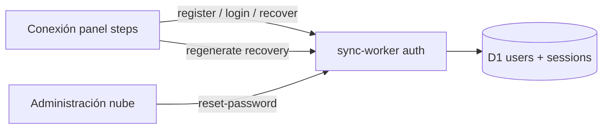

# Nube password recovery + Conexión panel UX — Design

> **For implementation:** After this spec is approved in review, use **writing-plans** for a task-by-task plan. Do not implement until the written spec is reviewed.

**Date:** 2026-08-02  
**Status:** Approved in brainstorm; awaiting written-spec review.  
**Release target:** 7.9.x (on top of Cloud Sync Free pilot).  
**Related:** [`2026-08-02-cloud-sync-free-pilot-design.md`](2026-08-02-cloud-sync-free-pilot-design.md), worker `cloud/sync-worker/`, renderer `public/js/features/cloud-sync/`, LAN panel mount `public/js/features/lan/panel-nube-mount.mjs`.

**PO decisions (2026-08-02):**

- Recovery = **self-service recovery code** + **admin reset** (no email).
- Panel redesign scope = **reorganize whole Conexión guardia** into clear steps (same dropdown).
- Without Nube session (Sala / Torre HU): show **only** Connect step; hide teams / censo / QR / sync until logged in.
- Recovery code shown **once at register**; user can **regenerate while logged in** (invalidates previous).

---

## Problem statement

Conexión guardia for Sala / Torre HU mixes cloud auth, room join, monthly team creation, global census, sync diagnostics, QR Internos, and waitlist with no step hierarchy. Residents cannot tell what to do next, and there is **no password recovery** for Nube accounts (only SQLCipher master-password recovery exists elsewhere).

## Goals

- [ ] Resident can recover Nube access with a recovery code (no email).
- [ ] Program admin / R4 can reset a user’s password from Administración nube (or admin key).
- [ ] Logged-out Nube panel shows only Connect (Entrar / Crear / Recuperar).
- [ ] Logged-in panel reads as steps: Sala → Equipo → Más.
- [ ] Clear **Modo Nube** status chip (vs LAN / sin sesión).
- [ ] Targeted worker + renderer tests for recover / regenerate / panel gating.

## Non-goals (V1)

- Email / magic-link reset.
- Password recovery for LAN-only salas (Inters, UX, Eme, Área A).
- Splitting Conexión into a separate window or Ajustes-only surface.
- Changing cloud sync protocol, LWW, or room authority.
- SSO / OAuth / Cloudflare Access.

---

## Architecture overview

**Authority:** recovery material lives in D1 next to password hashes. Client never stores the recovery code except ephemeral UI after one-shot reveal.

---

## Data model

Migration `schema/003-recovery.sql` (after `001-init.sql`, `002-admin-turn.sql`):

| Column | Type | Notes |
|--------|------|--------|
| `recovery_salt` | BLOB NULL | Same blob encoding as password salt |
| `recovery_hash` | BLOB NULL | PBKDF2-SHA-256, same iteration count as passwords |
| `recovery_updated_at` | TEXT NULL | ISO timestamp of last set/rotate |

Existing users without recovery: on next **successful login** after deploy, worker **lazy-mints** a recovery code once and returns it in the login response (`recoveryCode`). Older pilot accounts get a code without re-registering.

---

## Auth API

Base path unchanged: `/api/sync/v1/auth/…` and `/api/sync/v1/admin/…`.

### Code format

- Human-readable: `R+` + 3 groups of 4 uppercase alphanumeric (exclude ambiguous `0/O/1/I`), e.g. `R+AB3K-7NMP-Q2WX`.
- Generate with `crypto.getRandomValues`; hash before persist; plaintext only in JSON response once.

### `POST /auth/register` (extend)

Response includes `recoveryCode` (one-shot) alongside session + user. Hash stored; plaintext never logged.

### `POST /auth/recover`

Request: `{ username, recoveryCode, newPassword }`  
Behavior:

1. Rate-limit by IP + normalized username (same window as login failures).
2. Load user; generic failure if missing / disabled / no recovery hash / verify fails → `invalid_credentials` with message suitable for UI: “Usuario o código incorrecto.”
3. Validate `newPassword` (≥ 10 chars).
4. Update password hash; **delete all sessions** for user; create new session.
5. Rotate recovery code; return `{ ok, token, user, recoveryCode }` (new code one-shot).

### `POST /auth/regenerate-recovery`

Auth: Bearer session.  
Rotate recovery hash; return `{ ok, recoveryCode }` once. Does not change password.

### `POST /admin/users/:id/reset-password`

Auth: session with `admin` / `program_admin` **or** `X-Sync-Admin-Key`.  
Body: `{ temporaryPassword }` (required, validated) and optional `{ rotateRecovery: true }`.  
Invalidate all sessions for that user. If `rotateRecovery`, return `recoveryCode` once for admin to convey out-of-band.

### Rate limits

Reuse in-memory failure map from `auth.js` with key prefix `recover:` + IP + username (separate from login counter so a recover lockout does not block password login).

---

## Renderer UX — Conexión guardia (Sala / Torre HU)

Mount remains via `panel-nube-mount.mjs` inside `connection-dropdown`. Non-allowlisted salas keep LAN chrome unchanged.

### Step machine

| Step | Visible when | Content |
|------|--------------|---------|
| **1 · Conectar** | Always when Nube panel shown; **only** step if `!session` | Tabs: Entrar · Crear cuenta · Recuperar. Badge: `Modo Nube · Sin sesión`. Short lead: “No hace falta host LAN.” |
| **2 · Sala del turno** | Session present | Create room / join with code; show connected room summary |
| **3 · Equipo** | Session present | Link/button to Mi rotación; “Crear equipos del mes” (existing rank action) |
| **4 · Más** | Session present; **collapsed by default** | Censo global, estado de sync, QR Internos, Lista de espera, regenerar código, Administración nube (if role), Avanzado URL, toggles |

LAN-specific host controls that do not apply under Nube override stay hidden when `shouldUseNubeNotLan` is true (same as today).

### Recovery UI

- Tab **Recuperar**: `@usuario`, código, nueva contraseña, confirmar → submit `recover`.
- After register / recover / regenerate / lazy-mint: **blocking modal** with code, Copiar, checkbox “Lo guardé en un lugar seguro”, then Continue. Closing without confirm still allowed but warn once.
- Logged-in **Más → Regenerar código de recuperación**: confirm dialog → show one-shot modal.

### Status chip

Map cloud sync status to chip: Sin sesión / Sin conexión / Sincronizando / Al día / Error. Prefer “Nube” wording over generic “Sin conexión” when the gap is missing auth vs offline transport.

### Admin UI

In existing Administración nube user row: action **Restablecer contraseña** → temp password field → call admin reset; show temp password + optional new recovery code once.

---

## Error handling (copy)

| Case | User message |
|------|----------------|
| Bad user/code | Usuario o código incorrecto. |
| Weak password | La contraseña debe tener al menos 10 caracteres. |
| Rate limited | Demasiados intentos. Esperá un momento. |
| Offline / bad URL | Sin conexión con Nube. Revisá la red o Avanzado → URL. |
| Recovery unavailable (legacy row, no hash, not yet minted) | Esta cuenta aún no tiene código. Entrá si podés y regeneralo, o pedí reset al admin. |

Do **not** reveal whether a username exists.

---

## Testing

**Worker (node:test / existing worker test style):**

- register returns recoveryCode; recover with code sets password and returns session + new code.
- old recovery code fails after recover or regenerate.
- rate limit on recover.
- admin reset-password invalidates sessions; login with temp password works.

**Renderer (jsdom / existing panel tests):**

- without token, DOM has connect tabs only (no equipos / censo / QR blocks).
- with token, steps 2–4 mount; Más collapsed by default.
- recover tab wires to API client method.

Use `npm run test:one -- <path>` only.

---

## Files likely touched

| Area | Paths |
|------|--------|
| Schema | `cloud/sync-worker/schema/003-recovery.sql` |
| Auth | `cloud/sync-worker/src/auth.js`, `password.js`, new `recovery-code.js` |
| Admin | `cloud/sync-worker/src/admin.js` |
| Client API | `public/js/features/cloud-sync/api-client.mjs` |
| Panel HTML/handlers | `panel-conexion-html.mjs`, `panel-conexion-handlers.mjs`, new `panel-steps.mjs` / `recovery-modal.mjs` |
| Rank sections gating | `public/js/features/lan/panel-rank-sections.mjs`, `panel-render-once.mjs` |
| Docs | this spec; brief note in `cloud/sync-worker/README.md` Auth section |

Debt budgets: new modules stay ≤ Tier 1 (complexity ≤ 15, function ≤ 80 lines, file ≤ 600). Prefer new files over growing `auth.js` / `panel-conexion-html.mjs` past limits.

---

## Rollout

1. Deploy worker migration + auth endpoints.
2. Ship renderer panel steps + recovery UI.
3. On pilot day: existing users get recovery code on next login (lazy mint) or regenerate from Más.
4. Update release notes highlight for 7.9.x.

---

## Open questions

None for V1 — resolved in brainstorm (approaches A; decisions C / B / A / B above).
