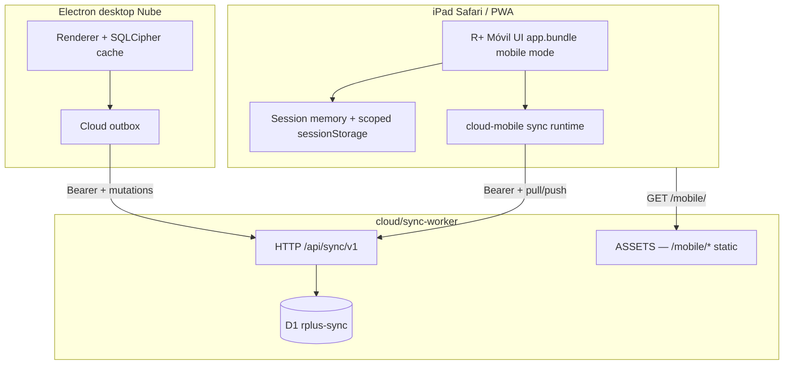

# Cloud Mobile (R+ Móvil / iPad) — Nube Guardia Design

> **For implementation:** After this spec is approved in review, use **superpowers:writing-plans** for a task-by-task plan. Do not implement until the written spec is reviewed.

**Date:** 2026-08-05  
**Status:** Approved for planning (V1 with Nube 7.9+).  
**Release target:** **7.10.0** (current app: 7.9.4).  
**Related:** [`2026-08-02-cloud-sync-free-pilot-design.md`](2026-08-02-cloud-sync-free-pilot-design.md), [`2026-06-02-interno-guardia-mobile-design.md`](2026-06-02-interno-guardia-mobile-design.md), [`2026-06-05-guardia-panel-overhaul-design.md`](2026-06-05-guardia-panel-overhaul-design.md), Equipos cloud mobile (`cloud/equipos-worker/`, `cloud/equipos-pages/`), plan target [`../plans/2026-08-05-cloud-mobile-7.10.md`](../plans/2026-08-05-cloud-mobile-7.10.md) (create at planning).

**PO decisions (2026-08-05):**
- **R+ Móvil on Nube** is required for Sala / Torre HU turns that already use cloud sync — LAN iPad invite is intentionally absent on the Nube ⇄ path today.
- **Same Worker** as desktop Nube (`cloud/sync-worker`) serves static mobile assets (Equipos pattern: Worker API + `ASSETS`).
- **Each clinician logs in on iPad** with their own Nube username/password; desktop invite is a **room deep link**, not a session hijack.
- **Feature parity** with LAN R+ Móvil: guardia board + expediente esencial + team-scoped census; no Word, no full Ajustes, no SOME/labs workbench.
- **Interno MIP** (QR vitals-only micro-app) is **Phase B** — same Worker, separate URL — to keep 7.10 scope shippable.

---

## Problem statement

**R+ Móvil / iPad** today is a **LAN web client**: Safari opens `http://<ward-mac>:3738/mobile/?token=…` and pairs to the desktop Mac running `server.js`. Clinical data flows through the host’s SQLCipher cache and LAN host-store ([`mobile-sharer-sync.mjs`](../../../public/js/mobile-sharer-sync.mjs), [`app-shell-mobile-boot.mjs`](../../../public/js/app-shell-mobile-boot.mjs)).

**Nube 7.9** made Cloudflare D1 the authority for **Sala** and **Torre HU** and **disabled LAN sync transport** for those salas ([`lan-override.mjs`](../../../public/js/features/cloud-sync/lan-override.mjs), [`orchestrator-boot.mjs`](../../../public/js/features/lan/orchestrator-boot.mjs)). The ⇄ panel **skips LAN mobile invite UI** on the Nube path ([`panel-render-once.mjs`](../../../public/js/features/lan/panel-render-once.mjs)).

Result: a team on Nube cannot use iPad guardia mode without ward LAN + a tethered Mac — contradicting the Nube goal (“no LAN host required”) and the guardia workflow (signos at bedside).

**Interno MIP** ([`2026-06-02-interno-guardia-mobile-design.md`](2026-06-02-interno-guardia-mobile-design.md)) remains LAN-only (`/api/interno/v1` on `:3738`). Phase B extends it to cloud for the same reason.

---

## Goals (success criteria)

- [ ] iPad on **4G / guest Wi‑Fi** (no ward LAN) can open R+ Móvil, log in, join the turn’s **cloud room**, and see the same **team-scoped** patient list as LAN mobile.
- [ ] **Guardia board** + **expediente esencial** work: signos/glu, EA registro, indicaciones read, monitoreo history — mutations push to Nube and appear on desktop within one poll cycle.
- [ ] Desktop on Nube shows **“Copiar enlace iPad (Nube)”** + QR in ⇄ (parity with LAN invite, cloud URL).
- [ ] **Session-scoped PHI** on web: no durable localStorage clinical blobs; wipe on `pagehide` ([`session-clinical-wipe.mjs`](../../../public/js/session-clinical-wipe.mjs)).
- [ ] **Sala allowlist** unchanged: cloud mobile only for **Sala** + **Torre HU**; Inters / UX / Eme / Área A keep LAN mobile invite.
- [ ] Pilot stays within **Workers Free** headroom with mobile poll budgeting (see Quotas).
- [ ] No regression to LAN mobile or LAN-only salas.

## Non-goals (V1 / 7.10)

- Cloud mobile for Interconsultas, UX, Eme, or Área A (LAN path unchanged).
- Word / `.docx` export on iPad (existing `blockIfMobileDocExport`).
- Full expediente tabs (labs workbench, SOME paste, VPO edit, receta HU, censo export, Ajustes).
- Offline PWA with durable encrypted cache (session memory only in V1).
- WebSocket LiveSync on mobile (HTTP poll + push-on-save, same as desktop Nube V1).
- Replacing desktop Electron or SQLCipher.
- E2EE where Worker cannot decrypt (same at-rest model as Nube 7.9).
- **Phase B** items: Interno MIP cloud QR, cloud host discovery, LAN↔Nube bridge for same room.

---

## Product metaphor

| Today (LAN) | 7.10 (Nube mobile) |
|-------------|-------------------|
| iPad scans Mac’s ward IP | iPad opens `https://<nube>/mobile/` |
| Ticket / team code pairs to host | Login + room code (or deep link `?room=`) |
| Host Mac is sync hub | Cloudflare D1 is sync hub |
| Sharer URL mirrors desktop `@usuario` | Each user logs in; scope from `clinicalOps` + teams |
| `server.js` serves bundle | Worker `ASSETS` serves bundle |

**User story:** R2 copies **enlace iPad (Nube)** from ⇄ before guardia. On the ward iPad (any network), Safari → Add to Home Screen → login once → join room → guardia board and EA signos match the Mac on Nube.

---

## Feature parity matrix (R+ Móvil)

Aligned with [`tour-flow-guardia-copy.mjs`](../../../public/js/features/settings-help/tour-flow-guardia-copy.mjs) and [`expediente-tabs-migrate.mjs`](../../../public/js/expediente-tabs-migrate.mjs).

| Surface | LAN mobile today | Cloud mobile V1 |
|---------|------------------|-----------------|
| Sidebar census (team scope) | ✓ | ✓ |
| Modo Guardia board | ✓ | ✓ |
| EA — signos, glu, I/E registro | ✓ | ✓ |
| Indicaciones read | ✓ | ✓ |
| Monitoreo / vitals history | ✓ | ✓ |
| Notas / indicaciones edit | Limited | Same as LAN mobile |
| Labs / SOME / paste | ✗ | ✗ |
| Word / censo export | ✗ | ✗ |
| Ajustes / profile / tours | ✗ | ✗ (version badge only) |
| ⇄ / LAN invite | LAN only | Nube invite on desktop |

**Scope rule:** [`shouldEnforceTeamPatientMirror()`](../../../public/js/clinical-privileges.mjs) — joined teams + active guardia coverage; never full R4 ward census on web.

---

## Architecture overview



**Authority:** Same as Nube 7.9 — D1 room revision when sala ∈ {Sala, Torre HU}.  
**No dual path:** Cloud mobile never opens LAN transport for the same turn.

### Package layout (new / extended)

```
cloud/sync-pages/public/mobile/     # index.html, bundle, tokens (built artifact)
cloud/sync-worker/
  wrangler.toml                     # + ASSETS binding
  src/index.js                      # serve ASSETS + API (equipos pattern)
public/js/features/cloud-mobile/    # mobile-only cloud boot + sync loop
  boot.mjs                          # replace LAN join when origin is Nube
  sync-runtime.mjs                  # poll + push (no Electron outbox file)
  invite-url.mjs                    # build cloud mobile deep links
public/js/features/cloud-sync/
  panel-mobile-invite.mjs           # Nube ⇄ iPad section + QR
scripts/build-cloud-mobile.mjs      # esbuild → sync-pages/public/mobile/
```

Reuse (import, do not fork logic):
- [`api-client.mjs`](../../../public/js/features/cloud-sync/api-client.mjs) — auth + pull/push
- [`pull-apply.mjs`](../../../public/js/features/cloud-sync/pull-apply.mjs) — apply into memory state
- [`mutate-bridge.mjs`](../../../public/js/features/cloud-sync/mutate-bridge.mjs) — push paths (subset on mobile)
- [`cloud-op-slim.mjs`](../../../public/js/features/cloud-sync/cloud-op-slim.mjs) — slim ops on pull
- [`applyClinicalScopeFromLanOpsSnapshot`](../../../public/js/clinical-access-runtime/scope-lan.mjs) — iPad scope hydrate

---

## URL & invite model

### Public mobile entry

| URL | Role |
|-----|------|
| `https://<nube-host>/mobile/` | Shell; sets `__RPC_MOBILE_WEB__` |
| `https://<nube-host>/mobile/join?room=<CODE>` | Deep link from desktop invite |
| `https://<nube-host>/mobile/join?room=<CODE>&sala=Sala%201` | Optional sala label for UI |

**Config:** Same base URL as desktop Nube ([`settings.mjs`](../../../public/js/features/cloud-sync/settings.mjs) / `rpc-settings.cloudSyncUrl`). Desktop normalizes; mobile reads from query `?sync=` override for staging only.

### Desktop invite (⇄ Nube path)

When `shouldShowNubePanel(sala)` && `shouldShowNubePostAuthChrome(token)`:

1. Section **「iPad / R+ Móvil (Nube)」** — mirror LAN card copy but cloud URL.
2. **Copiar enlace móvil** → `buildCloudMobileJoinUrl({ roomCode, sala })`.
3. **QR** — reuse [`interno-qr-render.mjs`](../../../public/js/interno-qr-render.mjs) canvas helper.
4. Spanish hint: *«Abre en Safari en cualquier red. Inicia sesión con tu @usuario. No necesitas Mac anfitrión ni Wi‑Fi de sala.»*

**Not** a permanent LAN ticket. Room code may rotate when owner rotates cloud room invite (same as desktop join).

### Mobile boot sequence

1. Load `/mobile/` → `installSessionClinicalWipeOnExit()`.
2. If no session token → **login / register** UI (reuse [`panel-steps-html.mjs`](../../../public/js/features/cloud-sync/panel-steps-html.mjs) patterns, mobile layout).
3. Parse `room` from URL → `joinRoom` or prompt for code.
4. Initial `pull` (snapshot if cold) → `applyCloudState` → `applyClinicalScopeFromLanOpsSnapshot`.
5. Start poll loop (30s visible, paused hidden) + push after local saves.
6. **Do not** call `configureLanFromMobileJoin` or LAN discovery.

Replace [`initMobileWebBoot`](../../../public/js/app-shell-mobile-boot.mjs) branch: if `isCloudMobileOrigin()` → `initCloudMobileBoot()` else existing LAN boot.

---

## Auth & session (mobile web)

| Topic | V1 rule |
|-------|---------|
| Identity | Same D1 users as desktop Nube |
| Token storage | `sessionStorage` key `rpc-cloud-sync-token` only — **not** `localStorage` |
| Password KDF | PBKDF2-SHA-256 (Worker, same as 7.9) |
| Session TTL | 14 days sliding; revoke on password change |
| Logout | Clear token + `wipeSessionClinicalStorage({ includeLanSession: false })` |
| Recovery codes | Optional V1.1 mobile UI; V1 can deep-link to desktop recovery flow copy |

**Sharer params deprecated on cloud:** Do not reintroduce LAN-style `?user=&name=&rank=` session binding without login. URL may carry `sala` and `room` for UX only.

---

## Sync protocol (mobile client)

Identical to Nube 7.9 desktop HTTP sync — no new mutation schema.

### Pull

`GET /api/sync/v1/rooms/:roomId/pull?since=REV`

- Apply via `applyCloudPullResult` → memory `storage` / `app-state` (web mode).
- Always apply `clinicalOps` for scope ([`pull-apply.mjs`](../../../public/js/features/cloud-sync/pull-apply.mjs) web branch).

### Push

`POST /api/sync/v1/rooms/:roomId/mutations`

Mobile enqueue in **memory outbox** (reuse [`outbox.mjs`](../../../public/js/features/cloud-sync/outbox.mjs) interface with `localStorage` backend disabled).

**Allowed mutation paths from mobile (client gate):**

| Path pattern | Example use |
|--------------|-------------|
| `entries/*/monitoreo` | EA signos / glu |
| `entries/*/estadoActual` | EA sections |
| `entries/*/note` | Short updates if already editable on LAN mobile |
| `entries/*/indicaciones` | Only if LAN mobile already allows |
| `todos/*` | Pendientes toggle |
| `clinicalOps` | **Never** from mobile |

Reject locally before HTTP for forbidden paths (labs, bulk census, tombstones).

### Poll schedule

| Client | Interval | Condition |
|--------|----------|-----------|
| Desktop Nube | 15s | App focused |
| **Mobile Nube** | **30s** | `document.visibilityState === 'visible'` |
| Either | Immediate | After successful local save (debounced 2s, share [`cloud-sync-timing.mjs`](../../../public/js/features/cloud-sync/cloud-sync-timing.mjs)) |

Status chip on mobile header: `Nube · al día` / `sincronizando` / `pendiente (N)` / `Sin conexión` (reuse strings from desktop).

---

## Worker changes

### Static assets (`ASSETS`)

Mirror [`cloud/equipos-worker/src/index.js`](../../../cloud/equipos-worker/src/index.js):

1. API routes under `/api/sync/v1/*` (existing).
2. `env.ASSETS.fetch(request)` for `/mobile/*`.
3. `/mobile` → `/mobile/index.html`.
4. CORS: allow mobile origin; headers `Authorization`, `Content-Type`.

### `wrangler.toml`

```toml
[assets]
directory = "../sync-pages/public"
binding = "ASSETS"
```

### Optional fast bootstrap (V1.1)

`GET /api/sync/v1/rooms/:roomId/mobile-bootstrap`

Returns `{ revision, clinicalOps, memberIds, summary }` without full patient payload — **not required for 7.10** if full pull fits Free tier for ≤50 patients.

### No new D1 tables for V1

Room membership + bundle state already in Nube schema.

---

## Build & bundle strategy

**Approach:** Ship the **same renderer bundle** as desktop with mobile boot flag — avoids maintaining a second feature surface.

1. `scripts/build-cloud-mobile.mjs`:
   - Run `npm run build:ui` (or subset entry).
   - Copy `public/index.html`, `public/js/app.bundle.mjs`, chunks, `tokens.css`, critical CSS into `cloud/sync-pages/public/mobile/`.
   - Rewrite asset paths to relative `/mobile/…`.
   - Inject `<script>globalThis.__RPC_CLOUD_MOBILE__=true</script>` in shell.
2. Desktop Electron continues loading from `file:` / dev server — **no** cloud mobile flag.
3. **Do not** hand-edit generated chunks in `sync-pages/`.

**Size gate:** Mobile artifact gzipped ≤ current `app.bundle.mjs` + 5% (same as debt perf rule). If over, lazy chunks already in bundle must suffice; no new eager imports in mobile boot path.

**Boot graph:** `cloud-mobile/boot.mjs` loaded only when `__RPC_CLOUD_MOBILE__`; no new static imports in `app.js` cold path.

---

## Desktop UX changes (7.10)

| Location | Change |
|----------|--------|
| ⇄ Nube main stack | Add mobile invite card when `shouldShowNubePostAuthChrome` |
| LAN mobile card | Hidden when `shouldHidePrimaryLanChrome` (unchanged) |
| Onboarding / tour | New step variant `gv7_mobile_cloud_link` for Nube salas |
| Release notes | «iPad sin anfitrión LAN en Sala/Torre Nube» |

Copy distinction (tour):

- **LAN invite:** otra Mac / ticket ward IP.
- **Nube invite:** cualquier red; login propio.

---

## Phase B — Interno MIP on cloud (7.10.x or 7.11)

Separate micro-app; **do not block 7.10**.

| Piece | Cloud behavior |
|-------|----------------|
| URL | `https://<nube>/interno/sala-1?t=<token>` |
| Auth | Per-room interno token in D1 (`room_interno_tokens`) — not SQLCipher `sala_interno_access` |
| Board | `GET /api/sync/v1/interno/:sala/board` — derived from room bundle + `active_guardias` in snapshot |
| POST vitals | `POST /api/sync/v1/interno/vitals` → LWW mutation on `entries/:id/monitoreo` + guardia fields |
| UI | Reuse `public/interno/*` built into `sync-pages/public/interno/` |
| Desktop QR | Nube panel «QR Internos (Nube)» for R4 |

Host discovery **removed** — URL is always cloud hostname.

---

## Security & compliance

| Risk | Mitigation |
|------|------------|
| PHI at rest on iPad | Session memory + wipe; no `CLINICAL_LS_KEYS` in `localStorage` |
| Token theft | `sessionStorage` + short session; HTTPS only |
| Scope escape | Server enforces room membership; client enforces team mirror |
| Interno token leak (Phase B) | Rotate per sala; rate limit POST |
| Logging | No PHI in Worker logs (same as 7.9) |
| CORS | Allowlist nube host + staging |

Update [`01-vision-north-star.md`](../../core/01-vision-north-star.md) changelog line: cloud mobile pilot extends Nube to bedside iPad for Sala/Torre.

---

## Quotas (Free tier — mobile added)

Estimate **12 users × 12h guardia** (7 desktop + 5 iPad):

| Traffic | Desktop only (7.9) | + Mobile V1 |
|---------|-------------------|-------------|
| Pull reads / day | ~7×15s ≈ 34k | +5×30s ≈ +14k → **~48k** |
| Push writes | Coalesced saves | Same + mobile vitals |

Stays under D1 **5M reads/day**. Mobile **must** pause poll when hidden and use 30s interval.

If soak fails → first lever: mobile poll 45s; second: Paid Workers (~$5).

---

## Mode matrix (updated)

| Context | Desktop | iPad R+ Móvil |
|---------|---------|---------------|
| Sala/Torre + Nube online | Cloud authority | **Cloud mobile** (7.10+) |
| Sala/Torre + Nube offline | Local cache + outbox | Session data only; badge «Sin conexión»; queue pushes in memory until tab killed |
| Inters/UX/Eme/Área A | LAN | LAN mobile (unchanged) |
| LAN-only sala + LAN host | LAN | LAN mobile |

Never: iPad cloud client + desktop LAN authority for same room.

---

## Rollout / versioning

| Step | Deliverable | Needs app release? |
|------|-------------|-------------------|
| A | Worker + ASSETS deploy (`wrangler deploy`) | No (static shell only) |
| B | Mobile cloud boot + sync in bundle | **Yes — 7.10.0** |
| C | Desktop Nube iPad invite + QR | **Yes — 7.10.0** |
| D | Docs + tour + release notes | **Yes — 7.10.0** |
| E | Phase B interno cloud | **Yes — 7.10.x/7.11** |

**Install rule (release notes):** Sala/Torre on Nube → install **7.10+ on all desktops** the day you enable cloud iPad; iPad uses web URL (no App Store). LAN-only salas: no change required.

`package.json` bump to **7.10.0** at release only.

---

## Testing strategy

### Automated

- Worker (Miniflare): ASSETS serve `/mobile/`, CORS preflight, auth + pull with Bearer.
- [`pull-apply.test.mjs`](../../../public/js/features/cloud-sync/pull-apply.test.mjs) — extend web `clinicalOps` scope case.
- `cloud-mobile/boot.test.mjs` — cloud origin skips LAN `configureLanFromMobileJoin`.
- `cloud-mobile/mutation-gate.test.mjs` — forbidden paths blocked.
- Invite URL builder tests (room code encoding).

### Manual (required before 7.10)

1. Desktop A + B on Nube Sala room; iPad on LTE logs in, joins same room → census matches team scope.
2. iPad records signos → desktop EA within 30s; desktop edit → iPad sidebar updates.
3. Kill ward LAN on iPad — cloud mobile still works.
4. Logout iPad → `localStorage` clinical keys empty; sessionStorage token cleared.
5. UX sala — LAN mobile invite still works; no cloud mobile card.
6. Regression: LAN Sala turn (pre-Nube) — LAN mobile unchanged.

### Debt / perf gates

- `npm run metrics:check` — no new boot-graph imports from `app.js`.
- Mobile boot path Tier 1 budgets on new `cloud-mobile/*` files.

---

## Resolved decisions

1. **Worker packaging:** Single `sync-worker` + `sync-pages` (not a third Worker).
2. **Login on iPad:** Required per user; no LAN sharer mirror on cloud.
3. **Bundle:** Full mobile-mode renderer from ASSETS, not a new micro-app (unlike Interno MIP).
4. **Poll interval:** 30s mobile vs 15s desktop.
5. **Interno MIP:** Phase B — separate spec section, same Worker host.
6. **Sala allowlist:** Unchanged from Nube 7.9.
7. **Offline mobile:** Best-effort memory queue only; no durable offline cache in V1.

---

## Open questions (resolve in planning, not block spec)

1. Custom domain for mobile URL (e.g. `m.rplus.app`) vs `*.workers.dev` — default workers.dev for pilot.
2. Mobile login UI: minimal standalone form vs embedded Conexión chrome — prefer **minimal standalone** (faster boot).
3. Push notifications for altered vitals on iPad — **out of V1** (toast on desktop only).

---

## Success metrics (pilot)

- **Primary:** One full guardia with **zero LAN host**, ≥2 iPads on LTE, signos captured on iPad appear on desktop Nube clients with no loss reports.
- **Secondary:** Combined Worker/D1 usage ≤70% of Free daily caps with 5 mobile clients.
- **Guardrail:** LAN mobile regression tests pass for Inters/UX/Eme/Área A.

---

> [!IMPORTANT]
> **7.10 requires both** a Worker deploy (assets + API) **and** a desktop app release (invite URL + bundle with `cloud-mobile` boot). Shipping Worker-only does not give users a working cloud iPad path from ⇄.
