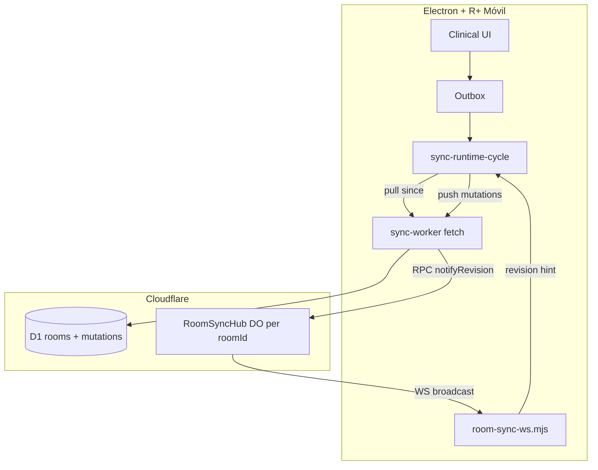

# Cloud Sync Realtime (Room DO + WebSocket) — Design

> **For implementation:** After this spec is approved in review, use **superpowers:writing-plans** for a task-by-task plan. Do not implement until the written spec is reviewed.

**Date:** 2026-08-07  
**Status:** Approved for planning.  
**Release target:** **8.1.0** (follows 8.0.5 Nube-only baseline).  
**Related:** [`2026-08-02-cloud-sync-free-pilot-design.md`](2026-08-02-cloud-sync-free-pilot-design.md), [`2026-08-05-cloud-mobile-ipad-design.md`](2026-08-05-cloud-mobile-ipad-design.md), [`2026-06-03-lan-conflict-lww-design.md`](2026-06-03-lan-conflict-lww-design.md), plan [`../plans/2026-08-07-cloud-sync-realtime-do.md`](../plans/2026-08-07-cloud-sync-realtime-do.md).

**PO decisions (2026-08-07):**
- **Push → signal → pull** replaces aggressive HTTP polling as the primary path for peer updates.
- **Workers Free + Durable Objects (SQLite-backed)** targets institutional rollout: **~47 R1** (primary editors) + **~10** R2/R3/R4 (mostly readers). **~60 accounts** is a soft estimate, not a hard cap.
- **Poll stays** as safety net and transport fallback — intervals **relax** when WS is healthy.
- **No censo over WebSocket** — only lightweight `revision` (and optional `actorId`) hints; pull/apply unchanged.
- **LAN transport ladder reused:** WS → SSE (optional phase) → HTTP poll.

---

## Problem statement

Nube V1 uses HTTP **push + poll** because the Free pilot spec assumed realtime required Paid DO hubs. Cloudflare now exposes **Durable Objects on Workers Free** (April 2025): 100k DO requests/day, WebSocket hibernation, outgoing WS messages at no extra charge.

Today peers discover remote edits only via **poll** (currently ~8 s idle desktop, ~12 s mobile) or focus/online events. That feels sluggish, burns Worker request budget, and contradicts the Drive metaphor the product already uses on LAN (signal + fetch).

**Decision:** Add a **per-room Durable Object** that fans out revision hints after successful mutation commits. Clients pull on signal; poll becomes reconciliation, not the primary UX.

---

## Goals (success criteria)

- [ ] After Mac A pushes, Mac B / iPad see the change within **~1 s** on ward Wi‑Fi (signal + pull), without clicking Forzar.
- [ ] **Worker request budget drops** vs current 8 s poll (see Quotas).
- [ ] **DO request budget** stays under Free daily caps for institutional rollout (~47 R1 + seniors).
- [ ] WS disconnect (proxy, sleep, tab background) → automatic fallback poll; reconnect → immediate pull + WS resume.
- [ ] Desktop + R+ Móvil share the same signal path.
- [ ] Auth: only room **members** with valid Bearer session can open the room WS.
- [ ] No regression to push/outbox/LWW/pull-apply/offline queue.

## Non-goals (V1)

- Shipping full censo or ops payloads over WS.
- Replacing D1 as authority or merging in the DO.
- Presence cursors / “who is editing” UI.
- E2EE / per-room DEKs (product target; see [15-security.md](../../core/15-security.md) — not this realtime slice).
- SSE middle tier (optional later; WS + poll enough for V1).
- Web Push notifications for desktop Electron.

---

## Architecture overview



**Authority:** unchanged — D1 `rooms.revision` + `room_state` (target: client-encrypted; production: plaintext JSON — [15-security.md](../../core/15-security.md)).  
**DO role:** connection registry + fan-out only; stores last `revision` for catch-up on connect.

---

## Room DO (`RoomSyncHub`)

| Item | Choice |
|------|--------|
| Class name | `RoomSyncHub` |
| Instance id | `env.ROOM_SYNC_HUB.idFromName(roomId)` |
| Storage | SQLite-backed DO (Free tier) — optional `lastRevision` column |
| API | WebSocket Hibernation API (`acceptWebSocket`, `webSocketMessage`, `webSocketClose`) |

### Wire protocol (JSON text frames)

**Server → client**

```json
{ "type": "revision", "revision": 843, "at": "2026-08-07T22:30:00.000Z" }
{ "type": "hello", "revision": 843, "yourId": "conn-abc" }
```

**Client → server**

```json
{ "type": "ping" }   // optional; protocol pings preferred
```

No PHI on the wire.

### Worker → DO after successful push

After `commitMutationBatch` returns `ok`:

```js
const stub = env.ROOM_SYNC_HUB.get(env.ROOM_SYNC_HUB.idFromName(roomId));
await stub.notifyRevision({ revision: nextRevision, at: new Date().toISOString() });
```

`notifyRevision` broadcasts `{ type: 'revision', revision, at }` to all attached WebSockets. **Outgoing messages are not billed** on DO.

### WebSocket route

`GET /api/sync/v1/rooms/:roomId/live`

1. Worker validates Bearer + `room_members`.
2. Forwards upgrade to room DO stub (`fetch` with `Upgrade: websocket`).
3. DO `acceptWebSocket`, send `hello` with current revision (from D1 or DO cache).

---

## Client behavior

### New module: `public/js/features/cloud-sync/room-sync-ws.mjs`

- Connect when Nube runtime starts and `roomId` + token exist.
- Pause / close when runtime stops, logout, or `document.visibilityState === 'hidden'` (mobile: same as today hidden push-only).
- On `revision` message where `revision > localRevision`: call `runtime.pullLatest()` or `syncCycle()` if outbox pending.
- Debounce duplicate signals (same revision within 500 ms).
- Expose `getTransportState(): 'ws' | 'poll' | 'offline'`.

### `sync-runtime-cycle.mjs` integration

- `createCloudPollScheduler` reads transport state:
  - **`ws` healthy** → use **relaxed** intervals (below).
  - **`poll` fallback** → moderate intervals (similar to original V1 15 s).
  - **`offline`** → no timer; pending badge only.

### Relaxed polling (primary deliverable once WS works)

| Constant | No WS (today) | WS connected | WS down (fallback) |
|----------|---------------|--------------|-------------------|
| `CLOUD_POLL_IDLE_MS` | 8_000 | **90_000** | 20_000 |
| `CLOUD_POLL_MOBILE_IDLE_MS` | 12_000 | **60_000** | 25_000 |
| `CLOUD_POLL_ACTIVE_MS` | 4_000 | **30_000** | 8_000 |
| `CLOUD_POLL_ACTIVE_WINDOW_MS` | 180_000 | 180_000 | 180_000 |

Push debounce (`CLOUD_PUSH_FIRST_MS` / `CLOUD_PUSH_DEBOUNCE_MS`) unchanged — local coalescing, not peer discovery.

**Safety poll purpose:** catch missed WS frames, clock skew, tab that missed signal while backgrounded, admin purge on another client.

---

## Transport fallback ladder

1. **WebSocket** to room DO (primary).
2. **HTTP poll** (relaxed when WS up; faster when WS down).
3. Existing triggers unchanged: `online`, `focus`, `visibilitychange`, Forzar sync.

Optional later: **SSE** proxy on Worker for networks that block WS upgrade — not V1.

---

## Institutional load model (soft estimates)

| Cohort | Accounts | Role in sync | Typical concurrent (12 h guardia) |
|--------|----------|--------------|-----------------------------------|
| **R1** | **47** | Primary editors — censo, EA, notas, labs | ~**28** focused (not all 47 at keyboard) |
| **R2 / R3 / R4** | ~10 (subset uses Nube) | Mostly **read + pull** on R1 signals; occasional edit | ~**8** focused |
| **Total soft ceiling** | **~60** | Rollout planning number, not hard cap | ~**36** focused peak |

Most **pushes** come from R1; seniors still **pull** when a revision signal fires (they need live censo without polling aggressively).

---

## Quotas (Free tier)

Separate pools: **Worker requests** vs **DO requests**.

### Illustrative day (institutional defaults: 28 R1 + 8 seniors concurrent, 12 h)

Assumptions: R1 ~30 edits/h, seniors ~4 edits/h, ~0.35 pushes/edit after debounce, 9 peers pull per signal.

| Path | Worker req/day | DO req/day | D1 writes/day |
|------|----------------|------------|---------------|
| Poll 8 s idle (no WS) | ~**198_000** ❌ | 0 | ~7_000 |
| WS + safety poll 90 s | ~**54_000** ✓ | ~**3_700** | ~7_000 |
| Stress (all 47 R1 concurrent) | ~**87_000** ✓ | ~**7_500** | ~12_000 |

Poll-only at institutional scale **does not fit** Free. Realtime + relaxed poll is required for rollout, not only UX.

**Worst case (47 R1 all focused):** `CONCURRENT_EDITORS=47 REALTIME=1 npm run estimate:free` — still under 100k Worker requests with 90 s safety poll.

DO incoming WS messages: billed at **20:1**. Revision hints are tiny.

```bash
npm run estimate:free                      # institutional defaults
REALTIME=1 npm run estimate:free           # WS + 90 s safety poll
CONCURRENT_EDITORS=47 REALTIME=1 npm run estimate:free  # all R1 on keyboard
```

---

## Security

- WS upgrade requires same Bearer session as HTTP API.
- Room membership checked in Worker **before** DO handoff.
- DO never decrypts `room_state`; no PHI stored in DO SQLite beyond `lastRevision` + connection metadata.
- Rate-limit WS connects per user (reuse auth rate patterns).

---

## Testing

| Layer | Tests |
|-------|--------|
| Worker | Miniflare: mock DO, push triggers notify, WS receives revision |
| DO | Unit: broadcast to N mock sockets, hibernation stub |
| Renderer | `room-sync-ws.test.mjs`, `cloud-sync-timing.test.mjs` relaxed constants when `ws` transport |
| Integration | Manual: two desktops same room, edit nombre → peer < 2 s |

---

## Rollout

1. Deploy Worker + DO binding (WS route live; clients ignore until flag).
2. Ship desktop client with WS + relaxed poll behind `localStorage` / settings probe.
3. Ship R+ Móvil bundle (`build:cloud-mobile`).
4. Diagnóstico Nube chip: show transport `WS` vs `Poll`.

Rollback: client stops connecting WS → falls back to poll-only (no Worker change required).

---

## Open questions (defaults chosen)

| Question | Default |
|----------|---------|
| One DO per `roomId` vs per `sala+month`? | `roomId` (matches pull API) |
| Pull on every revision signal vs debounce? | Pull if `revision > local`; debounce 300 ms burst |
| Desktop Electron hidden tab? | Close WS when hidden; safety poll only |
