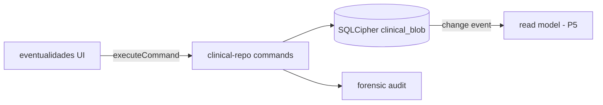

# P1 — Canonical Clinical Store

> **For implementation:** After approval, plan tasks in `plans/2026-08-11-clinical-data-reckoning.md` § P1. Parent program: [`2026-08-11-clinical-data-reckoning-program.md`](2026-08-11-clinical-data-reckoning-program.md).

**Date:** 2026-08-11  
**Status:** Draft for review  
**Depends on:** 8.0.5 Nube-only runtime (LAN retirement)  
**First vertical slice:** **Eventualidades** (entries + `labsText` timeline)

---

## Problem statement

Clinical mutations today follow an **memory-first** path:

1. Feature mutates `app-state.mjs` exports (`patients`, `labHistory`, …).
2. `saveState()` debounces (~400 ms) and writes JSON blobs to SQLCipher via `db-storage-bridge.mjs`.
3. Separate hooks call `mutate-bridge` to enqueue cloud ops from **in-memory** shapes.

This means:

- UI can observe state that is **not yet durable** (debounce window).
- Cloud ops can encode **stale** memory if save and enqueue race.
- Every new feature learns two APIs: “change app-state” and “maybe enqueue cloud.”
- Tests must mock globals instead of asserting repository behavior.

SQLCipher already stores the truth (`clinical_blob` table, `lib/db/clinical-blob-keys.mjs`). The reckoning is to make **commands write blobs directly** and treat RAM as a cache (P5).

---

## Goals (success criteria)

- [ ] New module `lib/clinical-repo/` (Node + importable from renderer via thin IPC) exposes **typed commands** with atomic blob commits.
- [ ] Commands return `{ ok, revision?, changedKeys }` — no silent partial writes.
- [ ] **Eventualidades slice** migrated: add/edit/delete entry writes via repo; no direct `saveState()` from `eventualidades-*.mjs`.
- [ ] IPC surface: `db:clinical-command` (or per-domain channels) with audit hook reuse from forensic audit.
- [ ] Colocated tests: command fixtures against in-memory SQLite (existing `createUnlockedDbManager` pattern).
- [ ] Feature flag `clinicalRepo.eventualidades` (settings or env) for rollback without redeploy.

## Non-goals (P1)

- Migrating census, labs historial, notes, EA (later 8.1.x slices).
- Changing cloud op schema.
- Removing `app-state` (P5).
- Normalizing blob JSON into relational tables (blobs stay JSON V1).

---

## Architecture



### Command shape (V1)

```js
// lib/clinical-repo/commands/eventualidades.mjs
/** @typedef {{ type: 'eventualidad.upsert', patientId: string, entry: object }} EventualidadUpsert */
/** @typedef {{ type: 'eventualidad.delete', patientId: string, entryId: string }} EventualidadDelete */

export async function executeClinicalCommand(db, command, meta) {
  // switch (command.type) — exhaustive
  // 1. load affected blob(s)
  // 2. apply pure transform (lib/clinical-repo/transforms/)
  // 3. single transaction: UPDATE clinical_blob + optional patient row touch
  // 4. emit change record for sync projector (P2)
}
```

**Rules:**

- Transforms are **pure functions** `(blob, command) → blob` — testable without DB.
- One transaction per command; no multi-command batch in P1.
- `meta.actorId`, `meta.source` ('ui' | 'sync-apply' | 'import') for audit.

### Module layout (new)

```
lib/clinical-repo/
  index.mjs                 # executeClinicalCommand dispatcher
  change-log.mjs            # append-only local change records (P2 consumes)
  commands/
    eventualidades.mjs
  transforms/
    eventualidades.mjs      # pure entry list mutations
  adapters/
    sqlcipher.mjs           # load/save blob by key
    memory.mjs              # web/mobile test double
lib/db/ipc-handlers-register-clinical-repo.mjs
public/js/clinical-repo-client.mjs   # renderer: ipc invoke wrapper
```

### Blob keys (unchanged V1)

Continue using `clinical_blob.blob_key` from `clinical-blob-keys.mjs`. Eventualidades live inside patient JSON or dedicated blob — **match current persistence shape** to avoid migration; only the **write path** changes.

---

## Renderer integration (eventualidades slice)

| Today | Target |
| --- | --- |
| `eventualidades-store.mjs` mutates patient in `patients` array | calls `clinicalRepo.upsertEventualidad(...)` |
| `saveState()` after edit | **removed** from hot path |
| `mutate-bridge` enqueue from store | **removed** in slice (P2 projector enqueues) |
| UI re-render | subscribe to `clinicalRepo.onChange` or refresh patient from read model |

**During transition:** if flag off, fall back to current store + `saveState()`.

---

## IPC contract

| Channel | Payload | Response |
| --- | --- | --- |
| `db:clinical-command` | `{ command, meta? }` | `{ ok, error?, changedKeys?, changeId? }` |
| `db:clinical-blob-get` | `{ keys: string[] }` | `{ blobs: Record<string, string> }` (existing `dbClinicalLoadAll` subset) |

Keep blob load for boot hydrate until P5 read models land.

---

## Sync interaction (handoff to P2)

P1 writes append a row to `clinical_change_log` (new table, schema bump v16):

```sql
CREATE TABLE clinical_change_log (
  id INTEGER PRIMARY KEY AUTOINCREMENT,
  change_id TEXT NOT NULL UNIQUE,
  command_type TEXT NOT NULL,
  blob_keys TEXT NOT NULL,  -- JSON array
  patient_id TEXT,
  actor_id TEXT,
  created_at TEXT NOT NULL,
  synced_at TEXT             -- NULL until projector marks done
);
```

P2 reads unsynced rows and emits cloud ops. P1 only **appends**; no cloud imports in P1.

---

## Tests

| File | Covers |
| --- | --- |
| `lib/clinical-repo/transforms/eventualidades.test.mjs` | Pure transforms |
| `lib/clinical-repo/commands/eventualidades.test.mjs` | SQLCipher integration |
| `public/js/features/eventualidades-store.test.mjs` | Flag on → repo called; flag off → legacy |
| `lib/db/schema.test.mjs` | v16 migration |

Run: `npm run test:one -- lib/clinical-repo/transforms/eventualidades.test.mjs` (and siblings).

---

## Acceptance (P1 gate)

1. With flag **on**, add eventualidad on Mac A → SQLCipher blob updated before UI toast; no `saveState` in call stack (assert via test spy).
2. With flag **off**, behavior identical to 8.0.5.
3. Offline: command persists locally; outbox unchanged until P2 (no regression).
4. `npm run metrics:check` passes; new files ≤600 lines, functions ≤80 lines, complexity ≤15.

---

## Rollout

1. Ship schema v16 + repo module behind flag (8.1.0).
2. Enable flag for dev team one week.
3. Default flag on in 8.1.1 if no incidents.
4. Next slice candidate: **patient census field patch** (single-field LWW, high sync value).
