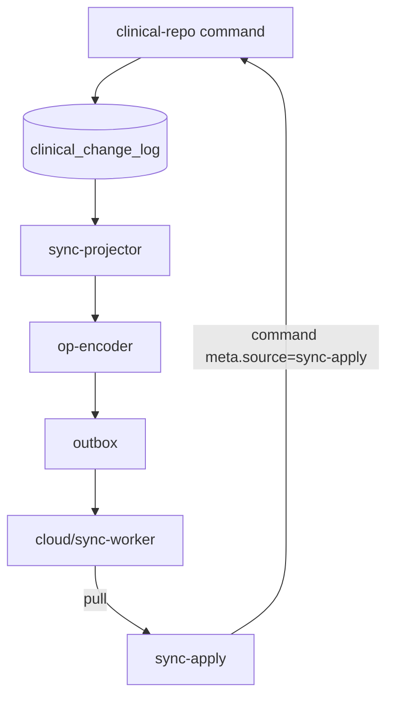

# P2 — Sync Projection & Outbox

> **For implementation:** Plan § P2 in `plans/2026-08-11-clinical-data-reckoning.md`. Requires P1 `clinical_change_log`. Parent: [`2026-08-11-clinical-data-reckoning-program.md`](2026-08-11-clinical-data-reckoning-program.md).

**Date:** 2026-08-11  
**Status:** Draft for review  
**Depends on:** P1 (at least one domain on repo commands)

---

## Problem statement

Cloud sync today is **feature-driven**:

- Dozens of call sites invoke `mutate-bridge.mjs` (`enqueuePatientOps`, `enqueueCloudClinicalOpsValue`, lab sidecars, tombstones, …).
- Each caller passes **in-memory** patient shapes that may not match what SQLCipher just persisted.
- `mutate-bridge.mjs` (~590 lines) encodes domain knowledge **duplicated** from save paths.
- Compensators accumulate: tombstone coalesce, census seed ops, legacy lab backfill ack in `sync.js`.

**Target:** Sync is a **projector** — reads durable local changes → emits cloud ops. Features never call `mutate-bridge` directly.

---

## Goals (success criteria)

- [ ] `lib/clinical-repo/sync-projector.mjs` consumes `clinical_change_log` rows and enqueues outbox ops.
- [ ] For P1 domains (eventualidades first), **zero** direct `mutate-bridge` imports in feature code.
- [ ] `mutate-bridge.mjs` reduced to: op encoding helpers + `configureCloudMutateBridge` + flush — **no** patient shape mapping from globals.
- [ ] Projector is **idempotent** per `change_id` (safe on retry / crash).
- [ ] Pull apply path (`sync-apply`) writes via **repo commands** with `meta.source: 'sync-apply'` — does not mutate `app-state` first.
- [ ] Delete or gate legacy paths: `tryLegacyBulkLabBackfillAck` once projector handles lab history changes.

## Non-goals (P2)

- WebSocket realtime (see [`2026-08-07-cloud-sync-realtime-do-design.md`](2026-08-07-cloud-sync-realtime-do-design.md)).
- Changing LWW semantics on the Worker.
- Projecting all domains day one — follow P1 slice rollout.

---

## Architecture



### Projector loop

1. On command success (or debounced 50 ms batch), projector loads rows where `synced_at IS NULL`.
2. For each `change_id`, load current blobs from SQLCipher (not app-state).
3. `op-encoder` maps `(command_type, blobs) → CloudSyncOp[]` — extracted from today's `mutate-bridge-ops.mjs`.
4. Enqueue single outbox mutation per change (or coalesce per patient within batch window).
5. On push ACK, mark `synced_at`; on permanent failure, surface in Conexión diagnostics.

### Op encoder module (refactor, not rewrite)

```
lib/clinical-repo/sync/
  projector.mjs
  op-encoder.mjs          # path/value builders from blobs
  op-encoder-eventualidades.mjs
  op-encoder-patient.mjs  # later slices
  tombstone.mjs           # move from outbox-tombstones.mjs
```

Keep cloud op JSON **byte-compatible** with Worker `lww.js` — no protocol change.

---

## Inbound sync (pull apply)

| Today | Target |
| --- | --- |
| `sync-apply` patches `app-state` then `saveState()` | `executeClinicalCommand({ type: 'sync.applyOps', ops })` |
| Risk of double enqueue | Projector skips rows where `meta.source === 'sync-apply'` |

**Rule:** Remote changes never re-enqueue in the same revision tick (revision check + `origin: 'pull'` on change log).

---

## mutate-bridge shrink plan

| Keep | Move to projector | Delete after all domains migrated |
| --- | --- | --- |
| `configureCloudMutateBridge`, flush, revision | `mapPatientEntryToOps` | `enqueuePatientPatchFromMemory` |
| `cloud-sync-diagnostics` hooks | census field ops from blob diff | globals imports (`patients`, `labHistory`) |
| constants (`CLOUD_BATCH_MUTATION_ID`) | lab sidecar ops from blob diff | `patientsForPersistence` coupling |

**End state file size target:** `mutate-bridge.mjs` ≤150 lines (facade only) or replaced by `cloud-sync/runtime.mjs`.

---

## Worker cleanup (coordinated)

Once projector owns lab backfill:

- Remove `tryLegacyBulkLabBackfillAck` from `cloud/sync-worker/src/sync.js` after min desktop version ≥8.1.2.
- Document in Worker CHANGELOG; no D1 migration.

---

## Tests

| File | Covers |
| --- | --- |
| `lib/clinical-repo/sync/op-encoder-eventualidades.test.mjs` | Blob → ops golden files |
| `lib/clinical-repo/sync/projector.test.mjs` | Idempotency, batch, synced_at |
| `public/js/features/cloud-sync/mutate-bridge.test.mjs` | Slim facade; no patient global reads |
| `public/js/features/sync-apply/sync-apply-repo.test.mjs` | Pull → command, no enqueue echo |

---

## Feature flags

| Flag | Meaning |
| --- | --- |
| `clinicalRepo.eventualidades` | P1 writes |
| `clinicalRepo.syncProjector` | P2 enqueue from change log (requires P1 flag) |

---

## Acceptance (P2 gate)

1. Eventualidad edit on Mac A → one outbox mutation whose ops match blob content (fixture test).
2. Pull from Mac B → repo command applies → Mac B UI updates without intermediate `app-state` write.
3. Grep `features/eventualidades*.mjs` for `mutate-bridge` → zero imports.
4. Simulated crash after DB commit before projector run → restart drains change log without duplicate ops (idempotency).

---

## Rollout

1. Ship projector behind flag with eventualidades only (8.1.1).
2. Migrate patient census patch encoder (8.1.2).
3. Labs historial + sidecars (8.1.3) — highest complexity; keep legacy bridge as fallback until golden tests pass.
4. Remove direct enqueue from remaining features per slice.
