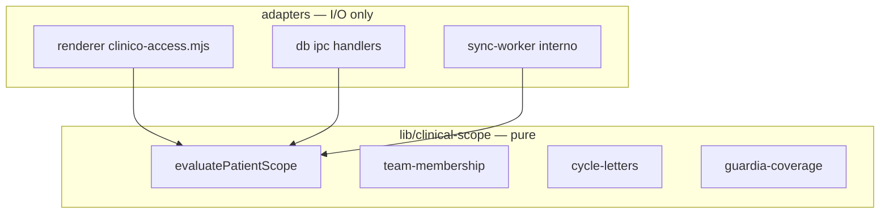

# P4 — Unified Clinical Access Domain

> **For implementation:** Plan § P4. Can start after P1 defines stable `patientId` / team IDs in commands. Parent: [`2026-08-11-clinical-data-reckoning-program.md`](2026-08-11-clinical-data-reckoning-program.md).

**Date:** 2026-08-11  
**Status:** Draft for review  
**Depends on:** P1 repository patterns (soft); P3 LAN removal (hard for scope-lan deletion)

---

## Problem statement

Clinical scope rules (sala, guardia, team membership, entrega, interconsultas) are implemented **twice**:

| Layer | Modules |
| --- | --- |
| Main / DB | `lib/db/clinical-access-*.mjs`, `clinical-privileges.mjs` |
| Renderer | `public/js/clinico-access*.mjs`, `clinico-access-scope/` |
| Runtime glue | `clinical-access-runtime/`, `scope-lan.mjs` (retire) |

Divergence causes:

- “Works in UI, fails in IPC” or opposite.
- Cloud mobile reimplementing subsets (`mobile-team-patient-scope.mjs`).
- Tests documenting scars (“LAN reconcile retired…”).

---

## Goals (success criteria)

- [ ] New package `lib/clinical-scope/` — **pure functions** over plain data (no `window`, no `ipc`, no SQL).
- [ ] Single source for: `patientInUserSala`, `patientCoveredByGuardia`, `patientMatchesTeam`, cycle letter rules, entrega phase gates.
- [ ] Renderer `clinico-access.mjs` becomes **thin re-export barrel** of `lib/clinical-scope/` (bundled into renderer via esbuild).
- [ ] Main process DB handlers call same functions with data loaded from SQLCipher.
- [ ] Worker interno board scope uses same module (import from `lib/clinical-scope/` in `cloud/sync-worker`).
- [ ] Delete duplicated logic files after migration; net **line count decreases**.
- [ ] One characterization test suite: `lib/clinical-scope/characterization.test.mjs` with fixtures from real guardia scenarios.

## Non-goals (P4)

- Changing privilege product rules (who is R4, admin, etc.).
- RBAC / hospital SSO.
- Moving SQL schema for teams to new tables.

---

## Architecture



### Data inputs (explicit structs)

No hidden globals. Callers pass:

```ts
/** @typedef {{
 *   patient: { id, sala?, teamId?, assignments? },
 *   viewer: { userId, rank, joinedTeams[], guardiaState? },
 *   rotation: { activeCycle?, services? },
 *   room?: { clinicalOps? }
 * }} ScopeContext */
```

Functions return `{ allowed: boolean, reason?: string }` or filter lists — **no side effects**.

### Module layout

```
lib/clinical-scope/
  index.mjs
  patient-sala.mjs        # from clinico-access-patient.mjs
  team-membership.mjs     # from clinico-access-teams.mjs
  guardia-coverage.mjs
  cycle-letters.mjs
  entrega-phase.mjs       # entrega gates only
  interconsultas.mjs
  characterization.test.mjs
  fixtures/               # JSON guardia scenarios
```

### Migration order

1. Extract `patient-sala` + `team-membership` (highest duplication).
2. Wire renderer imports to `lib/clinical-scope` — behavior parity tests.
3. Replace `lib/db/clinical-access-assignments.mjs` internals with scope calls.
4. Worker interno `readInternoBoard` filter.
5. Delete `public/js/clinico-access-*.mjs` bodies (keep barrels re-exporting).
6. Delete `clinical-access-runtime/scope-lan.mjs`.

---

## Bundling note

`lib/clinical-scope/` must be importable from:

- Electron main (Node)
- Renderer (esbuild bundles `lib/` paths — verify `scripts/bundle-renderer` alias)
- Cloudflare Worker (no Node builtins)

**Constraint:** no `fs`, `path`, or SQL imports in domain module. Adapters load data.

---

## Tests

| Strategy | Detail |
| --- | --- |
| Parity | For each extracted function, run old vs new on fixture set → same result |
| Worker | Port interno board filter cases to shared fixtures |
| Regression | `clinical-access-runtime.test.mjs` updated — remove LAN reconcile cases |

---

## Acceptance (P4 gate)

1. `lib/clinical-scope/characterization.test.mjs` ≥20 scenarios from production bugs/changelog.
2. `rg "patientCoveredByGuardia" public/js lib` — single implementation in `lib/clinical-scope/`.
3. Interno MIP board patient list identical before/after on fixture room snapshot.
4. No new duplication clones ≥8 lines (`jscpd` / metrics check).

---

## Rollout

- **8.1.3** — extract + renderer parity (flag not required; pure refactor).
- **8.1.4** — worker + IPC adoption.
- **8.1.5** — delete old implementations.
