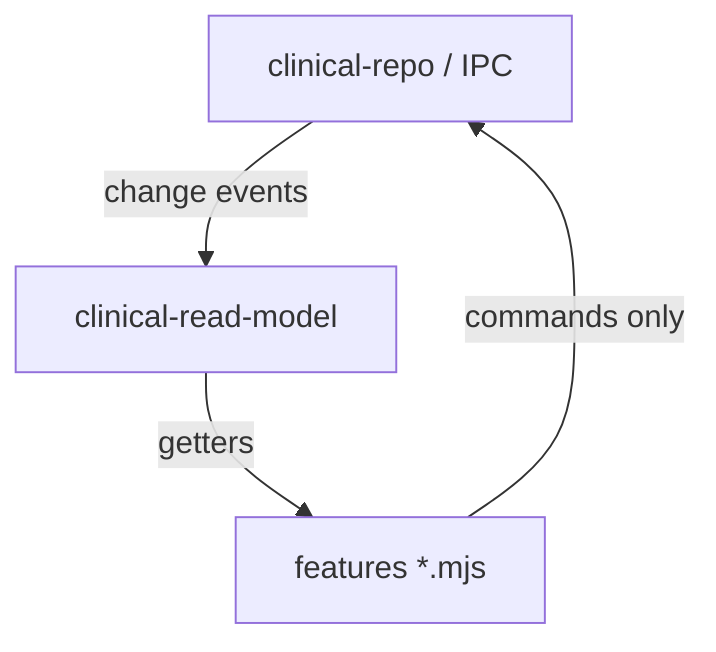

# P5 — Renderer Read Models & Storage Demotion

> **For implementation:** Plan § P5. Requires P1+P2 for at least census + eventualidades + labs. Parent: [`2026-08-11-clinical-data-reckoning-program.md`](2026-08-11-clinical-data-reckoning-program.md).

**Date:** 2026-08-11  
**Status:** Draft for review  
**Depends on:** P1 (commands), P2 (projector), P4 (optional, for scope in read API)

---

## Problem statement

`app-state.mjs` is a **writeable in-memory database**:

- Exported `let` bindings mutated across hundreds of modules.
- `saveState()` debounces persistence — UI reads can race durability.
- `setPersistPatientsResolver` hacks for tour demos.
- `storage.js` mirrors the same blobs to localStorage for legacy paths.

Once P1/P2 make SQLCipher authoritative, `app-state` should be a **read model** — not a second source of truth.

---

## Goals (success criteria)

- [ ] New `public/js/clinical-read-model.mjs` subscribes to repo change events + boot hydrate.
- [ ] Exported **read-only** views: `getPatients()`, `getLabHistory(patientId)`, … — mutations throw in dev or no-op with console warning.
- [ ] `app-state.mjs` deprecated; thin re-exports read model for gradual migration.
- [ ] `storage.js` clinical blobs **removed** — prefs-only (`tour`, UI flags, cloud token cache).
- [ ] `saveState()` deleted after all domains on repo commands.
- [ ] Tour/pitch demos inject at read layer (`withDemoPatients(readModel)`) — not `setPersistPatientsResolver`.
- [ ] Web clinical client (`isWebClinicalClient`) uses in-memory repo + read model — same API as desktop.

## Non-goals (P5)

- Reactive framework (still vanilla JS; simple pub/sub).
- Normalizing blobs into relational renderer caches.
- IndexedDB clinical store (SQLCipher remains desktop truth).

---

## Architecture



### Read model API (sketch)

```js
// public/js/clinical-read-model.mjs
const _cache = { patients: [], notes: {}, ... };
const _listeners = new Set();

export function subscribeClinicalReadModel(fn) { ... }
export function getPatients() { return _cache.patients; }
export function getPatientById(id) { ... }

/** @internal — called by repo client after command or hydrate */
export function _applyRepoSnapshot(partial) { ...; _listeners.forEach(fn => fn()); }
```

**Rules:**

- No `export let patients` — prevents accidental writes.
- Features import `getPatients` not mutable arrays.
- Long-running views call `subscribeClinicalReadModel` for re-render (or existing app shell refresh hook).

### storage.js end state

| Keep in localStorage | Remove (SQLCipher / repo only) |
| --- | --- |
| Cloud token, UI prefs, tour progress | `rpc-patients`, `rpc-notes`, all `CLINICAL_LS_KEYS` |
| Theme, toast prefs | `rpc-lan-*` (P3) |

`ensureStorageHydrated()` becomes prefs-only on desktop; clinical hydrate via `clinical-repo-client.hydrate()`.

---

## Migration map (by domain)

| Domain | P1 command | P2 projector | P5 read model |
| --- | --- | --- | --- |
| Eventualidades | ✓ first | ✓ | ✓ |
| Patient census | slice 2 | slice 2 | slice 2 |
| labHistory | slice 3 | slice 3 | slice 3 |
| notes / indicaciones | slice 4 | slice 4 | slice 4 |
| med receta / VPO | slice 5 | slice 5 | slice 5 |
| todos / agenda | slice 6 | slice 6 | slice 6 |

Each slice: grep domain for `setPatients`, `saveState`, direct `patients[` mutation → convert to commands + getters.

---

## Demo / tour path

Replace `setPersistPatientsResolver`:

```js
// clinical-read-model-demo.mjs
export function getPatientsForDisplay(baseGetPatients) {
  if (!isPitchTourActive()) return baseGetPatients();
  return [...demoPatients, ...baseGetPatients().filter(p => !p.isDemo)];
}
```

Demos never persist; repo commands reject `isDemo` ids.

---

## Tests

| File | Covers |
| --- | --- |
| `public/js/clinical-read-model.test.mjs` | Subscribe, snapshot apply, immutability |
| `public/js/app-state-deprecation.test.mjs` | No `export let` in app-state (after cutover) |
| `public/js/storage-prefs-only.test.mjs` | No clinical keys written |

**Mechanical codemod (optional):** script to flag `saveState(` call sites remaining.

---

## Acceptance (P5 gate)

1. Grep production `public/js` for `saveState(` → zero (except deprecated barrel).
2. Grep for `export let patients` → zero.
3. Full guardia manual: census edit, lab paste, eventualidad, note export — Nube sync between two Macs.
4. Tour pitch: demos show, exit tour restores real census without persistence leak.
5. `npm run metrics:check`; boot graph does not add eager imports (dynamic `import()` for read model init if needed).

---

## Rollout

- **8.1.2–8.1.5** — per-domain read model as commands land.
- **8.2.0** — delete `app-state.mjs` write exports; `storage.js` clinical methods removed.
- Release notes: “Mejoras de confiabilidad al guardar datos clínicos.”

---

## Deprecation warnings (8.1.x)

During transition, `app-state.mjs`:

```js
export function setPatients(next) {
  console.warn('[reckoning] setPatients is deprecated — use clinicalRepo.command');
  // legacy impl
}
```

Remove warnings in 8.2.0 when impl deleted.
